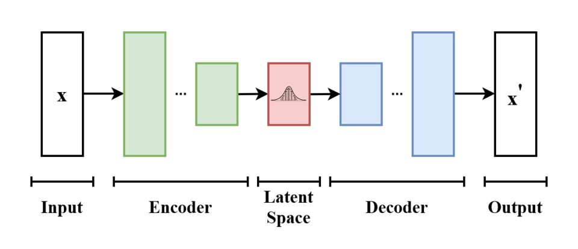

## Table of Contents

## What is a Variational Autoencoder (VAE) and how does it differ from a traditional autoencoder?

A Variational Autoencoder (VAE) is a type of neural network that is used for generating new data similar to the data it was trained on. It works by learning the underlying structure of the input data and then using that structure to create new, similar data. Unlike traditional autoencoders, VAEs add an extra step where they force the data to fit into a specific, simple distribution, usually a normal distribution. This is done by making the encoder output the mean and variance of a distribution, and then sampling from this distribution to get the latent representation. This process, called reparameterization, helps the VAE generate more diverse and realistic data.

A traditional autoencoder, on the other hand, is simpler and works by compressing the input data into a lower-dimensional representation (the latent space) and then reconstructing it. The main goal is to minimize the reconstruction error, so the network learns to encode and decode the data as accurately as possible. The key difference between a VAE and a traditional autoencoder is that VAEs introduce randomness into the latent space. This randomness, controlled by the reparameterization trick, allows VAEs to generate new data points, not just reproduce the input data. This makes VAEs particularly useful for tasks like image generation, where creating new, varied images is the goal.

## How does the architecture of a VAE work, including the encoder and decoder components?

The architecture of a Variational Autoencoder (VAE) consists of two main components: the encoder and the decoder. The encoder takes in the input data and compresses it into a lower-dimensional space called the latent space. However, unlike a traditional autoencoder, the encoder in a VAE doesn't just output a single point in the latent space. Instead, it outputs two vectors: one for the mean (μ) and one for the variance (σ^2) of a normal distribution. This allows the VAE to create a distribution over the latent space, rather than just a single point. To get a sample from the latent space, we use the reparameterization trick, where we sample from a standard normal distribution and then shift and scale it using the mean and variance vectors. This can be expressed as $$ z = \mu + \sigma \cdot \epsilon $$, where $$\epsilon$$ is a random sample from a standard normal distribution.

The decoder then takes this sample from the latent space and tries to reconstruct the original input data. The goal of the decoder is to produce an output that is as close as possible to the original input, minimizing the reconstruction loss. This loss is usually measured using a metric like mean squared error or binary cross-entropy, depending on the type of data. In addition to the reconstruction loss, VAEs also have a second component to their loss function called the KL divergence. This measures how much the distribution of the latent space deviates from a standard normal distribution. By minimizing the KL divergence, the VAE encourages the latent space to follow a simple, well-behaved distribution, which helps with generating new data. Together, these two losses (reconstruction loss and KL divergence) guide the training of the VAE, allowing it to learn both to compress and reconstruct data effectively and to generate new, similar data points.

## What is the role of the latent space in a VAE and how is it used for data generation?

The latent space in a Variational Autoencoder (VAE) is like a secret code that the VAE uses to understand and create new data. When you give the VAE some data, like a picture, it turns that picture into a simpler form in the latent space. But instead of just making one point in this space, the VAE makes a small area where it thinks the picture should be. It does this by figuring out the average (mean) and how spread out (variance) this area should be. Then, it picks a spot in this area to use as the secret code for the picture.

To make new data, the VAE takes a random spot from this secret code space. It uses a trick called the reparameterization trick to do this. The trick is to take a random number from a normal bell-shaped curve and then adjust it using the mean and variance the VAE figured out. This can be shown as $$ z = \mu + \sigma \cdot \epsilon $$, where $$\epsilon$$ is the random number. The VAE then turns this new spot back into a picture using the decoder. Because the VAE uses this random spot, it can create many different pictures that look like the ones it learned from. This way, the latent space helps the VAE both understand old data and make new, similar data.

## Can you explain the concept of the loss function in VAEs, including reconstruction loss and KL divergence?

The loss function in a Variational Autoencoder (VAE) is like a guide that helps the VAE learn how to turn data into a secret code and back again. It has two parts: the reconstruction loss and the KL divergence. The reconstruction loss checks how well the VAE can turn the secret code back into the original data. If the VAE does a good job, the reconstruction loss is small. If it messes up, the loss is big. This part of the loss makes sure the VAE can remember and recreate the data it sees.

The other part, the KL divergence, is a bit trickier. It makes sure the secret code space, or latent space, follows a simple pattern, usually a normal bell-shaped curve. The KL divergence measures how different the VAE's secret code space is from this simple pattern. If it's very different, the KL divergence is big, and the VAE tries to fix it by making the secret code space more like the simple pattern. This helps the VAE create new data that looks like the old data because it can pick new spots in the secret code space that still make sense. The total loss for the VAE is the sum of the reconstruction loss and the KL divergence, and the VAE tries to make this total loss as small as possible.

In simple terms, the reconstruction loss makes sure the VAE can recreate what it sees, and the KL divergence makes sure it can make new things that fit well with what it knows. Together, they help the VAE learn and create data in a smart way.

## How does the reparameterization trick work in VAEs and why is it important?

The reparameterization trick is a clever way that helps Variational Autoencoders (VAEs) work smoothly. In a VAE, when the encoder turns the input data into a secret code, it doesn't just give one number. Instead, it gives two numbers: one for the average (mean) and one for how spread out (variance) the secret code should be. The VAE then needs to pick a random spot from this spread-out area to use as the secret code. But, if the VAE tried to do this directly, it would be hard to train because the randomness would make it tricky to learn. So, the reparameterization trick comes to the rescue. It uses a simple formula $$ z = \mu + \sigma \cdot \epsilon $$ where $$\mu$$ is the mean, $$\sigma$$ is the standard deviation (which comes from the variance), and $$\epsilon$$ is a random number from a normal bell-shaped curve. This way, the VAE can still use randomness but in a way that's easier to train.

The reparameterization trick is important because it makes training the VAE much easier. Without it, the VAE would have a hard time figuring out how to change the secret code to make the loss smaller because the randomness would mess things up. By using the trick, the VAE can separate the randomness from the learning part. This means the VAE can learn to make the mean and variance better without the randomness getting in the way. This helps the VAE learn to turn data into a secret code and back again, and also to make new data that looks like the old data. So, the reparameterization trick is a key part that makes VAEs work well.

## What are some common applications of VAEs in machine learning and data science?

Variational Autoencoders (VAEs) are used in many cool ways in machine learning and data science. One of the most common uses is for generating new images. If you train a VAE on a bunch of pictures, like pictures of faces, it can create new faces that look real but are different from the ones it was trained on. This is useful for things like making new art or even helping with tasks in computer graphics. Another cool use is in data compression. VAEs can take a lot of data and turn it into a smaller, secret code that still keeps the important parts of the data. This can help save space and make it easier to work with big data sets.

VAEs are also great for understanding and working with data. For example, they can help find patterns in data that might be hard to see otherwise. If you have a lot of data about customers, a VAE can help figure out different types of customers based on their behavior. This can be really helpful for businesses trying to understand their customers better. Another use is in filling in missing data. If some parts of your data are missing, a VAE can guess what should be there based on what it knows from the rest of the data. This can make your data more complete and useful.

In the field of drug discovery, VAEs are used to generate new molecules. By training a VAE on the structures of known molecules, it can create new ones that might have useful properties. This can speed up the process of finding new medicines. VAEs are also used in natural language processing, where they can help with tasks like text generation or translation. By learning the patterns in language, a VAE can create new sentences or translate text from one language to another. These are just a few examples of how VAEs are making a big impact in many different areas of machine learning and data science.

## How can VAEs be used for data generation and what are the benefits of using them for this purpose?

Variational Autoencoders (VAEs) are great for making new data that looks like the data they were trained on. Imagine you have a bunch of pictures of dogs. If you train a VAE on these pictures, it can create new pictures of dogs that you've never seen before. It does this by turning the dog pictures into a secret code, and then using that code to make new pictures. The secret code is like a map that helps the VAE understand what makes a dog picture a dog picture. By using this map and adding a bit of randomness, the VAE can create new dog pictures that are different but still look like real dogs.

Using VAEs for making new data has some big benefits. One big benefit is that they can create a lot of different data. Because VAEs use randomness in their secret code, they can make many different versions of the same thing. This is really helpful for things like making new art or testing how a new product might look in different ways. Another benefit is that VAEs can help fill in gaps in data. If you have some missing parts in your data, a VAE can guess what should be there based on what it knows. This can make your data more complete and useful for things like predicting what might happen next or understanding patterns in the data.

## What are the challenges and limitations of training VAEs, and how can they be addressed?

Training Variational Autoencoders (VAEs) can be tricky because they need to balance two goals: making good copies of the data they see and keeping their secret code space simple. One big challenge is that the VAE might focus too much on making good copies and not enough on keeping the secret code space simple. This can make it hard for the VAE to create new data that looks right. Another challenge is that VAEs can sometimes make blurry images when they try to create new pictures. This happens because they try to make pictures that are kind of like a lot of different pictures at once, which can make things look fuzzy.

To fix these problems, you can try a few things. One way is to change how much the VAE cares about keeping the secret code space simple compared to making good copies. This is done by adjusting the weight of the KL divergence in the loss function. For example, if you want the VAE to focus more on keeping the secret code space simple, you can make the KL divergence part of the loss function bigger. Another way to help is to use a different kind of loss function for the pictures, like using a loss function that cares more about making sharp, clear images. By trying different ways to balance these goals, you can make the VAE better at creating new data that looks right and is useful.

## How do VAEs compare to other generative models like Generative Adversarial Networks (GANs)?

Variational Autoencoders (VAEs) and Generative Adversarial Networks (GANs) are both used to make new data that looks like the data they were trained on, but they work in different ways. VAEs turn the data into a secret code and then use that code to make new data. They use a special trick called the reparameterization trick to add randomness to the secret code, which helps them make different versions of the data. The loss function in VAEs has two parts: one part checks how well the VAE can make copies of the data it sees (reconstruction loss), and the other part makes sure the secret code space follows a simple pattern (KL divergence). This helps VAEs create new data that is similar to the old data but can sometimes make the new data a bit blurry.

GANs, on the other hand, use two networks that work together: a generator that makes new data and a discriminator that tries to tell if the data is real or fake. The generator tries to fool the discriminator by making data that looks more and more real. GANs don't have a secret code space like VAEs, and they don't use a loss function that tries to keep things simple. Instead, they use a game-like approach where the generator and discriminator get better by competing with each other. GANs can make very sharp and realistic data, but they can be harder to train because they need to find a balance between the generator and the discriminator. While VAEs are easier to train and can handle missing data well, GANs are often better at making data that looks very real and detailed.

## Can you discuss advanced techniques for improving VAE performance, such as conditional VAEs or β-VAEs?

One advanced technique for improving VAE performance is using Conditional Variational Autoencoders (CVAEs). CVAEs add extra information to the VAE, like labels or other data, to help guide the creation of new data. For example, if you're making pictures of dogs, you can tell the CVAE what kind of dog you want, like a "poodle" or a "labrador." This extra information helps the CVAE make pictures that match what you asked for. By using this extra information, CVAEs can create more specific and useful data, which is great for tasks like image generation where you want control over what is created.

Another technique is using β-VAEs, which change the way the VAE balances its two goals: making good copies of the data and keeping the secret code space simple. In a regular VAE, these two goals are balanced by the loss function, which includes both the reconstruction loss and the KL divergence. In a β-VAE, you can adjust how much the VAE cares about keeping the secret code space simple by adding a number called β to the KL divergence part of the loss function. The formula for the β-VAE loss function is $$ \text{Loss} = \text{Reconstruction Loss} + \beta \cdot \text{KL Divergence} $$. By changing β, you can make the VAE focus more on either making good copies or keeping the secret code space simple. This can help improve the VAE's performance, especially in tasks where you want the VAE to learn more about the data's structure.

## What are some practical considerations when implementing VAEs, including hyperparameter tuning and model evaluation?

When you're putting together a Variational Autoencoder (VAE), you need to think about a few things to make it work well. One big thing is picking the right hyperparameters. These are numbers that you set before training the VAE, like how many layers it should have, how big those layers should be, and how fast it should learn. You also need to decide on the β value in a β-VAE, which controls how much the VAE cares about keeping its secret code space simple. A good way to find the best hyperparameters is to try different ones and see which ones make the VAE perform the best. This is called hyperparameter tuning, and you can do it by hand or use special tools that try different settings for you.

Another important thing is figuring out how well your VAE is doing, which is called model evaluation. You can check this by looking at how well the VAE can make copies of the data it sees (reconstruction loss) and how well it keeps its secret code space simple (KL divergence). For example, if the VAE is making pictures, you can look at the pictures it makes to see if they look clear and real. You can also use numbers to measure how good the VAE is, like the Evidence Lower Bound (ELBO), which is the total of the reconstruction loss and the KL divergence. The formula for ELBO is $$ \text{ELBO} = \text{Reconstruction Loss} + \text{KL Divergence} $$. By keeping an eye on these numbers and looking at the data the VAE makes, you can tell if it's working well and make changes to improve it if you need to.

## How might future developments in VAEs impact their use in fields like drug discovery or personalized medicine?

Future developments in Variational Autoencoders (VAEs) could make a big difference in drug discovery. Right now, VAEs help scientists create new molecules by learning from the structures of known ones. If VAEs get better at understanding and making these structures, they could find new medicines faster. For example, if VAEs can learn to make molecules that work well with specific proteins in the body, they could help design drugs that are more effective and have fewer side effects. By making the secret code space more detailed and accurate, future VAEs might also be able to predict how new drugs will behave in the body, speeding up the testing process.

In personalized medicine, VAEs could become even more useful if they get better at handling complex data like genetic information. Right now, VAEs help doctors understand patterns in patient data to tailor treatments to individuals. If VAEs can learn to include more types of data, like lifestyle and environmental factors, they could help create treatment plans that are even more personalized. By improving how VAEs turn data into a secret code and back again, doctors might be able to predict how a patient will respond to different treatments, making healthcare more effective and personalized.