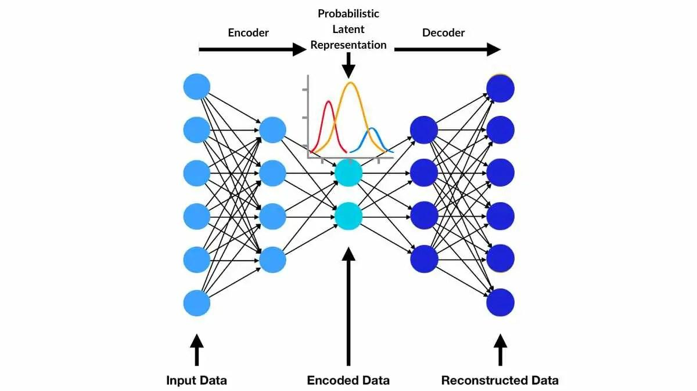

## Table of Contents

## What is Variational Optimization in the context of machine learning?

Variational Optimization is a technique used in machine learning to find the best parameters for a model by using a method called variational inference. This approach is particularly useful when dealing with complex models where traditional optimization methods might be too slow or difficult to apply. Instead of directly optimizing the model's parameters, variational optimization uses a simpler distribution to approximate the true distribution of the model's parameters. This simpler distribution is easier to work with and can be optimized more efficiently.

In practice, variational optimization involves defining a family of distributions, often called the variational family, and then finding the member of this family that is closest to the true distribution of the model's parameters. The closeness is typically measured using a divergence measure like the Kullback-Leibler (KL) divergence. By minimizing this divergence, the variational distribution becomes a good approximation of the true distribution, allowing us to make predictions and perform other tasks more efficiently. This method is widely used in areas like deep learning, where it helps in training complex models like variational autoencoders.

## How does Variational Optimization differ from traditional optimization methods?

Variational Optimization and traditional optimization methods both aim to find the best parameters for a model, but they go about it in different ways. Traditional optimization methods, like gradient descent, directly adjust the model's parameters to minimize a loss function. They work by calculating the gradient of the loss function with respect to the parameters and then updating the parameters in the direction that reduces the loss. This approach can be straightforward and effective for simpler models, but it can become slow and computationally expensive for more complex models with many parameters.

On the other hand, Variational Optimization uses a different strategy. Instead of directly optimizing the model's parameters, it introduces a simpler distribution to approximate the true distribution of the model's parameters. This simpler distribution, known as the variational distribution, is easier to work with and can be optimized more efficiently. The goal is to find the variational distribution that is closest to the true distribution, typically measured by minimizing the Kullback-Leibler (KL) divergence $$D_{KL}(q(z) || p(z|x))$$. By doing so, Variational Optimization can handle complex models more effectively, making it particularly useful in areas like deep learning where models can be very intricate.

## What are the basic principles behind Variational Optimization?

Variational Optimization is a way to make it easier to find the best settings for a machine learning model. Instead of directly changing the model's settings to make it better, Variational Optimization uses a simpler way to guess what the best settings might be. This simpler guess is called a variational distribution. The goal is to make this guess as close as possible to the real best settings. To do this, we measure how different the guess is from the real settings using something called the Kullback-Leibler (KL) divergence, written as $$D_{KL}(q(z) || p(z|x))$$. By making this difference smaller, the guess gets better and helps the model work better.

This method is really helpful when the model is very complicated and hard to work with directly. Traditional ways of finding the best settings can be slow and hard for these complex models. Variational Optimization makes things easier by working with a simpler guess instead. This approach is used a lot in deep learning, where models can have many layers and settings. By using Variational Optimization, we can train these complex models more quickly and effectively, making it easier to use them for tasks like image recognition or generating new data.

## Can you explain the concept of Variational Inference and its relation to Variational Optimization?

Variational Inference is a way to guess the best settings for a model when it's too hard to find them directly. Imagine you have a big puzzle, and instead of trying to solve it piece by piece, you use a simpler picture to help you guess where the pieces should go. In machine learning, this simpler picture is called a variational distribution. The goal is to make this guess as close as possible to the real solution. We measure how close the guess is using something called the Kullback-Leibler (KL) divergence, written as $$D_{KL}(q(z) || p(z|x))$$. By making this difference smaller, our guess gets better and helps the model work better.

Variational Optimization is closely related to Variational Inference. While Variational Inference is about using a simpler guess to understand the model's settings, Variational Optimization is about using this guess to actually find the best settings. It's like using the simpler picture not just to understand the puzzle but to actually solve it. In Variational Optimization, we adjust the simpler guess to minimize the KL divergence, which helps us find the best settings for the model more efficiently. This method is especially useful for complex models in deep learning, where traditional ways of finding the best settings can be too slow or difficult.

## What is GECO and how does it apply Variational Optimization?

GECO stands for Gradient-based Estimation of Conditional Objectives, and it's a way to make machine learning models better by using a special kind of optimization called Variational Optimization. Imagine you're trying to find the best path through a maze, but the maze keeps changing. GECO helps you find that path by using a simpler guess to guide you. It does this by adjusting the guess to make it closer to the real best path. This is done by minimizing something called the Kullback-Leibler (KL) divergence, written as $$D_{KL}(q(z) || p(z|x))$$. By making this difference smaller, GECO helps the model work better, even when the problem is very complicated.

In practice, GECO applies Variational Optimization by using the simpler guess to estimate how the model should change to improve. This is especially useful in deep learning, where models can be very complex and hard to work with directly. By using GECO, you can train these models more quickly and effectively. It's like using a map to navigate a tricky city instead of trying to figure it out street by street. This method helps in tasks like generating new images or understanding complex data, making it easier to use machine learning for real-world problems.

## How does the Residual Normal Distribution enhance Variational Optimization techniques?

The Residual Normal Distribution helps make Variational Optimization better by adding a special kind of guess to the simpler picture we use to find the best settings for a model. Imagine you're trying to guess where a ball will land after it bounces. The Residual Normal Distribution is like adding a little extra bounce to your guess, making it more accurate. By using this extra bounce, we can make our simpler guess closer to the real best settings. This is done by adjusting the guess to minimize the difference, measured by the Kullback-Leibler (KL) divergence, written as $$D_{KL}(q(z) || p(z|x))$$. This helps the model work better, especially when the problem is very complicated.

In practice, using the Residual Normal Distribution in Variational Optimization means we can handle more complex models more easily. It's like having a better tool to solve a tricky puzzle. By adding this extra bounce to our guess, we can train deep learning models more quickly and effectively. This is really helpful in tasks like generating new images or understanding complex data, making it easier to use machine learning for real-world problems.

## What is ASVI and how does it improve upon standard Variational Inference methods?

ASVI stands for Adaptive Stochastic Variational Inference, and it's a way to make guessing the best settings for a machine learning model even better. Imagine you're trying to find the best path through a maze, but the maze keeps changing. Standard Variational Inference uses a simpler guess to help you navigate, but ASVI makes this guess smarter by adjusting it as you go along. It does this by using something called the Kullback-Leibler (KL) divergence, written as $$D_{KL}(q(z) || p(z|x))$$, to measure how close the guess is to the real best path. By making this difference smaller and adapting the guess, ASVI helps the model work better, even when the problem is very complicated.

ASVI improves upon standard Variational Inference by being more flexible and efficient. It's like having a map that updates itself as you explore the maze, making it easier to find the best path. This method is especially useful in deep learning, where models can be very complex and hard to work with directly. By using ASVI, you can train these models more quickly and effectively. It's really helpful in tasks like generating new images or understanding complex data, making it easier to use machine learning for real-world problems.

## What are the common challenges faced when implementing Variational Optimization?

Implementing Variational Optimization can be tricky because it involves using a simpler guess to find the best settings for a model. One common challenge is choosing the right simpler guess, or variational distribution. If the guess is too simple, it might not capture the complexity of the model well, leading to poor results. On the other hand, if the guess is too complex, it can be hard to work with and might not speed up the optimization process as much as hoped. Another challenge is measuring how close the guess is to the real best settings, which is done using the Kullback-Leibler (KL) divergence, written as $$D_{KL}(q(z) || p(z|x))$$. Calculating and minimizing this divergence can be difficult, especially for very complex models.

Another difficulty is dealing with the trade-off between accuracy and computational efficiency. Variational Optimization aims to make finding the best settings faster, but sometimes this comes at the cost of accuracy. It's a balancing act to ensure the model performs well without taking too long to train. Additionally, implementing Variational Optimization often requires a good understanding of both the model and the optimization techniques. This can be challenging for those new to the field, as it requires knowledge of how to adjust the simpler guess effectively and interpret the results correctly.

## How can Variational Optimization be used to improve model training in deep learning?

Variational Optimization can help make training deep learning models easier and faster. Imagine you're trying to find the best path through a maze, but the maze keeps changing. Instead of trying to solve it piece by piece, you use a simpler picture to help you guess where the pieces should go. In deep learning, this simpler picture is called a variational distribution. By using this guess, we can make the model work better without spending too much time on it. We measure how close the guess is to the real best settings using something called the Kullback-Leibler (KL) divergence, written as $$D_{KL}(q(z) || p(z|x))$$. By making this difference smaller, our guess gets better and helps the model learn more quickly and effectively.

This method is especially useful for very complex models in deep learning, where traditional ways of finding the best settings can be too slow or difficult. Variational Optimization helps by adjusting the simpler guess to make it closer to the real best settings. This is like using a map that updates itself as you explore the maze, making it easier to find the best path. By doing this, we can train deep learning models to do things like generate new images or understand complex data more efficiently. This makes it easier to use machine learning for real-world problems, where speed and accuracy are both important.

## What are some advanced techniques in Variational Optimization for handling complex distributions?

Advanced techniques in Variational Optimization help make it easier to work with very complex distributions in machine learning models. One such technique is the use of Normalizing Flows. Imagine you have a simple guess about where the best settings for your model might be, but the real best settings are much more complicated. Normalizing Flows help by transforming this simple guess into something that can capture the complexity of the real best settings. They do this by using a series of transformations that can be reversed, making it easier to measure how close the guess is to the real settings. This helps the model learn more accurately and quickly, even when the problem is very tricky.

Another advanced technique is the use of Importance Weighted Autoencoders (IWAEs). These are like having multiple guesses instead of just one, and then choosing the best one to help find the real best settings. By using multiple guesses, IWAEs can better handle the complexity of the model's true distribution. They do this by using something called importance sampling to weigh the different guesses, making the final guess more accurate. This approach is particularly useful when the model's true distribution is very complex and hard to work with directly. By using IWAEs, we can train deep learning models more effectively, making it easier to solve real-world problems where the data can be very complicated.

## Can you discuss a case study where Variational Optimization significantly improved a machine learning model's performance?

A great example of Variational Optimization improving a machine learning model's performance is in the development of Variational Autoencoders (VAEs) for image generation. Imagine you want to create new images that look like real photographs, but it's hard because there are so many different ways images can look. VAEs use a simpler guess to help find the best settings for generating these images. By adjusting this guess to make it closer to the real best settings, measured by the Kullback-Leibler (KL) divergence $$D_{KL}(q(z) || p(z|x))$$, VAEs can generate high-quality images much faster than traditional methods. This was shown in a study by researchers at Google Brain, where VAEs were used to generate realistic faces and other complex images. The use of Variational Optimization helped the model learn the patterns in the images more effectively, leading to better and more diverse generated images.

Another case study involves using Variational Optimization in natural language processing (NLP) for language translation. Translating languages is tough because there are so many ways to say the same thing. Researchers at the University of Montreal used Variational Optimization to improve neural machine translation models. They applied a technique called Variational Dropout, which helps the model learn more robustly by using a simpler guess to find the best settings for translating text. By minimizing the difference between the guess and the real best settings, the model was able to produce more accurate translations. This approach significantly improved the model's performance, making it better at understanding and translating different languages. These examples show how Variational Optimization can make complex machine learning tasks easier and more effective.

## What future developments or research directions are anticipated in the field of Variational Optimization?

Future developments in Variational Optimization are likely to focus on making it even easier and faster to find the best settings for machine learning models. Researchers are working on new ways to use simpler guesses, or variational distributions, to handle even more complex problems. One exciting direction is improving Normalizing Flows, which help transform simple guesses into something that can capture the complexity of the real best settings. By making these transformations more flexible and easier to reverse, we can measure how close the guess is to the real settings more accurately. This could lead to better performance in tasks like generating new images or understanding complex data. Another area of interest is developing better ways to use multiple guesses, like in Importance Weighted Autoencoders (IWAEs), to make the final guess more accurate and robust.

Additionally, researchers are exploring how Variational Optimization can be used in new areas, like reinforcement learning and federated learning. In reinforcement learning, Variational Optimization could help find the best strategies for agents to learn from their environment more efficiently. By using a simpler guess to find the best settings, agents could learn faster and make better decisions. In federated learning, where data is spread across many devices, Variational Optimization could help combine these different data sources more effectively. By adjusting the simpler guess to make it closer to the real best settings, measured by the Kullback-Leibler (KL) divergence $$D_{KL}(q(z) || p(z|x))$$, models could learn from diverse data without needing to share it all in one place. These advancements could make machine learning more powerful and applicable to a wider range of real-world problems.