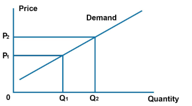

In the complex world of economics and trading, understanding the unique concepts of Giffen goods and Veblen goods is essential. These economic anomalies disrupt traditional supply and demand theories, offering a unique window into consumer behavior. Giffen goods are characterized by an increased demand as prices rise, a stark contrast to conventional goods. This counterintuitive relationship often occurs under specific economic conditions, such as austerity, where the lack of substitutes persists. On the other hand, Veblen goods thrive on the wealthy's desire for status, with demand growing in tandem with rising prices, purely due to their appeal as symbols of wealth and prestige.

In the context of algorithmic trading, these products introduce fascinating challenges and opportunities. Algorithmic trading employs sophisticated algorithms to execute trades at speeds and frequencies beyond human reach. By understanding the complex demand patterns inherent to Giffen and Veblen goods, traders can potentially develop novel strategies that leverage these anomalies for competitive advantage. For instance, recognizing the particular conditions that give rise to Giffen goods could inform models to predict market behavior during economic downturns. Similarly, the prestige-driven demand for Veblen goods might be incorporated into algorithms to anticipate price movements in luxury markets.



This article will dissect the definitions, differences, and examples of these economic curiosities, illustrating their significance in today's financial landscape. As we examine the interplay between Giffen and Veblen goods and algorithmic trading, we highlight how these unconventional concepts are increasingly becoming relevant in crafting dynamic and responsive trading strategies.

## Table of Contents

## Understanding Giffen Goods

Giffen goods represent a unique and paradoxical category within economics, distinguished by their counterintuitive demand behavior where demand rises with an increase in price. This anomaly contradicts the conventional law of demand, which suggests that price hikes typically lead to decreased consumption. The origin of the Giffen paradox traces back to the 19th century, often attributed to the Scottish economist Sir Robert Giffen, who observed this phenomenon during economic distress periods.

Staple foods, such as bread and potatoes, are classic examples associated with Giffen goods, particularly during economic hardships. In such scenarios, these staples constitute a significant portion of the consumer's diet. When prices fall, consumers can afford to purchase more of other goods, effectively reducing the consumption of the staple. Conversely, when prices rise, these staples become all the more integral to the consumer's diet, consuming a larger share of their limited budget and leading to increased consumption despite the higher price. This behavior illustrates the lack of available substitutes and compels consumers to reallocate their resources toward the staple rather than luxury goods.

The emergence of Giffen goods hinges on specific economic conditions and consumer behavior patterns. They primarily arise in low-income settings where a staple good forms a substantial part of the consumer's budget. The rarity of Giffen goods in modern markets is attributed to the advancement of economies and the diversification of consumer options, which offer greater flexibility and substitution possibilities.

Understanding Giffen goods also involves exploring how they fit alongside inferior and standard goods. Inferior goods, similar to Giffen goods, see an increase in demand as income decreases. However, unlike Giffen goods, their demand decreases when their prices increase due to availability of substitutes or shifting consumer preferences. Standard goods typically follow the normal law of demand, where demand decreases as prices rise. Giffen goods, therefore, occupy a niche position in economic theory, providing insight into the complexities of consumer choice under constraint. This understanding emphasizes their unique role in economic analysis and their specific market conditions under which they can exist.

## Understanding Veblen Goods

Named after the economist Thorstein Veblen, Veblen goods defy conventional economic logic by exhibiting an upward-sloping demand curve—demand for these goods increases as their price rises. This counterintuitive phenomenon primarily occurs due to the status symbol associated with such goods. Veblen goods are typically high-end luxury items, with examples including designer fashion, luxury vehicles, and exclusive watches. These products signify wealth and social status, making them more desirable precisely because they are expensive.

Central to the concept of Veblen goods is conspicuous consumption—a term also coined by Veblen. It refers to the spending on goods and services mainly for the display of wealth rather than to fulfill basic needs. This form of consumption allows individuals to demonstrate their economic power and social standing. Consequently, the higher the price, the more perceived prestige the goods confer, attracting buyers who wish to display their affluence.

Exclusivity enhances the appeal of Veblen goods. Limited production runs, unique designs, and prestigious brand names contribute to an image of scarcity and exclusivity. Some brands deliberately maintain a high price point to foster an aura of prestige. For instance, in the fashion world, luxury brands like Rolex and Louis Vuitton leverage high pricing and exclusivity to reinforce their status as desirable, premium labels.

Several societal and psychological factors drive the demand for Veblen goods. From a societal perspective, norms and cultural factors influence individuals' consumption choices. In certain communities, owning luxury items is perceived as a marker of success and belonging to a higher social class. Psychologically, the desire to signal wealth and success to oneself and others can be powerful motivators. Concepts such as emotional satisfaction and self-identity, associated with owning such exclusive items, further fuel their demand.

In summary, Veblen goods challenge traditional economic models through their demand patterns driven by social and psychological factors. The interplay of conspicuous consumption, the allure of exclusivity, and the societal values around status and success combine to sustain the demand for these luxury items even as their prices climb.

## Comparison: Giffen vs. Veblen Goods

Giffen and Veblen goods present unique economic phenomena characterized by their upward-sloping demand curves, although they emerge from distinctly different socioeconomic contexts.

Giffen goods are an anomaly resulting from necessity and a lack of substitutes. Named after economist Sir Robert Giffen, these goods defy the law of demand by becoming more sought after as their prices rise. This counterintuitive behavior typically occurs in situations of economic hardship, affecting staple goods such as bread or rice. When prices of these goods increase, consumers with limited budgets may forego more expensive alternatives, purchasing more of the Giffen good despite its higher cost. This behavior significantly contrasts with normal goods, where demand usually decreases as prices increase. Real-world examples of Giffen goods are rare, largely due to the complexity of the conditions required for their existence, including the absence of close substitutes and the essential nature of the good.

In contrast, Veblen goods are associated with luxury and status. Derived from the work of Thorstein Veblen, these goods exhibit increased demand as prices rise due to the perception of exclusivity and prestige. High-end fashion, luxury cars, and premium watches are typical examples. The demand for Veblen goods thrives on the allure of conspicuous consumption, wherein individuals purchase expensive items to showcase wealth and social status. The utility derived from Veblen goods goes beyond their practical use, as their value is inherently tied to the social prestige they confer.

Despite their shared trait of an upward-sloping demand curve, the economic implications of Giffen and Veblen goods vary considerably. Giffen goods offer insights into consumer behavior under constrained economic conditions, highlighting how price changes in essential goods can impact living standards. Conversely, Veblen goods demonstrate the psychological and societal factors influencing economic behavior, where the perception of prestige drives market demand.

The debate concerning the existence of Giffen goods versus the prevalence of Veblen goods is notable. While Giffen goods are often regarded with skepticism due to the scarcity of empirical examples, Veblen goods are commonly observed in luxury markets worldwide. This contrast emphasizes the diverse contexts and motivations underlying consumer behavior, from survival-driven necessity to aspiration-driven consumption.

## Implications for Algorithmic Trading

Algorithmic trading, or algo trading, employs advanced computer systems to execute trading strategies automatically using mathematical models and statistical methods. The integration of economic anomalies such as Giffen and Veblen goods into algo trading provides intriguing opportunities for traders aiming to exploit unconventional market behaviors.

Giffen goods, characterized by increasing demand despite rising prices, challenge the typical downward-sloping demand curve. In the context of [algorithmic trading](/wiki/algorithmic-trading), recognizing patterns where Giffen goods appear might signal unusual consumer behaviors linked to economic distress or necessity-driven demand. Traders can develop algorithms that monitor price fluctuations and consumption metrics to identify potential Giffen good scenarios. For example, during economic downturns, certain essential goods may witness upward-sloping demand curves, and algorithms can leverage this to predict price movements and adjust trading strategies accordingly.

Conversely, the dynamics of Veblen goods, which enjoy heightened demand as their price rises due to their luxury status and social prestige, present a different set of variables. Algo trading models can capitalize on this by focusing on sentiments and trends in luxury markets. Algorithms can utilize [machine learning](/wiki/machine-learning) to analyze social media trends, luxury brand announcements, and economic indicators related to wealth accumulation, feeding this data into predictive models. For instance, an increase in consumer spending on premium brands amid a bullish market might prompt algorithms to focus trading activity on luxury stocks, anticipating continued demand and price growth.

Incorporating these behaviors into algo trading models may involve sophisticated data analysis techniques. A potential Python code snippet for analyzing social media sentiment for Veblen goods might look like this:

```python
import requests
from textblob import TextBlob

def fetch_tweets(query, api_key):
    url = f"https://api.twitter.com/2/tweets/search/recent?query={query}"
    headers = {"Authorization": f"Bearer {api_key}"}
    response = requests.get(url, headers=headers)
    return response.json()

def analyze_sentiment(tweets):
    sentiments = [TextBlob(tweet['text']).sentiment.polarity for tweet in tweets]
    return sum(sentiments) / len(sentiments) if sentiments else 0

tweets = fetch_tweets('Veblen Luxury Brand', 'your_api_key')
average_sentiment = analyze_sentiment(tweets)
print(f'Average Sentiment for Veblen Goods: {average_sentiment}')
```

Through such innovative approaches, traders can capture the anomalies of Giffen and Veblen goods, utilizing the insights to design robust trading strategies that accommodate and potentially exploit these unique consumer behaviors, leading to substantial returns. Case studies have shown that adapting to these unconventional models, especially during periods of market [volatility](/wiki/volatility-trading-strategies) or unique economic conditions, can enhance algorithmic trading success, as traders align their strategies with real-world economic phenomena that defy traditional models.

## Conclusion

The exploration of Giffen and Veblen goods within the context of algorithmic trading highlights intriguing aspects of economic behavior that have significant implications for modern financial markets. These goods challenge the conventional understanding of supply and demand, presenting unique characteristics that can be leveraged within algorithmic trading models.

Throughout this article, we examined the distinctive features of Giffen goods, whose demand paradoxically increases with price due to constraints in income and substitution, and Veblen goods, which defy typical demand patterns by being more desirable as their price rises. Both types of goods illustrate alternative consumer behaviors that are driven by necessity or status, respectively.

As algorithmic trading continues to advance, integrating these unconventional economic concepts into trading strategies offers potential rewards. Algorithmic systems, with their capacity for processing vast datasets and executing complex strategies at high speeds, can potentially exploit the anomalous demand patterns of Giffen and Veblen goods. For instance, algorithms can be tuned to detect shifts in consumer sentiment or market conditions that influence the demand for these goods, thus providing opportunities for strategic trades.

The continuous evolution of financial markets underscores the importance of understanding varied economic behaviors to inform trading decisions. By incorporating insights from Giffen and Veblen goods, traders may not only enhance their strategies but also gain deeper insights into broader market dynamics and consumer behaviors. As we advance in an era where data drives decision-making, these economic anomalies could contribute to the sophistication and success of trading models. Understanding their impact fosters a more nuanced comprehension of how markets operate, ultimately benefiting traders and enhancing our broader understanding of economic interactions.

## References & Further Reading

[1]: Jehle, G. A., & Reny, P. J. (2011). "Advanced Microeconomic Theory." Pearson Education. This book offers insights into microeconomic concepts, including anomalies like Giffen and Veblen goods. 

[2]: "The Theory of the Leisure Class" by Thorstein Veblen. This classic work introduces concepts such as Veblen goods and conspicuous consumption that are central to understanding luxury market behavior.

[3]: Deaton, A., & Muellbauer, J. (1980). "Economics and Consumer Behavior." Cambridge University Press. Essential reading for understanding consumer behavior theories including those concerning Giffen goods.

[4]: ["Advances in Financial Machine Learning"](https://www.amazon.com/Advances-Financial-Machine-Learning-Marcos/dp/1119482089) by Marcos Lopez de Prado. This book explores how machine learning can enhance algorithmic trading strategies.

[5]: "Quantitative Trading: How to Build Your Own Algorithmic Trading Business" by Ernest P. Chan. This book provides practical insights into developing strategies for algorithmic trading, relevant for leveraging economic concepts such as Giffen and Veblen goods.

[6]: Krugman, P., & Wells, R. (2018). "Macroeconomics." Worth Publishers. Offers a broad understanding of economic principles that underpin market dynamics influenced by goods like Giffen and Veblen goods.

[7]: ["Evidence-Based Technical Analysis: Applying the Scientific Method and Statistical Inference to Trading Signals"](https://www.amazon.com/Evidence-Based-Technical-Analysis-Scientific-Statistical/dp/0470008741) by David Aronson. Provides insights into leveraging statistical methods for trading strategies, which is crucial for algorithmic trading.

[8]: "Consumer Theory" by Kelvin Lancaster in "New Palgrave Dictionary of Economics." This academic entry explores consumer choice theory, relevant for understanding the demand behavior of Giffen and Veblen goods.