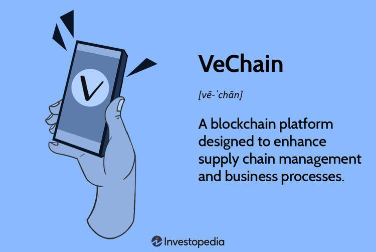

## Table of Contents

## What is VeChain and what is its primary purpose?

VeChain is a blockchain platform that helps businesses track their products from the moment they are made until they reach the customer. It uses special technology to make sure that all the information about a product is safe and cannot be changed. This helps companies know exactly where their products are and if they are real or fake.

The main purpose of VeChain is to make supply chains better and more trustworthy. It does this by giving businesses a way to see all the steps their products go through. This can help them find problems quickly and make sure their products are good quality. VeChain also helps companies show their customers that they care about being honest and open about how their products are made and delivered.

## How does VeChain differ from other blockchain platforms?

VeChain is different from other blockchain platforms because it focuses a lot on helping businesses with their supply chains. While many blockchains are used for things like money or digital art, VeChain is all about making sure products are tracked well from start to finish. It uses a special technology called the VeChainThor blockchain, which is designed to handle a lot of data and keep it safe. This makes it easier for companies to see where their products are and if they are real or not.

Another way VeChain stands out is by working closely with big companies. It has partnerships with well-known brands in different industries, like fashion and food. This shows that VeChain is trusted by businesses to help them improve how they work. Other blockchains might not have as many real-world uses or partnerships, making VeChain a more practical choice for companies looking to use blockchain technology in their daily operations.

## What are the main components of the VeChain ecosystem?

The VeChain ecosystem has several key parts that work together to make it useful for businesses. The main part is the VeChainThor blockchain, which is like a big digital record keeper. It stores all the information about products in a way that is safe and cannot be changed. This blockchain helps companies track their products from when they are made until they reach the customer. Another important part is the VeChain ToolChain, which is a set of tools that businesses can use to easily add their product data to the blockchain. It makes it simpler for companies to use VeChain without needing to know a lot about how blockchain works.

Another component is the VeChain tokens, which are called VET and VTHO. VET is like the main money in the VeChain world, and it is used to make transactions on the blockchain. VTHO is used to pay for the work the blockchain does, like adding new data. These tokens help keep the VeChain ecosystem running smoothly. Lastly, the VeChain Foundation and its partnerships with big companies are also important. The Foundation helps guide the development of VeChain and works with businesses to make sure the platform meets their needs. These partnerships show that VeChain is trusted and used in the real world, making it more valuable for other companies to join.

## How does VeChain ensure the security and integrity of its blockchain?

VeChain keeps its blockchain safe and trustworthy by using a special way of checking and adding new information. This method is called Proof of Authority (PoA). In PoA, only certain trusted people, called validators, can add new data to the blockchain. These validators are chosen carefully and have to follow strict rules. This makes it very hard for anyone to cheat or change the information on the blockchain because the validators are always watching and checking each other.

Another way VeChain keeps its blockchain secure is by using strong math and computer tricks, like encryption. This means that all the information on the blockchain is locked up in a way that only people with the right keys can see or change it. If someone tries to mess with the data, the blockchain will notice and stop them. This helps make sure that the information about products stays true and cannot be faked or changed without permission.

## What is the VeChainThor blockchain and how does it work?

The VeChainThor blockchain is a special kind of digital record keeper that helps businesses track their products. It's like a big, safe notebook where all the information about a product's journey is written down. This blockchain uses a method called Proof of Authority (PoA) to make sure the information is correct and safe. In PoA, only certain trusted people, called validators, can add new information to the blockchain. These validators are chosen carefully and they watch each other to make sure no one cheats or changes the data.

The VeChainThor blockchain also uses strong math and computer tricks, like encryption, to keep the information safe. This means that all the data on the blockchain is locked up so only people with the right keys can see or change it. If someone tries to mess with the data, the blockchain will notice and stop them. This helps businesses trust that the information about their products is true and cannot be faked or changed without permission.

## What are VET and VTHO, and what roles do they play in the VeChain ecosystem?

VET and VTHO are the two main tokens in the VeChain ecosystem. VET, short for VeChain Token, is like the main money in VeChain. It's used to make transactions on the VeChainThor blockchain. When you want to move or track a product, you use VET to pay for that action. VET also helps keep the VeChain ecosystem running smoothly because it's what people use to buy and sell things on the blockchain.

VTHO, or VeThor Token, is a bit different. It's used to pay for the work the blockchain does, like adding new data or running smart contracts. Think of VTHO as the fuel that keeps the VeChainThor blockchain going. Every time someone wants to do something on the blockchain, they need to use some VTHO to make it happen. This helps make sure that the blockchain can handle all the tasks it needs to without getting too busy or slow.

## Can you explain the consensus mechanism used by VeChain?

VeChain uses a special way to make sure everyone agrees on what information goes on its blockchain. This method is called Proof of Authority (PoA). In PoA, only certain trusted people, called validators, can add new information to the blockchain. These validators are chosen carefully and they have to follow strict rules. They watch each other to make sure no one cheats or changes the data. This makes it very hard for anyone to mess with the information because the validators are always checking and making sure everything is correct.

This system helps VeChain keep its blockchain safe and trustworthy. Because only trusted validators can add new data, it's much harder for bad people to try to change things. The validators work together to make sure the information stays true and cannot be faked or changed without permission. This is important for businesses that use VeChain to track their products because they need to know that the information they see is always correct and safe.

## What are some real-world applications of VeChain technology?

VeChain helps businesses keep track of their products from start to finish. For example, in the food industry, companies use VeChain to make sure their food is safe and fresh. They can see where the food comes from, how it's stored, and when it's delivered. This helps them find any problems quickly and make sure their customers get good quality food. Big companies like Walmart China use VeChain to do this, so they can show their customers that they care about safety and quality.

Another real-world use of VeChain is in the fashion industry. Brands like H&M use VeChain to fight against fake products. They put special tags on their clothes that customers can scan to see if the item is real. This helps the brands protect their name and make sure people are buying real products. VeChain also helps with recycling by tracking how clothes are reused or thrown away, which is good for the environment.

In the car industry, companies like Renault use VeChain to keep track of car parts. They can see where each part comes from and make sure it's good quality. This helps them build better cars and fix problems faster. VeChain makes it easier for car companies to work with their suppliers and keep everything running smoothly.

## How has VeChain evolved since its inception?

VeChain started in 2015 as a way to help businesses track their products better. At first, it was called VeChain and used the Ethereum blockchain. But the team saw that they needed their own special blockchain to do more and be faster. So, in 2018, they made the VeChainThor blockchain. This new blockchain was made just for businesses and could handle a lot more information safely. They also changed their name to VeChain to show that they were a new and improved version.

Since then, VeChain has grown a lot. They have worked with big companies in different industries like food, fashion, and cars. For example, they help Walmart China keep their food safe and H&M fight against fake clothes. VeChain also made it easier for businesses to use their technology with tools like VeChain ToolChain. They keep making their blockchain better and adding new ways for companies to use it. This shows that VeChain is always trying to help businesses work better and be more trustworthy.

## What are the major milestones in VeChain's history?

VeChain started in 2015 to help businesses track their products better. At first, it used the Ethereum blockchain and was called VeChain. But the team saw they needed their own special blockchain to do more and be faster. So, in 2018, they made the VeChainThor blockchain. This new blockchain was made just for businesses and could handle a lot more information safely. They also changed their name to VeChain to show that they were a new and improved version.

Since then, VeChain has grown a lot. They have worked with big companies in different industries like food, fashion, and cars. For example, they help Walmart China keep their food safe and H&M fight against fake clothes. VeChain also made it easier for businesses to use their technology with tools like VeChain ToolChain. They keep making their blockchain better and adding new ways for companies to use it. This shows that VeChain is always trying to help businesses work better and be more trustworthy.

## What are the current challenges and future prospects for VeChain?

VeChain faces some challenges right now. One big challenge is getting more businesses to use their technology. Even though they work with big companies like Walmart China and H&M, many other businesses still don't know about VeChain or how it can help them. Another challenge is keeping their blockchain safe and fast as more people use it. As more data gets added, it can get harder to keep everything running smoothly and securely.

But VeChain also has a bright future ahead. They keep making their technology better and adding new ways for businesses to use it. For example, they are working on making their blockchain even faster and more secure. They also want to help with big problems like climate change by tracking how products affect the environment. If more businesses start using VeChain, it could become a very important tool for making supply chains better and more trustworthy all over the world.

## How does VeChain contribute to sustainability and environmental efforts?

VeChain helps with sustainability by tracking products in a way that helps businesses be more eco-friendly. They use their blockchain to keep an eye on how products are made, moved, and thrown away. This helps companies see where they can save energy, use fewer resources, and recycle more. For example, VeChain works with fashion brands to track how clothes are reused or recycled, which is good for the environment.

In the future, VeChain wants to do even more for the environment. They are working on new ways to use their technology to fight climate change. By tracking how products affect the environment, VeChain can help businesses make choices that are better for the planet. This could make a big difference in making the world more sustainable.

## References & Further Reading

[1]: ["VeChain Foundation Whitepaper"](https://vechain.org/vision/), VeChain Foundation.

[2]: Nakamoto, S. (2008). ["Bitcoin: A Peer-to-Peer Electronic Cash System."](https://nakamotoinstitute.org/library/bitcoin/)

[3]: Tapscott, D., & Tapscott, A. (2018). ["Blockchain Revolution: How the Technology Behind Bitcoin and Other Cryptocurrencies is Changing the World,"](https://www.tandfonline.com/doi/full/10.1080/10686967.2018.1404373) Penguin Books.

[4]: Pilkington, M. (2016). ["Blockchain Technology: Principles and Applications,"](https://papers.ssrn.com/sol3/papers.cfm?abstract_id=2662660) in Research Handbook on Digital Transformations.

[5]: PricewaterhouseCoopers (PwC). ["How Blockchain Technology Could Impact the Audit."](https://www.pwc.com/us/en/services/digital-assets/blockchain-services.html)

[6]: ["Blockchain: Blueprint for a New Economy"](https://dl.acm.org/doi/book/10.5555/3006358) by Melanie Swan, O'Reilly Media.

[7]: ["VeChain: A Guide to Blockchain and Cryptocurrency for Supply Chain Management"](https://www.gemini.com/cryptopedia/vechain-crypto-blockchain-supply-chain-management) by Sean Bennett.

[8]: Wood, G. (2014). ["Ethereum: A Secure Decentralised Generalised Transaction Ledger."](https://www.semanticscholar.org/paper/ETHEREUM%3A-A-SECURE-DECENTRALISED-GENERALISED-LEDGER/da082d8dcb56ade3c632428bfccb88ded0493214) Ethereum Yellow Paper.