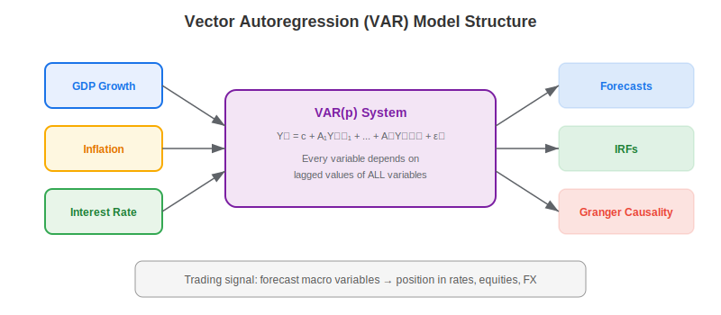
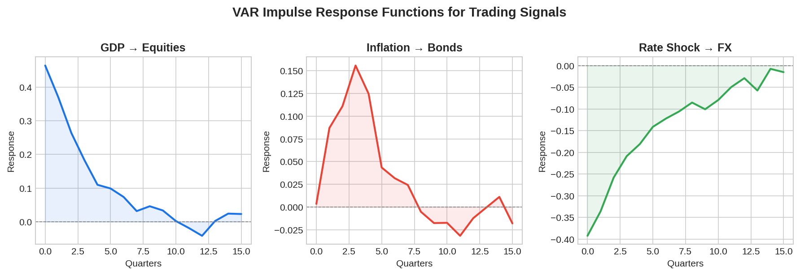

A **Vector Autoregression (VAR)** model is a multivariate time series model where each variable is regressed on its own lagged values and the lagged values of all other variables in the system. In trading, VAR models capture the dynamic interdependencies between macro variables — GDP growth, inflation, interest rates, credit spreads — and use these relationships for forecasting, causality testing, and impulse response analysis. VAR is the empirical workhorse of macro-finance: simpler than [DSGE models](https://paperswithbacktest.com/wiki/dsge-models-explained-algo-trading) but more flexible and data-driven.

## The VAR(p) Model

A VAR model of order $p$ for $K$ variables:

$$Y_t = c + A_1 Y_{t-1} + A_2 Y_{t-2} + \ldots + A_p Y_{t-p} + \epsilon_t$$

where $Y_t$ is a $K \times 1$ vector of variables, $c$ is a constant vector, $A_i$ are $K \times K$ coefficient matrices, and $\epsilon_t \sim \mathcal{N}(0, \Sigma)$ is the error vector with covariance $\Sigma$.

For a 3-variable system (GDP, inflation, rates) with 1 lag:

$$\begin{pmatrix} \text{GDP}_t \\ \pi_t \\ i_t \end{pmatrix} = \begin{pmatrix} c_1 \\ c_2 \\ c_3 \end{pmatrix} + \begin{pmatrix} a_{11} & a_{12} & a_{13} \\ a_{21} & a_{22} & a_{23} \\ a_{31} & a_{32} & a_{33} \end{pmatrix} \begin{pmatrix} \text{GDP}_{t-1} \\ \pi_{t-1} \\ i_{t-1} \end{pmatrix} + \epsilon_t$$

Every variable depends on the lagged values of **all** variables — this is what captures cross-variable dynamics.



## Key Applications for Traders

**Forecasting**: VAR models produce multi-step-ahead forecasts of all variables simultaneously. Traders use these to forecast rates, spreads, and growth — the inputs that drive asset allocation.

**Impulse Response Functions (IRFs)**: Trace how a shock to one variable (e.g., a surprise rate hike) propagates through the system over time. IRFs tell traders how long a shock persists and which other variables are affected.

**Granger Causality**: Test whether past values of variable X help predict variable Y beyond Y's own history. This identifies lead-lag relationships that can be exploited — for example, whether credit spreads Granger-cause equity returns.

**Forecast Error Variance Decomposition (FEVD)**: Quantifies what fraction of each variable's forecast error is attributable to shocks from each other variable. This reveals which macro factors are the dominant drivers.



## Python Implementation

```python
import numpy as np

def fit_var(data, p=1):
    """
    Fit a VAR(p) model via OLS.
    data: T x K array of time series
    Returns coefficient matrices and residual covariance.
    """
    T, K = data.shape
    # Build lagged matrices
    Y = data[p:]  # T-p x K
    X = np.ones((T - p, 1))  # intercept
    for lag in range(1, p + 1):
        X = np.column_stack([X, data[p - lag:T - lag]])
    
    # OLS: B = (X'X)^-1 X'Y
    B = np.linalg.lstsq(X, Y, rcond=None)[0]
    residuals = Y - X @ B
    sigma = residuals.T @ residuals / (T - p - K * p - 1)
    
    return B, sigma, residuals

def var_forecast(data, B, p=1, steps=4):
    """Generate multi-step forecasts from a fitted VAR."""
    K = data.shape[1]
    forecasts = []
    last_obs = data[-p:].copy()
    
    for _ in range(steps):
        x = np.array([1.0])  # intercept
        for lag in range(p):
            x = np.concatenate([x, last_obs[-(lag+1)]])
        y_hat = B.T @ x
        forecasts.append(y_hat)
        last_obs = np.vstack([last_obs[1:], y_hat.reshape(1, -1)])
    
    return np.array(forecasts)

# Example: 3-variable macro VAR
np.random.seed(42)
T = 200
gdp = np.cumsum(np.random.normal(0.5, 1, T))
inflation = 0.3 * gdp + np.cumsum(np.random.normal(0, 0.5, T))
rates = 0.5 * inflation + np.random.normal(0, 0.3, T)
data = np.column_stack([np.diff(gdp), np.diff(inflation), np.diff(rates)])

B, sigma, resid = fit_var(data, p=2)
forecasts = var_forecast(data, B, p=2, steps=4)

var_names = ["GDP Growth", "Inflation", "Rate Change"]
print("4-Quarter Ahead Forecasts:")
for t in range(4):
    print(f"  Q+{t+1}: " + " | ".join(f"{var_names[k]}: {forecasts[t, k]:+.3f}" for k in range(3)))
```

## VAR vs Other Macro Models

| Feature | VAR | DSGE | Single-Equation AR |
|---------|-----|------|-------------------|
| Variables | Multiple, jointly modeled | Multiple, structurally linked | Single |
| Theory required | None | Full micro-foundations | None |
| Flexibility | High | Medium | High |
| Interpretation | Statistical | Economic | Limited |
| Forecasting | Good short-term | Good scenario analysis | Good single-variable |
| Causality testing | Granger causality | Structural causality | Not applicable |

## Limitations and Risks

VAR models are data-hungry — they have $K^2 \times p + K$ parameters, which grows quickly. With 5 variables and 4 lags, that is already 105 parameters. Overfitting is a constant risk, especially with short macro time series. VAR is atheoretical — it captures correlations but not causal mechanisms, which can lead to spurious relationships. The Lucas critique applies: estimated relationships may change when policy regimes shift.

## Conclusion

Vector autoregression models provide a flexible, data-driven framework for modeling the dynamic interactions between macro-financial variables. For algo traders, their primary value lies in multi-step forecasting, Granger causality testing, and impulse response analysis — tools that inform [macro factor investing](https://paperswithbacktest.com/wiki/macro-factor-investing-explained) and regime-aware strategy allocation. Combined with structural models like DSGE, VAR gives traders a complete macro modeling toolkit.

---

**Explore further on PapersWithBacktest:**
- Browse [backtested macro strategies](https://paperswithbacktest.com/strategies) with Python code and performance metrics
- Access [clean historical market data](https://paperswithbacktest.com/datasets) for equities, crypto, and futures
- Take the [algo trading course](https://paperswithbacktest.com/course) — 60+ video lessons and notebooks
- Related wiki pages: [DSGE Models Explained](https://paperswithbacktest.com/wiki/dsge-models-explained-algo-trading) · [IS-LM Model](https://paperswithbacktest.com/wiki/is-lm-model-curves-characteristics-limitations) · [Macro Factor Investing](https://paperswithbacktest.com/wiki/macro-factor-investing-explained)
