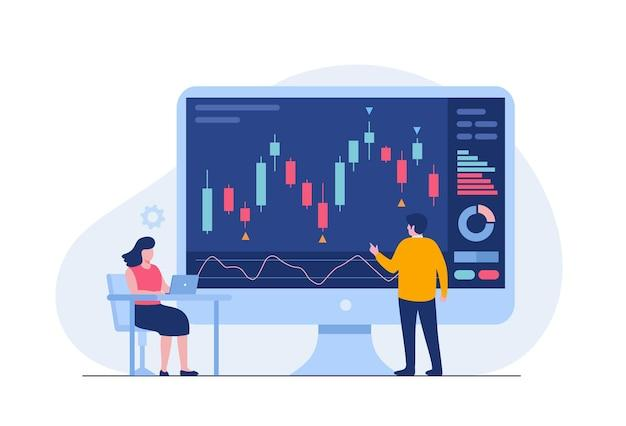

In the fast-paced world of financial markets, technology continues to revolutionize the way we trade. Among the technological advancements redefining the landscape, Vector Trading stands out as a significant development within algorithmic trading. Vector Trading employs sophisticated algorithms and mathematical models to automate and optimize trading processes, enabling rapid and efficient decision-making based on real-time data analysis.

Vector Trading's prominence is underscored by its ability to process vast amounts of market data at unprecedented speeds. This technology leverages computational power to execute trades that aim to exploit market inefficiencies, thereby achieving consistent and profitable outcomes. As such, the incorporation of Vector Trading into financial practices reflects a shift towards more data-driven and precise trading methodologies.



This article explores the fundamentals of Vector Trading, highlighting its key features and the benefits it offers traders. By examining the pivotal role of technology in facilitating this trading approach, the article aims to provide a comprehensive understanding of Vector Trading's influence on financial markets. Through an analysis of its operational mechanics and associated benefits, readers will gain insight into how this innovative trading method is shaping the future of the financial industry.

## Table of Contents

## What is Vector Trading?

Vector Trading refers to the process of executing trades through the utilization of predefined algorithms and mathematical models. At its core, it involves the deployment of automated trading systems programmed to make buy or sell decisions by analyzing market data. This approach aims to identify and exploit market inefficiencies for profitable outcomes.

Unlike traditional manual trading methods, Vector Trading is capable of processing large volumes of data at exceptional speeds. This efficiency is achieved by leveraging computational power that far surpasses human capability. For instance, algorithms may analyze various indicators such as moving averages, price patterns, and other technical signals to make informed decisions swiftly.

The strategies employed in Vector Trading are crafted to detect opportunities arising from market inefficiencies. These can include price mismatches, [arbitrage](/wiki/arbitrage) opportunities, or other anomalies that may be temporarily present in the market. For example, a basic algorithm may look for discrepancies in the prices of a stock across different exchanges and execute trades to profit from the differences.

In Python, a simple model for moving average crossover strategy, which is commonly used in Vector Trading, might look like this:

```python
import pandas as pd

# Sample stock data
data = pd.DataFrame({'close': [100, 102, 104, 101, 98, 99, 105, 107]})

# Calculate moving averages
data['short_mavg'] = data['close'].rolling(window=2).mean()
data['long_mavg'] = data['close'].rolling(window=4).mean()

# Generate signals
data['signal'] = 0
data.loc[data['short_mavg'] > data['long_mavg'], 'signal'] = 1
data.loc[data['short_mavg'] < data['long_mavg'], 'signal'] = -1

print(data)
```

In this code snippet, short-term and long-term moving averages are calculated. Buy or sell signals are generated based on the crossover of these averages, reflecting the essence of strategy creation in Vector Trading.

The overarching aim of Vector Trading is to harness advanced computational techniques to foster consistent and profitable trading results, marking a significant evolution from conventional practices in financial markets.

## How Does Algorithmic Trading Work?

Algorithmic trading systems use intricate mathematical models to process historical and real-time market data. These systems rely on pre-set instructions concerning timing, price, and [volume](/wiki/volume-trading-strategy), allowing for precise execution of trades. At their core, these algorithms evaluate large datasets to identify trends and patterns that might be invisible to the human eye. A significant advantage is the ability to operate continuously, thus eliminating human factors such as fatigue or emotional biases that can impair judgment.

These algorithms function through a series of steps: data collection, signal generation, risk management, and execution. The primary step—data collection—entails gathering extensive historical and streaming data. This data might include stock prices, trading volumes, news events, and other financial indicators. Python is often employed in this phase due to its rich ecosystem of libraries like `pandas` and `NumPy`, which facilitate data manipulation and analysis.

For signal generation, algorithms apply various mathematical models to identify opportunities. One basic example is the Moving Average Crossover strategy, where buy or sell signals are generated when a short-term moving average crosses a long-term moving average. In Python, this can be implemented as follows:

```python
import pandas as pd

# Assume 'data' is a pandas DataFrame with a 'close' column
short_window = 40
long_window = 100

data['short_mavg'] = data['close'].rolling(window=short_window, min_periods=1, center=False).mean()
data['long_mavg'] = data['close'].rolling(window=long_window, min_periods=1, center=False).mean()

data['signals'] = 0.0
data['signals'][short_window:] = np.where(data['short_mavg'][short_window:] > data['long_mavg'][short_window:], 1.0, 0.0)
data['positions'] = data['signals'].diff()
```

Once a signal is generated, risk management algorithms evaluate it to determine the viability and risk-return ratio, ensuring that the executed trades adhere to a defined risk tolerance framework. This step also involves setting stop-loss limits or leverage caps.

Lastly, the execution phase activates, where the system places orders into the market. This can be automated via electronic communication networks (ECNs) or through broker APIs, leading to rapid and efficient trade execution.

Overall, [algorithmic trading](/wiki/algorithmic-trading) ensures that transactions are conducted at high speed and efficiency, surpassing manual trading capabilities significantly. Continuous [backtesting](/wiki/backtesting) and refinement of algorithms are essential, as they help optimize strategies across diverse market conditions, thereby ensuring sustained performance and adaptability.

## Benefits of Vector Trading

Vector Trading offers several significant benefits to financial market participants, primarily driven by its reliance on algorithmic systems. One of the foremost advantages is the increased speed of trade execution. These systems can analyze vast amounts of data in fractions of a second, allowing traders to capitalize on fleeting market opportunities that would be missed with manual trading. This rapid decision-making capability substantially enhances trading accuracy by minimizing the delay between input and execution, which can be critical in highly volatile markets.

Furthermore, Vector Trading systems allow traders to manage large transaction volumes effortlessly. The ability to execute numerous trades simultaneously, without the need for manual intervention, vastly increases the efficiency of trading operations. This scalability is invaluable in liquid markets, where the speed and volume of trades can have a significant impact on profitability.

Another crucial benefit is the minimization of human errors. By automating the trading process, the risk associated with human factors such as emotion-driven decisions or fatigue is significantly reduced. Algorithmic systems follow predefined instructions with precision, ensuring consistent application of trading strategies. This reliability enhances the overall trustworthiness of the trading system.

The ability to backtest trading strategies against extensive historical data is another advantage of Vector Trading. By evaluating the performance of strategies in past market conditions, traders can refine their techniques to improve future outcomes. This process involves adjusting parameters and models to optimize performance, often employing statistical and [machine learning](/wiki/machine-learning) methods to identify effective strategies. 

In Python, backtesting can be done using libraries like `Backtrader` or `Zipline`:

```python
import backtrader as bt

class TestStrategy(bt.Strategy):
    def __init__(self):
        self.dataclose = self.datas[0].close

    def next(self):
        if not self.position:
            if self.dataclose[0] < self.dataclose[-1]:
                self.buy(size=100)
        else:
            if self.dataclose[0] > self.dataclose[-1]:
                self.sell(size=100)

cerebro = bt.Cerebro()
cerebro.addstrategy(TestStrategy)
cerebro.run()
```

Moreover, the algorithmic nature of Vector Trading reduces transaction costs. Because trades are executed automatically and quickly, the expense of engaging intermediary parties can be minimized. This cost efficiency, coupled with the scalability to handle large transaction volumes, enhances the potential for traders to achieve higher profitability through algorithmic systems.

Overall, these benefits make Vector Trading an indispensable approach for traders seeking to leverage technology to improve trading performance and financial outcomes in the competitive landscape of modern financial markets.

## Challenges in Vector Trading

Vector Trading, while presenting numerous advantages, is not without its challenges. One major concern is the potential for high-frequency trading ([HFT](/wiki/high-frequency-trading-strategies)) to increase market [volatility](/wiki/volatility-trading-strategies) and initiate flash crashes. HFT, due to its ability to execute a vast number of transactions in milliseconds, can rapidly alter the market landscape. It may exacerbate price swings and, in extreme cases, lead to flash crashes as seen in events like the 2010 United States stock market crash.

Developers of trading algorithms face the continuous challenge of updating and refining these systems. Market conditions are dynamic, and algorithms that are not regularly adapted may become obsolete or ineffective. This requires a deep understanding of both the current market environment and potential future conditions, demanding significant resources and expertise.

The complexity inherent in algorithmic trading can sometimes introduce unforeseen risks and failures. Algorithms are sophisticated and can involve multiple layers of logic and nested decision-making processes. Small errors in the algorithm's code or logic can lead to considerable financial losses, as evidenced by incidents like the Knight Capital Group trading mishap in 2012, where faulty code led to a $440 million loss in just 45 minutes.

Furthermore, Vector Trading is subject to increasing regulatory scrutiny. Financial regulators across the globe are focusing on ensuring the transparency and accountability of algorithmic trading systems. Compliance with legal standards is essential, as regulators demand greater transparency to minimize risks associated with market manipulation and to protect the integrity of financial markets. This regulatory landscape requires traders and firms to maintain detailed records of their algorithms and to ensure their practices align with constantly evolving legal requirements.

In summary, while Vector Trading offers significant advantages, it requires careful management of these challenges to fully harness its potential without compromising market stability or regulatory compliance.

## Key Technologies and Tools

The foundation of Vector Trading relies on advanced technological infrastructure. High-speed internet and powerful computing systems are essential to efficiently process and analyze vast quantities of market data. These resources enable rapid data throughput and computational tasks needed for executing trades.

Key programming languages such as Python, C++, and Java are commonly used for developing trading algorithms. Python is notably preferred for its simplicity and the extensive range of libraries available for financial analysis and machine learning applications. Here's a simple example of using Python to calculate the exponential moving average (EMA), a common technical indicator:

```python
import pandas as pd

def calculate_ema(data, span):
    return data.ewm(span=span, adjust=False).mean()

# Sample usage
prices = pd.Series([100, 102, 104, 103, 105])
ema = calculate_ema(prices, span=3)
print(ema)
```

Software platforms play a critical role in the development and deployment of trading algorithms. MetaTrader and QuantConnect are widely recognized for their comprehensive suites that cover backtesting, execution, and strategy visualization. These platforms provide traders with the necessary tools to automate and optimize their trading processes.

Machine learning and [artificial intelligence](/wiki/ai-artificial-intelligence) are increasingly integrated to improve the predictive accuracy of algorithms. These systems can learn from historical data patterns and adjust to new market conditions dynamically. For example, neural networks and [reinforcement learning](/wiki/reinforcement-learning) models are employed to predict asset price movements and optimize trading strategies accordingly.

Data processing tools and APIs are indispensable for accessing real-time market data streams. Efficient data management and processing allow for the swift transformation of raw data into actionable trading insights. APIs serve as gateways for acquiring market data from exchanges, ensuring that algorithms function with the most current information available.

In summary, the technological backbone of Vector Trading combines high-speed computing, sophisticated programming, and intelligent systems to enhance the precision and efficiency of algorithmic trades.

## Case Studies and Success Stories

Leading financial institutions have implemented Vector Trading successfully, leading to noteworthy competitive advantages and highlighting the transformative role of algorithmic trading in the financial sector. A case in point is Renaissance Technologies, a [hedge fund](/wiki/hedge-fund-trading-strategies) renowned for its algorithmic trading strategies. Renaissance's Medallion Fund, spearheaded by sophisticated quantitative models, consistently produces high returns, showcasing the potential of Vector Trading. 

Similarly, firms like Citadel LLC leverage algorithmic approaches to manage large-scale trading volumes with increased precision and cost-efficiency. Citadel's integration of data-driven strategies exemplifies how algorithmic models can enhance decision-making processes and streamline trade executions. 

Individual traders have also harnessed Vector Trading to optimize performance. Using platforms such as QuantConnect, they create and backtest strategies to achieve refined trading techniques. Algorithms provide these traders with analytical prowess, enabling them to exploit market inefficiencies and secure profitable outcomes.

Efficiency improvements and cost reductions are other key benefits exemplified by major brokerage firms that utilize Vector Trading. Through programmatic trading, firms have managed to cut down transaction costs significantly and improve the speed of trade executions. These technologies have mitigated manual errors and increased transaction throughput, providing a decisive edge in high-frequency trading environments.

Despite these successes, there are cautionary tales in the industry. Companies that failed to embrace technological advancements have faced significant setbacks. For instance, some firms could not adapt to the rapid progression of algorithmic trading and consequently suffered from inefficiencies and reduced market relevance. These lessons underscore the critical need for continuous innovation and adaptability in the face of technological disruptions.

## Future Trends in Vector Trading

The integration of big data analytics in Vector Trading is expected to enhance trading precision significantly. By processing vast amounts of real-time and historical data, algorithms can identify patterns and trends that were previously undetectable. This capability allows for a more nuanced understanding of market dynamics, leading to improved decision-making processes. For example, machine learning techniques are used to analyze diverse data sets, ranging from price movements to social media sentiment, to predict future market behavior more accurately.

Blockchain technology is poised to play a crucial role in the evolution of Vector Trading. The decentralized nature of blockchain offers enhanced transparency and security, addressing some of the critical vulnerabilities of algorithmic trading systems. Smart contracts, which are self-executing contracts with the terms of the agreement directly written into code, could automate and validate transactions without the need for intermediaries. This innovation could lead to lower operational costs and reduce the susceptibility to fraud.

The rise of decentralized finance (DeFi) platforms is another trend that may reshape Vector Trading's landscape. DeFi aims to recreate traditional financial systems, like banks and exchanges, using decentralized technologies such as blockchain. This movement can democratize access to financial services, enabling a broader range of participants to engage in Vector Trading. The seamless integration of DeFi protocols with trading platforms could facilitate more efficient, transparent, and inclusive trading ecosystems.

Ethical and responsible trading algorithms are becoming increasingly important as concerns about market manipulation and fairness grow. Regulators are placing a stronger emphasis on ethical practices, demanding greater accountability and transparency from trading entities. Algorithm developers are now incorporating ethical considerations into their designs to ensure fair play and mitigate risks associated with predatory trading practices. This shift is leading to the development of algorithms that not only aim for profitability but also adhere to acceptable ethical standards.

The continuous evolution of artificial intelligence (AI) is central to the advancement of Vector Trading strategies. AI technologies like [deep learning](/wiki/deep-learning) and neural networks offer sophisticated methods for analyzing complex data and making predictions. These AI-driven approaches can optimize trading algorithms by adapting to changing market conditions and learning from past trades. As artificial intelligence continues to advance, its integration with Vector Trading systems promises to deliver enhanced performance and adaptability, shaping an increasingly automated and intelligent trading future. 

Overall, while challenges remain, particularly concerning regulatory compliance and ethical standards, the future of Vector Trading is set to be heavily influenced by technological advancements. These developments promise to make trading systems more efficient, secure, and accessible, ultimately transforming the financial markets.

## Conclusion

Vector Trading represents a transformative shift in how financial markets operate, driven by its integration of algorithmic models and computational prowess. Its benefits of speed, accuracy, and scalability make it an indispensable tool for modern traders seeking to navigate the complexities of today's markets. The ability to process and analyze massive datasets in mere milliseconds allows traders to capitalize on fleeting market opportunities, thus enhancing their competitive edge.

However, while Vector Trading offers significant advantages, it is not without its challenges. The landscape of financial markets is ever-evolving, and technological advancements continue to pave the way for more robust systems. Developers and traders must stay informed, continually updating and refining their algorithms to adapt to changing conditions and emerging technologies. This constant evolution requires a commitment to staying ahead of regulatory demands and integrating cutting-edge tools such as machine learning and artificial intelligence to maintain optimal performance.

Moreover, the growth of new technologies such as blockchain and decentralized finance platforms promises to further shape the future of Vector Trading. These advancements may introduce greater transparency, security, and efficiency, potentially revolutionizing traditional trading practices. As such, traders who remain vigilant and adaptable in this rapidly changing environment are more likely to achieve long-term success.

As financial markets progress, so will the sophistication and impact of Vector Trading. The interplay between technological innovation and market dynamics suggests a future where algorithmic trading systems will become more integral, sophisticated, and responsive to the needs of traders and investors alike. Embracing these changes will be critical for those aiming to thrive in the evolving world of finance.

## References & Further Reading

[1]: ["Advances in Financial Machine Learning"](https://www.amazon.com/Advances-Financial-Machine-Learning-Marcos/dp/1119482089) by Marcos Lopez de Prado

[2]: ["Evidence-Based Technical Analysis: Applying the Scientific Method and Statistical Inference to Trading Signals"](https://www.amazon.com/Evidence-Based-Technical-Analysis-Scientific-Statistical/dp/0470008741) by David Aronson

[3]: ["Machine Learning for Algorithmic Trading"](https://github.com/stefan-jansen/machine-learning-for-trading) by Stefan Jansen

[4]: ["Quantitative Trading: How to Build Your Own Algorithmic Trading Business"](https://www.amazon.com/Quantitative-Trading-Build-Algorithmic-Business/dp/1119800064) by Ernest P. Chan

[5]: Aldridge, I. (2013). ["High-Frequency Trading: A Practical Guide to Algorithmic Strategies and Trading Systems,"](https://www.amazon.com/High-Frequency-Trading-Practical-Algorithmic-Strategies/dp/1118343506) 2nd Edition, Wiley.

[6]: Hendershott, T., Jones, C. M., & Menkveld, A. J. (2011). ["Does Algorithmic Trading Improve Liquidity?"](https://onlinelibrary.wiley.com/doi/full/10.1111/j.1540-6261.2010.01624.x) The Review of Financial Studies, 24(8), 2915–2953.

[7]: Harris, L. (2003). ["Trading & Exchanges: Market Microstructure for Practitioners"](https://academic.oup.com/book/52292) by Oxford University Press

[8]: Kissell, R. (2013). ["The Science of Algorithmic Trading and Portfolio Management,"](https://www.sciencedirect.com/book/9780124016897/the-science-of-algorithmic-trading-and-portfolio-management) Academic Press.