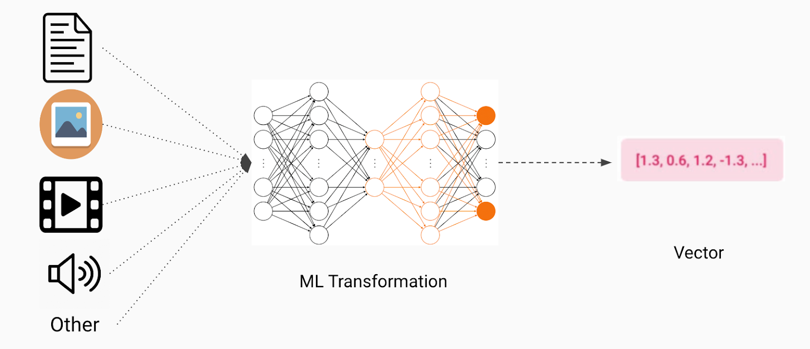

## Table of Contents

## What is a vector in the context of machine learning?

In machine learning, a vector is a way to represent data using numbers. Think of it as an arrow in space that has both a direction and a length. For example, if you want to describe a house, you might use numbers for its size, number of rooms, and price. Each of these numbers is part of a vector that represents the house. In math terms, a vector can be written as $$ \mathbf{v} = [v_1, v_2, v_3, ..., v_n] $$, where each $$ v_i $$ is a number.

Vectors are very important in machine learning because they help computers understand and work with data. Many algorithms, like those used in neural networks or clustering, use vectors to process information. For example, when a computer tries to recognize images, it might turn the image into a vector of pixel values. By doing this, the computer can then use math to find patterns and make predictions. This makes vectors a basic building block in many machine learning tasks.

## How are vectors used in data representation for machine learning?

In machine learning, vectors are used to represent data in a way that computers can easily understand and process. Imagine you have a collection of information about different fruits, like their weight, color, and sweetness. You can turn this information into a vector for each fruit. For example, an apple might be represented as a vector $$ \mathbf{v} = [150, "red", 8] $$, where 150 is the weight in grams, "red" is the color, and 8 is the sweetness level on a scale of 1 to 10. By using vectors, you can organize and analyze this data more effectively.

Once the data is in vector form, [machine learning](/wiki/machine-learning) algorithms can work with it to find patterns, make predictions, or classify items. For instance, if you want to teach a computer to recognize different types of fruits, you can use these vectors as input to a model. The model will learn to associate certain vector patterns with specific fruits. This is how machine learning uses vectors to turn complex data into something that can be mathematically analyzed and used to make decisions or predictions.

## What is the difference between a vector and a scalar in machine learning?

In machine learning, a vector is a list of numbers that can represent many different things, like the features of an object. For example, if you want to describe a car, you might use numbers for its speed, weight, and price. This would be a vector like $$ \mathbf{v} = [100, 1500, 20000] $$, where each number tells you something about the car. Vectors are great for machine learning because they let computers work with complex data in a simple way.

A scalar, on the other hand, is just a single number. It doesn't have any direction like a vector does. For example, if you want to describe the temperature outside, you might say it's 25 degrees. That's a scalar because it's just one number. In machine learning, scalars are used for things like the learning rate of an algorithm, which is a single number that tells the algorithm how fast to learn. So, while vectors help represent many pieces of information at once, scalars are used for single values that affect how the machine learning model works.

## How do vector operations like addition and multiplication apply in machine learning?

Vector operations like addition and multiplication are important in machine learning because they help process data and make models work better. When you add two vectors, you just add each number in the first vector to the matching number in the second vector. For example, if you have two vectors $$ \mathbf{v_1} = [1, 2, 3] $$ and $$ \mathbf{v_2} = [4, 5, 6] $$, adding them gives you $$ \mathbf{v_1} + \mathbf{v_2} = [1+4, 2+5, 3+6] = [5, 7, 9] $$. This can be useful in machine learning when you want to combine different sets of data or features.

Multiplication of vectors can be done in different ways, but the most common in machine learning is the dot product. The dot product of two vectors $$ \mathbf{v_1} $$ and $$ \mathbf{v_2} $$ is calculated by multiplying each number in $$ \mathbf{v_1} $$ by the matching number in $$ \mathbf{v_2} $$ and then adding all those products together. For example, if $$ \mathbf{v_1} = [1, 2, 3] $$ and $$ \mathbf{v_2} = [4, 5, 6] $$, their dot product is $$ \mathbf{v_1} \cdot \mathbf{v_2} = (1 \times 4) + (2 \times 5) + (3 \times 6) = 4 + 10 + 18 = 32 $$. This is used a lot in machine learning algorithms to find how similar two sets of data are or to help the model make predictions.

## What role do vectors play in feature scaling and normalization?

In machine learning, vectors are very important for feature scaling and normalization. Feature scaling means making sure all the numbers in your data are on a similar scale. This is important because some machine learning algorithms work better when all the features are in the same range. For example, if you're using vectors to describe houses, one feature might be the size in square feet (like 1500) and another might be the number of bedrooms (like 3). Without scaling, the size feature would have a much bigger effect on the model because it's a bigger number. By scaling the vector, you can make sure both features are treated fairly.

Normalization is a type of scaling where you change the numbers in the vector so they fit between 0 and 1. This can be done by subtracting the smallest number in the vector from each number and then dividing by the range of the vector. For example, if you have a vector $$ \mathbf{v} = [2, 4, 6, 8] $$, you can normalize it by subtracting 2 (the smallest number) from each element and then dividing by 6 (the range, which is 8 - 2). So the normalized vector would be $$ \mathbf{v}_{\text{normalized}} = \left[\frac{2-2}{6}, \frac{4-2}{6}, \frac{6-2}{6}, \frac{8-2}{6}\right] = [0, 0.33, 0.67, 1] $$. This helps the machine learning model work better because all the numbers are now on the same scale from 0 to 1.

## How are vectors utilized in dimensionality reduction techniques like PCA?

In machine learning, vectors are crucial for dimensionality reduction techniques like Principal Component Analysis (PCA). PCA works by taking a set of vectors, each representing a data point with many features, and finding new vectors called principal components that capture the most important information in the data. Imagine you have a bunch of points in a high-dimensional space, and you want to see them in a simpler way. PCA helps you do this by turning those high-dimensional vectors into lower-dimensional ones while keeping as much of the original information as possible. This is done by calculating the eigenvectors and eigenvalues of the data's covariance matrix, where the eigenvectors represent the principal components.

The process starts with a matrix where each row is a vector representing a data point. PCA then finds the directions (eigenvectors) in which the data varies the most. These directions are the principal components, and they are chosen so that the first component explains the most variance in the data, the second component explains the next most, and so on. By selecting only the top few principal components, you can represent your data with fewer dimensions. For example, if you have vectors in a 100-dimensional space, PCA might let you represent them well in just 2 or 3 dimensions. This makes it easier to visualize and work with the data, and it can also speed up machine learning algorithms by reducing the number of features they need to process.

## What is the significance of vector space in machine learning algorithms?

In machine learning, the idea of vector space is super important. Think of a vector space as a big room where each point in the room is a vector. These vectors can represent things like images, words, or any kind of data. By putting data into a vector space, machine learning algorithms can use math to find patterns and make predictions. For example, if you want to see how similar two images are, you can use the distance between their vectors in the vector space. This makes it easier for computers to understand and work with the data.

Vector spaces are also key in many machine learning techniques. For instance, when you use algorithms like clustering or classification, they often work by figuring out how vectors relate to each other in the vector space. Techniques like Principal Component Analysis (PCA) use vector spaces to reduce the number of dimensions while keeping the important information. By understanding how vectors move and interact in this space, machine learning models can do things like group similar items together or predict what might happen next based on past data.

## How do vectors contribute to the calculation of distances and similarities in machine learning?

In machine learning, vectors help us figure out how similar or different things are by calculating distances between them. Think of each vector as a point in a big room. If you want to see how close two points are, you can use a formula like the Euclidean distance. This is like measuring the straight line between two points. For example, if you have two vectors $$ \mathbf{v_1} = [1, 2] $$ and $$ \mathbf{v_2} = [4, 6] $$, the Euclidean distance between them is calculated as $$ \sqrt{(4-1)^2 + (6-2)^2} = \sqrt{9 + 16} = \sqrt{25} = 5 $$. By doing this, machine learning models can group similar items together or find the nearest neighbor for a new piece of data.

Vectors also help in finding similarities using other methods like cosine similarity. This method looks at the angle between two vectors instead of just their distance. If the angle is small, the vectors are similar. For example, if you have two vectors representing text documents, you can use cosine similarity to see how much they have in common. The formula for cosine similarity is $$ \text{cosine similarity} = \frac{\mathbf{v_1} \cdot \mathbf{v_2}}{|\mathbf{v_1}| |\mathbf{v_2}|} $$, where $$ \mathbf{v_1} \cdot \mathbf{v_2} $$ is the dot product and $$ |\mathbf{v_1}| $$ and $$ |\mathbf{v_2}| $$ are the magnitudes of the vectors. This helps in tasks like recommending items or searching for similar content.

## What are sparse vectors and how are they beneficial in machine learning?

Sparse vectors are vectors where most of the numbers are zero. Imagine you have a list of numbers and most of them are 0, with just a few numbers that are not zero. These vectors are called sparse because they are "spread out" and not filled with many non-zero values. In machine learning, sparse vectors are often used to represent things like text data. For example, if you want to describe a document using a vector, you might have a number for each word in your vocabulary. Most words won't be in the document, so those numbers will be zero, making the vector sparse.

Using sparse vectors can be very helpful in machine learning because they save a lot of memory and make calculations faster. When you have a vector where most numbers are zero, you don't need to store or process all those zeros. Instead, you can just keep track of the non-zero numbers and where they are in the vector. This makes it easier to work with big sets of data, like when you're dealing with lots of text or very high-dimensional data. By using sparse vectors, machine learning algorithms can run more efficiently and use less computer resources.

## How do vector embeddings enhance natural language processing tasks?

Vector embeddings help make computers understand human language better. They turn words or sentences into numbers, called vectors, so that the computer can see how similar or different they are. For example, if you have two words like "dog" and "cat," their vector embeddings might be close together because they are both animals. This closeness can be measured using a formula like the cosine similarity, $$ \text{cosine similarity} = \frac{\mathbf{v_1} \cdot \mathbf{v_2}}{|\mathbf{v_1}| |\mathbf{v_2}|} $$, which helps the computer see how related the words are. By using vector embeddings, natural language processing (NLP) tasks like finding similar words, translating languages, or answering questions become easier and more accurate.

These embeddings are also great for tasks like sentiment analysis, where the computer tries to figure out if a piece of text is positive or negative. By turning words into vectors, the computer can look at the whole sentence and understand the overall feeling. For instance, if a review has words like "good" and "happy," their vectors might add up to show a positive sentiment. This makes it possible for the computer to handle more complex language tasks, like understanding context or even generating new text. Vector embeddings make NLP more powerful because they give the computer a way to work with language that's closer to how humans think about it.

## What advanced techniques involve vectors in deep learning, such as in neural networks?

In [deep learning](/wiki/deep-learning), vectors play a big role in how neural networks work. A [neural network](/wiki/neural-network) is like a brain made of layers of connected nodes, and these nodes process vectors to learn from data. For example, when you feed an image into a neural network, it gets turned into a vector of pixel values. As the data moves through the network, each layer does math on these vectors to find patterns and make predictions. One important technique is backpropagation, which uses vectors to figure out how to change the network's weights to make it better. The weights are numbers that show how much each node affects the next one, and they are adjusted based on the difference between the network's guess and the right answer.

Another advanced technique involving vectors in deep learning is attention mechanisms, often used in models like transformers for tasks like translating languages or understanding text. Attention helps the model focus on the most important parts of the input data. Imagine reading a sentence; you pay more attention to some words than others to understand the meaning. In a neural network, this is done by calculating how much each part of the input vector should contribute to the output. The attention scores are computed using vectors, and they help the model weigh different parts of the data differently. This makes the model smarter and better at understanding complex relationships in the data.

## How can vector quantization be applied to improve the efficiency of machine learning models?

Vector quantization is a way to make machine learning models work faster and use less memory. Imagine you have a lot of data points, each represented by a vector. Instead of keeping all these vectors, vector quantization groups similar vectors together and replaces them with a single representative vector, called a centroid. This process reduces the number of unique vectors you need to store and process. For example, if you have a dataset of images, each image might be a high-dimensional vector. By using vector quantization, you can group similar images together and work with a smaller set of vectors, making your model run quicker and use less computer power.

In practice, vector quantization can be applied to techniques like clustering and nearest neighbor searches. In clustering, you might use an algorithm like k-means to find the best centroids that represent groups of similar vectors. Once you have these centroids, you can use them to quickly classify new data points. For nearest neighbor searches, instead of comparing a new vector to every vector in your dataset, you can compare it to the centroids, which is much faster. This makes tasks like recommendation systems or image retrieval more efficient. By using vector quantization, machine learning models can handle large datasets more easily and make predictions or find patterns more quickly.

## References & Further Reading

[1]: Pearson, K. (1901). ["On Lines and Planes of Closest Fit to Systems of Points in Space."](https://www.tandfonline.com/doi/abs/10.1080/14786440109462720) Philosophical Magazine.

[2]: Hotelling, H. (1933). ["Analysis of a Complex of Statistical Variables into Principal Components."](https://psycnet.apa.org/record/1934-00645-001) Journal of Educational Psychology.

[3]: Bishop, C. M. (2006). ["Pattern Recognition and Machine Learning."](https://link.springer.com/book/9780387310732) Springer.

[4]: Goodfellow, I., Bengio, Y., & Courville, A. (2016). ["Deep Learning."](https://link.springer.com/article/10.1007/s10710-017-9314-z) MIT Press.

[5]: Goldberg, Y., & Levy, O. (2014). ["word2vec Explained: Deriving Mikolov et al.'s Negative-Sampling Word-Embedding Method."](https://arxiv.org/abs/1402.3722) arXiv:1402.3722.

[6]: Yang, Y., & Pedersen, J. O. (1997). ["A comparative study on feature selection in text categorization."](https://dl.acm.org/doi/10.5555/645526.657137) Proceedings of the Fourteenth International Conference on Machine Learning. 

[7]: Blei, D. M., Ng, A. Y., & Jordan, M. I. (2003). ["Latent Dirichlet Allocation."](https://dl.acm.org/doi/10.5555/944919.944937) Journal of Machine Learning Research.

[8]: Van der Maaten, L., & Hinton, G. (2008). ["Visualizing Data using t-SNE."](https://jmlr.org/papers/v9/vandermaaten08a.html) Journal of Machine Learning Research.

[9]: Cover, T. M., & Thomas, J. A. (1991). ["Elements of Information Theory."](https://onlinelibrary.wiley.com/doi/book/10.1002/047174882X) John Wiley & Sons, Inc.