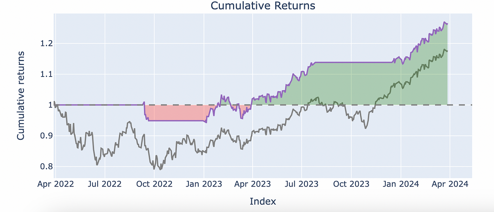

## Table of Contents

## What is VectorBT and why is it useful for backtesting?

VectorBT is a tool that helps people test their trading ideas using past market data. It's like a time machine for trading, where you can see how your strategy would have worked in the past. This tool uses something called vectorized backtesting, which means it can run many tests very quickly. This is helpful because it saves time and lets you try out lots of different ideas without waiting for the market to move.

Backtesting is important because it helps traders see if their ideas are good before they use real money. With VectorBT, you can test many different trading strategies at once, which makes it easier to find the best one. It's also useful because it can handle a lot of data and do complex calculations fast. This means you can get results quickly and make better decisions about your trading strategies.

## How do I install VectorBT and set up my development environment?

To install VectorBT, you first need to have Python on your computer. Once you have Python, open a command line or terminal and type `pip install vectorbt`. This command will download and set up VectorBT for you. It's a good idea to use a virtual environment to keep your project organized and avoid messing up other Python projects you might have.

After installing VectorBT, you'll need to set up your development environment. A good way to do this is by using an Integrated Development Environment (IDE) like Visual Studio Code or PyCharm. These tools help you write and run your code easily. Once your IDE is set up, create a new Python file and start writing your [backtesting](/wiki/backtesting) code. You can use VectorBT's documentation to learn how to use its features and start testing your trading ideas.

## What are the basic components of a VectorBT backtest?

A VectorBT backtest has a few main parts that work together to test your trading ideas. First, you need some data. This is usually price data from the market, like stock prices or [cryptocurrency](/wiki/cryptocurrency) prices. You tell VectorBT what data to use and how long you want to test your strategy. Next, you need to write the rules for your trading strategy. These rules tell VectorBT when to buy and sell based on the data. For example, you might say, "Buy when the price goes up by 5% and sell when it goes down by 3%."

After setting up your data and strategy, VectorBT runs the backtest. It goes through all the data you gave it and follows your rules to see how your strategy would have worked in the past. VectorBT is fast because it can test many different scenarios at once. Once the backtest is done, VectorBT gives you results. These results show things like how much money you would have made or lost, how often you would have traded, and other important information. You can use these results to see if your strategy is good or if you need to change it.

## How can I use VectorBT to analyze different trading strategies?

To use VectorBT to analyze different trading strategies, you first need to set up your data and define your strategies. Let's say you want to test a simple moving average crossover strategy and a [momentum](/wiki/momentum) strategy. For the moving average crossover, you might tell VectorBT to buy when a short-term moving average crosses above a long-term one and sell when it crosses below. For the momentum strategy, you could set it to buy when the price goes up by a certain percentage over a few days and sell when it drops. You can easily switch between these strategies in VectorBT by changing the rules you give it.

Once you have your strategies set up, VectorBT will run the backtest using the data you provided. It will go through all the historical data and apply your rules to see how each strategy would have performed. VectorBT is great because it can test many strategies at the same time, which saves you a lot of time. After the backtest is done, you'll get results that show how much money each strategy would have made or lost, how often it would have traded, and other useful information. By comparing these results, you can see which strategy works best and make better decisions about your trading.

## What are the key metrics provided by VectorBT for evaluating strategy performance?

VectorBT gives you a bunch of important numbers to help you see how well your trading strategy is doing. Some of the main ones are the total return, which tells you how much money you would have made or lost overall, and the Sharpe ratio, which shows how good your returns are compared to the risk you're taking. You also get to see the maximum drawdown, which is the biggest drop in your money from the highest point to the lowest point, and the win rate, which tells you how often your trades made money.

Another useful metric is the profit [factor](/wiki/factor-investing), which compares your winning trades to your losing trades. If it's more than 1, you're making more money on your wins than you're losing on your losses. VectorBT also shows you the average trade duration, so you know how long you're holding onto your trades, and the number of trades, which tells you how often you're buying and selling. All these numbers together help you understand if your strategy is good and where you might need to make changes.

## How do I optimize trading parameters using VectorBT?

To optimize trading parameters using VectorBT, you start by setting up your trading strategy and the parameters you want to test. Let's say you're using a moving average crossover strategy. You might want to test different lengths for the short-term and long-term moving averages. VectorBT lets you run many tests at once by trying out different combinations of these lengths. This way, you can see which combination of parameters gives you the best results without having to test each one separately, which would take a lot of time.

After running these tests, VectorBT gives you results that show how each combination of parameters performed. You can look at metrics like total return, Sharpe ratio, and maximum drawdown to see which set of parameters worked the best. By comparing these results, you can find the optimal settings for your strategy. This helps you fine-tune your trading approach to get the best possible performance based on historical data.

## Can VectorBT handle multiple assets and how do I set that up?

VectorBT can handle multiple assets easily. You just need to give it data for all the assets you want to test. For example, if you want to test your strategy on stocks, cryptocurrencies, and commodities, you can put all that data into VectorBT. It will then run your strategy on each asset at the same time, which is really fast and saves you a lot of work.

To set this up, you first need to get the data for all the assets you're interested in. You can usually find this data from financial websites or data providers. Once you have the data, you tell VectorBT which assets to use and how to apply your strategy to them. VectorBT will then do the backtesting and give you results for each asset, so you can see how your strategy works across different markets.

## What advanced features does VectorBT offer for strategy refinement?

VectorBT has some cool advanced features that help you make your trading strategy even better. One of these is called portfolio optimization. This means VectorBT can help you figure out the best way to spread your money across different assets to get the best returns while keeping risk low. It can also do something called walk-forward optimization, where it tests your strategy on different time periods to make sure it works well over time, not just in one specific period.

Another neat feature is the ability to use [machine learning](/wiki/machine-learning) to improve your strategy. VectorBT lets you use algorithms to find patterns in the data that you might not see otherwise. This can help you make smarter trading decisions. Plus, VectorBT has tools for doing sensitivity analysis, which means you can see how changes in your strategy's parameters affect its performance. This way, you can fine-tune your strategy to make it as good as it can be.

## How can I integrate external data sources with VectorBT?

To use external data with VectorBT, you first need to get the data from where it's coming from. This could be from financial websites, data providers, or even your own files. Once you have the data, you need to make sure it's in a format that VectorBT can understand, like a pandas DataFrame. After that, you can tell VectorBT to use this data when it's running your backtests. This way, you can test your trading ideas with the most up-to-date or specific information you need.

VectorBT makes it easy to add this external data into your strategy. You just need to load the data into your Python script and then pass it to VectorBT. For example, if you want to use weather data to see if it affects stock prices, you can get that data, put it into VectorBT, and see how your strategy performs with this new information. This helps you make your trading strategy better by considering more factors that might influence the market.

## What are some common pitfalls to avoid when using VectorBT?

When using VectorBT, one common mistake is overfitting your strategy. This happens when you keep tweaking your strategy to fit past data perfectly, but it might not work well in the future. It's like trying to predict the exact path of a leaf falling from a tree - it's hard to do accurately. To avoid this, don't change your strategy too much based on the results of one backtest. Instead, test your strategy on different time periods and with different data to make sure it works well overall.

Another pitfall is not considering transaction costs and slippage. These are the fees you pay when you buy or sell, and the difference between the price you want and the price you actually get. If you don't include these in your backtest, your strategy might look better than it really is. Always add these costs to your VectorBT tests to get a more realistic picture of how your strategy would perform in real life.

## How does VectorBT compare to other backtesting frameworks in terms of performance and features?

VectorBT stands out from other backtesting frameworks because it's really fast and can handle a lot of data at once. It uses something called vectorized backtesting, which means it can test many different trading ideas quickly. This is great if you want to try out lots of strategies without waiting a long time. Compared to other tools like Backtrader or Zipline, VectorBT is often faster and can work with more assets at the same time. This makes it easier to see how your strategy would work across different markets.

Another big advantage of VectorBT is its flexibility and advanced features. It lets you use machine learning to find patterns in your data, which can help you make better trading decisions. It also has tools for optimizing your portfolio and testing your strategy over different time periods to make sure it's reliable. While other frameworks like Backtrader or Quantopian might have good features too, VectorBT's combination of speed, flexibility, and advanced tools makes it a strong choice for traders who want to backtest their ideas thoroughly and quickly.

## What are the best practices for deploying a VectorBT strategy in a live trading environment?

When you want to use a VectorBT strategy in real trading, it's important to start slow and be careful. First, make sure your strategy works well in backtests with different time periods and data sets. This helps you see if it's reliable and not just lucky. Also, always include real-world costs like fees and slippage in your backtests. These can make a big difference in how your strategy performs in real life. Once you're happy with your backtest results, start with a small amount of money to test your strategy in the market. This way, you can see how it works without risking too much.

After you've tested your strategy with real money and it's working well, you can think about using it with more money. But keep watching it closely. Markets change, and what worked before might not work in the future. It's a good idea to keep backtesting and updating your strategy as you go. Also, make sure you have good systems in place to handle your trades automatically. This means setting up reliable software that can execute your trades quickly and correctly. By following these steps, you can use VectorBT to help you trade smarter and safer.

## References & Further Reading

[1]: ["Advances in Financial Machine Learning"](https://www.amazon.com/Advances-Financial-Machine-Learning-Marcos/dp/1119482089) by Marcos Lopez de Prado

[2]: ["Evidence-Based Technical Analysis: Applying the Scientific Method and Statistical Inference to Trading Signals"](https://www.amazon.com/Evidence-Based-Technical-Analysis-Scientific-Statistical/dp/0470008741) by David Aronson

[3]: ["Machine Learning for Algorithmic Trading"](https://github.com/stefan-jansen/machine-learning-for-trading) by Stefan Jansen

[4]: ["Quantitative Trading: How to Build Your Own Algorithmic Trading Business"](https://books.google.com/books/about/Quantitative_Trading.html?id=j70yEAAAQBAJ) by Ernest P. Chan