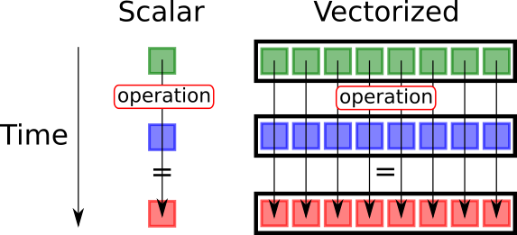

## Table of Contents

## What is vectorization in the context of programming and data processing?

Vectorization is a way to make computers do math faster by working on many numbers at the same time. Instead of telling the computer to do one calculation after another, like adding numbers one by one, vectorization lets the computer add many numbers all at once. This is especially useful when you're dealing with big sets of data, like in data analysis or machine learning, because it can make your programs run much quicker.

In programming, especially in languages like Python with libraries like NumPy, vectorization means using special tools that can handle these big calculations easily. For example, if you want to add two lists of numbers together, instead of writing a loop to go through each number, you can use a vectorized operation that does it all in one go. This not only speeds up your code but also makes it cleaner and easier to read.

## How does vectorization improve the performance of operations on data?

Vectorization speeds up data operations by letting the computer work on many numbers at the same time. Imagine you have a list of numbers and you want to add another list to it. Without vectorization, you'd have to tell the computer to add the first number from each list, then the second, and so on, one by one. This can be slow, especially with big lists. But with vectorization, the computer can add all the numbers from both lists at once, like doing many additions in a single step. This is much faster because the computer's hardware is designed to handle these kinds of bulk operations efficiently.

Another way vectorization helps is by reducing the amount of code you need to write and the number of steps the computer has to follow. When you use vectorized operations, you don't need to write loops or keep track of where you are in the data. This makes your code simpler and easier to understand, but it also means the computer has fewer instructions to process. Fewer instructions mean less time spent figuring out what to do next, so the overall operation runs faster. In the end, vectorization not only makes your programs run quicker but also makes them easier to maintain and less prone to errors.

## What are the basic operations that can be vectorized?

Vectorization can be used for many basic operations like adding, subtracting, multiplying, and dividing numbers. Imagine you have two lists of numbers, and you want to add them together. Instead of adding each pair of numbers one by one, vectorization lets you add all the numbers at the same time. This works the same way for subtracting, multiplying, and dividing. It's like doing a bunch of simple math problems all at once instead of one after the other.

Besides basic math, vectorization can also handle more complex operations like finding the biggest or smallest number in a list, or calculating averages and sums. For example, if you want to find the average of a list of numbers, vectorization can do this quickly without needing to go through each number individually. This makes it easier and faster to work with large sets of data, which is really helpful in areas like data analysis and machine learning.

## Can you explain the difference between vectorized and non-vectorized operations?

Vectorized operations let you do math on many numbers all at once, while non-vectorized operations make you do it one number at a time. Imagine you have two lists of numbers and you want to add them together. With vectorized operations, you can tell the computer to add all the numbers from both lists in one go. It's like doing a big group project where everyone works together at the same time. On the other hand, non-vectorized operations are like working alone, where you have to add each pair of numbers one by one, which can take a lot longer, especially if you have a lot of numbers.

Vectorized operations are usually faster and make your code simpler and easier to read. When you use vectorized operations, you don't need to write loops to go through each number, which means fewer steps for the computer to follow. This not only speeds up the process but also makes your code less likely to have mistakes. Non-vectorized operations, on the other hand, often need more lines of code and can be harder to understand because you have to keep track of where you are in the lists and make sure you're doing everything in the right order.

## What programming languages support vectorization?

Many programming languages support vectorization, but some are better at it than others. Python, with its popular library NumPy, is one of the best for vectorization. NumPy lets you do math on big lists of numbers all at once, which is great for things like data analysis and machine learning. Other languages like R also support vectorization and are often used for data work. 

MATLAB is another language that's really good at vectorization. It was made for engineers and scientists to do math easily, and it can handle big calculations quickly. Even though it's not free like Python, it's very powerful for certain kinds of work. Some newer languages like Julia also support vectorization and are trying to be as fast and easy to use as MATLAB but with the flexibility of Python.

## How does vectorization work in NumPy, and what are its benefits?

In NumPy, vectorization works by letting you do math on whole arrays of numbers at once. Instead of writing a loop to add each number from two lists one by one, you can just use a simple command like `numpy.add(list1, list2)` to add all the numbers together in one go. This is super helpful because it makes your code shorter and easier to read. You don't need to keep track of where you are in the lists or worry about making mistakes in your loop.

The big benefit of using vectorization in NumPy is that it makes your programs run much faster. Since computers are really good at doing lots of calculations at the same time, vectorization takes advantage of this to speed things up. This is especially useful when you're working with big sets of data, like in data analysis or machine learning. Not only does it save time, but it also makes your code easier to understand and maintain, because you're using simple commands instead of complicated loops.

## What are some common pitfalls or mistakes to avoid when using vectorization?

One common mistake when using vectorization is trying to do too much at once. Sometimes, people think they can vectorize everything, but some operations might not work well with vectorization or might even slow things down. It's important to think about what you're trying to do and whether vectorization is the best way to do it. For example, if you're working with very small lists of numbers, the time you save with vectorization might not be worth the extra memory it uses.

Another pitfall is not understanding how the vectorized operations work. When you use vectorization, you need to make sure that the shapes of your arrays match up correctly. If you try to add two arrays that have different sizes, you'll get an error. It's easy to forget to check this, especially when you're working with complex data. Always make sure your arrays are the right size before you try to do math on them.

Lastly, people sometimes forget that vectorization doesn't solve all problems. It's great for speeding up math operations, but it won't help with things like sorting data or searching through lists. If you're trying to use vectorization for something it's not good at, you might end up with code that's harder to read and doesn't run any faster. Always think about what you're trying to achieve and whether vectorization is the right tool for the job.

## How can vectorization be applied to machine learning algorithms?

Vectorization is super helpful in machine learning because it makes things faster and easier. Imagine you have a lot of data, like pictures or numbers, and you want to use a machine learning algorithm to learn from this data. Instead of going through each piece of data one by one, which can take a long time, you can use vectorization to work on all the data at the same time. This is especially useful when you're doing things like training a model or making predictions. For example, if you're using a neural network to recognize pictures, vectorization can help you process many pictures all at once, making the whole learning process quicker.

Another way vectorization helps in machine learning is by making the code simpler and easier to understand. When you use vectorized operations, you don't need to write complicated loops to go through each piece of data. This means less code to write and fewer chances to make mistakes. Libraries like NumPy in Python make this even easier by providing tools that are designed to work well with machine learning algorithms. So, whether you're working on a big project or just learning about machine learning, using vectorization can make your life a lot easier.

## What are the limitations of vectorization in certain types of data processing?

Vectorization works great for doing math on lots of numbers at the same time, but it's not perfect for everything. One big problem is that it might not help with small lists of numbers. If you're only working with a few numbers, the time you save by using vectorization might not be worth the extra memory it uses. Also, some operations just don't work well with vectorization. For example, if you're trying to sort a list or search for something specific, vectorization might not make things faster and could even make your code harder to understand.

Another limitation is that vectorization needs the data to be in the right shape. If you try to add two lists of numbers that are different sizes, you'll get an error. This means you have to make sure your data is set up correctly before you can use vectorization, which can be a hassle if you're working with messy data. Sometimes, trying to use vectorization on the wrong kind of problem can actually make your program slower and more complicated, so it's important to think about whether it's the best tool for the job.

## How does vectorization impact memory usage and efficiency?

Vectorization can make your program use more memory because it works on lots of numbers all at once. When you use vectorization, you might need to keep all your data in memory at the same time, which can be a problem if you're working with really big lists of numbers. But, if you have enough memory, using vectorization can still be worth it because it makes your program run a lot faster.

On the other hand, vectorization can make your program more efficient by doing many calculations at the same time. Instead of going through each number one by one, which can take a long time, vectorization lets the computer do all the math in one go. This is especially helpful when you're working with big sets of data, like in data analysis or machine learning, because it can save a lot of time. So, while vectorization might use more memory, it often makes up for it by making your program run faster and easier to manage.

## Can you discuss advanced vectorization techniques used in GPU computing?

In GPU computing, advanced vectorization techniques take advantage of the many small processors inside a graphics card to do a lot of calculations at the same time. GPUs are really good at this because they were made to handle the complex math needed for drawing pictures on a screen. When you use vectorization on a GPU, you can break down big problems into smaller pieces and let each processor work on its own piece. This is called parallel processing, and it's like having a bunch of helpers working on different parts of a big puzzle all at once.

One cool technique used in GPU computing is called CUDA, which is a way to write programs that can run on NVIDIA GPUs. CUDA lets you tell the GPU exactly how to split up the work and do it in parallel. Another technique is OpenCL, which works with different types of GPUs and can even use other kinds of processors. Both of these let you use vectorization to make your programs run super fast, but they can be a bit tricky to learn because you have to think about how to break up your problem in a way that the GPU can handle.

## What future developments can we expect in the field of vectorization?

In the future, we can expect vectorization to get even better and faster. As computers keep getting more powerful, especially GPUs, they'll be able to do more calculations at the same time. This means that vectorization will be able to handle even bigger sets of data without slowing down. Also, new programming languages and libraries might come out that make it easier to use vectorization, so even people who aren't experts can take advantage of it.

Another thing that might happen is that vectorization will start to be used in more areas, not just data analysis and machine learning. For example, it could be used in video games to make them run smoother, or in apps on your phone to make them work faster. As more people learn about vectorization and how to use it, we'll see it pop up in all sorts of new places, making everything from big scientific projects to everyday apps quicker and easier to use.

## What are Case Studies?

In the context of vectorized strategy implementations, various trading strategies exhibit enhanced efficiency and clarity. Here, we explore two pivotal examples: the Simple Moving Average (SMA) strategy and [momentum](/wiki/momentum) strategies, which are commonly applied in financial analysis.

### Simple Moving Average (SMA) Strategy

The Simple Moving Average is a popular tool among traders for smoothing out price data to identify trends over a specified period. The SMA of a stock price is calculated by taking the mean of the closing prices over a specific number of days. Implementing this with vectorization significantly optimizes both the computation speed and resource usage.

#### Calculation
Let $p_t$ represent the price of a stock at time $t$. The formula for an $n$-day SMA is:
$$

\text{SMA}_t = \frac{1}{n} \sum_{i=0}^{n-1} p_{t-i} 
$$

Using `pandas`, we can vectorize this computation as follows:

```python
import pandas as pd

# Sample price data
prices = pd.Series([100, 102, 101, 103, 104, 105])

# Compute 3-day SMA
sma = prices.rolling(window=3).mean()
```

Here, the `.rolling(window=3).mean()` method leverages vectorization to compute the moving average efficiently, handling large datasets seamlessly. Traders use SMA to ascertain market trends and execute buy or sell signals based on crossovers of different SMAs (e.g., encountering a short-term SMA crossing above a long-term SMA as a buy signal).

### Momentum Strategies

Momentum strategies capitalize on the continuance of existing trends in the market. Traders examine past performance over a specific time horizon to predict future movements, typically using a momentum indicator. Vectorization aids in swiftly parsing through historical data to derive these indicators.

#### Calculation
The momentum can be delineated as either a simple rate of return over $n$ periods or through more complex lag difference approaches. A simple calculation might look like so:

$$

\text{Momentum}_t = p_t - p_{t-n}
$$

In Python, using `pandas`:

```python
import pandas as pd

# Sample price data
prices = pd.Series([100, 102, 101, 103, 104, 105])

# Compute 3-day momentum
momentum = prices.diff(periods=3)
```

This snippet executes efficiently over extensive time series data, enabling rapid signal generation for trading strategies. Momentum indicators can determine entry and exit points in the strategy: high momentum might signify a continuation of a trend, while diminishing momentum could hint at reversals.

### Performance Metrics

Both SMA and momentum strategies necessitate an analysis of profitability and risk. Metrics such as expected returns, [volatility](/wiki/volatility-trading-strategies), and Sharpe ratios are indispensable for evaluating the effectiveness of vectorized implementations. By utilizing vectorized operations, traders can compute these metrics over large datasets swiftly, facilitating a nuanced appraisal of strategy performance.

In summary, implementing trading strategies such as SMA and momentum using vectorized operations optimizes computational efficiency and robustness, offering traders a powerful tool to enhance decision-making in fast-paced financial markets.

## References & Further Reading

[1]: McKinney, W. (2012). ["Python for Data Analysis"](https://wesmckinney.com/book/). O'Reilly Media, Inc.

[2]: NumPy Developers. ["NumPy Documentation"](https://numpy.org/doc/).

[3]: The pandas development team. ["pandas Documentation"](https://pandas.pydata.org/docs/).

[4]: Chan, E. P. (2009). ["Algorithmic Trading: Winning Strategies and Their Rationale"](https://github.com/ftvision/quant_trading_echan_book). Wiley.

[5]: Lopez de Prado, M. (2018). ["Advances in Financial Machine Learning"](https://books.google.com/books/about/Advances_in_Financial_Machine_Learning.html?id=oU9KDwAAQBAJ). Wiley.

[6]: Pardo, R. (2008). ["The Evaluation and Optimization of Trading Strategies"](https://onlinelibrary.wiley.com/doi/book/10.1002/9781119196969). Wiley.

[7]: Aronson, D. R. (2007). ["Evidence-Based Technical Analysis: Applying the Scientific Method and Statistical Inference to Trading Signals"](https://onlinelibrary.wiley.com/doi/book/10.1002/9781118268315). Wiley.

[8]: Sullivan, R., Timmermann, A., & White, H. (1999). ["Data Snooping, Technical Trading Rule Performance, and the Bootstrap"](https://onlinelibrary.wiley.com/doi/abs/10.1111/0022-1082.00163). The Journal of Finance, 54(5), 1647-1691.