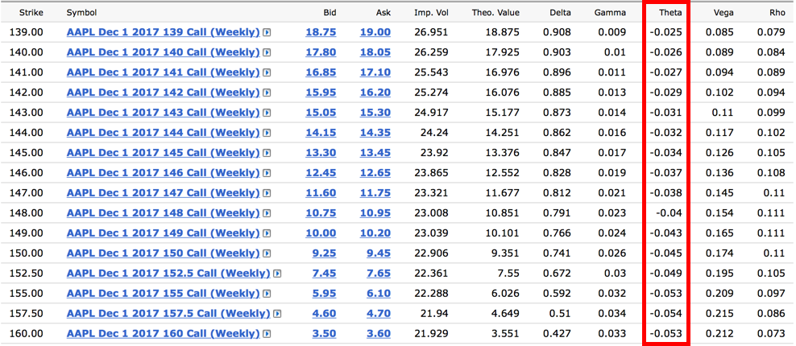

In today's fast-paced financial markets, trading options has become an appealing strategy for investors seeking to hedge risks and speculate on price movements. Options trading allows market participants to make strategic decisions based on their expectations of an asset's future price trajectory. A fundamental aspect in the pricing of options is Vega, a Greek metric that measures an option's sensitivity to changes in the underlying asset's implied volatility. Understanding Vega is crucial for traders, as it directly impacts the premium of both call and put options.

The growing interest in options trading coincides with advancements in technology and data analysis tools. Algorithmic trading, which utilizes automated systems to conduct trades, has gained traction for its ability to efficiently execute complex strategies that involve options and their sensitivity metrics like Vega. These systems can process large amounts of market data rapidly, making it possible to adjust trading strategies in response to evolving market conditions effectively.



In this article, the focus will be on exploring options trading through the lens of Vega, examining how algorithmic trading enhances strategies by offering precise control over risk management. The interplay between market volatility and Vega will be analyzed, highlighting how algorithms can refine trading approaches and improve decision-making processes. By integrating traditional knowledge with state-of-the-art trading technologies, investors can optimize their options trading strategies, managing risks and maximizing potential returns in today’s dynamic financial environment.

## Table of Contents

## Understanding Vega in Options Trading

Vega, one of the Greek metrics in options trading, quantifies the sensitivity of an option's price to changes in the implied volatility of the underlying asset. Specifically, Vega represents the change in an option’s price for every 1% change in the underlying asset's implied volatility. Understanding Vega is crucial for traders as it provides insights into how options are likely to react in environments with changing volatility.

Both call and put options inherently possess positive Vega. This means that the prices of these options increase as implied volatility rises, reflecting a greater potential for price movement in the underlying asset. Consequently, higher Vega values denote a heightened sensitivity to volatility fluctuations. For instance, a Vega of 0.15 indicates that if the implied volatility goes up by 1%, the option's price will increase by $0.15, all else being constant.

Longer-term options, also known as long-dated options, usually exhibit higher Vega compared to their shorter-term counterparts. This phenomenon is attributed to the increased uncertainty over longer time horizons, which heightens sensitivity to changes in volatility. Similarly, at-the-money (ATM) options—where the price of the underlying asset is close to the option's strike price—tend to have higher Vega values. This is because ATM options are more likely to be affected by shifts in volatility since they have significant extrinsic value and relatively balanced probabilities of moving in or out of the money.

In summary, Vega's role in options trading is indispensable for assessing an option's vulnerability to changes in market [volatility](/wiki/volatility-trading-strategies). For traders, comprehending this metric is an integral component of formulating effective strategies, particularly in volatile markets.

## Vega-Neutral Strategies

Vega-neutral strategies are designed to create a balanced position that is insulated from variations in market volatility. Traders employ these strategies to mitigate the risks associated with volatile market conditions, where a change in implied volatility can significantly impact option pricing.

One commonly used technique is the **calendar spread**. This strategy involves simultaneously purchasing and selling options of the same underlying asset and strike price but with different expiration dates. The aim is to leverage differences in time decay, or theta, while maintaining a net zero Vega position. By aligning the Vega from long and short options, traders can minimize the impact of volatility changes on their overall position. For example, if implied volatility increases, the loss in value from a short option may be offset by the gain in the long option, thereby maintaining a stable net position.

Another strategy is the **Vega-neutral spread**, which combines multiple options positions to create an overall Vega profile that is close to zero. This involves sophisticated calculations and adjustments to ensure that the positive and negative Vega components are balanced. The effectiveness of such strategies often relies on periodic rebalancing to accommodate any shifts in volatility or other Greek measures that could unbalance the neutral state.

The successful implementation of Vega-neutral strategies demands active management and monitoring. In markets where volatility is constantly changing, traders must frequently reassess their portfolios to ensure neutral Vega is sustained. This is particularly critical during periods of high volatility when market conditions are more unpredictable. Employing software tools and [algorithmic trading](/wiki/algorithmic-trading) systems can greatly aid in maintaining this balance, allowing for automatic adjustments based on real-time market data.

Incorporating Vega-neutral strategies can be particularly advantageous as part of a diversified options portfolio. During periods of heightened volatility, these strategies help stabilize performance, reducing risk exposure from abrupt volatility shifts. This aspect makes them a valuable tool for traders seeking to optimize their risk-reward ratio while navigating uncertain market environments. By maintaining a focus on balancing Vega, traders can better position themselves to exploit volatility opportunities without being adversely affected by sudden changes.

## Algorithmic Trading and Options

Algorithmic trading utilizes computer-driven systems to automate the execution of trading strategies in financial markets, including the options market. It leverages advanced algorithms to perform rapid transactions, which is vital in an environment where market conditions can change within seconds. The ability to trade at high speeds is particularly beneficial in the options market, where timing can significantly affect the profitability of trades given the time-sensitive nature of options contracts.

One of the main advantages of algorithmic trading in options is its capacity to dynamically adjust to market conditions. Algorithms can manage a portfolio's exposure to Vega, the sensitivity of an option's price to changes in volatility, alongside other Greeks such as Delta, Gamma, and Theta. This dynamic adjustment allows traders to effectively manage risk by maintaining a balanced exposure to market volatility.

Sophisticated algorithmic strategies involve complex approaches like dynamic hedging and volatility [arbitrage](/wiki/arbitrage). Dynamic hedging involves continually adjusting the position in the underlying asset to offset the changes in an option's value due to market movements, a task that is computationally intensive and well-suited to algorithmic execution. For example, traders might use Python to develop an algorithm that continuously calculates the optimal hedging ratio given the current market conditions:

```python
import numpy as np

def calculate_hedge_ratio(option_vega, market_volatility):
    # Hypothetical example with linear relationship for simplicity
    hedge_ratio = option_vega / market_volatility
    return hedge_ratio

# Example values
option_vega = 0.25
market_volatility = 0.20

hedge_ratio = calculate_hedge_ratio(option_vega, market_volatility)
print(f"Optimal Hedge Ratio: {hedge_ratio}")
```

In volatility arbitrage, traders aim to profit from discrepancies between predicted and actual volatility. Algorithms can efficiently identify and exploit these opportunities, quickly executing trades to take advantage of volatility mispricings across different markets or timeframes.

By integrating algorithmic trading with options strategies, traders can harness technology to optimize their approaches, improve execution efficiency, and manage complex portfolios with greater precision and speed. This symbiosis between human strategy and automated execution defines the modern options trading landscape, offering a powerful toolkit for navigating volatile markets.

## Volatility, Vega, and Market Sentiment

Volatility signifies the rate and extent of price changes within a financial market, acting as a vital element in options pricing mechanisms through its relationship with Vega. Vega quantifies the sensitivity of an option’s price to changes in the implied volatility of the underlying asset. Specifically, for each 1% change in implied volatility, an option's price is expected to change by the amount of the option's Vega.

Consider the scenario where implied volatility rises; this generally leads to an increase in the price of options. This phenomenon transpires because higher implied volatility suggests a greater expectation of significant price swings in the asset, resulting in an amplified risk/reward profile for the option holder. Consequently, traders keenly analyze these dynamics using Vega as a predictive tool alongside volatility indices like the VIX, also known as the "Fear Index," which provides insights into broader market sentiment.

To illustrate how volatility impacts option pricing, assume an option with a Vega of 0.20. At this metric, a 1% rise in the underlying asset's implied volatility might increase the option's value by $0.20, reflecting the direct financial impact of volatility changes.

Traders leverage Vega and volatility measures to not only interpret current market sentiment but also to anticipate possible future price movements. By adeptly understanding these relationships, they craft and execute volatility-based strategies that exploit discrepancies between expected and actual market conditions. For instance, during times of heightened market anxiety or uncertainty, implied volatility typically surges, allowing traders to profit by purchasing options that gain value as volatility increases. Conversely, in periods of anticipated volatility contraction, traders might opt to sell options, banking on the erosion of Vega to lower option values.

Overall, the strategic utilization of Vega in concert with real-time volatility assessments equips traders to better navigate and capitalize on dynamic market environments, optimizing their portfolios in the face of variable market sentiments.

## Practical Examples of Vega in Action

Consider a hypothetical options scenario involving a highly liquid stock like Apple Inc., where traders anticipate a significant increase in volatility. To capitalize on this expectation, traders may purchase options with high Vega. Vega measures the sensitivity of an option's price to changes in the implied volatility of the underlying asset. Therefore, if volatility rises, the option with high Vega would see a proportionally higher increase in its premium.

For example, an option with a Vega of 0.10 implies that for every 1% increase in implied volatility, the option's price would theoretically increase by $0.10. In a practical trading environment, if Apple Inc.'s options exhibit a high Vega and the implied volatility of Apple Inc. stocks increases by 5%, the option's price could increase by approximately $0.50. This scenario illustrates how traders position themselves to benefit from anticipated market conditions.

Conversely, if traders expect a decrease in volatility, they might opt to sell options. In this scenario, Vega works inversely; a drop in implied volatility reduces the option's premium. For instance, using the same Vega value of 0.10, a 5% decrease in Apple Inc.'s implied volatility would result in a $0.50 decrease in the option's price. Selling options with high Vega allows traders to profit from the expected premium decline.

Beyond individual trades, real-life applications of managing Vega include maintaining a balanced portfolio, particularly in volatile markets. Traders and portfolio managers often adjust Vega to mitigate potential risks associated with unpredictable market conditions. Python can be employed to automate such portfolio adjustments efficiently. Below is an example of Python code that can simulate the impact of changing implied volatility on options with different Vega values:

```python
def calculate_option_price_change(vega, vol_change):
    return vega * vol_change

# Example values
vega = 0.10  # Vega of the option
volatility_change = 0.05  # 5% change in implied volatility

price_change = calculate_option_price_change(vega, volatility_change)
print("Change in option price:", price_change)
```

This code snippet calculates the change in an option's price given its Vega and a change in implied volatility. By effectively managing Vega within a portfolio, traders can offset risks and optimize their strategies in response to fluctuations in market conditions.

## Conclusion

Vega, representing an option's sensitivity to volatility changes, remains a fundamental Greek in options trading. As market conditions fluctuate, understanding Vega allows traders to anticipate and respond effectively to shifts in implied volatility, directly influencing option prices. The adept management of Vega can reveal profitable trading opportunities, helping traders adapt strategies to evolving market sentiment.

Algorithmic trading significantly enhances the execution and management of options strategies by automating processes and optimizing risk management related to Vega. These systems can systematically track market conditions, swiftly executing trades when specific volatility thresholds or conditions are met. This automation not only increases efficiency and precision but also minimizes human error and emotional biases, crucial in dynamic market environments. 

By mastering Vega and employing algorithmic solutions, traders navigate the intricacies of options trading more effectively. This dual mastery, encompassing both the theoretical knowledge of options Greeks and the practical implementation through technology, equips traders to optimize their strategies in complex, modern financial markets. Adopting an integrated approach of options expertise and sophisticated trading technology remains essential for achieving sustained success in contemporary trading strategies.

## References & Further Reading

[1]: Chance, D. M., & Brooks, R. (2015). ["An Introduction to Derivatives and Risk Management"](https://books.google.com/books/about/Introduction_to_Derivatives_and_Risk_Man.html?id=b8PgBQAAQBAJ). Cengage Learning.

[2]: Natenberg, S. (1994). ["Option Volatility and Pricing: Advanced Trading Strategies and Techniques"](https://www.amazon.com/Option-Volatility-Pricing-Strategies-Techniques/dp/0071818774). McGraw-Hill Education.

[3]: Hull, J. C. (2017). ["Options, Futures, and Other Derivatives"](https://www.pearson.com/en-us/subject-catalog/p/options-futures-and-other-derivatives/P200000005938/9780136939917) (10th Edition). Pearson.

[4]: Sinclair, E. (2010). ["Volatility Trading"](https://onlinelibrary.wiley.com/doi/book/10.1002/9781119197058) (2nd Edition). Wiley.

[5]: Wystup, U. (2017). ["FX Options and Structured Products"](https://onlinelibrary.wiley.com/doi/book/10.1002/9781119192183). Wiley.