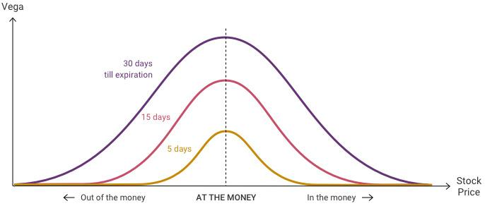

## Table of Contents

## What is Vega in options trading?

Vega is a measure used in options trading that shows how much an option's price might change when the volatility of the underlying asset changes. Volatility means how much the price of the asset, like a stock, goes up and down. If an option has a high Vega, its price will change a lot if the volatility changes. If it has a low Vega, the price won't change as much.

For example, if an option has a Vega of 0.10, it means the option's price could go up by $0.10 if the volatility of the stock goes up by 1%. This is important for traders because they need to know how sensitive their options are to changes in the market's volatility. By understanding Vega, traders can make better decisions about which options to buy or sell.

## How does Vega affect the price of an option?

Vega affects the price of an option by showing how much the option's price will change if the volatility of the underlying asset changes. If the volatility goes up, the price of the option will go up too, and if the volatility goes down, the price of the option will go down. The number that Vega gives you tells you how much the price will change for every 1% change in volatility. For example, if an option has a Vega of 0.10, its price will go up by $0.10 if the volatility increases by 1%.

This is important because options are often used to bet on or protect against changes in the price of the underlying asset. If a trader thinks the market will become more volatile, they might buy options with a high Vega because those options will increase in value more if their prediction is right. On the other hand, if a trader expects the market to become less volatile, they might sell options with a high Vega to take advantage of the expected drop in the option's price. Understanding Vega helps traders make smarter choices about which options to trade.

## What factors influence Vega?

Vega is influenced by several factors, mainly the time until the option expires and the current level of [volatility](/wiki/volatility-trading-strategies) in the market. The longer the time until the option expires, the higher the Vega will be. This is because there's more time for the price of the underlying asset to move around, which means more uncertainty and a bigger impact from changes in volatility. So, options that are far from their expiration date will have a higher Vega than options that are close to expiring.

Another [factor](/wiki/factor-investing) that affects Vega is the current level of volatility in the market. If the market is already very volatile, the Vega of an option will be higher because even small changes in volatility can have a big impact on the option's price. On the other hand, if the market is calm and not moving much, the Vega will be lower because changes in volatility won't affect the option's price as much. Traders need to keep an eye on these factors to understand how sensitive their options are to changes in the market's volatility.

## How can Vega be used to assess the risk of an options portfolio?

Vega can help traders understand the risk in their options portfolio by showing how much the value of their options might change if the market's volatility changes. If a portfolio has a lot of options with high Vega, it means the portfolio's value could go up or down a lot if the market becomes more or less volatile. This is important because it helps traders know how sensitive their portfolio is to changes in the market's ups and downs.

Traders can use Vega to make their portfolio less risky by balancing options with high and low Vega. For example, if a trader has a lot of options with high Vega, they might want to add some options with low Vega to the portfolio. This way, if the market's volatility changes, the overall impact on the portfolio's value won't be as big. By keeping an eye on Vega, traders can make smarter choices to manage the risk in their options portfolio.

## What is the relationship between Vega and implied volatility?

Vega and implied volatility are closely related because Vega measures how much an option's price will change when the implied volatility changes. Implied volatility is a guess about how much the price of the underlying asset might move in the future. If the implied volatility goes up, the price of the option will go up too, and Vega tells you by how much. For example, if an option has a Vega of 0.10 and the implied volatility increases by 1%, the option's price will go up by $0.10.

This relationship is important for traders because it helps them understand how sensitive their options are to changes in the market's expected volatility. If a trader thinks the market will become more volatile, they might look for options with a high Vega because those options will gain more value if their prediction is correct. On the other hand, if a trader expects the market to calm down, they might choose options with a lower Vega or even sell options with high Vega to profit from the expected drop in implied volatility. By understanding the link between Vega and implied volatility, traders can make better decisions about which options to buy or sell.

## How does Vega change as an option approaches expiration?

Vega changes as an option gets closer to its expiration date. When an option has a lot of time left before it expires, its Vega is usually higher. This is because there's more time for the price of the underlying asset to move around, which means more uncertainty and a bigger impact from changes in volatility. So, options that are far from their expiration date will have a higher Vega.

As the option gets closer to expiring, its Vega starts to go down. This happens because there's less time left for the price of the underlying asset to change a lot. With less time, changes in volatility don't have as big an effect on the option's price. So, options that are close to expiring will have a lower Vega. This is important for traders to know because it helps them understand how sensitive their options are to changes in the market's volatility as time goes by.

## Can Vega be negative, and if so, under what conditions?

Vega is usually a positive number, which means that when the volatility of the underlying asset goes up, the price of the option goes up too. But Vega can be negative in some special cases. This happens with certain kinds of options called "exotic options" or when you have a complex options strategy that involves selling options.

For example, if you sell an option, you might have a negative Vega. This means that if the volatility goes up, the value of what you sold goes up, which is bad for you because you sold it. So, your position loses value when volatility increases. Traders need to understand these situations to manage their risk properly when dealing with options that can have a negative Vega.

## How do traders use Vega to hedge their options positions?

Traders use Vega to hedge their options positions by balancing the sensitivity of their portfolio to changes in volatility. If a trader has a lot of options with high Vega, their portfolio's value can change a lot if the market's volatility goes up or down. To hedge this risk, the trader might add options with lower Vega to their portfolio. This way, if the market's volatility changes, the overall impact on the portfolio's value won't be as big. By using Vega to balance their options, traders can protect their portfolio from big swings caused by changes in the market's ups and downs.

For example, if a trader has bought a lot of call options with high Vega, they might be worried about what will happen if the market's volatility drops. To hedge this, they could sell some call options with high Vega or buy put options with high Vega. This would help balance out the Vega in their portfolio, making it less sensitive to changes in volatility. By carefully managing the Vega of their options, traders can make their portfolio more stable and reduce the risk of losing money because of unexpected changes in the market's volatility.

## What are Vega-neutral strategies and how are they implemented?

Vega-neutral strategies are ways traders use to make sure their options portfolio doesn't change much in value when the market's volatility changes. They do this by balancing the Vega of different options in their portfolio. If a trader has some options that will go up in value if volatility goes up, they might also have other options that will go down in value if volatility goes up. By making sure the total Vega of their portfolio is close to zero, traders can protect their portfolio from big changes caused by the market's ups and downs.

To implement a Vega-neutral strategy, traders first figure out the Vega of each option in their portfolio. They then adjust their positions by buying or selling options to make the total Vega as close to zero as possible. For example, if a trader has a lot of options with high Vega, they might sell some of those options or buy options with negative Vega to balance it out. This way, no matter if the market's volatility goes up or down, the overall value of their portfolio stays more stable. It's like making sure their boat doesn't rock too much in choppy waters.

## How does Vega impact different options strategies like straddles and strangles?

Vega plays a big role in options strategies like straddles and strangles because these strategies involve buying options, which means they have positive Vega. In a straddle, a trader buys a call option and a put option at the same strike price. Both of these options will go up in value if the market's volatility increases, so the whole straddle has a high Vega. If a trader thinks the market will become more volatile, they might use a straddle to make money from that increase in volatility. But if the market stays calm, the straddle could lose value because the options will be worth less as time goes by and the Vega decreases.

In a strangle, a trader buys a call option and a put option, but at different strike prices. Like a straddle, a strangle has a high Vega because both options will gain value if volatility goes up. The difference is that a strangle is usually cheaper because the options are out of the money, but it needs a bigger move in the underlying asset's price to make money. Traders using a strangle are also betting on increased volatility, and the high Vega means they can profit if their guess about the market's ups and downs is right. But if the market doesn't get more volatile, the strangle will lose value over time as the Vega drops.

## What advanced tools or models are used to analyze Vega in complex options trading?

Traders use advanced tools and models to analyze Vega in complex options trading. One popular model is the Black-Scholes model, which helps traders figure out the price of options and how sensitive they are to changes in volatility. This model uses math to calculate Vega and other important numbers like Delta and Gamma. Traders can use software that runs the Black-Scholes model to see how Vega might change over time and under different market conditions. This helps them make better decisions about which options to buy or sell and how to manage their risk.

Another tool traders use is called a volatility surface, which is a chart that shows how implied volatility changes for different options with different strike prices and expiration dates. By looking at the volatility surface, traders can see how Vega might be different for various options in their portfolio. This helps them understand how changes in the market's volatility could affect their whole portfolio. Some traders also use Monte Carlo simulations, which are computer programs that run many different scenarios to see how Vega and other factors might change in the future. These tools help traders plan their strategies and manage the risks in their options trading.

## How can historical Vega data be used to predict future market movements?

Traders can use historical Vega data to predict future market movements by looking at how Vega has changed in the past during similar market conditions. Vega shows how much an option's price might change when the market's volatility changes. By studying past Vega data, traders can see patterns and trends that might help them guess what could happen next. For example, if Vega was high during times when the market was about to get more volatile, traders might expect a similar increase in Vega if they see the same signs in the market today.

Using historical Vega data can also help traders understand how sensitive their options are to changes in volatility. If they see that Vega has been very high in the past when certain events happened, like big news announcements or economic reports, they can prepare for similar events in the future. This way, they can adjust their options strategies to take advantage of expected changes in the market's volatility. By keeping an eye on historical Vega data, traders can make smarter choices and be ready for what might come next in the market.

## References & Further Reading

[1]: Chance, D. M., & Brooks, R. (2015). ["An Introduction to Derivatives and Risk Management"](https://books.google.com/books/about/Introduction_to_Derivatives_and_Risk_Man.html?id=b8PgBQAAQBAJ). Cengage Learning.

[2]: Natenberg, S. (1994). ["Option Volatility and Pricing: Advanced Trading Strategies and Techniques"](https://www.amazon.com/Option-Volatility-Pricing-Strategies-Techniques/dp/0071818774). McGraw-Hill Education.

[3]: Hull, J. C. (2017). ["Options, Futures, and Other Derivatives"](https://www.pearson.com/en-us/subject-catalog/p/options-futures-and-other-derivatives/P200000005938/9780136939917) (10th Edition). Pearson.

[4]: Sinclair, E. (2010). ["Volatility Trading"](https://onlinelibrary.wiley.com/doi/book/10.1002/9781119197058) (2nd Edition). Wiley.

[5]: Wystup, U. (2017). ["FX Options and Structured Products"](https://onlinelibrary.wiley.com/doi/book/10.1002/9781119192183). Wiley.