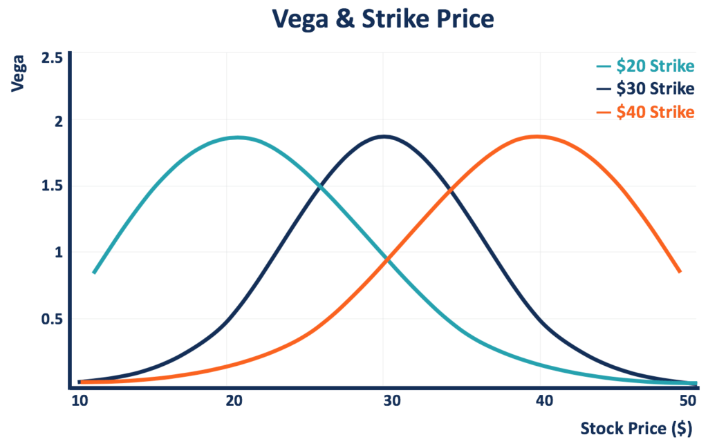

## Table of Contents

## What is Vega in finance?

Vega is a measure used in finance to understand how the price of an option might change as the volatility of the underlying asset changes. Volatility means how much the price of the asset, like a stock, moves up and down. Vega tells you how sensitive the option's price is to these changes in volatility. If an option has a high vega, its price will change a lot when the volatility of the stock changes. If it has a low vega, the price won't change as much.

For example, imagine you have an option on a stock, and the stock's volatility increases. If the option has a high vega, the price of the option will go up a lot. This is because higher volatility means there's a bigger chance the stock price will move in a way that makes the option more valuable. Traders use vega to manage their risk and make decisions about buying or selling options. Understanding vega helps them predict how their options might perform in different market conditions.

## How does Vega relate to options pricing?

Vega is an important part of figuring out how much an option is worth. It tells you how much the price of an option will change if the volatility of the stock it's based on changes. Volatility is like how much the stock price jumps around. If the stock's volatility goes up, the option's price might go up too, and vega helps you know by how much.

For example, if an option has a vega of 0.10, it means that for every 1% increase in the stock's volatility, the option's price will go up by $0.10. This is useful because it helps traders understand how sensitive their options are to changes in the market. If a trader thinks the stock's volatility will increase, they might want to buy options with a high vega to take advantage of that change.

## What does it mean for an options portfolio to be Vega neutral?

Being Vega neutral means that an options portfolio is not affected by changes in the volatility of the underlying assets. If the volatility goes up or down, the overall value of the portfolio stays the same because the positive and negative impacts of vega cancel each other out. This is important for traders who want to protect their portfolio from sudden changes in market volatility.

To achieve Vega neutrality, traders might buy and sell different options with varying levels of vega. For example, they might buy options with high vega and sell options with low vega, or vice versa, until the total vega of the portfolio is zero. This balancing act helps them focus on other aspects of their trading strategy without worrying about volatility affecting their portfolio's value.

## Why is Vega neutrality important in risk management?

Vega neutrality is important in risk management because it helps traders protect their portfolios from changes in market volatility. When a portfolio is Vega neutral, it means that the value of the portfolio won't go up or down just because the volatility of the stocks changes. This is really helpful for traders who want to focus on other parts of their trading plan without worrying about sudden jumps or drops in the market.

By making a portfolio Vega neutral, traders can manage their risk better. They do this by balancing options with different levels of sensitivity to volatility. This way, if the market gets more or less volatile, the gains and losses from the options cancel each other out. It's like having a safety net that keeps the portfolio stable no matter what happens with volatility.

## How can an investor achieve Vega neutrality in their portfolio?

To make a portfolio Vega neutral, an investor needs to balance the options they own so that the total sensitivity to changes in volatility is zero. This means they need to look at the Vega of each option in their portfolio. If some options have a high Vega, meaning their price changes a lot with volatility, the investor might sell those options or buy options with a lower Vega to balance it out. It's like a seesaw; if one side goes up, the other side needs to go down to keep it level.

For example, if an investor owns options with a total Vega of +100, they need to find options with a total Vega of -100 to make the portfolio Vega neutral. They might do this by selling options that have a high Vega or buying options that have a negative Vega. By carefully choosing which options to buy and sell, the investor can make sure that changes in the market's volatility won't affect the overall value of their portfolio. This helps them manage risk and focus on other parts of their trading strategy.

## What are the challenges of maintaining Vega neutrality?

Keeping a portfolio Vega neutral can be tricky. The main problem is that the market is always moving. Volatility can change quickly, and when it does, the Vega of the options in the portfolio changes too. This means that what was Vega neutral one day might not be the next. To stay Vega neutral, investors need to keep an eye on their portfolio all the time and make adjustments as needed. This can be a lot of work and might lead to more trading, which can be costly.

Another challenge is that options have different expiration dates. The Vega of an option changes as it gets closer to expiring. So, an investor needs to think about not just the current Vega but also how it will change over time. This means they might have to buy or sell options at different times to keep the portfolio balanced. It's like trying to hit a moving target, and it takes a lot of planning and quick thinking to do it right.

## How does Vega neutrality interact with other Greeks like Delta and Gamma?

Vega neutrality focuses on balancing the sensitivity of a portfolio to changes in volatility, but it doesn't work alone. It interacts with other Greeks like Delta and Gamma, which are also important for managing an options portfolio. Delta measures how much the price of an option changes when the price of the underlying asset changes. If a portfolio is Vega neutral but not Delta neutral, it could still be affected a lot by changes in the stock price. So, an investor might need to adjust both Vega and Delta to keep the portfolio stable in different market conditions.

Gamma, on the other hand, shows how the Delta of an option changes when the price of the underlying asset moves. It's like the speed of Delta. If a portfolio is Vega neutral but has a high Gamma, the Delta could change quickly, making the portfolio less stable. To keep things balanced, an investor might need to consider Gamma as well when they're trying to stay Vega neutral. It's all about finding the right mix of these Greeks to manage risk and keep the portfolio in line with their trading goals.

## Can Vega neutrality be applied to different types of options, such as American and European options?

Vega neutrality can be applied to both American and European options, but there are some differences to keep in mind. American options can be exercised at any time before they expire, while European options can only be exercised at expiration. This means that the Vega of American options might change in ways that are a bit harder to predict because people might decide to exercise them early. Still, the basic idea of Vega neutrality is the same: you want to balance out the sensitivity to changes in volatility so that the overall value of your portfolio doesn't change when volatility does.

To achieve Vega neutrality with American and European options, you need to look at the Vega of each option and balance them out. If you have American options with high Vega, you might need to sell some or buy European options with lower Vega to even things out. It's a bit like juggling, but the goal is the same: to make sure that your portfolio stays stable no matter what happens with market volatility.

## What are the implications of Vega neutrality on different market conditions?

Vega neutrality helps keep a portfolio stable no matter how the market's volatility changes. When the market is calm and volatility is low, a Vega neutral portfolio won't lose value just because the market stays quiet. This is good because it means the investor doesn't have to worry about sudden drops in their portfolio's value due to low volatility. On the other hand, if the market gets wild and volatility goes up, a Vega neutral portfolio won't gain value just because of that either. This can be a bit of a downside if the investor was hoping to make money from the increased volatility.

In different market conditions, Vega neutrality means the investor can focus on other things, like changes in the stock price or interest rates, without worrying about volatility. But it's not perfect. Keeping a portfolio Vega neutral takes a lot of work because the market is always changing. An investor has to keep adjusting their options to stay balanced. This can be tiring and might cost more in trading fees. So, while Vega neutrality can help manage risk, it also requires a lot of attention and effort to maintain.

## How do professional traders use Vega neutrality in their strategies?

Professional traders use Vega neutrality to protect their portfolios from sudden changes in market volatility. They do this by balancing their options so that the total Vega, or sensitivity to volatility, is zero. This means that if the market gets more or less volatile, the value of their portfolio stays the same. This helps them focus on other parts of their trading plan, like changes in the stock price or interest rates, without worrying about volatility messing things up. Vega neutrality is like a safety net that keeps their portfolio stable no matter what happens with the market's ups and downs.

To achieve Vega neutrality, traders need to keep a close eye on their options and make adjustments all the time. The market is always moving, so what was Vega neutral one day might not be the next. Traders might buy and sell different options with different levels of Vega to keep everything balanced. This can be a lot of work and might lead to more trading, which can cost money in fees. But for traders who want to manage their risk carefully, the effort is worth it. Vega neutrality lets them sleep better at night knowing their portfolio is protected from volatility shocks.

## What advanced tools or software are used to monitor and adjust Vega neutrality?

Professional traders use special software and tools to keep their portfolios Vega neutral. These tools help them see the Vega of each option in their portfolio and make quick changes when they need to. Some popular software includes Bloomberg Terminal, which gives traders a lot of information about options and helps them calculate Vega. Another tool is OptionVue, which is made just for options trading and has features to help traders stay Vega neutral. These tools make it easier for traders to keep an eye on their portfolio and adjust it to stay balanced.

These software programs often have charts and graphs that show how the Vega of the portfolio changes over time. They can also send alerts if the Vega gets out of balance, so traders know when to make a move. This is really helpful because the market can change fast, and traders need to be ready to adjust their options to keep their portfolio stable. By using these advanced tools, traders can manage their risk better and make sure their portfolio stays Vega neutral even when the market gets wild.

## How does Vega neutrality fit into a broader risk management and hedging strategy?

Vega neutrality is a key part of a bigger plan to manage risk and protect a portfolio. It helps traders keep their portfolio stable when the market's volatility changes. By balancing the Vega of their options, traders make sure that their portfolio's value doesn't go up or down just because the market gets more or less volatile. This is important because it lets traders focus on other risks, like changes in stock prices or interest rates, without worrying about volatility messing things up. Vega neutrality is like a safety net that keeps the portfolio safe from big swings in the market.

In a broader hedging strategy, Vega neutrality works together with other ways to manage risk. Traders also look at other Greeks like Delta, which shows how the option's price changes with the stock price, and Gamma, which shows how fast Delta changes. By balancing all these Greeks, traders can create a portfolio that is protected from many different kinds of risks. Vega neutrality is just one piece of the puzzle, but it's a very important one. It helps traders keep their portfolio steady no matter what happens in the market, making it easier to stick to their overall trading plan.

## What is Understanding Vega in Options Trading?

Vega is a fundamental component in options trading, representing the measure of an option's sensitivity to changes in the implied volatility of the underlying asset. Implied volatility refers to the market's forecast of a likely movement in an asset's price and, thus, is crucial in options pricing models like the Black-Scholes-Merton model. Unlike other options Greeks, such as Delta, which measures the sensitivity to the price of the underlying asset, or Gamma, which measures the rate of change of Delta, Vega specifically targets the risk associated with volatility fluctuations.

Options with higher Vega levels are notably more responsive to changes in volatility, thereby influencing their pricing substantially. This sensitivity means that as implied volatility increases, the premium of the option generally increases as well, assuming all other factors remain constant. Conversely, a decrease in implied volatility results in a reduced option premium. This volatility sensitivity can be expressed mathematically as:

$$
\text{Vega} = \frac{\partial V}{\partial \sigma}
$$

where $V$ is the option price and $\sigma$ is the implied volatility. This partial derivative indicates how much the price of an option is expected to move per 1% change in implied volatility.

For traders, managing Vega exposure becomes a primary focus when aiming to maintain stability within their options portfolios. A strategic approach to Vega management allows traders to mitigate risks tied to [volatility](/wiki/volatility-trading-strategies) fluctuations, especially in turbulent markets. This aspect of options trading is pivotal for constructing sophisticated strategies that isolate and minimize volatility risks.

Understanding and controlling Vega is integral for traders who employ options strategies, as it provides the capability to predict and adjust for variations in implied volatility. By accurately evaluating Vega, traders can strategically adjust their portfolios, hedging against undue volatility while capitalizing on other market movements. This capability underscores the importance of Vega within complex trading strategies aimed at risk management and optimized investment returns.

## References & Further Reading

[1]: Hull, J. C. (2018). ["Options, Futures, and Other Derivatives"](https://www.semanticscholar.org/paper/Options%2C-Futures%2C-and-Other-Derivatives-Hull/89bdee500c8623864fc9eb7a471546aa713acc44). Pearson.

[2]: Black, F., & Scholes, M. (1973). ["The Pricing of Options and Corporate Liabilities."](https://www.cs.princeton.edu/courses/archive/fall09/cos323/papers/black_scholes73.pdf) Journal of Political Economy, 81(3), 637-654.

[3]: Taleb, N. N. (1997). ["Dynamic Hedging: Managing Vanilla and Exotic Options"](https://archive.org/details/dynamichedgingma0000tale). Wiley.

[4]: Johnson, H., & Shanno, D. (1987). ["Option Pricing When the Variance is Changing."](https://www.cambridge.org/core/journals/journal-of-financial-and-quantitative-analysis/article/abs/option-pricing-when-the-variance-is-changing/E242191E3C24BAB1D72C7813724689C6) Journal of Financial and Quantitative Analysis, 22(2), 143-151.

[5]: Natenberg, S. (1994). ["Option Volatility & Pricing: Advanced Trading Strategies and Techniques"](https://www.amazon.com/Option-Volatility-Pricing-Strategies-Techniques/dp/0071818774). McGraw-Hill Education.