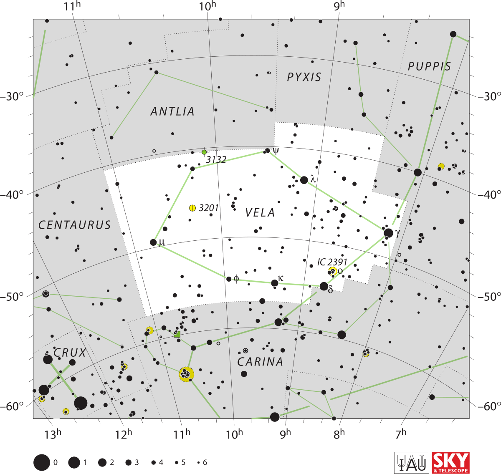

## Table of Contents

## What is the Vela Constellation and where is it located in the sky?

The Vela Constellation is a group of stars that looks like a sail. It is part of a bigger group of stars that used to be called Argo Navis, which means "the ship of the Argonauts" from an old story. But now, it is split into smaller parts, and Vela is one of them. The name Vela comes from the Latin word for sail.

You can find Vela in the southern part of the sky. It is best seen from places that are not too far north, like the southern half of the United States, or from countries that are even further south. During the months of March, April, and May, Vela is high in the sky at night, making it a good time to look for it.

## What is the mythological background of the Vela Constellation?

The Vela Constellation comes from a story about a big ship called Argo Navis. This ship was used by a group of heroes called the Argonauts. They went on a big adventure to find a special golden item called the Golden Fleece. The leader of the Argonauts was a man named Jason. The ship was so important in their story that when people looked at the stars, they saw the shape of the ship in the sky.

A long time ago, all the stars that made up the ship were thought of as one big constellation called Argo Navis. But later, people decided to split it into smaller parts to make it easier to study. So, the part of the ship that looked like a sail became its own constellation, called Vela. Even though Vela is just a part of the old ship, it still reminds us of the exciting adventure of Jason and the Argonauts.

## What are the main stars in the Vela Constellation and their characteristics?

The Vela Constellation has several bright stars that are easy to see. The brightest one is called Gamma Velorum, also known as Regor. It's a big star that is much hotter and brighter than our Sun. It's actually a group of stars that are close together, and they look like one star from Earth. Another important star in Vela is Delta Velorum, or Alsephina. It's also very bright and is a bit farther away from us than Gamma Velorum. Delta Velorum is a special kind of star called a giant, which means it's bigger and older than our Sun.

There's also Kappa Velorum, which is another bright star in Vela. It's a bit cooler than Gamma and Delta Velorum but still shines brightly in the sky. Kappa Velorum is interesting because it's what astronomers call a binary star, meaning it has a smaller star orbiting around it. Lastly, there's Lambda Velorum, which is not as bright as the others but still important in the constellation. It's a bit like our Sun but much bigger and farther away. These stars together make up the main points of the Vela Constellation, helping to shape the sail in the sky.

## How can one identify the Vela Constellation in the night sky?

To find the Vela Constellation in the night sky, you need to look towards the south if you're in the southern part of the world or the southern half of the United States. Vela is part of a bigger picture that used to be one large ship, but now it's just the sail part. The best time to see it is during the months of March, April, and May when it's high in the sky at night. 

Start by finding the bright star called Gamma Velorum, also known as Regor. It's the brightest star in Vela and looks like one star but is actually a group of stars close together. From Gamma Velorum, you can trace out the shape of the sail. Look for another bright star, Delta Velorum, or Alsephina, which is a bit farther away from Gamma Velorum. These two stars, along with other less bright stars like Kappa Velorum and Lambda Velorum, form the outline of the sail. By connecting these stars with imaginary lines, you can see the shape of the Vela Constellation in the sky.

## What are some notable deep-sky objects found in the Vela Constellation?

In the Vela Constellation, there's a really cool thing called the Vela Supernova Remnant. This is what's left after a star exploded a long time ago. It's spread out over a big area in the sky and looks like a faint glow. You need a special telescope to see it well, but it's one of the closest supernova remnants to Earth, which makes it really interesting for scientists.

Another neat thing in Vela is the Vela Pulsar. This is a type of star that spins really fast and sends out beams of light and radio waves. It's what's left in the middle of the Vela Supernova Remnant. The Vela Pulsar is one of the brightest pulsars we know about, and it helps scientists learn more about how stars work and what happens when they explode.

There's also the Omicron Velorum Cluster, which is a group of stars that are close together. It's not as famous as the supernova remnant or the pulsar, but it's still cool to look at through a telescope. This cluster is made up of young, hot stars that shine brightly and are fun to see if you're exploring the night sky.

## What is the history of the Vela Constellation's recognition and naming?

The Vela Constellation was first part of a bigger group of stars called Argo Navis. Argo Navis was named after the ship from the story of Jason and the Argonauts. They were heroes who went on a big adventure to find the Golden Fleece. The whole ship was seen as one big constellation in the sky. But as time went on, people found it hard to study such a big group of stars all at once. So, in the 1700s, a man named Nicolas Louis de Lacaille decided to split Argo Navis into smaller parts. He named these parts after different parts of the ship. Vela, which means "sail" in Latin, became one of these new, smaller constellations.

After Lacaille split Argo Navis, Vela became its own official constellation. This happened in the 1750s. Since then, Vela has been known as a separate group of stars that looks like a sail. People all over the world, especially in the southern parts, can see Vela in the night sky. It's a reminder of the old story of the Argonauts and their ship, but now it's easier for scientists and star watchers to study and enjoy.

## How does the Vela Constellation relate to its neighboring constellations?

The Vela Constellation is part of a big group of stars that used to be one constellation called Argo Navis, which means "the ship of the Argonauts." When Argo Navis was split into smaller parts, Vela became the sail of the ship. It's close to other parts of the old ship, like Carina, which is the keel, and Puppis, which is the stern. These three constellations together still make up the shape of the ship in the sky.

Vela is also near some other constellations that aren't part of the ship. For example, it's close to Centaurus, which looks like a centaur, and Lupus, which looks like a wolf. These constellations are all in the southern part of the sky, so if you're looking at Vela, you might see these other constellations nearby too. They all help to make the night sky in the southern hemisphere a busy and interesting place to explore.

## What are the best times and seasons to observe the Vela Constellation?

The best time to see the Vela Constellation is during the months of March, April, and May. This is when Vela is high in the sky at night, making it easier to spot. If you live in the southern part of the world or the southern half of the United States, you can look towards the south to find it. Vela looks like a sail, and it's part of a bigger picture that used to be one large ship.

You'll want to find a spot where the sky is dark and clear, away from city lights. This helps you see the stars better. The bright star Gamma Velorum, also called Regor, is a good starting point to find Vela. From there, you can trace out the shape of the sail with other stars like Delta Velorum and Kappa Velorum. So, if you're planning to look for Vela, remember to check the sky in the early spring months when it's most visible.

## Are there any significant astronomical events or phenomena associated with the Vela Constellation?

The Vela Constellation is home to some really interesting things in space. One of the coolest is the Vela Supernova Remnant. This is what's left after a star exploded a long time ago. It spreads out over a big area in the sky and looks like a faint glow. You need a special telescope to see it well, but it's one of the closest supernova remnants to Earth. This makes it very important for scientists who want to learn more about how stars explode and what happens afterward.

Another amazing thing in Vela is the Vela Pulsar. This is a type of star that spins very fast and sends out beams of light and radio waves. It's right in the middle of the Vela Supernova Remnant. The Vela Pulsar is one of the brightest pulsars we know about, and it helps scientists understand more about stars and what happens when they explode. These two things make the Vela Constellation a special place in the sky for people who love to learn about space.

## How has the Vela Constellation been used in navigation or cultural practices?

The Vela Constellation, which looks like a sail, has been helpful for people who travel on the sea. Long ago, sailors used the stars to find their way. They would look at the stars to know which direction they were going. Vela, being part of the bigger ship Argo Navis, was a useful guide for them. Even though it's now a smaller part of the old ship, sailors in the southern parts of the world can still use Vela to help them navigate.

In some cultures, the stars in the sky are important for more than just finding the way. They tell stories and have meanings that are special to the people. The Vela Constellation, being part of the story of Jason and the Argonauts, reminds people of this old adventure. In places where Vela can be seen clearly, like in the southern hemisphere, it might be part of local stories or traditions. People might look up at Vela and remember the heroes who sailed on a big adventure long ago.

## What are the current research interests or findings related to the Vela Constellation?

Scientists are very interested in the Vela Supernova Remnant, which is part of the Vela Constellation. This is what's left after a star exploded a long time ago. They use special telescopes to study it because it's one of the closest supernova remnants to Earth. By looking at it, scientists learn more about how stars explode and what happens afterward. They also study the Vela Pulsar, which is a fast-spinning star in the middle of the supernova remnant. This pulsar sends out beams of light and radio waves, and it's one of the brightest ones we know about. Studying the Vela Pulsar helps scientists understand more about how stars work and what they leave behind when they explode.

Another thing scientists are looking at in the Vela Constellation is the Omicron Velorum Cluster. This is a group of young, hot stars that are close together. By studying this cluster, scientists can learn more about how stars form and grow. The Vela Constellation is a busy place in the sky, and there's always something new to discover. With better telescopes and new ways to study the stars, scientists keep finding out more about the interesting things in Vela.

## How does the Vela Constellation contribute to our understanding of the universe's structure?

The Vela Constellation helps scientists learn about the big picture of the universe. It has something called the Vela Supernova Remnant, which is what's left after a star exploded. By studying this, scientists can understand more about how stars explode and what they leave behind. This helps them see how the universe changes over time. The Vela Supernova Remnant is close to Earth, so it's easier to study and gives us a lot of information about these big events.

Another important part of Vela is the Vela Pulsar. This is a fast-spinning star that sends out beams of light and radio waves. It's in the middle of the supernova remnant and is one of the brightest pulsars we know about. By looking at the Vela Pulsar, scientists learn about how stars work and what happens when they die. This also helps them understand the structure of the universe because pulsars are like markers that help map out space. Together, these parts of the Vela Constellation give us clues about how the universe is put together and how it changes.

## What is the relationship between Algorithmic Trading and Market Dynamics?

Algorithmic trading has significantly transformed the finance industry by leveraging technology to automate complex trading strategies. This method employs sophisticated algorithms to perform high-frequency trading, executing numerous transactions in fractions of a second. These algorithms analyze vast datasets to detect emerging patterns and market inefficiencies that human traders might overlook.

A key component of [algorithmic trading](/wiki/algorithmic-trading) is the ability to access low-latency market data and execution technology. Firms like Vela Trading Systems, now operating as Exegy, specialize in providing such solutions. Their services include delivering real-time financial data with minimal delay, enabling traders to react swiftly to market changes. By reducing the time between receiving data and executing a trade, these companies enhance the potential for profit generation in volatile markets.

The technological infrastructure for algorithmic trading is rooted in advanced mathematics and statistical models. For example, a simple moving average (SMA) can be used to identify trends:

$$
SMA = \frac{1}{N} \sum_{i=0}^{N-1} \text{Price}_i
$$

In this equation, $N$ represents the number of periods over which the average is calculated, and $\text{Price}_i$ denotes the asset price at period $i$. By comparing the current price to the SMA, algorithms can signal potential buy or sell actions, making it a foundational tool in automated trading strategies.

The global reach of platforms like Vela underscores the interconnectedness of today's financial markets. They facilitate trading across various asset classes, exchanges, and time zones, allowing traders to capitalize on opportunities regardless of their geographic location. This connectivity not only enhances [liquidity](/wiki/liquidity-risk-premium) but also fosters a more integrated global financial network.

The increasing reliance on algorithmic trading highlights the importance of robust data security, regulatory compliance, and the ethical implications of automated decision-making. Consequently, both practitioners and regulators must remain vigilant to ensure that these systems operate fairly and transparently.

In summary, algorithmic trading epitomizes the fusion of technology and finance, enabling rapid execution and data-driven decision-making. Companies such as Exegy play a crucial role by providing the necessary infrastructure to support this transformation, thus offering valuable insights into the intricacies of modern market dynamics.

## References & Further Reading

[1]: Bergstra, J., Bardenet, R., Bengio, Y., & Kégl, B. (2011). ["Algorithms for Hyper-Parameter Optimization."](https://proceedings.neurips.cc/paper/2011/file/86e8f7ab32cfd12577bc2619bc635690-Paper.pdf) Advances in Neural Information Processing Systems 24.

[2]: ["Advances in Financial Machine Learning"](https://www.amazon.com/Advances-Financial-Machine-Learning-Marcos/dp/1119482089) by Marcos Lopez de Prado

[3]: ["Evidence-Based Technical Analysis: Applying the Scientific Method and Statistical Inference to Trading Signals"](https://www.amazon.com/Evidence-Based-Technical-Analysis-Scientific-Statistical/dp/0470008741) by David Aronson

[4]: ["Machine Learning for Algorithmic Trading"](https://github.com/stefan-jansen/machine-learning-for-trading) by Stefan Jansen

[5]: ["Quantitative Trading: How to Build Your Own Algorithmic Trading Business"](https://www.amazon.com/Quantitative-Trading-Build-Algorithmic-Business/dp/1119800064) by Ernest P. Chan