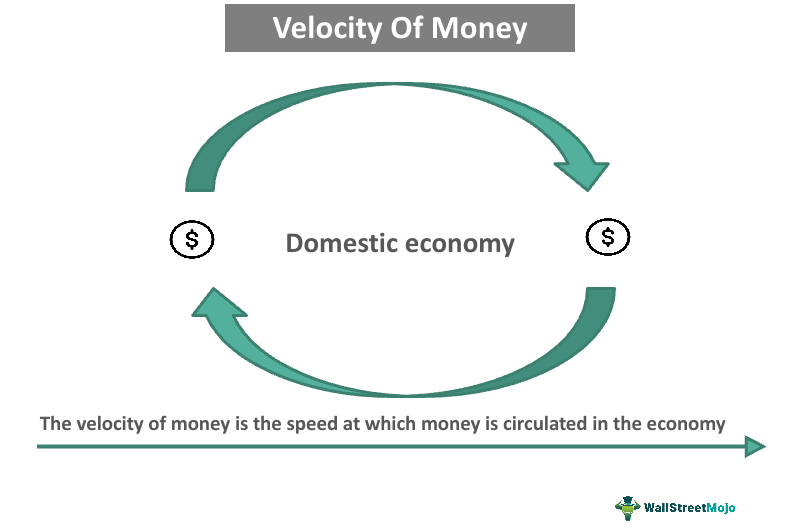

Understanding the intersection of financial theory and practical application is crucial for success in today's fast-paced economic landscape. This article aims to connect the intricate concept of the velocity of money with the cutting-edge world of algorithmic trading. By examining these ideas, we will illustrate their impact on modern finance, enriched with examples and formulae for a clearer understanding.

The velocity of money refers to the frequency at which a unit of currency circulates and is used in financial transactions within an economy over a certain period. It serves as a critical economic indicator, highlighting the pace of economic activity and spending behaviors. Mathematically, it can be expressed as:



$$
\text{Velocity of Money} = \frac{\text{Gross Domestic Product (GDP)}}{\text{Money Supply}}
$$

Algorithmic trading, on the other hand, revolutionizes the execution of financial trades by utilizing programmed instructions based on predefined conditions. This mechanized approach injects speed, precision, and the ability to analyze vast data sets into trading, far surpassing traditional human capabilities. 

By exploring these concepts, readers will acquire insight into how financial metrics like the velocity of money can be harnessed to enhance trading strategies, particularly within the domain of algorithmic trading. As we progress, it will be evident how economic formulae intertwine with trading mechanics, creating opportunities to leverage financial theories in practical settings.

## Table of Contents

## Understanding the Velocity of Money

The velocity of money is a key concept in macroeconomics, representing the rate at which money exchanges hands in an economy. It essentially tracks how quickly money is being put to work in facilitating economic activities, including buying goods and services. A fundamental measure of economic vitality, the velocity of money provides insights into the momentum of economic transactions.

Mathematically, the velocity of money is expressed as the ratio of a country's Gross Domestic Product (GDP) to its money supply. This relationship can be captured in the following formula:

$$
\text{Velocity of Money (V)} = \frac{\text{GDP}}{\text{Money Supply}}
$$

In this context, GDP represents the total value of all goods and services produced over a specific time period within a country, while the money supply indicates the total amount of monetary assets available in the economy.

A higher velocity of money suggests a vibrant economy where money changes hands frequently, indicating strong consumer activity and business transactions. Conversely, a lower velocity may imply reduced economic activity, where money circulates less frequently, potentially signaling economic stagnation or a downturn.

To better illustrate this concept, consider a simple real-world example:

Suppose a country's GDP is $1 trillion, and its money supply is $500 billion. The velocity of money can be calculated as follows:

$$
V = \frac{\text{\$1 trillion}}{\text{\$500 billion}} = 2
$$

This result implies that, on average, each unit of currency in the money supply is used twice to purchase goods and services in one year.

The velocity of money can also be influenced by various economic factors, such as consumer confidence, interest rates, and inflation. For instance, when consumer confidence is high, individuals are more likely to spend money rather than save, increasing the velocity of money. Conversely, during periods of economic uncertainty, the velocity may decrease as people and businesses hoard cash, reducing transactions.

Overall, understanding the velocity of money is essential for assessing economic performance and trends, offering a lens through which economic health can be evaluated.

## Economic Implications of the Velocity of Money

The velocity of money is an essential metric for understanding economic activity, providing insights into how dynamically money circulates through an economy. It helps policymakers and investors evaluate economic [momentum](/wiki/momentum) and draw conclusions about the overall economic climate. The velocity of money is typically calculated with the formula:

$$
\text{Velocity of Money} = \frac{\text{Gross Domestic Product (GDP)}}{\text{Money Supply}}
$$

An increase in the velocity of money during growth periods suggests that money is changing hands rapidly, pointing to active economic engagement and consumer confidence. This trend typically indicates an expanding economy where spending is robust, leading to higher production and services, increased employment, and overall economic health. Conversely, a decline in money velocity may signal an economic slowdown or recession, where money circulates less frequently—a possible indicator of reduced demand, lower economic activity, and a potential increase in savings or hoarding by consumers.

From a policy perspective, central banks closely monitor the velocity of money as part of their macroeconomic assessment to guide monetary policies. An observed decrease in money velocity might prompt central banks to introduce stimulus measures such as lowering interest rates or implementing quantitative easing to encourage lending and spending. Conversely, if the velocity is excessively high and indicative of overheating, central banks may consider tightening monetary policy to prevent inflation by raising interest rates or reducing the money supply.

By understanding and reacting to changes in the velocity of money, central banks aim to stabilize the economy, ensuring sustainable growth and preventing detrimental cycles of boom and bust. Furthermore, investors can use the velocity of money as an indicator to strategize, adjusting their portfolios in response to anticipated macroeconomic shifts.

In summary, the velocity of money serves as a barometer for economic vitality, facilitating informed decisions for policymakers and investors who strive to cultivate ideal economic conditions.

## Algorithmic Trading: The Basics

Algorithmic trading is a method that automates trade execution using complex algorithms based on pre-set parameters. This approach capitalizes on speed, precision, and efficiency, elements often limited in manual trading. By processing vast amounts of market data in real-time, algorithms can execute trades at speeds that are orders of magnitude faster than human traders, allowing for more accurate and timely trades.

### Development and Deployment of Algorithms

The development of trading algorithms involves designing a systematic set of instructions or rules that guide trading decisions. These rules can be based on a variety of criteria including price, timing, [volume](/wiki/volume-trading-strategy), or any mathematical model that can predict market trends. Typically, these algorithms are developed using programming languages such as Python, C++, or Java. Python, in particular, is popular due to its robust libraries and ease of use, which facilitate data analysis and algorithm development.

Deployment of algorithms requires integration with financial markets through trading platforms or APIs. These platforms provide the necessary infrastructure to execute trades automatically on various exchanges. Traders test their algorithms extensively using historical data to ensure their effectiveness before deploying them in live markets.

### Key Algorithmic Trading Strategies

Several key strategies dominate [algorithmic trading](/wiki/algorithmic-trading), notably trend-following and [arbitrage](/wiki/arbitrage).

- **Trend-following**: This strategy exploits market momentum by anticipating that prices will continue to move in the current trend. Traders develop algorithms that detect signals of an upward or downward trend and make trades accordingly. For example, moving averages (MA) or the relative strength index (RSI) might be used to identify trends. In a Python implementation, a simple moving average crossover strategy can be coded as:

  ```python
  import pandas as pd

  def moving_average_strategy(data, short_window=40, long_window=100):
      data['Short_MA'] = data['Close'].rolling(window=short_window, min_periods=1).mean()
      data['Long_MA'] = data['Close'].rolling(window=long_window, min_periods=1).mean()
      data['Signal'] = 0
      data['Signal'][short_window:] = \
          np.where(data['Short_MA'][short_window:] > data['Long_MA'][short_window:], 1, 0)
      data['Position'] = data['Signal'].diff()
      return data
  ```

  This code calculates short and long moving averages and generates buy/sell signals based on their crossover.

- **Arbitrage**: Arbitrage strategies take advantage of price discrepancies of the same asset in different markets. For instance, an algorithm might identify a situation where a stock is priced differently on two exchanges, buy the cheaper option, and sell at the higher price. High-frequency trading firms often use these algorithms due to the narrow profit margins which require rapid execution and high trade volumes to be profitable.

In algorithmic trading, these strategies rely extensively on data accuracy and processing speed. The precision of algorithm execution not only minimizes market impact (slippage) but leverages slight market movements for profitable trades. As technology evolves, the refinement and complexity of these algorithms continue to push the boundaries of trading efficiency, making them instrumental in modern financial markets.

## Integrating Economic Indicators with Algorithmic Trading

Integrating economic indicators with algorithmic trading involves the use of economic data, such as the velocity of money, to refine and optimize trading strategies. Financial algorithms, which are automated trading programs, can analyze this economic data to make informed trading decisions, thereby maximizing potential returns.

The velocity of money, as an economic indicator, provides insights into the economic activity level. This data can be integrated into trading algorithms to predict market movements and improve decision-making. For instance, an increase in the velocity of money might signal a robust economic environment, prompting algorithms to adopt a more aggressive trading strategy. Conversely, a decrease could indicate potential economic slowdowns, leading algorithms to adopt a more conservative approach.

To integrate the velocity of money into algorithmic trading, consider the following steps:

1. **Data Acquisition**: Obtain reliable and up-to-date data on the velocity of money from economic databases or financial data providers. This data is essential for accurately assessing market conditions.

2. **Data Analysis**: Use statistical methods and machine learning techniques to analyze the historical relationship between the velocity of money and market performance. This analysis can help identify patterns and correlations that are beneficial in trading.

3. **Algorithm Development**: Develop trading algorithms that incorporate insights from the data analysis. For example, a simple Python code snippet to integrate economic indicators might look like this:

    ```python
    import pandas as pd
    from sklearn.linear_model import LinearRegression

    # Load economic data
    data = pd.read_csv('velocity_of_money.csv')
    features = data[['Velocity_of_Money', 'GDP', 'Interest_Rates']]
    target = data['Market_Return']

    # Train a simple linear regression model
    model = LinearRegression()
    model.fit(features, target)

    # Predict market returns based on new data
    new_data = {'Velocity_of_Money': [1.5], 'GDP': [21000], 'Interest_Rates': [0.75]}
    prediction = model.predict(pd.DataFrame(new_data))
    ```

4. **Strategy Testing**: Backtest the strategies using historical data to evaluate their performance. Ensure that the strategy performs well under various market conditions before deploying it in live trading.

5. **Real-time Monitoring**: Continuously monitor the performance of trades executed by the algorithm, adapting model parameters as necessary according to changing economic conditions.

By incorporating the velocity of money into algorithmic trading strategies, traders can enhance their market predictions, leading to better decision-making and potentially higher returns. The integration of such economic indicators into algorithmic frameworks not only leverages historical data but also allows for real-time adjustments, providing a dynamic edge in financial markets.

## Case Study: Algorithm Trading with Velocity of Money

In this case study, we explore the application of money velocity as a trigger within algorithmic trading strategies. By integrating the velocity of money into trading algorithms, traders can potentially optimize trade execution and enhance decision-making. 

### Selection of Financial Instruments

To effectively employ the velocity of money in algorithmic trading, we begin by selecting appropriate financial instruments. Equities, commodities, and foreign exchange (Forex) are common candidates due to their [liquidity](/wiki/liquidity-risk-premium) and response to economic indicators. For this hypothetical scenario, let's focus on equity indices like the S&P 500, as they often reflect broader economic conditions.

### Algorithmic Strategy Setup

The algorithmic strategy involves two essential components: the calculation of money velocity and its integration into a trading framework.

1. **Calculation of Money Velocity:**

   The velocity of money is calculated using the formula:
$$
   V = \frac{GDP}{M}

$$

   Where $V$ is the velocity of money, GDP is the Gross Domestic Product, and $M$ is the money supply. For real-time trading, quarterly GDP and monthly M1 or M2 money supply figures from reliable economic sources are used.

2. **Algorithm Integration:**

   Using Python, we construct an algorithm that processes these economic inputs. The strategy involves setting predefined thresholds for the velocity of money to determine market sentiment and trading signals.

   ```python
   import pandas as pd
   import numpy as np

   # Simulated data for demonstration
   data = pd.DataFrame({
       'Date': pd.date_range(start='1/1/2020', periods=12, freq='M'),
       'GDP': np.random.uniform(20000, 21000, 12),  # in billions
       'Money_Supply': np.random.uniform(1000, 1100, 12)  # in billions
   })

   # Calculate velocity of money
   data['Velocity_of_Money'] = data['GDP'] / data['Money_Supply']

   # Set a velocity threshold for trading
   VELOCITY_THRESHOLD = 20

   # Generate trading signals based on the threshold
   data['Trade_Signal'] = data['Velocity_of_Money'].apply(
       lambda x: 'Buy' if x > VELOCITY_THRESHOLD else 'Sell'
   )

   print(data)
   ```

   This code calculates the velocity of money using simulated GDP and money supply data, subsequently generating buy or sell signals based on a predefined velocity threshold.

### Hypothetical Results

Upon employing this strategy over a simulated period, the algorithm yields trading signals indicating potential entry and [exit](/wiki/exit-strategy) points based on economic activity as measured by money velocity. A "Buy" signal is triggered when the velocity exceeds the threshold, suggesting that the market is vibrant, possibly leading to upward trends. Conversely, a "Sell" signal reflects lower velocity, indicating caution or declining economic momentum.

By integrating these signals with technical analysis indicators such as moving averages or RSI (Relative Strength Index), traders can refine their trading positions further. This multi-faceted approach enables more informed and data-driven decisions, potentially leading to optimized trading outcomes.

In conclusion, using the velocity of money within algorithmic trading presents a novel method for linking macroeconomic health to trading strategies, presenting opportunities for traders to enhance their performance through economic foresight.

## Challenges and Considerations in Algo Trading

Integrating complex economic indicators like the velocity of money into algorithmic trading systems presents unique challenges that require careful consideration. Data accuracy is of paramount importance, as the reliability of trading decisions hinges on the quality of information used as input. An incorrect GDP estimation or outdated money supply data can skew the results of calculations, leading to erroneous interpretations of the velocity of money and potentially adverse trading decisions. 

Furthermore, algorithm sensitivity plays a critical role in how effectively these indicators are employed. Overly sensitive algorithms might react too quickly to minor fluctuations in the velocity of money, which might not represent significant economic shifts but are rather noise. Conversely, insufficient sensitivity can lead to missed opportunities where a genuine change in economic conditions could have been leveraged for profit. This requires the calibration of algorithmic models to account for noise while maintaining responsiveness to meaningful changes.

Another significant concern is the risk of systemic trading errors, particularly when integrating multiple data sources and complex indicators. If an algorithm is too dependent on a single indicator like the velocity of money, it could lead to skewed trading behaviors that do not fully account for the broader economic context. It’s crucial to diversify the data streams feeding into algorithms to mitigate this risk. For instance, combining velocity of money data with other economic indicators like unemployment rates or consumer spending might provide a more holistic view of market conditions.

Traders can enhance resilience in their trading systems by employing diverse data streams in tandem with robust back-testing and scenario analysis frameworks. This not only aids in the anticipation of potential issues but also in the crafting of algorithms that can adapt to changing economic landscapes. For example, implementing [machine learning](/wiki/machine-learning) techniques to recognize patterns across multiple indicators can lead to more nuanced and effective trading strategies. 

Optimal balancing requires continuous evaluation and adjustment. Consider the Python snippet below, which illustrates a simple framework for testing an algorithm's response to changes in the velocity of money and other indicators:

```python
import numpy as np
from sklearn.ensemble import RandomForestRegressor

# Sample synthetic data representing our indicators
gdp = np.random.normal(loc=1.5, scale=0.1, size=1000)
money_supply = np.random.normal(loc=1.0, scale=0.05, size=1000)
velocity_of_money = gdp / money_supply
unemployment_rate = np.random.normal(loc=5.0, scale=0.5, size=1000)

# Features are the velocity of money and unemployment rate
X = np.column_stack((velocity_of_money, unemployment_rate))
y = np.random.normal(loc=1.0, scale=0.02, size=1000)  # hypothetical trading profit/loss

# Create and fit the model
model = RandomForestRegressor(n_estimators=100)
model.fit(X, y)

# Simulating a new economic scenario
new_velocity = np.array([1.9, 1.2])  # velocity of money
new_unemployment = np.array([4.5, 6.0])  # unemployment rate
new_X = np.column_stack((new_velocity, new_unemployment))

# Predicting potential outcomes
predicted_outcomes = model.predict(new_X)
```

This code snippet demonstrates how an algorithm might be structured to integrate and evaluate various economic metrics. By employing a model that considers multiple factors, traders can fine-tune their strategies to better navigate volatile markets and mitigate the potential pitfalls of relying heavily on a single economic indicator.

## Conclusion

The integration of economic theories with practical trading strategies, such as algorithmic trading, offers significant opportunities for traders seeking to enhance their market performance. This synthesis allows for a nuanced approach to trading, where advanced economic metrics like the velocity of money can be harnessed to inform and optimize automated trading systems. By understanding the velocity of money, which indicates the frequency at which money changes hands within an economy, traders can better predict market trends and adjust their strategies accordingly.

Algorithmic trading systems, characterized by their speed, precision, and ability to process vast amounts of data, are well-suited to leverage this economic indicator. The velocity of money can signal shifts in economic activity, guiding algorithms to execute trades that align with the prevailing economic conditions. For instance, a rising velocity might suggest an environment ripe for growth-oriented investments, whereas a declining velocity could indicate cautious or defensive trading strategies.

Advancements in technology and the increasing availability of real-time data are further empowering traders to refine their approaches continuously. Machine learning algorithms and improved data analytics enable the development of sophisticated trading models that can dynamically adapt to changes in the velocity of money and other economic indicators. As data processing capabilities continue to evolve, traders can expect even greater precision and flexibility in their trading strategies.

In conclusion, the marriage of economic theory and algorithmic trading represents a frontier for innovation in financial markets. Traders who adeptly incorporate economic metrics like the velocity of money into their algorithmic strategies stand to gain a competitive edge, potentially achieving improved market outcomes in an ever-changing economic landscape.

## References & Further Reading

[1]: Friedman, B. M. (1990). ["The Future of Monetary Policy: The Central Bank as an Army with Only a Signal Corps."](https://scholar.harvard.edu/files/bfriedman/files/the_future_of_monetary_policy_the_central_bank_as_an_army_with_only_a_signal_corps.pdf) International Finance Section. 

[2]: Keynes, J. M. (1936). ["The General Theory of Employment, Interest, and Money."](https://www.files.ethz.ch/isn/125515/1366_KeynesTheoryofEmployment.pdf) Macmillan.

[3]: Lopez de Prado, M. (2018). ["Advances in Financial Machine Learning."](https://www.amazon.com/Advances-Financial-Machine-Learning-Marcos/dp/1119482089) Wiley.

[4]: Engle, R. F. (2002). ["Dynamic Conditional Correlation: A Simple Class of Multivariate GARCH Models."](https://www.jstor.org/stable/1392121) Journal of Business & Economic Statistics.

[5]: Hull, J. (2021). ["Options, Futures, and Other Derivatives."](https://books.google.com/books/about/Options_Futures_and_Other_Derivatives_Gl.html?id=sdg2EAAAQBAJ) Pearson.

[6]: Bokil, H., & Engle, R. (1991). ["Modelling the Term Structure of Interest Rates Under Non-separable Utility and Durability."](https://www.sciencedirect.com/science/article/pii/0304405X8690005X) Review of Economic Studies.

[7]: Chan, E. (2009). ["Quantitative Trading: How to Build Your Own Algorithmic Trading Business."](https://github.com/ftvision/quant_trading_echan_book) Wiley.