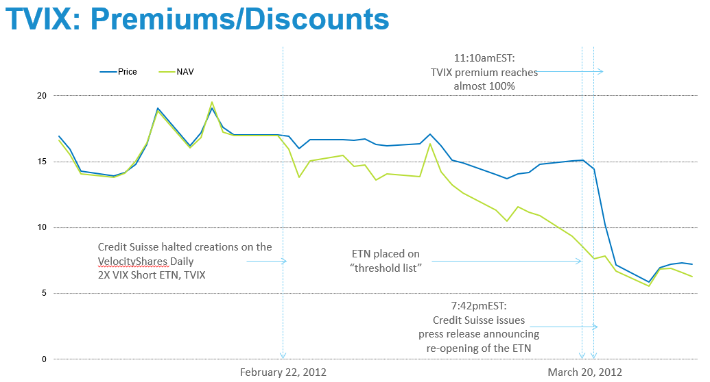

## Table of Contents

## What is the VelocityShares Daily 2x VIX Short-Term ETN?

The VelocityShares Daily 2x VIX Short-Term ETN, also known as TVIX, is a type of investment product. It is designed to give investors double the daily performance of the S&P 500 VIX Short-Term Futures Index. This index tracks the performance of futures contracts on the CBOE Volatility Index, which is often called the VIX. The VIX is a measure of the stock market's expectation of volatility over the next 30 days.

TVIX is meant for short-term trading, not for long-term investment. This is because it resets its exposure daily, which can lead to different results over time compared to the index it tracks. It's a high-risk product because it aims to deliver twice the daily return of a very volatile index. So, it can be useful for traders who want to bet on increased market volatility, but it's not suitable for everyone.

## How does the VelocityShares Daily 2x VIX Short-Term ETN work?

The VelocityShares Daily 2x VIX Short-Term ETN, or TVIX, is a financial product that tries to give investors twice the daily performance of the S&P 500 VIX Short-Term Futures Index. This index follows the price changes of futures contracts on the VIX, which is a measure of how much the stock market is expected to move in the next 30 days. So, if the VIX index goes up by 1% in a day, TVIX aims to go up by 2%. But if the VIX index goes down by 1%, TVIX aims to go down by 2%.

TVIX is meant for short-term trading, not for holding onto for a long time. This is because it resets its exposure every day. Over time, this can lead to results that are very different from the index it tracks. It's a high-risk product because it tries to deliver twice the daily return of a very volatile index. This makes it useful for traders who want to bet on increased market volatility, but it's not suitable for everyone because of the high risk involved.

## What is the VIX and how is it related to this ETN?

The VIX, or CBOE Volatility Index, is a measure that shows how much people expect the stock market to move in the next 30 days. It's often called the "fear gauge" because it goes up when people are worried about the market and expect big changes. The VIX doesn't track the stock market directly but looks at the prices of options, which are contracts that give the right to buy or sell stocks at a certain price. When the VIX is high, it means people think the market will be more volatile, and when it's low, they think it will be calmer.

The VelocityShares Daily 2x VIX Short-Term ETN, known as TVIX, is closely related to the VIX. TVIX is designed to give investors twice the daily performance of the S&P 500 VIX Short-Term Futures Index, which tracks futures contracts on the VIX. This means if the VIX goes up by 1% in a day, TVIX aims to go up by 2%. But it's important to know that TVIX is meant for short-term trading because it resets its exposure every day. This can make it very risky, as it tries to deliver twice the daily return of a very volatile index.

## What are the risks associated with investing in the VelocityShares Daily 2x VIX Short-Term ETN?

Investing in the VelocityShares Daily 2x VIX Short-Term ETN, or TVIX, comes with high risks. It tries to give you twice the daily performance of the VIX, which is already a very volatile index. This means if the VIX goes up by 1% in a day, TVIX aims to go up by 2%, but if the VIX goes down by 1%, TVIX will go down by 2%. This can lead to big losses quickly if the market moves against you. Also, TVIX is designed for short-term trading, not for holding onto for a long time. If you keep it for more than a day, the daily resetting of its exposure can lead to results that are very different from the VIX, and often worse.

Another risk is that TVIX is meant for experienced traders who understand how to use it correctly. It's not suitable for everyone, especially not for people who are new to investing or who don't understand how volatile markets work. The high leverage of TVIX means it can be a powerful tool for betting on increased market volatility, but it can also lead to big losses if you're not careful. So, it's important to know what you're doing before you invest in TVIX.

## How does the 2x leverage affect the performance of this ETN?

The 2x leverage in the VelocityShares Daily 2x VIX Short-Term ETN, or TVIX, means it aims to give you twice the daily performance of the VIX index. If the VIX goes up by 1% in a day, TVIX tries to go up by 2%. But if the VIX goes down by 1%, TVIX will try to go down by 2%. This can make TVIX move a lot more than the VIX itself, which is already a very volatile index. So, if you're right about the market, you could make more money, but if you're wrong, you could lose a lot more, too.

Because TVIX resets its exposure every day, the 2x leverage can make things even trickier over time. If you hold TVIX for more than a day, the daily resetting can lead to results that are very different from the VIX. This is called volatility decay, and it can make TVIX lose value even if the VIX stays the same or goes up a little bit over time. So, TVIX is really meant for short-term trading, and it's not a good choice if you want to invest for a long time.

## What are the fees and expenses associated with the VelocityShares Daily 2x VIX Short-Term ETN?

The VelocityShares Daily 2x VIX Short-Term ETN, or TVIX, comes with fees and expenses that you need to know about. The main fee is the annual management fee, which is around 1.65% of the value of your investment each year. This fee is taken out of the ETN's value over time, so it can affect how much you make or lose.

There might also be other costs, like trading fees if you buy or sell TVIX through a broker. These fees can vary depending on the broker you use, so it's a good idea to check what they charge before you start trading. Remember, all these fees and expenses can add up and make a big difference in your investment over time.

## How does the short-term focus of this ETN impact its investment strategy?

The short-term focus of the VelocityShares Daily 2x VIX Short-Term ETN, or TVIX, means it's designed for people who want to trade quickly, not hold onto it for a long time. TVIX tries to give you twice the daily performance of the VIX, which is a measure of how much the stock market is expected to move in the next 30 days. Because it resets its exposure every day, TVIX is best used for short-term bets on market volatility. If you think the market is going to get more volatile soon, you might use TVIX to try to make money from that.

But if you keep TVIX for more than a day, things can get tricky. The daily resetting can lead to results that are very different from the VIX over time. This is called volatility decay, and it can make TVIX lose value even if the VIX stays the same or goes up a little bit. So, if you're thinking about using TVIX, you need to be ready to trade it quickly and understand the risks. It's not a good choice for long-term investing because of how it's designed.

## What historical performance data is available for the VelocityShares Daily 2x VIX Short-Term ETN?

The VelocityShares Daily 2x VIX Short-Term ETN, or TVIX, has had a very up-and-down history. Since it started trading in November 2010, TVIX has seen big swings in its value. This is because it tries to give you twice the daily performance of the VIX, which is already a very volatile index. So, when the market gets worried and the VIX goes up, TVIX can go up a lot. But when the market calms down and the VIX goes down, TVIX can lose a lot of value, too. Over the years, TVIX has had times when it went up a lot in a short time, but it has also had long periods where it lost a lot of value.

Looking at the long-term performance of TVIX, it's clear that it's not meant for holding onto for a long time. Because it resets its exposure every day, TVIX can lose value over time even if the VIX stays the same or goes up a little bit. This is called volatility decay, and it's why TVIX is best used for short-term trading. If you look at the historical data, you'll see that TVIX has had some big gains in short periods, but over longer periods, it has often lost a lot of value. So, if you're thinking about using TVIX, it's important to understand its history and how it's meant to be used.

## How does the VelocityShares Daily 2x VIX Short-Term ETN compare to other volatility-based financial products?

The VelocityShares Daily 2x VIX Short-Term ETN, or TVIX, is one of many financial products that focus on volatility. It tries to give you twice the daily performance of the VIX, which is a measure of how much the stock market is expected to move in the next 30 days. Other products, like the iPath S&P 500 VIX Short-Term Futures ETN (VXX), aim to track the VIX more directly, without the 2x leverage. VXX tries to match the daily performance of the VIX, so it's less risky than TVIX but still very volatile. There are also inverse volatility products, like the ProShares Short VIX Short-Term Futures ETF (SVXY), which aim to go up when the VIX goes down. These products are meant for people who think the market will get less volatile.

TVIX is designed for short-term trading, not for holding onto for a long time. Because it resets its exposure every day, TVIX can lose value over time even if the VIX stays the same or goes up a little bit. This is called volatility decay, and it's why TVIX is best used for quick trades. Other products like VXX and SVXY also have this issue, but it's even more important with TVIX because of the 2x leverage. So, if you're thinking about using TVIX or any other volatility-based product, it's important to understand how they work and what they're meant for. They can be powerful tools for betting on market volatility, but they're also very risky and not suitable for everyone.

## What are the tax implications of investing in the VelocityShares Daily 2x VIX Short-Term ETN?

Investing in the VelocityShares Daily 2x VIX Short-Term ETN, or TVIX, can have some special tax rules. TVIX is treated as a prepaid forward contract for tax purposes. This means that any gains or losses you make from trading TVIX are usually treated as capital gains or losses. If you hold TVIX for less than a year, any profit you make is considered a short-term capital gain, which is taxed at your regular income tax rate. If you hold it for more than a year, it's a long-term capital gain, which is taxed at a lower rate.

There's another thing to keep in mind. TVIX might also have something called a "constructive sale" rule. This can happen if the value of TVIX goes down a lot in a short time. If this happens, you might have to pay taxes on any gains you've made up to that point, even if you haven't sold your TVIX yet. So, it's a good idea to talk to a tax advisor to understand how TVIX might affect your taxes.

## How can the VelocityShares Daily 2x VIX Short-Term ETN be used in a diversified investment portfolio?

The VelocityShares Daily 2x VIX Short-Term ETN, or TVIX, can be a part of a diversified investment portfolio, but it's important to use it carefully because it's very risky. TVIX is meant for short-term trading, not for holding onto for a long time. If you think the market is going to get more volatile soon, you might use TVIX to try to make money from that. But because it tries to give you twice the daily performance of the VIX, it can go up or down a lot in a short time. So, if you decide to use TVIX in your portfolio, it should be a small part of it, and you should be ready to trade it quickly.

Using TVIX in a diversified portfolio can help you balance out other investments that might lose value if the market gets more volatile. For example, if you have a lot of stocks in your portfolio, adding a small amount of TVIX can help protect you if the market suddenly gets worried and the VIX goes up. But remember, TVIX is not for everyone. It's meant for experienced traders who understand how to use it correctly. If you're new to investing or don't understand how volatile markets work, it's better to stay away from TVIX and focus on other, less risky investments.

## What advanced trading strategies can be employed with the VelocityShares Daily 2x VIX Short-Term ETN?

Advanced trading strategies with the VelocityShares Daily 2x VIX Short-Term ETN, or TVIX, often involve using it to bet on short-term increases in market volatility. One common strategy is called "hedging." If you have a lot of stocks in your portfolio and you're worried about a sudden drop in the market, you might buy a small amount of TVIX. This way, if the market does get more volatile and the VIX goes up, TVIX could go up a lot and help offset any losses in your stocks. But because TVIX is so risky and meant for short-term trading, you need to be ready to sell it quickly if the market doesn't move the way you expect.

Another strategy is called "pairs trading." This involves trading TVIX along with another volatility product, like the iPath S&P 500 VIX Short-Term Futures ETN (VXX). You might buy TVIX and sell VXX at the same time, betting that TVIX will go up more than VXX because of its 2x leverage. Or you could do the opposite, selling TVIX and buying VXX, if you think the market will stay calm. This strategy can help you make money from the difference in how these products move, but it's still very risky because both TVIX and VXX can be very volatile. So, if you're thinking about using these strategies, it's important to understand the risks and be ready to act quickly.

## References & Further Reading

[1]: ["Advances in Financial Machine Learning"](https://www.amazon.com/Advances-Financial-Machine-Learning-Marcos/dp/1119482089) by Marcos Lopez de Prado

[2]: Bergstra, J., Bardenet, R., Bengio, Y., & Kégl, B. (2011). ["Algorithms for Hyper-Parameter Optimization."](https://dl.acm.org/doi/10.5555/2986459.2986743) Advances in Neural Information Processing Systems 24.

[3]: Till, Hilary & Eagleeye, Joseph (2018). ["The Practical Challenges of Trading VIX Futures"](https://papers.ssrn.com/sol3/papers.cfm?abstract_id=4718895). The Journal of Alternative Investments.

[4]: ["Evidence-Based Technical Analysis: Applying the Scientific Method and Statistical Inference to Trading Signals"](https://www.amazon.com/Evidence-Based-Technical-Analysis-Scientific-Statistical/dp/0470008741) by David Aronson

[5]: ["Machine Learning for Algorithmic Trading"](https://github.com/stefan-jansen/machine-learning-for-trading) by Stefan Jansen

[6]: ["Quantitative Trading: How to Build Your Own Algorithmic Trading Business"](https://www.amazon.com/Quantitative-Trading-Build-Algorithmic-Business/dp/1119800064) by Ernest P. Chan