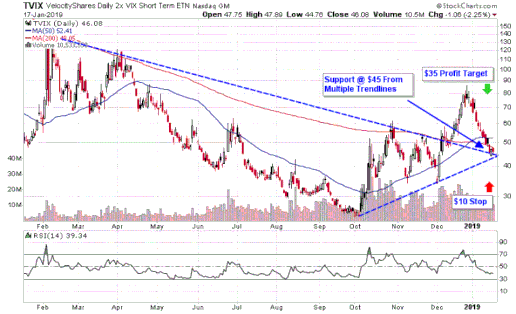

VelocityShares Daily 2X VIX Short-Term ETN (TVIX) was a financial instrument specifically engineered to multiply the daily fluctuations of the S&P 500 VIX Short-Term Futures Index by a factor of two. This leverage made it an attractive option for investors seeking aggressive growth strategies over a short-term horizon. The inherent volatility of TVIX appealed to a niche of traders aiming to capitalize on market turbulence, often involving substantial risk due to its exposure to market volatility through leveraged positioning. 

Algorithmic trading was integral to TVIX's rise in popularity, offering the ability to execute complex trading strategies with remarkable speed and precision. Algorithms, designed to analyze and respond to market signals efficiently, allowed traders to navigate the rapid price changes associated with TVIX effectively. This capacity for handling intricate trading strategies made algorithmic trading a perfect match for the volatile nature of TVIX, fostering its adoption among traders aiming for high-frequency and strategic gains. 



This article examines TVIX as a financial instrument—exploring its mechanics, historical context, the pivotal role that algorithmic trading played in its utilization, and insights for investors considering or engaging with similar high-leverage, volatility-focused products.

## Table of Contents

## Understanding VelocityShares ETN VIX Short-Term

The VelocityShares Daily 2X VIX Short-Term ETN (TVIX) was an innovative financial instrument designed to give investors exposure to the volatility of the stock market by capitalizing on the daily movements of the VIX Index. The VIX, often referred to as the "fear index," is a measure derived from the implied volatility of S&P 500 index options and represents the market's expectation of future volatility. 

TVIX sought to achieve a return that was 200% of the daily performance of the S&P 500 VIX Short-Term Futures Index. This leveraging meant that if the VIX index increased by 1% in a single day, the value of TVIX was designed to increase by 2%, essentially doubling any movement in the VIX index. Conversely, this mechanism also resulted in twice the loss if the VIX index decreased, thus amplifying both potential gains and losses and rendering it a highly speculative and volatile investment vehicle.

Due to its unique structure, TVIX was not an ideal choice for typical long-term investments. While its high leverage could appeal to traders seeking substantial returns from short-term volatility, the product's design led to a rapid price decay over time. This decay primarily arose from the frequent need to rebalance the leveraged exposure daily, a process often referred to as "beta slippage" or "volatility drag." Over prolonged periods, especially in sideways or less volatile markets, this characteristic could erode the value significantly, making long-term holding unfavorable.

Furthermore, the decay was exacerbated by the contango effect in the futures market. Contango occurs when the futures market's price is above the expected future spot price, resulting in a recurring loss as contracts are rolled over to maintain exposure. These elements combined necessitated a careful strategic approach to trading TVIX, typically aligning with investors who employed sophisticated trading methods to mitigate these risks while capitalizing on short-term market movements. 

In summary, while TVIX provided a potent tool for exploiting market [volatility](/wiki/volatility-trading-strategies), its inherent risks and the intricate dynamics of leveraged ETNs made it suitable primarily for experienced investors with a thorough understanding of its mechanics and an appetite for high-risk, high-reward trading scenarios.

## Algorithmic Trading and TVIX

Algorithmic trading, often referred to as algo trading, employs computers to execute trades rapidly based on a predetermined set of criteria, such as timing, price, or [volume](/wiki/volume-trading-strategy). This trading methodology enables market participants to manage their activities more systematically and efficiently, especially when dealing with instruments that require swift market responses.

TVIX, the VelocityShares Daily 2X VIX Short-Term ETN, was particularly suitable for [algorithmic trading](/wiki/algorithmic-trading) due to its high volatility and leveraged nature. The 2X leverage meant that TVIX would move significantly in response to changes in the VIX, the volatility index it aimed to track. This characteristic necessitated quick adjustments in trading positions to profit from its daily price fluctuations effectively.

The rapid market movements inherent in TVIX made it an attractive vehicle for algorithmic traders. These traders utilized complex algorithms designed to detect and exploit inefficiencies or patterns in the market. High-frequency trading ([HFT](/wiki/high-frequency-trading-strategies)) strategies, which rely on executing a large number of orders at extremely fast speeds, were especially prevalent. 

For instance, an algorithm might be programmed to buy TVIX when the VIX futures contracts show signs of increasing volatility and sell when volatility appears to be subsiding. Here is a simplified example of what such an algorithm could look like in Python:

```python
import numpy as np
import pandas as pd

# Example function to simulate buying or selling based on VIX signal
def trade_tvix(vix_prices, threshold=1.0):
    actions = []
    for i in range(1, len(vix_prices)):
        if (vix_prices[i] - vix_prices[i-1]) > threshold:
            actions.append('BUY')
        elif (vix_prices[i-1] - vix_prices[i]) > threshold:
            actions.append('SELL')
        else:
            actions.append('HOLD')
    return actions

# Example VIX price data
vix_prices = np.array([15.0, 15.5, 14.5, 16.0, 15.8])
trade_decisions = trade_tvix(vix_prices)
print(trade_decisions)
```

In the example above, the function `trade_tvix` makes decisions based on changes in VIX prices. If the price change exceeds the threshold, the algorithm decides whether to buy or sell TVIX, exploiting short-term volatility swings characteristic of the product.

The adoption of algorithmic trading in handling TVIX was also driven by the desire to mitigate risks associated with manual trading errors and emotional decision-making. By predefining trading plans, algorithm-driven strategies helped execute trades with precision, capitalizing on the fleeting opportunities that TVIX’s volatility presented.

In conclusion, the implementation of algorithmic trading strategies was crucial in navigating TVIX’s fast-paced trading environment, allowing market participants to optimize their trades with speed and efficiency, making it a prominent choice for traders seeking exposure to volatility through advanced technological methodologies.

## Historical Context and Delisting of TVIX

VelocityShares Daily 2X VIX Short-Term ETN (TVIX) was introduced by Credit Suisse in 2010, at a time when interest in volatility trading instruments was growing among investors pursuing high-risk, high-reward strategies. The product quickly gained traction, as it provided a leveraged exposure to the S&P 500 VIX Short-Term Futures Index, offering double the daily performance. 

TVIX's allure stemmed from its capacity to capitalize on sudden spikes in market volatility, appealing primarily to sophisticated traders and institutional investors adept at managing the associated risks. However, the structural nature of the ETN, particularly its leverage, led to rapid price decay, necessitating persistent adjustments to maintain usability and attractiveness. These adjustments often came in the form of reverse splits. A reverse split is a process by which a company or fund reduces the number of its outstanding shares, thereby increasing the per-share price. This was essential for TVIX to alleviate issues related to extremely low trading prices and prevent delisting by maintaining compliance with stock exchange requirements.

Throughout its existence, TVIX underwent several reverse splits, reflecting the inherent challenges of maintaining a 2X leveraged volatility product. Despite the popularity of TVIX, its lifecycle came to an end in June 2020 when Credit Suisse decided to delist it. This decision was part of the company's strategic realignment of its product offerings, aimed at achieving broader growth objectives. The move was part of Credit Suisse's initiative to simplify its portfolio and focus on opportunities that align with contemporary market demands and regulatory landscapes.

The delisting of TVIX was a significant event in the financial markets, as it represented the culmination of evolving market strategies and regulatory conditions. Post-delisting, investors who relied on TVIX had to seek alternative strategies or similar products to continue trading volatility, realigning their portfolios according to new market dynamics.

## Alternatives to TVIX

After the delisting of VelocityShares Daily 2X VIX Short-Term ETN (TVIX) in June 2020, traders who sought exposure to market volatility turned to other financial instruments such as the ProShares VIX Short-Term Futures [ETF](/wiki/etf-trading-strategies) (VIXY) and the iPath Series B S&P 500 VIX Short-Term Futures ETN (VXX). These products allow investors to participate in the fluctuations of the VIX, albeit with distinct attributes that appeal to various trading strategies and risk preferences.

### ProShares VIX Short-Term Futures ETF (VIXY)

VIXY is designed to target the S&P 500 VIX Short-Term Futures Index, offering exposure to the implied volatility of the S&P 500. As an exchange-traded fund (ETF), it holds a diversified portfolio of VIX futures contracts, primarily focusing on the first and second month futures to mimic the performance of short-term volatility. This makes VIXY a strategic tool for traders aiming to hedge against market downturns or gain from anticipated increases in volatility. Its structure as an ETF provides an added layer of accessibility by allowing investors to trade shares just like any public stock during market hours. However, similar to other volatility products, VIXY is susceptible to the effects of contango, where longer-dated futures are priced higher than nearer-term contracts, which can erode returns over time.

### iPath Series B S&P 500 VIX Short-Term Futures ETN (VXX)

VXX is another alternative, offering a different mechanism for tapping into short-term volatility. As an exchange-traded note (ETN), VXX provides exposure to the VIX through a synthetic construct backed by Barclays Bank PLC. An ETN's performance is linked to an index without owning the underlying securities, offering investors a different risk profile compared to ETFs. VXX seeks to replicate the daily percentage moves of the S&P 500 VIX Short-Term Futures Index. It provides a flexible approach for traders who wish to speculate on rapid changes in market sentiment or hedge against volatility spikes. Nonetheless, VXX carries its own risks, including credit risk from the issuer and significant time decay when held for prolonged periods.

### Key Differences and Considerations

Choosing between VIXY and VXX involves understanding the nuances in their structure and how they align with one's trading objectives:

1. **Leverage and Risk**: Neither VIXY nor VXX offers the same 2x leverage as TVIX, leading to less pronounced gains or losses. This can be beneficial or detrimental depending on the investor's strategy.

2. **Trading Vehicles**: VIXY, as an ETF, provides ease of trading, with dividends reinvested into the fund. In contrast, VXX, as an ETN, exposes investors to the creditworthiness of the issuing bank.

3. **Volatility Exposure**: While both products aim to offer short-term volatility exposure, the absence of leverage in these instruments necessitates different tactical approaches vs. the high risk/reward profile of TVIX.

For traders transitioning from TVIX, evaluating these alternatives requires a comprehensive understanding of their performance characteristics and how they fit within broader market strategies. Engaging with these instruments demands vigilance, as the inherent complexities of volatility trading can lead to rapid financial changes.

## Pros and Cons of Trading VIX-Based Products

Trading VIX-based products offers both opportunities and challenges for investors. These financial instruments, designed to track the volatility of the stock market as measured by the VIX, are unique due to their short-term focus and derivative nature. Here, we explore some of the primary advantages and disadvantages of trading VIX-based products.

**Pros:**

1. **Potential for Significant Profit:**
   VIX-based products can offer substantial returns during periods of heightened market volatility. As indicators of future market movement, these products are particularly appealing to traders seeking to capitalize on short-term price changes. Unlike traditional stocks, which are typically influenced by longer-term company fundamentals, VIX products primarily respond to market sentiment shifts. For investors with a robust understanding of market dynamics, this opens up opportunities for significant profit.

2. **Accessibility:**
   VIX-based products are traded on exchanges in a manner similar to stocks, allowing investors to buy and sell them with ease. This accessibility makes them an attractive option for retail investors who are able to execute trades using standard brokerage accounts. Moreover, the availability of both exchange-traded funds (ETFs) and exchange-traded notes (ETNs) linked to VIX futures provides investors with a range of leverage options and risk profiles.

**Cons:**

1. **Inherent Risk of Contango:**
   One of the primary risks associated with VIX-based products is contango, a situation where the futures prices are higher than the spot prices. In markets exhibiting contango, these products can suffer from roll costs as they move from one futures contract to the next, leading to a decrease in value over time. This is especially critical for instruments tracking VIX futures, as they necessitate perpetual contract rolling to maintain exposure.

2. **Significant Price Decay:**
   Due to their derivative structure and the impact of contango, VIX-based products tend to experience price decay. This makes them unsuitable for long-term holding strategies, as their value can erode significantly over time despite market conditions. Investors intending to hold these products for extended periods may find them less effective than initially anticipated.

3. **Deviation from Spot VIX Performance:**
   VIX-based products often diverge from the actual performance of the spot VIX index due to their dependence on VIX futures. Factors such as daily rebalancing and the compounding effect of returns can cause these products to underperform compared to the spot index over time. Consequently, traders must engage in careful management and frequent monitoring to align their positions with expected market movements.

Overall, trading VIX-based products necessitates a sophisticated approach and a comprehensive understanding of both market conditions and the specific mechanisms of these financial instruments. The inherent risks, while formidable, can be mitigated through diligent strategy and informed decision-making.

## Concluding Thoughts

The story of the VelocityShares Daily 2X VIX Short-Term ETN (TVIX) unfolds as a compelling narrative that highlights both the potential and perils of investing in short-term volatility products enhanced by algorithmic trading. As with many leveraged financial instruments, TVIX offered the allure of amplified returns, capturing the interest of traders keen on exploiting swift market movements. However, this opportunity for substantial profit was accompanied by significant risks, emphasizing the importance of having a robust understanding of the underlying market mechanics.

TVIX's leverage, aiming to deliver 200% of the daily movement of the VIX index, meant that both gains and losses were exaggerated. This characteristic made TVIX a suitable tool for sophisticated algorithmic trading strategies, which rely on the rapid and precise execution of trades. The use of algorithms allows traders to navigate the volatility of products like TVIX by executing complex, timing-sensitive strategies designed to capitalize on fleeting market conditions.

However, the risks inherent in trading such VIX-based products cannot be overstated. Issues such as contango, where futures prices are higher than spot prices, lead to significant price decay over time, meaning that holding these products without frequent adjustment can result in substantial losses. Moreover, the increased sensitivity to market fluctuations demands constant vigilance and a willingness to embrace technology-driven solutions.

For investors interested in engaging with short-term volatility trading, a keen understanding of the associated risks is crucial. The efficacy of algorithmic trading strategies hinges upon their sophistication and the trader's ability to interpret and respond to ever-changing market signals. Leveraging technology not only supports the automation and precision required in such fast-paced environments but also facilitates the continuous analysis necessary for informed decision-making.

In sum, TVIX serves as a cautionary example of the balance between risk and reward. It underscores the critical need for diligent risk management and the continuous application of advanced trading systems to mediate the complex interplay of factors influencing volatility products. For those pursuing opportunities in this domain, success lies in staying informed and maintaining a disciplined, strategic approach to trading.

## References & Further Reading

[1]: ["Advances in Financial Machine Learning"](https://www.amazon.com/Advances-Financial-Machine-Learning-Marcos/dp/1119482089) by Marcos Lopez de Prado

[2]: Bergstra, J., Bardenet, R., Bengio, Y., & Kégl, B. (2011). ["Algorithms for Hyper-Parameter Optimization."](https://dl.acm.org/doi/10.5555/2986459.2986743) Advances in Neural Information Processing Systems 24.

[3]: Till, Hilary & Eagleeye, Joseph (2018). ["The Practical Challenges of Trading VIX Futures"](https://papers.ssrn.com/sol3/papers.cfm?abstract_id=4718895). The Journal of Alternative Investments.

[4]: ["Evidence-Based Technical Analysis: Applying the Scientific Method and Statistical Inference to Trading Signals"](https://www.amazon.com/Evidence-Based-Technical-Analysis-Scientific-Statistical/dp/0470008741) by David Aronson

[5]: ["Machine Learning for Algorithmic Trading"](https://github.com/stefan-jansen/machine-learning-for-trading) by Stefan Jansen

[6]: ["Quantitative Trading: How to Build Your Own Algorithmic Trading Business"](https://www.amazon.com/Quantitative-Trading-Build-Algorithmic-Business/dp/1119800064) by Ernest P. Chan