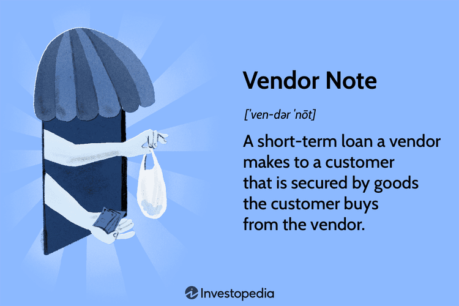

## Table of Contents

## What is a vendor note?

A vendor note is a type of financing where a seller provides a loan to the buyer to help them purchase the seller's product or service. It's like when you buy something but can't pay all at once, so the seller lets you pay over time. This is common in business-to-business deals where the buyer needs time to pay.

Vendor notes are useful because they help buyers who might not have enough money right away. They can buy what they need and pay later. For sellers, offering a vendor note can attract more customers and help close deals faster. But, it's important for both the buyer and seller to agree on the terms, like how much to pay each month and for how long.

## How does a vendor note differ from other types of financing?

A vendor note is different from other types of financing because it comes directly from the seller, not from a bank or another financial institution. When you use a vendor note, you're borrowing money from the person or company selling you the product or service. This can be easier to get than a bank loan because the seller might be more flexible with the terms and might not check your credit as строго as a bank would.

Other types of financing, like bank loans or credit cards, usually come from big financial institutions. These often have stricter rules about who can borrow money and how much interest you have to pay. With a bank loan, you might need good credit and a lot of paperwork. Credit cards let you borrow money easily, but they can have high interest rates. A vendor note can be a simpler and sometimes cheaper way to finance a purchase, especially if the seller is willing to work with you on the payment plan.

## What are the key components of a vendor note?

A vendor note has several important parts that both the buyer and the seller need to agree on. The first part is the amount of money being loaned. This is how much the buyer needs to pay back to the seller. The second part is the [interest rate](/wiki/interest-rate-trading-strategies), which is extra money the buyer has to pay for borrowing. The third part is the repayment schedule, which tells the buyer when and how much to pay each time. 

The fourth part is the term of the note, which is how long the buyer has to pay back all the money. The fifth part is any security or collateral, which is something valuable the buyer might have to give to the seller if they can't pay back the loan. The last part is the default terms, which explain what happens if the buyer misses payments or can't pay back the loan. All these parts need to be clear so both the buyer and the seller know what to expect.

## Who typically uses vendor notes?

Vendor notes are often used by businesses when they buy things from other businesses. For example, a small company might need new equipment but doesn't have enough money to pay for it all at once. The seller of the equipment might offer a vendor note, letting the small company pay over time. This helps the small company get what it needs without having to wait until they have all the money.

Sometimes, vendor notes are also used in bigger deals, like when one company buys another. The seller might agree to a vendor note to make the deal easier for the buyer. This can help the buyer complete the purchase without needing to borrow money from a bank. Both small and big businesses can find vendor notes helpful because they offer a flexible way to finance purchases.

## What are the benefits of using a vendor note for buyers?

Using a vendor note can be really helpful for buyers. It lets them buy things they need even if they don't have all the money right away. For example, a small business might need new machines to grow but can't afford to pay for them all at once. With a vendor note, the seller lets them pay over time. This means the business can start using the machines right away and pay later, which can help them make more money faster.

Another big benefit is that vendor notes can be easier to get than bank loans. Banks often have strict rules and might say no if the buyer's credit isn't good enough. But with a vendor note, the seller might be more willing to work with the buyer. They might not check credit as closely and could offer better terms, like lower interest rates or longer time to pay. This makes it easier for the buyer to get what they need without jumping through a lot of hoops.

## What advantages do sellers gain from offering a vendor note?

Sellers can attract more buyers by offering a vendor note. When buyers can't pay all at once, a vendor note lets them buy things they need and pay over time. This means more people can afford to buy from the seller, which can help sell more products or services. It's like giving buyers a way to pay that fits their budget better, so they're more likely to choose the seller's product.

Another advantage for sellers is that they can close deals faster. Sometimes, buyers need time to arrange financing from a bank, which can delay the sale. By offering a vendor note, the seller can speed up the process because the buyer doesn't have to wait for a bank loan. This can be really helpful, especially if the seller needs to sell something quickly. Plus, the seller might earn interest on the money they lend, which can add to their income.

## What are the potential risks and drawbacks of vendor notes for buyers?

Using a vendor note can be risky for buyers because they might end up paying more over time. The interest rate on the note adds extra cost to the total amount they need to pay. If the interest rate is high, it can make the purchase much more expensive than paying upfront. Also, if the buyer can't keep up with the payments, they might lose any collateral they put up, like equipment or other valuable things. This can hurt their business if they need those items to keep working.

Another drawback is that vendor notes might have strict terms. If a buyer misses a payment or pays late, the seller might have the right to demand the full amount right away or take back the product. This can put a lot of pressure on the buyer, especially if their business is not doing well. Plus, if the buyer relies too much on vendor notes, they might find it hard to get other types of financing later because it can affect their credit if they struggle to make payments.

## What challenges might sellers face when providing a vendor note?

Sellers who offer a vendor note might have trouble getting their money back if the buyer can't pay. If the buyer's business isn't doing well, they might miss payments or stop paying altogether. This means the seller might not get all the money they are owed. The seller might have to take back the product they sold, but if it's been used or damaged, it might not be worth as much as before. This can be a big problem if the seller was counting on that money to run their own business.

Another challenge for sellers is the risk of lending money. If the buyer can't pay back the loan, the seller might lose money. This can be especially hard if the seller doesn't have a lot of cash to spare. Also, managing a vendor note takes time and effort. The seller has to keep track of payments, deal with late payments, and maybe even go to court if things go really wrong. All of this can take away from the time the seller could be spending on other parts of their business.

## How is the interest rate determined on a vendor note?

The interest rate on a vendor note is usually set by the seller. They might look at what banks are charging for loans and decide to offer a rate that's a bit lower to make it more attractive for the buyer. The seller might also think about how much risk they're taking by lending the money. If they think the buyer might have trouble paying back, they might set a higher interest rate to cover that risk.

Sometimes, the interest rate can be negotiated between the buyer and the seller. If the buyer has a good credit history or a strong business, they might be able to ask for a lower rate. The seller might agree if they really want to make the sale. But if the buyer doesn't have much to offer, the seller might stick to a higher rate to protect themselves.

## What are the common terms and conditions included in a vendor note agreement?

A vendor note agreement usually includes the total amount of money the buyer needs to pay back. This is the price of the product or service plus any interest. The agreement also sets the interest rate, which is the extra cost for borrowing the money. It will say how often the buyer needs to make payments, like monthly or yearly, and how much each payment should be. The agreement will also have a term, which is how long the buyer has to pay everything back. If the buyer can't pay, they might have to give the seller something valuable as collateral, like equipment or property.

Another important part of the agreement is what happens if the buyer misses a payment or can't pay back the loan. This is called the default terms. If the buyer doesn't pay on time, the seller might be able to take back the product they sold or ask for the full amount right away. The agreement might also say that the buyer has to pay extra fees or penalties for late payments. Both the buyer and the seller need to understand and agree to all these terms before signing the agreement, so they know what to expect and can avoid problems later.

## How can a vendor note be structured to benefit both the buyer and the seller?

A vendor note can be structured to benefit both the buyer and the seller by setting clear and fair terms. For the buyer, the seller can offer a lower interest rate than what banks might charge, making it easier for the buyer to afford the payments. The seller can also give the buyer a longer time to pay back the loan, which helps the buyer manage their cash flow better. If the buyer's business is doing well, they can use the product or service right away and start making money from it, which helps them pay back the loan more easily. The seller can also be flexible with late payments or offer a grace period, which can reduce stress for the buyer.

For the seller, structuring the vendor note with a reasonable interest rate can provide extra income over time. The seller can also ask for collateral, like equipment or property, to make sure they get their money back if the buyer can't pay. By setting a clear repayment schedule, the seller knows when to expect payments, which helps them plan their own finances. If the seller trusts the buyer's business, they might offer better terms to close the deal faster, which can be good for both sides. This way, the seller can sell their product or service quickly and the buyer can start using it right away, creating a win-win situation.

## What legal and financial considerations should be taken into account when setting up a vendor note?

When setting up a vendor note, both the buyer and the seller need to think about legal and financial things. Legally, they should have a written agreement that spells out all the terms, like how much money is being loaned, the interest rate, when payments are due, and what happens if the buyer can't pay. This agreement should be clear so both sides know what to expect. They might also need to check local laws to make sure the vendor note follows all the rules. It's a good idea to get a lawyer to look over the agreement to make sure everything is legal and fair.

Financially, the seller needs to think about if they can afford to wait for their money. If the buyer can't pay back the loan, the seller might lose money, so they should think about how much risk they're willing to take. The seller might want to ask for collateral, like equipment or property, to protect themselves. The buyer should think about if they can really afford the payments, including the interest. They should make sure the payments fit their budget and won't cause problems for their business. Both sides should talk openly about their financial situation to make sure the vendor note works for everyone.

## What are the legal considerations and protections?

Legal frameworks play a crucial role in the enforceability and management of vendor notes. A vendor note, functioning as a promissory note, is a legal instrument that binds the buyer to repay the seller under a set of agreed terms. To ensure that these notes are enforceable, they must comply with the relevant legal requirements and frameworks established by financial regulations. The Uniform Commercial Code (UCC), applied in the United States, serves as one of the primary legal structures governing secured transactions, including vendor notes.

Including comprehensive default clauses in vendor notes is essential to mitigate risks that arise from the buyer’s potential failure to meet payment obligations. These clauses should clearly delineate the circumstances under which a default is declared, the remedies available to the seller, and any grace periods or opportunities for the buyer to rectify the default. A robust default provision typically includes acceleration clauses, which allow the seller to demand the full repayment of the outstanding balance upon default. This could be mathematically represented as:

$$
\text{Accelerated Payment} = P_t + \sum_{i=t+1}^{n} P_i
$$

where $P_t$ is the payment due at the time of default, $P_i$ are the subsequent payments, and $n$ represents the total number of remaining payments.

Regular legal reviews are another critical component for maintaining the validity and enforceability of vendor notes. These reviews ensure that the terms comply with evolving legal standards and that the note remains legally binding over the duration of its term. Legal reviews can identify changes in regulatory requirements and potential ambiguities in the contract language that may be exploited or lead to disputes.

Enforceability is also heavily influenced by the inclusion of security or collateral in the agreement. By securing a vendor note with collateral, the seller gains an added layer of protection, reducing the risk of significant loss in the event of a default. The collateral arrangement should be thoroughly documented and align with legal standards for asset repossession and recovery.

In conclusion, the enforceability and protection of vendor notes heavily rely on clear legal frameworks, detailed default clauses, and consistent legal oversight. These measures are integral to safeguarding the interests of both parties and facilitating the successful execution of transactions involving vendor notes.

## References & Further Reading

[1]: Remer, C. R. (2011). "Seller Financing: Using Installment Sales to Improve Liquidity." Real Estate Issues, 36(3). 

[2]: Ullrich, C. (2016). ["Algorithmic Trading and Financial Frauds"](https://pubmed.ncbi.nlm.nih.gov/39583740/). Springer Series in Finance.

[3]: Choudhry, M. (2019). ["The Mechanics of Securitization: A Practical Guide to Structuring and Closing Asset-Backed Security Transactions"](https://books.google.com/books/about/The_Mechanics_of_Securitization.html?id=EAVuCDZNyYYC). Wiley, 2nd edition.

[4]: Twomey, M., & Ludlow, R. (2010). ["Business Acquisitions: A Comprehensive Guide to Financial Evaluation"](https://www.amazon.com/D-P-Twomeys-M-M-Jennings-Business/dp/B0043A8NHK). Palgrave Macmillan UK.

[5]: Lopez de Prado, M. (2018). ["Advances in Financial Machine Learning"](https://www.amazon.com/Advances-Financial-Machine-Learning-Marcos/dp/1119482089). Wiley.