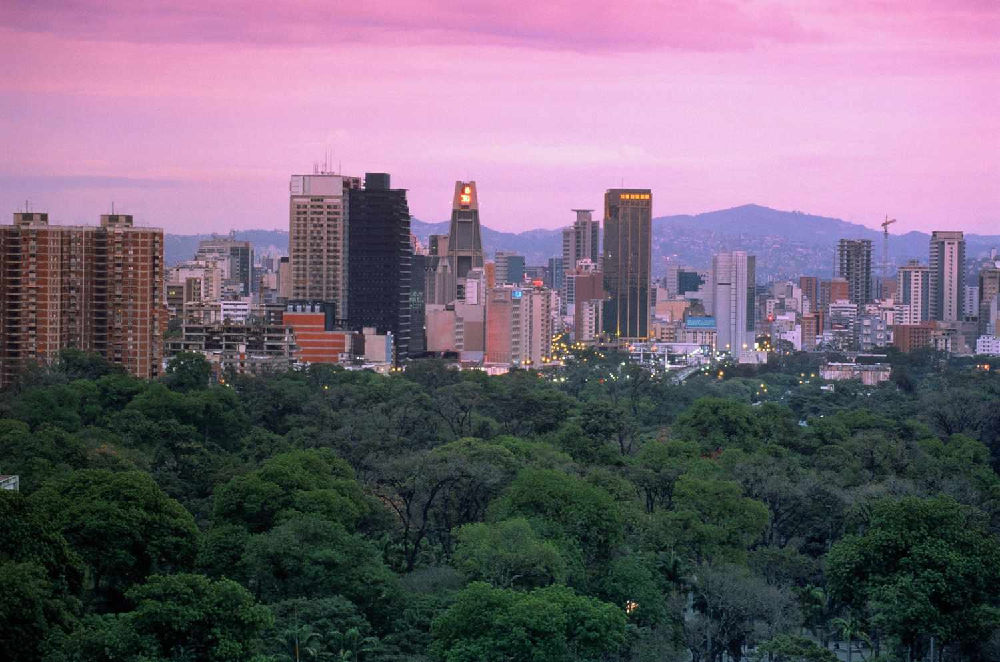

The Venezuelan Bolivar has undergone substantial transformations since its inception, a reflection of the broader economic and political volatility that has characterized Venezuela over the decades. Originally instituted in 1879, the Bolivar was once considered one of Latin America's most stable currencies. Its initial stability was largely due to its peg to both the silver and gold standards and later to the U.S. dollar. However, the narrative of the Venezuelan Bolivar is not one of prolonged stability but rather a tumultuous journey punctuated by episodes of dramatic devaluation and hyperinflation.

The devaluation of the Bolivar is intimately connected with several key factors. Economic mismanagement, rampant corruption, and an over-reliance on oil exports have significantly eroded the currency's value. The infamous Black Friday of 1983 marked the beginning of a downward spiral that saw the Bolivar suffer successive depreciations. In recent times, the introduction of the Bolivar Fuerte in 2008 and the Bolivar Soberano in 2018 were attempts to stabilize the currency but ultimately proved ineffective in the face of Venezuela's hyperinflation crisis.



Algorithmic trading has emerged as a crucial mechanism in navigating the complexities posed by such volatile economic conditions. Amidst the rapid fluctuations in currency value, algorithmic trading offers the ability to quickly respond to price changes and execute trades with precision. This article examines how this technology plays a role in addressing the challenges faced by the Venezuelan Bolivar, drawing from the historical trajectory of the currency to provide insight into potential future economic strategies.

By exploring the timeline of the Venezuelan Bolivar, this article aims to underscore the importance of understanding its historical context. This overview sets the stage for assessing current economic conditions and contemplating future strategies that could aid in stabilizing the Bolivar. Through comprehensive analysis, it becomes apparent that the lessons gleaned from the currency's past are pivotal in crafting informed and effective economic policies moving forward.

## Table of Contents

## Historical Background of the Venezuelan Bolivar

The Venezuelan Bolivar, which originated in 1879, initially established a reputation for stability in Latin America due to its peg to the silver and gold standards. This peg facilitated a robust monetary framework that supported Venezuela's economy for several decades. The transition from this dual-metal standard to a peg against the US dollar further reinforced the Bolivar's stability during a period when international trade and global financial systems increasingly leaned towards the dollar.

However, in the latter half of the 20th century, Venezuela became heavily reliant on oil exports as its principal economic driver. This dependency exposed the nation to vulnerabilities linked to fluctuations in global oil prices. By the 1980s, severe economic difficulties emerged, culminating in the notorious event known as Black Friday in 1983. On this day, Venezuela's government devalued the Bolivar by more than 50% against the US dollar, marking the beginning of a downward spiral for the currency. The devaluation resulted from diminishing foreign reserves and an unsustainable exchange rate policy designed to defend the Bolivar's value amid plummeting oil revenues.

The Bolivar's decline continued into the new millennium. In an effort to consolidate the currency and reestablish confidence, the Venezuelan government introduced the Bolivar Fuerte (VEF) in 2008. The reform involved systematically cutting three zeros from the currency and implementing a new monetary code. Despite these measures, the Bolivar Fuerte failed to arrest inflationary pressures and economic instability. Hyperinflation persisted, primarily driven by economic mismanagement and external shocks such as oil price [volatility](/wiki/volatility-trading-strategies).

The introduction of the Bolivar Fuerte aimed to curb the rampant inflation that had eroded the purchasing power of Venezuelans. Yet, chronic fiscal deficits, controls on prices and exchange rates, and unrelenting inflation pressure undermined these efforts. The strategy to stabilize the currency did not yield the intended outcomes and further highlighted the challenges facing Venezuela's fiscal policy and economic management.

## The Financial Collapse and Hyperinflation

By the 2010s, Venezuela witnessed one of the most severe cases of hyperinflation in modern history, characterized by an exponential increase in prices and a corresponding decrease in the purchasing power of the Venezuelan Bolivar. The initial response to the escalating inflation was the redenomination of the currency, resulting in the introduction of the Bolivar Soberano (VES) in 2018. This move involved cutting five zeros from the previous currency, the Bolivar Fuerte, in an effort to simplify monetary transactions and restore public confidence in the currency [1]. However, this measure failed to address the underlying economic issues, and inflation continued unabated.

The root causes of hyperinflation can be traced back to a combination of economic mismanagement, widespread corruption, and external shocks such as the decline in global oil prices. The Venezuelan government, heavily reliant on oil revenues, found its fiscal position severely weakened as prices plummeted from over $100 per barrel in 2014 to less than $30 per barrel in 2016. This fiscal strain led to an increased dependence on monetary financing of the budget deficit—effectively printing money—to cover governmental expenses [2].

Moreover, the lack of transparency and accountability in public finances exacerbated the problem. Corruption diverted substantial resources away from productive investments and essential services, eroding institutional trust and economic stability. Attempts to control the bolivar's value by pegging it to a fixed exchange rate failed due to the persistent discrepancy between the official and black-market rates. As a consequence, the bolivar depreciated rapidly, fueling further inflation as import costs soared and local production dwindled.

The cumulative impact of these factors created a vicious cycle of hyperinflation, whereby prices for goods and services saw exponential increases on a daily basis. The International Monetary Fund estimated that inflation in Venezuela reached an astronomical rate of 1,000,000% in 2018 [3]. Such levels of inflation rendered the bolivar almost worthless, leading to a widespread adoption of the US dollar and cryptocurrencies for everyday transactions.

Efforts to curb hyperinflation included tighter fiscal policies and attempts to boost oil production. Nevertheless, the lack of comprehensive structural reforms and continued political instability have hindered effective resolution of the currency crisis. As of the latest data, the bolivar remains in a precarious state, with ongoing hyperinflation and a populace increasingly reliant on alternative currencies to preserve their wealth.

[1] Central Bank of Venezuela. Official Documents on Currency Redenomination. Retrieved from [Central Bank of Venezuela](https://www.bcv.org.ve/).

[2] International Monetary Fund. (2018). World Economic Outlook.

[3] Weisbrot, M., et al. "Economic Experts Forecast for Venezuela in Hyperinflation Context", Center for Economic and Policy Research (2018).

## Impact of Economic Policies on the Bolivar

The economic policies implemented in Venezuela over recent decades have had profound impacts on the value and stability of the Venezuelan Bolivar. Among these, currency controls and state interventions have played a significant role in exacerbating economic challenges, particularly through the promotion of a thriving black market for US dollars. This has, in turn, severely undermined the official exchange rates set by the Venezuelan government.

In an effort to maintain control over the economy and protect the local currency, the government imposed strict capital controls which limited the amount of foreign currency that citizens and businesses could legally access and transfer abroad. These measures were intended to prevent capital flight and stabilize the Bolivar. However, these controls instead led to the burgeoning of a black market where the US dollar traded at rates significantly divergent from official values. The disparity between the black market and official exchange rates eroded public confidence in the Bolivar, encouraging further reliance on black market transactions and accelerating the currency's devaluation. The forced pegging of the Bolivar to the US dollar was another critical policy decision that further diminished confidence. By fixing the exchange rate, the government sought to stabilize the Bolivar, but this measure often resulted in a misalignment with the market's natural valuation of the currency. The fixed rate was frequently unsustainable, demanding constant government intervention and adjustment, which further strained the country's foreign reserves.

One of the more controversial responses to the currency instability was the launch of the Petro, a state-backed [cryptocurrency](/wiki/cryptocurrency) introduced in 2018. The Petro was presented as an innovative solution to bypass international sanctions and access foreign investments. However, the Petro faced significant skepticism both domestically and internationally. Critics questioned its legitimacy and transparency, given that its backing was intended to be based on the country's vast oil reserves, which were themselves subject to declining production and mismanagement issues. The Petro did not achieve widespread acceptance or trust, and its effectiveness in stabilizing the Bolivar was minimal.

In conclusion, the economic policies oriented towards controlling the currency and integrating alternative solutions like the Petro failed to restore confidence in the Bolivar. These measures intensified the currency's depreciation and underscored the need for comprehensive policy reform to address the underlying structural and economic challenges in Venezuela.

## Algorithmic Trading in the Venezuelan Financial Context

Algorithmic trading has emerged as a strategic tool in the Venezuelan financial landscape, characterized by extreme volatility and currency instability. The country's challenging economic conditions have driven developers and financial experts to explore algorithmic solutions, aiming to capitalize on market fluctuations and execute trades with precision. 

In markets like Venezuela, where traditional financial infrastructures are often unreliable, [algorithmic trading](/wiki/algorithmic-trading) offers a distinct advantage through its ability to process vast amounts of data and react rapidly to changing market conditions. Algorithms can analyze patterns, implement strategies, and conduct transactions far more efficiently than human traders, which is particularly beneficial in a volatile environment. By employing advanced statistical models and [machine learning](/wiki/machine-learning) techniques, algorithmic traders can more accurately predict movements in the Bolivar's value, allowing for dynamic adjustment of trading positions.

The erratic valuation of the Venezuelan Bolivar requires trading systems that can adapt quickly to price changes. Algorithmic trading utilizes techniques such as statistical [arbitrage](/wiki/arbitrage), [trend following](/wiki/trend-following), and mean reversion. For instance, an algorithm might be programmed to detect deviations from a mean price and execute trades when the currency hits certain predetermined thresholds. Simple Python code for such a mean reversion strategy could look like this:

```python
class MeanReversionTrading:
    def __init__(self, window_size, buy_threshold, sell_threshold):
        self.window_size = window_size
        self.buy_threshold = buy_threshold
        self.sell_threshold = sell_threshold
        self.prices = []

    def calculate_mean(self):
        return sum(self.prices[-self.window_size:]) / self.window_size if len(self.prices) >= self.window_size else 0

    def update_price(self, new_price):
        self.prices.append(new_price)
        mean_price = self.calculate_mean()

        if new_price < mean_price * (1 - self.buy_threshold):
            return "Buy"
        elif new_price > mean_price * (1 + self.sell_threshold):
            return "Sell"
        else:
            return "Hold"
```

This code defines a basic algorithmic trading strategy centered on mean reversion, an approach suited for volatile currencies like the Bolivar, where prices frequently fluctuate around a historical average. The algorithm trades based on deviations from the mean, aiming to profit from the correction of price anomalies.

However, the application of algorithmic trading in Venezuela is not without its challenges. The inherent instability of the economy, characterized by hyperinflation and currency controls, presents a complex environment in which to operate. The lack of reliable financial data and potential regulatory hurdles can impede the effective implementation of algorithmic strategies. Moreover, the widespread use of the black market for currency exchange complicates the ability to obtain accurate pricing information, affecting the precision of algorithmic predictions.

Despite these obstacles, the potential benefits of algorithmic trading in navigating Venezuela's financial instability are substantial. By providing a mechanism for risk management and efficient trade execution, algorithmic trading can play a crucial role in mitigating the adverse effects of economic volatility. As Venezuelan developers continue to refine these systems, algorithmic trading remains a promising avenue for addressing the challenges posed by an unpredictable economic environment.

## The Present and Future of the Venezuelan Currency

The Venezuelan Bolivar’s persistent volatility remains a significant challenge despite various economic reforms and the introduction of new currencies over the years. The currency's instability is evident in its rapid depreciation against foreign currencies and the widespread adoption of alternative monetary units among the Venezuelan populace.

Many Venezuelans have turned to foreign currencies, such as the US dollar and the euro, as more reliable stores of value and mediums of exchange. This shift has been fueled by the relatively steady purchasing power of these currencies compared to the Bolivar. Moreover, the emergence of cryptocurrencies as transactional commodities in the Venezuelan market underscores a collective search for stability. Cryptocurrencies like Bitcoin and Dash are being utilized for routine transactions, thanks to their ability to circumvent governmental controls and restrictions.

Looking at the future prospects for the Venezuelan Bolivar, several potential paths could be considered for stabilizing the currency. Structural reforms that address the root causes of economic mismanagement and foster a transparent, accountable governance framework are essential. Additionally, re-establishing trust in the national currency may require pegging it to a stable basket of foreign currencies or commodities, anchoring it against volatile devaluation.

Another viable direction involves the expanded use of digital currencies, possibly through blockchain-based financial systems. Central Bank Digital Currencies (CBDCs) could serve as a bridge towards monetary stability by integrating technological advancements with state control to ensure transparency and security. Such transitions would require careful implementation of policies that can adapt to technological, economic, and political changes.

In conclusion, while the present landscape portrays a grim reality for the Bolivar, a combination of prudent reforms and modern technological tools could pave the way for its stabilization and renewed confidence among Venezuelans. Comprehensive policy measures and a strategic embrace of the digital future will be integral to this journey.

## Conclusion

The Venezuelan Bolivar's tumultuous history highlights the complexities of managing an economy rich in natural resources yet mired in political instability. This dynamic has led to profound currency devaluation and persistent hyperinflation, significantly impacting the lives of Venezuelan citizens. The country's economic turbulence underscores the challenges faced by policymakers attempting to stabilize an unstable currency while navigating corrupt governance and fluctuating global oil prices.

In this volatile financial environment, algorithmic trading emerges as an instrumental tool for mitigating risk. By harnessing advanced algorithms, traders can execute swift and efficient transactions, thus potentially shielding their investments from rapid currency fluctuations. Algorithmic trading can process vast amounts of data and adapt to sudden market changes, offering a strategic advantage in such unpredictable conditions.

The future stabilization of the Venezuelan Bolivar and broader economic recovery will require comprehensive policy reforms. These reforms must address structural economic issues, mitigate corruption, and foster transparent and reliable governance practices. Moreover, re-establishing international confidence will be crucial to attract foreign investment and facilitate economic recovery. This can include pursuing international partnerships and leveraging digital currencies to complement economic processes and stabilize the currency further. As Venezuela navigates these complex challenges, the Bolivar's path ahead remains contingent on decisive and effective economic policy interventions.

## References & Further Reading

[1]: Hausmann, R., & Rodríguez, F. (2014). "Venezuela Before Chávez: Anatomy of an Economic Collapse." Penn State University Press.

[2]: Corrales, J., & Penfold-Becerra, M. (2011). "Dragon in the Tropics: Hugo Chávez and the Political Economy of Revolution in Venezuela." Brookings Institution Press.

[3]: International Monetary Fund. (2018). ["World Economic Outlook."](https://www.imf.org/en/Publications/WEO/Issues/2018/09/24/world-economic-outlook-october-2018)

[4]: Weisbrot, M., & Sachs, J. (2019). ["Economic Sanctions as Collective Punishment: The Case of Venezuela."](https://cepr.net/images/stories/reports/venezuela-sanctions-2019-04.pdf) Center for Economic and Policy Research.

[5]: Central Bank of Venezuela. ["Official Documents on Currency Redenomination."](https://platform.keesingtechnologies.com/the-redenomination-of-venezuelas-banknotes-2008-2024/)

[6]: López, A., & Panizza, U. (2016). “Economic Growth and Exchange Rate Regimes in Latin America.” Journal of Applied Economics, 19(1). 

[7]: Friedman, M. (1953). "Essays in Positive Economics." University of Chicago Press.

[8]: Naim, M. (1993). "The Rebirth of Latin American Christianity." University of Notre Dame Press.