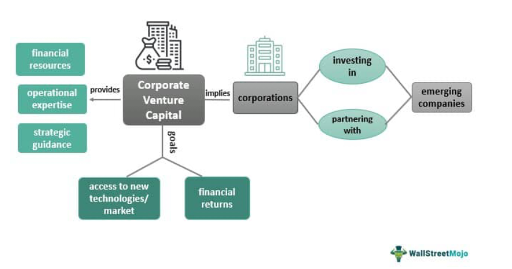

Venture Capital Trusts (VCTs) are an essential concept for investors aiming to support and benefit from the growth of high-potential small businesses. Established in the UK, VCTs offer a distinctive opportunity for individuals to invest in burgeoning small and medium enterprises (SMEs) by pooling their resources into a managed fund. This collective investment model not only aids the expansion of promising companies but also provides investors with several tax incentives designed to boost participation in these ventures.

The UK government introduced VCTs to stimulate innovation and growth in the SME sector. By channeling investment into these enterprises, VCTs facilitate economic dynamism and job creation. Investors benefit from the structured approach of VCTs, which typically involve professional management teams that identify and nurture promising businesses across various industries.



This article provides an overview of Venture Capital Trusts, discussing the basic structure, function, and types of VCTs available to investors. It will also examine the interplay between VCTs and algorithmic trading — a sophisticated strategy that can enhance investment decisions through automated processes based on quantitative data analysis. Algorithmic trading's precision and efficiency offer potential for optimizing the timing and execution of trades in VCT shares, making it a compelling tool for investors seeking to maximize returns while managing risk. Through this exploration, the article aims to elucidate how VCTs, with their unique benefits and considerations, fit into the broader landscape of investment options.

## Table of Contents

## What is a Venture Capital Trust (VCT)?

A Venture Capital Trust (VCT) is a publicly listed company in the United Kingdom designed to provide capital to small and medium enterprises (SMEs). First introduced by the UK government in 1995, VCTs were established as a mechanism to stimulate economic growth by fostering entrepreneurial activities and innovation within the SME sector. By channeling funds from private investors into smaller, high-potential businesses, VCTs play a critical role in enhancing the economic landscape and supporting job creation.

The primary appeal of VCTs lies in their tax-efficient investment structure, which offers individual investors an opportunity to engage with venture capital investments through the stock market. Notably, VCTs offer several tax incentives aimed at encouraging investment. Investors are eligible for income tax relief at the rate of 30% on the amount invested into new VCT shares, up to a maximum of £200,000 per tax year. Furthermore, investors are exempt from paying capital gains tax on dividends derived from VCT shares. Importantly, these tax benefits are contingent on holding the VCT shares for a minimum period, typically five years.

To qualify as a VCT, a company must be listed on a major UK stock exchange and comply with specific regulatory requirements, which include investing at least 70% of its funds in qualifying SMEs within a prescribed timeframe. This mandate ensures that a substantial portion of each VCT's investment is allocated towards enterprises that can benefit substantially from capital infusions, thus fulfilling the trust’s purpose of stimulating SME growth.

Overall, VCTs are an attractive option for investors seeking a blend of high-risk, potentially high-reward opportunities with the added advantage of tax reliefs. By directing investment into burgeoning businesses, VCTs not only provide individual fiscal benefits but also contribute significantly to broader economic development objectives.

## How Venture Capital Trusts (VCTs) Work

Venture Capital Trusts (VCTs) function as investment vehicles specifically designed to channel funds into small and medium enterprises (SMEs) within the UK. These trusts are publicly listed companies, allowing them to gather funds by issuing shares in the stock market. The central operational mechanism of VCTs compels them to invest at least 70% of the capital raised into qualifying SMEs within three years of the fund being closed. This requirement is essential to drive growth in underfunded sectors by providing needed capital to burgeoning businesses.

Listing on a major UK exchange is a mandatory requirement for VCTs. This ensures transparency for investors, as publicly traded companies are subject to stringent regulatory standards and continuous disclosure obligations. The listing also enhances [liquidity](/wiki/liquidity-risk-premium), making it easier for investors to buy and sell shares of the VCT in the open market.

Investors in VCTs benefit significantly from various tax incentives. Notably, there is the provision for income tax relief on the amount invested, up to a specified limit. As of the current tax provisions, investors can claim relief on investments up to £200,000 per tax year, provided they hold the shares for a minimum specified period, typically five years. Additionally, dividends received from VCT shares are generally exempt from income tax, and any capital gains realized on the sale of VCT shares are also free from capital gains tax, encouraging long-term investment.

Furthermore, VCTs also have constraints on the size and type of company they can invest in to ensure they focus on small, developing businesses. For a company to qualify for VCT investment, it generally must have fewer than 250 full-time employees and assets not exceeding £15 million immediately before the investment. These criteria ensure that the targeted funding goes toward genuinely small and medium enterprises that can benefit from the additional capital provided by VCTs. 

In conclusion, VCTs operate as a structured means to provide vital funding to SMEs, characterized by stringent investment regulations and attractive tax benefits for investors, all while maintaining market transparency and liquidity through public listing requirements.

## Types of Venture Capital Trusts

Venture Capital Trusts (VCTs) offer investors a range of strategies to access small and medium-sized enterprises (SMEs) in various sectors, aligning with different risk profiles and investment goals. Understanding the types of VCTs can help investors make informed decisions.

Generalist VCTs provide a broad-based investment strategy by spreading their capital across multiple sectors and business stages. This diversification reduces specific sector risk and allows investors to benefit from a wide array of industry growth opportunities. By investing in an assortment of companies, these VCTs aim to stabilize returns and mitigate the impact of downturns in any single sector.

Specialist VCTs, in contrast, narrow their focus to particular industries, such as technology, biotechnology, or renewable energy. These trusts appeal to investors with specific market interests and those who are more comfortable with the inherent risks associated with specialized sectors. By concentrating their investments, specialist VCTs can leverage industry expertise, potentially improving their selection of high-performing companies and offering increased returns in thriving sectors.

AIM VCTs direct their investments at companies listed on the Alternative Investment Market (AIM). This market specializes in smaller, high-growth businesses that might not meet the criteria for a main market listing due to their size or nascent stage. AIM VCTs present an opportunity for investors seeking high growth potential paired with an understanding of the increased [volatility](/wiki/volatility-trading-strategies) and risks typical of smaller, less established companies.

Evergreen VCTs adopt a long-term investment approach, managing a constant pool of investments. They reinvest profits back into the trust rather than distributing income immediately to shareholders. This strategy can benefit investors seeking sustained growth over time, as it allows the VCT to compound investments and support a firm's development throughout its lifecycle. Evergreen VCTs are suitable for investors with an extended investment horizon, focused on capital appreciation rather than immediate tax-relief benefits.

Each VCT type offers specific attributes tailored to different investor needs, from broad diversification to focused industry expertise, high growth potential, or long-term capital growth. The choice of VCT depends on individual investment goals, risk tolerance, and sector interest.

## Example of a Venture Capital Trust

The Octopus Titan VCT stands as a prominent example of a successful venture capital trust in the UK, primarily targeting early-stage technology companies. It is among the largest VCTs in the country, demonstrating a strong track record of strategic investments that yield high returns while offering advantageous tax benefits to its investors.

Octopus Titan VCT distinguishes itself by investing in innovative firms poised for significant growth. Notable among these are Zoopla, a leading property portal, and Secret Escapes, a luxury travel deals company. These investments showcase the trust's ability to identify and support businesses with substantial market potential and scalability.

Investing in Octopus Titan VCT provides investors with opportunities to maximize returns through capital appreciation and tax incentives. The structure of VCTs allows individuals to benefit from income tax relief on new investments and exemptions from capital gains tax on profits realized from VCT shares. This dual advantage of potential growth and tax efficiency makes Octopus Titan VCT an attractive option for investors aiming to diversify their portfolio risk while seeking high growth opportunities.

The success of Octopus Titan VCT underscores the broader potential offered by VCTs in fostering small and medium enterprises in the UK. By aligning investor interests with early-stage companies, VCTs like Octopus Titan contribute to economic innovation and development, highlighting the symbiotic relationship between investors and entrepreneurs within the UK's venture capital ecosystem.

## VCTs and Algorithmic Trading

Combining Venture Capital Trusts (VCTs) with [algorithmic trading](/wiki/algorithmic-trading) offers investors a progressive approach to enhancing portfolio performance. Algorithmic trading utilizes computer programs to execute trades at optimal times, based on various factors such as statistical patterns, real-time market data, and complex algorithms. By incorporating algorithmic strategies, investors can potentially optimize buying and selling decisions of VCT shares, benefiting from the systematic and data-driven nature of these trading systems.

### Algorithmic Trading and VCTs

Algorithmic trading can significantly benefit VCT investments by improving trade execution speed, precision, and efficiency. For instance, Python, a popular programming language in algorithmic trading, can be employed to create strategies that analyze historical data of VCT shares, predicting potential price movements and executing trades automatically.

```python
import numpy as np
import pandas as pd
from sklearn.linear_model import LinearRegression

# Example: Simple Linear Regression for Predicting VCT Share Prices
def predict_vct_price(historical_data):
    # historical_data should be a DataFrame with columns: 'Date', 'Price'
    historical_data['DateNum'] = pd.to_numeric(historical_data['Date'].apply(lambda x: x.toordinal()))

    # Define independent (X) and dependent (y) variables
    X = historical_data[['DateNum']]
    y = historical_data['Price']

    # Fit linear regression model
    model = LinearRegression().fit(X, y)

    # Predict the next day's price
    next_date = historical_data['Date'].max() + pd.Timedelta(days=1)
    next_date_num = [[next_date.toordinal()]]
    predicted_price = model.predict(next_date_num)

    return predicted_price

# Sample usage
# historical_data = pd.DataFrame({'Date': pd.date_range(start='2023-01-01', periods=100), 'Price': np.random.rand(100)})
# forecasted_price = predict_vct_price(historical_data)
```

### Considerations in Algorithmic Trading for VCTs

Investors must account for the unique characteristics of VCTs, such as their volatility and the specific market conditions impacting small and medium enterprises. VCTs can be subject to greater volatility due to their focus on early-stage businesses, which may lead to rapid valuation changes. This volatility necessitates robust risk management strategies when integrating VCTs with algorithmic trading.

Moreover, investors should ensure their algorithms incorporate real-world factors such as economic events, regulatory changes, and sector-specific developments affecting VCT holdings. This complexity makes it essential to develop algorithms that are not only reactive to market trends but also adaptable to the dynamic environment of VCT investments.

In conclusion, integrating algorithmic trading with VCT investments can yield enhanced portfolio performance through strategic, data-driven decisions. However, to fully capitalize on this potential, investors must address the intricate nature of VCTs with sophisticated algorithms and comprehensive risk management.

## Conclusion

Venture Capital Trusts (VCTs) are instrumental in fostering the growth of small businesses in the UK by providing crucial capital. These investment vehicles not only enable investors to support high-potential enterprises but also offer attractive tax benefits, aligning financial gain with economic development. Different types of VCTs, such as Generalist, Specialist, AIM, and Evergreen, accommodate varying investor preferences, balancing diversification with sector-specific focus and risk tolerance. This variety allows investors to tailor their portfolios to achieve desired growth and risk levels. 

Integrating VCTs with algorithmic trading introduces a sophisticated dimension to investment strategies, where data-driven decisions can potentially enhance portfolio performance. By employing algorithms to optimize the timing and selection of VCT shares, investors can leverage market trends and movements more efficiently. However, the intrinsic volatility and complexities of VCTs necessitate a careful and well-structured approach when merging them with algorithmic systems. Investors must employ thorough risk management practices to mitigate potential downsides while capitalizing on the unique opportunities that this combination presents.

In summary, VCTs offer a compelling mix of supporting economic growth, achieving tax efficiencies, and providing diverse investment channels. When combined judiciously with algorithmic trading, they hold the potential for enhanced financial returns, presenting investors with an innovative avenue for developing robust investment strategies.

## References & Further Reading

[1]: HM Revenue & Customs. ["Venture Capital Trusts (VCTs): An Introduction"](https://www.gov.uk/government/statistics/venture-capital-trusts-statistics-introductory-note/venture-capital-trusts-introduction-to-national-and-official-statistics). UK Government.

[2]: Law, D., & McGuinness, G. (2008). ["Venture Capital Trusts (VCTs) and Private Equity: A Performance Perspective"](https://www.wealthclub.co.uk/private-equity-performance/). Journal of Corporate Finance, 14(4), 524-541.

[3]: Lopez de Prado, M. (2018). ["Advances in Financial Machine Learning"](https://www.amazon.com/Advances-Financial-Machine-Learning-Marcos/dp/1119482089). Wiley.

[4]: Arnold, L. G. (2012). ["Algorithmic Trading & DMA: An Introduction to Direct Access Trading Strategies"](https://www.amazon.com/Algorithmic-Trading-DMA-introduction-strategies/dp/0956399207). Niche Trading Publications.

[5]: British Private Equity & Venture Capital Association. ["A Guide to Venture Capital Finance"](https://www.bvca.co.uk/Policy/Industry-guidance-standardised-documents/Model-documents-for-early-stage-investments/).

[6]: Turner, M., & Firth, S. (2011). ["Understanding Venture Capital Trusts and their Investment Criteria"](https://octopusinvestments.com/resources/guides/venture-capital-trusts/). Harriman House.