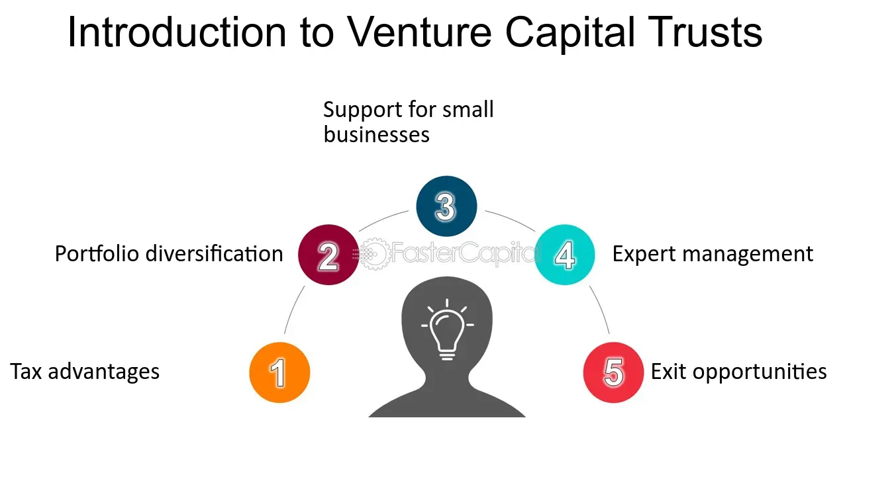

## Table of Contents

## What is a Venture Capital Trust (VCT)?

A Venture Capital Trust (VCT) is a type of investment fund in the UK that helps small, growing companies get the money they need. People invest their money in a VCT, and the VCT uses that money to buy shares in these small companies. This helps the companies grow and, in return, investors might get some tax benefits from the government.

Investing in a VCT can be risky because small companies can fail, but it can also be rewarding. If the companies do well, the value of the VCT's shares can go up, and investors might get dividends, which are like profits shared with them. Plus, the tax benefits can make it more attractive, like getting tax relief on the money you invest and not having to pay tax on the dividends you receive.

## How does a VCT work?

A Venture Capital Trust (VCT) is a way for people to invest their money in small, growing companies. When you put your money into a VCT, the VCT uses it to buy shares in these small businesses. This helps the companies get the money they need to grow. In return, you become a part-owner of the VCT and indirectly of the companies it invests in.

Investing in a VCT can be risky because small companies might not always succeed. But if they do well, the value of the VCT's shares can go up, and you might get dividends, which are like profits shared with you. Plus, the government offers tax benefits to make it more attractive. You can get tax relief on the money you invest, and you don't have to pay tax on the dividends you receive. This makes VCTs a popular choice for people looking to support small businesses while also getting some financial benefits.

## What are the benefits of investing in a VCT?

Investing in a Venture Capital Trust (VCT) can offer you some great benefits. One big advantage is the tax relief you get from the government. When you put money into a VCT, you can get a 30% tax relief on your investment, as long as you keep your money in the VCT for at least five years. This means if you invest £10,000, you can get £3,000 back in tax relief. Plus, any money you make from dividends, which are like profits shared with you, is tax-free. This can make a big difference in how much money you keep at the end of the day.

Another benefit is the chance to help small businesses grow. When you invest in a VCT, your money goes to small companies that need it to expand. If these companies do well, the value of your investment can go up, and you might get dividends. It's a way to support the economy and potentially make money at the same time. But remember, investing in small companies can be risky because they might not always succeed. So, it's important to think about the risks and rewards before you decide to invest.

## What are the risks associated with VCTs?

Investing in a Venture Capital Trust (VCT) can be risky. The biggest risk is that the small companies the VCT invests in might not do well. If a company fails, the value of your investment can go down a lot. Since VCTs focus on small, growing businesses, there's a higher chance that some of them won't succeed. This means you could lose some or all of the money you put in.

Another risk is that VCTs are not easy to sell quickly. If you need your money back, it might take a while to find someone to buy your shares. This is because VCTs are not as popular as other types of investments, so there are fewer people interested in buying them. This lack of a quick market can make it hard to get your money out when you need it.

Lastly, the tax benefits that make VCTs attractive can change. The government might decide to offer less tax relief or change the rules about how much you can invest. If this happens, the financial advantages of investing in a VCT could go down. So, it's important to keep an eye on any changes in tax laws that might affect your investment.

## Who can invest in a VCT?

Anyone can invest in a Venture Capital Trust (VCT) as long as they are over 18 years old and live in the UK. You don't need to be rich or have a lot of money to start. You can invest as little as £500 in some VCTs, but you need to be ready to keep your money in the VCT for at least five years to get the full tax benefits.

But, there are some rules about how much you can invest. You can put in up to £200,000 each tax year into VCTs and still get the tax relief. If you're thinking about investing more than that, you won't get the extra tax benefits on the amount over £200,000. So, it's good to know these limits before you decide to invest.

## What are the tax advantages of investing in a VCT?

Investing in a Venture Capital Trust (VCT) comes with some nice tax benefits. One big advantage is that you can get a 30% tax relief on the money you invest. This means if you put in £10,000, you can get £3,000 back in tax relief. But you need to keep your money in the VCT for at least five years to get this benefit. Also, you can invest up to £200,000 each year and still get this tax relief.

Another tax advantage is that any money you make from dividends, which are like profits shared with you, is tax-free. This can make a big difference because you get to keep all the money you earn from the VCT without paying any tax on it. Just remember, these tax benefits can change, so it's good to keep an eye on any updates from the government.

## How do VCTs differ from other investment vehicles like mutual funds or ETFs?

Venture Capital Trusts (VCTs) are different from mutual funds and ETFs in a few key ways. VCTs focus on investing in small, growing companies that need money to expand. This means they are riskier because small companies can fail more easily than big ones. On the other hand, mutual funds and ETFs usually invest in a wider range of companies, including big, established ones, which can make them less risky. Also, VCTs offer special tax benefits, like a 30% tax relief on your investment and tax-free dividends, which you don't get with mutual funds or ETFs.

Another difference is how easy it is to buy and sell these investments. VCTs are not as popular as mutual funds or ETFs, so it can be harder to find someone to buy your shares if you want to sell them quickly. Mutual funds and ETFs, on the other hand, are traded on stock exchanges, so you can usually buy and sell them more easily. This makes VCTs less liquid, meaning it's harder to turn your investment into cash when you need it. So, while VCTs can offer higher potential rewards and tax benefits, they come with more risk and less flexibility than mutual funds or ETFs.

## What types of companies do VCTs typically invest in?

Venture Capital Trusts (VCTs) usually invest in small, growing companies that are based in the UK. These companies often need money to help them expand their business. VCTs look for companies in different industries, like technology, healthcare, or manufacturing. They want to find businesses that have a good chance of growing and becoming successful.

The companies that VCTs invest in are usually at an early stage of their development. This means they might be new and still trying to figure out how to make their business work well. Because these companies are small and new, they can be riskier than bigger, more established companies. But if they do well, they can grow a lot and make money for the VCT and its investors.

## How are VCTs structured and managed?

A Venture Capital Trust (VCT) is set up as a company that people can invest in. When you put money into a VCT, you buy shares in this company. The VCT then uses your money to buy shares in small, growing businesses. The people who run the VCT, called managers, decide which companies to invest in. They look for businesses that they think will do well and grow. The managers keep an eye on these companies and help them when they can.

The VCT is managed by a team of experts who know a lot about investing in small companies. They make sure the VCT follows the rules set by the government, like only investing in UK companies and keeping the right amount of money in small businesses. The managers also handle things like paying out dividends to investors if the companies do well. They work to make sure the VCT is a good investment for everyone who puts money into it.

## What is the process for investing in a VCT?

To invest in a Venture Capital Trust (VCT), you first need to find a VCT that you like. You can do this by looking at different VCTs and seeing which ones have a good track record and invest in the kinds of companies you believe in. Once you've chosen a VCT, you can buy shares in it. You can usually do this through a financial advisor or directly from the VCT's website. You'll need to fill out some forms and send in your money. The minimum amount you can invest is often around £500, but you can invest up to £200,000 each year to get the tax benefits.

After you've invested, you need to keep your money in the VCT for at least five years to get the full 30% tax relief. This means if you invest £10,000, you can get £3,000 back in tax relief. During this time, the VCT will use your money to invest in small, growing companies. If these companies do well, the value of your investment can go up, and you might get dividends, which are like profits shared with you. Remember, investing in a VCT can be risky because small companies might not always succeed, but the tax benefits and the chance to help small businesses grow can make it a good choice for some people.

## How can one evaluate the performance of a VCT?

To evaluate the performance of a Venture Capital Trust (VCT), you need to look at a few things. First, check the net asset value (NAV) of the VCT. This tells you how much the VCT's investments are worth. If the NAV is going up, it means the companies the VCT invested in are doing well. You can also look at the dividends the VCT pays out. If the VCT is giving you more dividends over time, it's a good sign that the companies are making money.

Another way to evaluate a VCT is by looking at its track record. See how well it has done in the past. Has it made money for its investors? Have the companies it invested in grown and succeeded? You can also compare the VCT's performance to other VCTs or to the overall market. This can help you see if the VCT is doing better or worse than others. Remember, past performance doesn't guarantee future results, but it can give you a good idea of how well the VCT is managed.

## What are the regulatory requirements and compliance issues for VCTs?

Venture Capital Trusts (VCTs) have to follow strict rules set by the government to make sure they are doing things the right way. They need to invest at least 70% of their money in small, growing companies that are based in the UK. These companies should have less than £15 million in gross assets before the investment and less than £16 million after. VCTs also need to make sure that the companies they invest in are not controlled by another company and that they are not older than seven years when the VCT first invests in them. This helps make sure that VCTs are helping new and small businesses grow.

VCTs also have to follow rules about how they report their activities and how they treat their investors. They need to send regular reports to the government and to their investors, showing how their money is being used and how well the companies they invested in are doing. VCTs must also make sure they are treating all their investors fairly and not giving special treatment to some over others. If a VCT does not follow these rules, it could lose its special tax benefits, which would make it less attractive to investors. So, it's really important for VCTs to stay compliant with all these regulations.

## References & Further Reading

[1]: HM Revenue & Customs. ["Venture Capital Trusts (VCTs): An Introduction"](https://www.gov.uk/government/statistics/venture-capital-trusts-statistics-introductory-note/venture-capital-trusts-introduction-to-national-and-official-statistics). UK Government.

[2]: Law, D., & McGuinness, G. (2008). ["Venture Capital Trusts (VCTs) and Private Equity: A Performance Perspective"](https://www.wealthclub.co.uk/private-equity-performance/). Journal of Corporate Finance, 14(4), 524-541.

[3]: Lopez de Prado, M. (2018). ["Advances in Financial Machine Learning"](https://www.amazon.com/Advances-Financial-Machine-Learning-Marcos/dp/1119482089). Wiley.

[4]: Arnold, L. G. (2012). ["Algorithmic Trading & DMA: An Introduction to Direct Access Trading Strategies"](https://www.amazon.com/Algorithmic-Trading-DMA-introduction-strategies/dp/0956399207). Niche Trading Publications.

[5]: British Private Equity & Venture Capital Association. ["A Guide to Venture Capital Finance"](https://www.bvca.co.uk/Policy/Industry-guidance-standardised-documents/Model-documents-for-early-stage-investments/).

[6]: Turner, M., & Firth, S. (2011). ["Understanding Venture Capital Trusts and their Investment Criteria"](https://octopusinvestments.com/resources/guides/venture-capital-trusts/). Harriman House.