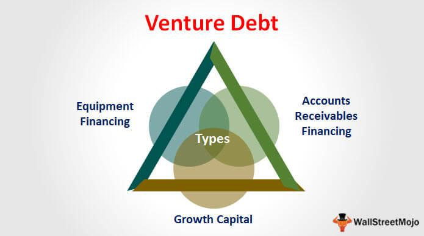

## Table of Contents

## What is venture debt financing?

Venture debt financing is a type of loan that startup companies can get. It's different from regular loans because it's designed for businesses that are growing fast but might not have a lot of money yet. Venture debt is often used by startups that have already raised some money from investors, called venture capital. The loan helps these startups keep growing without giving away more ownership to investors.

This kind of financing is helpful because it lets startups get money they need without losing more control of their company. Instead of giving up equity, they pay back the loan over time, usually with interest. Venture debt can be used for things like buying equipment, hiring more staff, or expanding the business. It's a way for startups to keep moving forward while keeping more of their company for themselves.

## How does venture debt differ from traditional debt?

Venture debt is different from traditional debt in a few key ways. First, venture debt is made for startups that are growing fast but might not have a lot of money yet. Traditional debt, like a bank loan, usually needs the business to show it can pay back the loan with steady income or assets. But venture debt doesn't need this because it's based on the startup's potential to grow big and the support from their venture capital investors.

Second, venture debt often comes with different terms. Traditional debt might have a fixed interest rate and regular payments. Venture debt can have interest-only payments for a while, and sometimes it includes warrants, which are like options to buy part of the company later. This means the lender can share in the startup's success if it does well. So, venture debt is more flexible and tailored to help startups grow without giving away too much ownership right away.

## What are the typical terms and conditions of venture debt?

Venture debt usually comes with a few key terms and conditions that startups need to know. The loan often has an interest rate that's higher than traditional loans because it's riskier for the lender. Startups might only have to pay the interest for a while, which is called an interest-only period. This can last from 6 to 12 months, giving the startup time to use the money to grow before they have to start paying back the principal. The total loan term can be from 3 to 5 years.

Another important part of venture debt is that lenders often get warrants. These are like options that let the lender buy a small part of the company later at a set price. This gives the lender a chance to share in the startup's success if it does well. Also, venture debt might come with covenants, which are rules the startup has to follow, like keeping a certain amount of cash on hand or hitting certain business goals. If the startup doesn't follow these rules, the lender can ask for the loan to be paid back early.

## Who are the main providers of venture debt?

The main providers of venture debt are specialized financial institutions and banks that focus on lending to startups. These include companies like Silicon Valley Bank, which is very well-known for providing venture debt. Other big names are Western Technology Investment (WTI) and Hercules Capital. These firms understand the unique needs of growing startups and offer loans that are more flexible than traditional bank loans.

Sometimes, big banks like Bank of America and Wells Fargo also offer venture debt, but they usually work with more established startups. They might need the startup to have more proven success before they lend money. There are also smaller, regional banks and non-bank lenders that provide venture debt, especially in places with lots of startup activity. These lenders might be more willing to work with newer startups that are still growing.

## What types of companies are best suited for venture debt financing?

Companies that are best suited for venture debt financing are usually startups that have already raised some money from venture capital investors. These startups are often in the growth stage, meaning they have a product or service that's working and they're looking to expand quickly. They might need money to buy equipment, hire more people, or reach more customers, but they don't want to give away more ownership of their company to new investors. Venture debt helps them get the money they need without losing control.

These companies should also have a clear path to making more money in the future. They don't need to be profitable yet, but they should show that they can grow and eventually pay back the loan. Venture debt is a good fit for startups that have solid backing from their existing investors and a strong plan for growth. It's a way for them to keep moving forward while keeping more of their company for themselves.

## What are the advantages of using venture debt for startups?

Venture debt helps startups get the money they need without giving away more of their company to investors. This means they can keep more control over their business. Instead of selling more shares, they take a loan and pay it back over time with interest. This is good for startups that already have some money from investors but need more to grow fast. They can use the loan to buy equipment, hire more people, or reach more customers without losing more ownership.

Another big advantage is that venture debt gives startups time to grow before they have to start paying back the full loan. They might only have to pay the interest for the first year or so. This lets them use the money to make their business bigger and better before they have to worry about paying back the principal. It's like getting a little extra time to make sure their growth plan works out. This can be a big help for startups that are on the edge of really taking off.

## What are the potential risks and drawbacks of venture debt?

Venture debt can be risky for startups because they have to pay it back no matter what happens. If the startup doesn't grow as fast as they hoped, they might not make enough money to pay back the loan. This can lead to big problems, like not being able to pay their bills or even going out of business. Also, venture debt often has high interest rates because it's riskier for the lender. This means the startup has to pay back more money over time, which can be hard if they're not making a lot of money yet.

Another drawback is that venture debt can come with strict rules, called covenants. These rules might say the startup has to keep a certain amount of money in the bank or hit certain business goals. If they don't follow these rules, the lender can ask for the loan to be paid back right away. This can put a lot of pressure on the startup and make it hard for them to focus on growing their business. So, while venture debt can help startups grow without giving away more ownership, it also comes with risks that they need to be careful about.

## How is the interest rate determined in venture debt agreements?

The interest rate in venture debt agreements is based on how risky the lender thinks the loan is. Startups are seen as riskier than big, established companies, so the interest rate for venture debt is usually higher. The lender looks at things like how much money the startup has already raised, how fast they're growing, and how likely they are to succeed. If the startup seems very risky, the interest rate will be higher to make up for that risk.

Sometimes, the interest rate can also be affected by the overall economy and how much money is available for lending. If there's a lot of money to lend and not many startups wanting loans, the interest rate might be lower. But if money is tight and lots of startups are looking for loans, the interest rate could go up. Lenders also think about what other lenders are offering to make sure their rates are competitive but still cover the risk they're taking on.

## What are the key covenants and milestones that startups need to meet in venture debt?

Startups taking venture debt often have to follow certain rules called covenants. These rules are there to make sure the startup stays on track and can pay back the loan. One common covenant is a financial one, like keeping a certain amount of cash in the bank. This is called a minimum cash covenant. Another rule might be that the startup has to hit certain business goals, like making a certain amount of money or getting to a certain number of customers. If the startup doesn't follow these rules, the lender can ask for the loan to be paid back early, which can be a big problem.

Milestones are also important in venture debt. These are specific goals that the startup needs to reach to show they're growing and doing well. For example, a milestone could be launching a new product, getting more funding from investors, or reaching a certain level of sales. Meeting these milestones helps the lender feel more confident that the startup will be able to pay back the loan. If the startup doesn't hit these milestones, it might be harder for them to get more money or they might have to pay back the loan sooner than planned.

## How does the process of securing venture debt work from start to finish?

Securing venture debt starts with a startup looking for money to grow without giving away more of their company. They usually talk to lenders who specialize in venture debt, like Silicon Valley Bank or Hercules Capital. The startup needs to show the lender their business plan, how much money they've already raised from investors, and how they plan to use the loan to grow. The lender will look at all this information to see if the startup is a good risk. They'll also check if the startup has hit certain milestones, like making a certain amount of money or getting more funding.

If the lender likes what they see, they'll offer the startup a loan with certain terms. These terms include the interest rate, how long the startup has to pay back the loan, and any rules they have to follow, called covenants. The startup might only have to pay the interest for the first year or so, which gives them time to grow before they have to start paying back the principal. Once the startup agrees to these terms, they get the money and can start using it to grow their business. They'll need to keep an eye on the covenants and milestones to make sure they can keep the loan and avoid any problems.

## What role does venture debt play in a company's overall capital structure?

Venture debt is like a special kind of loan that startups can use to help them grow without giving away more of their company to investors. It fits into a company's overall capital structure by giving them another way to get money. When a startup already has some money from investors but needs more to grow fast, venture debt can help. It lets them keep more control of their business because they don't have to sell more shares. Instead, they pay back the loan over time, usually with interest.

This type of financing works well with other kinds of money a startup might have, like money from venture capital investors or their own profits. Venture debt can be used for things like buying equipment, hiring more people, or reaching more customers. It's a way for startups to keep moving forward and grow bigger without losing more ownership. By using venture debt smartly, startups can balance their need for money with their desire to keep control of their company.

## How can venture debt be strategically used in conjunction with equity financing?

Venture debt can be a smart way for startups to grow without giving away too much of their company to investors. When a startup has already raised some money from venture capital investors, they might want to get more money to keep growing. Instead of selling more shares and losing more control, they can take a venture debt loan. This loan lets them use the money to buy equipment, hire more people, or reach more customers, all while keeping more of their company for themselves. It's like getting a boost to help them grow faster without giving up more ownership.

Using venture debt along with equity financing can be a good strategy. Startups can use the money from venture capital to build their business and hit important milestones. Once they've shown they can grow and have a solid plan, they can get venture debt to keep going without needing to raise more equity right away. This way, they can keep more control of their company and use the loan to reach their next big goals. It's a way to balance getting the money they need with keeping as much ownership as possible.

## What are the Mechanics of Debt Financing?

Debt financing involves borrowing funds that must be repaid with interest, using various financial instruments such as loans, bonds, and credit lines. This form of financing is fundamental for many businesses, allowing them to grow and expand without relinquishing ownership. The mechanics of debt financing are significantly affected by interest rates, which determine the cost of borrowing and thus impact the overall financial health of a company.

Interest rates play a critical role in debt financing. They represent the cost of borrowing money and can vary based on factors such as economic conditions, the creditworthiness of the borrower, and central bank policies. High-interest rates increase the cost of debt, making it more expensive for businesses to procure funding. Conversely, low-interest rates can encourage borrowing and spur economic growth. Understanding how interest rates affect debt costs is essential for businesses to make informed financing decisions.

Effective management of debt involves strategies that mitigate risks associated with fluctuating interest rates and ensure the sustainability of the business. One such strategy is diversification, which involves spreading borrowing across various instruments and maturities to minimize dependency on any single source of debt. This approach can reduce the risk of financial distress if conditions change in one particular market segment.

Another critical strategy is [interest rate](/wiki/interest-rate-trading-strategies) hedging, which is the use of financial derivatives to manage exposure to fluctuations in interest rates. By locking in favorable rates or establishing rate caps or floors, businesses can protect themselves from adverse changes that could increase their debt servicing costs. Common hedging instruments include interest rate swaps, futures, and options.

Mathematically, the impact of interest rates on debt financing can be represented by the formula for calculating periodic interest payments:

$$
\text{Interest Payment} = \text{Principal} \times \text{Interest Rate}
$$

For businesses, optimizing capital structures involves determining the appropriate mix of debt and equity to minimize the overall cost of capital while maintaining financial flexibility. This decision requires a comprehensive analysis of the cost of different financing sources and the potential return on investment.

In Python, businesses can model their debt financing scenarios to project future liabilities and evaluate the impact of different interest rate environments. Here is a simple code snippet to calculate the annual interest payment:

```python
def calculate_annual_interest(principal, interest_rate):
    return principal * interest_rate

principal = 1000000  # Example principal amount
interest_rate = 0.05  # Example interest rate of 5%

annual_interest = calculate_annual_interest(principal, interest_rate)
print(f"The annual interest payment is: ${annual_interest:.2f}")
```

This fundamental understanding of debt financing mechanics is crucial for businesses aiming to optimize their capital structure and funding strategies, ensuring they can adequately support growth initiatives while maintaining financial stability.

## How can debt financing be integrated with algo trading strategies?

Integrating debt financing with [algorithmic trading](/wiki/algorithmic-trading) strategies offers unique opportunities for optimizing financial outcomes. This approach leverages the capital obtained through debt instruments to fund algorithmic trading systems, providing the potential for significant returns while managing the risks associated with leverage and market fluctuations.

### Case Studies of Successful Integrations

One notable example of successful integration is a [hedge fund](/wiki/hedge-fund-trading-strategies) using capital from debt instruments to enhance its algorithmic trading capabilities. By doing so, the fund could scale its operations and increase its trading [volume](/wiki/volume-trading-strategy) without diluting equity. The key to success in such integrations often lies in the ability to manage leverage prudently. Leverage, while amplifying returns, also increases exposure to market [volatility](/wiki/volatility-trading-strategies). Therefore, effective integration requires rigorous risk management practices, including maintaining appropriate debt levels relative to equity and ensuring that trading strategies are sufficiently diversified.

For instance, suppose a fund borrows $10 million at an interest rate of 5% per annum to invest in algorithmic trading strategies expected to yield an annual return of 15%. The net return would then be:

$$
\text{Net Return} = (\text{Return Rate} - \text{Interest Rate}) \times \text{Borrowed Capital}
$$

Plugging in the values:

$$
\text{Net Return} = (0.15 - 0.05) \times 10,000,000 = 1,000,000
$$

This case demonstrates how careful borrowing, coupled with effective trading strategies, can produce substantial net returns even after accounting for debt costs.

### Risks Involved

Integrating debt financing with algorithmic trading involves risks such as leverage and market volatility. Increased leverage can lead to higher potential losses if trading strategies do not perform as expected. Moreover, algorithmic trading relies heavily on historical data and assumptions that may not hold in future market conditions, contributing to model risk. To mitigate these risks, firms must employ robust risk management systems and strategies such as stress testing, scenario analysis, and diversification across different asset classes and trading models.

### Risk Management and Capital Allocation Strategies

Effective risk management is crucial when combining these financial elements. A sophisticated risk management framework could involve automating risk assessment processes using [machine learning](/wiki/machine-learning) algorithms to predict potential losses and adjust trading strategies accordingly. Consider the use of a Python-based simulation approach to evaluate various scenarios:

```python
import numpy as np

def simulate_returns(initial_investment, interest_rate, expected_market_return, volatility, periods=12):
    np.random.seed(42)  # for reproducibility
    monthly_returns = np.random.normal(expected_market_return / 12, volatility / np.sqrt(12), periods)
    portfolio_value = initial_investment
    for monthly_return in monthly_returns:
        portfolio_value *= (1 + monthly_return)
    net_return = portfolio_value - (initial_investment * (1 + interest_rate))
    return net_return

net_return = simulate_returns(10000000, 0.05, 0.15, 0.2)
print("Simulated Net Return: $", net_return)
```

Capital allocation should also be precisely managed to balance the growth potential and risk exposure. This involves setting clear guidelines on the proportion of debt capital to be used, aligning capital allocation strategies with overall financial objectives, and continuously monitoring performance.

In conclusion, integrating debt financing with algorithmic trading strategies can lead to enhanced financial outcomes when executed with diligence and strategic foresight. This approach requires a careful balance of risk and reward, underpinned by sophisticated risk management practices and a thorough understanding of market dynamics.

## References & Further Reading

[1]: Bergstra, J., Bardenet, R., Bengio, Y., & Kégl, B. (2011). ["Algorithms for Hyper-Parameter Optimization."](https://papers.nips.cc/paper/4443-algorithms-for-hyper-parameter-optimization) Advances in Neural Information Processing Systems 24.

[2]: ["Advances in Financial Machine Learning"](https://www.amazon.com/Advances-Financial-Machine-Learning-Marcos/dp/1119482089) by Marcos Lopez de Prado

[3]: ["Evidence-Based Technical Analysis: Applying the Scientific Method and Statistical Inference to Trading Signals"](https://www.amazon.com/Evidence-Based-Technical-Analysis-Scientific-Statistical/dp/0470008741) by David Aronson

[4]: ["Machine Learning for Algorithmic Trading"](https://github.com/stefan-jansen/machine-learning-for-trading) by Stefan Jansen

[5]: ["Quantitative Trading: How to Build Your Own Algorithmic Trading Business"](https://www.amazon.com/Quantitative-Trading-Build-Algorithmic-Business/dp/1119800064) by Ernest P. Chan