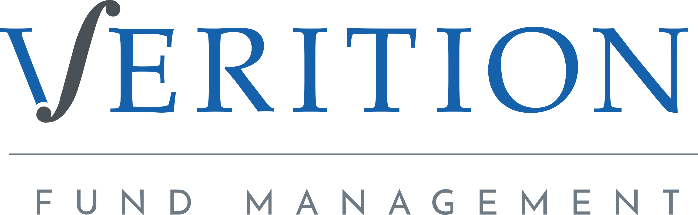

## Table of Contents

## What is Verition Fund Management?

Verition Fund Management is a company that manages money for investors. It was started in 2008 by a man named Nicholas Maounis. The company is based in Greenwich, Connecticut, and it also has offices in other places like New York, London, and Hong Kong. Verition helps people invest their money in different ways, like stocks, bonds, and other financial products. They use smart strategies to try to make more money for their clients.

The company is known for using technology and data to make good investment choices. They have a team of experts who look at a lot of information to decide where to invest. Verition works with big investors like pension funds and endowments. They aim to give their clients good returns on their investments while managing risks carefully. Overall, Verition Fund Management is a trusted name in the world of investing.

## When was Verition Fund Management founded?

Verition Fund Management was founded in 2008. The company was started by a man named Nicholas Maounis. They are based in Greenwich, Connecticut, but they also have offices in other places like New York, London, and Hong Kong.

Verition helps people invest their money in different ways, like stocks and bonds. They use smart strategies and technology to make good investment choices. The company works with big investors like pension funds and endowments, aiming to give them good returns on their investments while managing risks carefully.

## Who are the founders of Verition Fund Management?

Verition Fund Management was started by a man named Nicholas Maounis. He founded the company in 2008. Nicholas wanted to create a place where people could invest their money wisely.

The company is based in Greenwich, Connecticut. They also have offices in other places like New York, London, and Hong Kong. Verition helps people invest in things like stocks and bonds, using smart strategies and technology to make good choices.

## What types of investment strategies does Verition Fund Management employ?

Verition Fund Management uses different ways to help people invest their money. They look at a lot of information and use technology to make smart choices. They invest in things like stocks, bonds, and other financial products. Their goal is to make more money for their clients while being careful about risks.

The company has a team of experts who study the market and use data to decide where to put money. They work with big investors like pension funds and endowments. Verition tries to give these investors good returns on their money. They use a mix of strategies to do this, always keeping an eye on how the market is doing and adjusting their plans as needed.

## How does Verition Fund Management differentiate itself from other hedge funds?

Verition Fund Management stands out from other hedge funds because it uses a lot of technology and data to make smart investment choices. They have a team of experts who look at a lot of information to decide where to invest. This helps them find good opportunities that other funds might miss. Verition also works with big investors like pension funds and endowments, which shows that they are trusted in the investment world.

Another way Verition is different is that they focus on managing risks carefully while trying to make more money for their clients. They use a mix of strategies and keep an eye on the market to adjust their plans as needed. This careful approach helps them give their clients good returns on their investments. Overall, Verition's use of technology, data, and risk management makes them a unique and trusted choice in the world of investing.

## What are the key areas of focus for Verition Fund Management's investments?

Verition Fund Management focuses on investing in a variety of financial products like stocks and bonds. They use technology and data to make smart choices about where to put money. This helps them find good opportunities that other funds might miss. Verition works with big investors like pension funds and endowments, which shows that they are trusted in the investment world.

Another key area of focus for Verition is managing risks carefully while trying to make more money for their clients. They use a mix of strategies and keep an eye on the market to adjust their plans as needed. This careful approach helps them give their clients good returns on their investments. Overall, Verition's use of technology, data, and risk management makes them a unique and trusted choice in the world of investing.

## How has Verition Fund Management performed historically?

Verition Fund Management has done well over the years. They started in 2008 and have grown a lot since then. They use smart strategies and technology to make good investment choices. This has helped them make more money for their clients. Big investors like pension funds and endowments trust Verition because they have a good track record.

The company looks at a lot of information to decide where to invest. They focus on managing risks carefully while trying to make more money. This careful approach has helped them give their clients good returns on their investments. Overall, Verition's use of technology, data, and risk management has made them a trusted name in the world of investing.

## What is the organizational structure of Verition Fund Management?

Verition Fund Management has a clear way of organizing its team. They have a group of leaders at the top, including the founder, Nicholas Maounis. These leaders make big decisions and set goals for the company. They also have managers who help run different parts of the business, like investing, technology, and working with clients. Each manager has a team of people who work together to do their jobs well.

The company is split into different teams that focus on different things. There are teams that look at data and use technology to find good investments. Other teams work directly with clients, like pension funds and endowments, to help them invest their money. Everyone at Verition works together to make smart choices and help their clients make more money. This way of organizing helps Verition be successful and trusted in the world of investing.

## How does Verition Fund Management approach risk management?

Verition Fund Management takes risk management very seriously. They use a lot of information and technology to understand risks better. This helps them make smart choices about where to invest money. They always keep an eye on the market and adjust their plans to manage risks carefully. This careful approach helps them protect their clients' money while trying to make more money for them.

The company has a team of experts who work together to manage risks. They look at different kinds of risks, like market risks and financial risks. By understanding these risks, they can make better investment choices. Verition's focus on risk management is one of the reasons big investors trust them. They work hard to balance making money with keeping their clients' investments safe.

## What are some notable investments made by Verition Fund Management?

Verition Fund Management has made many smart investments over the years. They have put money into different kinds of businesses, like technology companies and financial services. One example is their investment in a company called Palantir Technologies, which uses data to help other businesses make decisions. Verition saw that Palantir had a lot of potential and decided to invest in it.

Another notable investment was in a company called Robinhood, which lets people buy and sell stocks easily on their phones. Verition believed that more people would start using Robinhood, so they invested in it. These investments show how Verition uses technology and data to find good opportunities. They look for companies that they think will grow and make money in the future.

## How does Verition Fund Management integrate technology in its operations?

Verition Fund Management uses technology a lot to help them make smart choices about where to invest money. They have special computer programs and tools that help them look at a lot of information quickly. This helps them find good investment opportunities that other funds might miss. They also use technology to keep an eye on the market and make changes to their plans when needed. This way, they can make better decisions and help their clients make more money.

The company also uses technology to manage risks carefully. They have systems that help them understand different kinds of risks, like market risks and financial risks. By using these systems, they can make safer investment choices. This focus on using technology to manage risks is one of the reasons big investors trust Verition. They work hard to balance making money with keeping their clients' investments safe.

## What future plans or expansions does Verition Fund Management have?

Verition Fund Management wants to keep growing and helping more people invest their money. They plan to open new offices in different parts of the world. This will help them work with more clients and find new investment opportunities. They also want to keep using technology to make their work better. By using new tools and computer programs, they can look at more information and make smarter choices about where to invest.

Another big plan for Verition is to keep working on their risk management. They want to use even better systems to understand and manage risks. This will help them protect their clients' money while still trying to make more money for them. Overall, Verition's future plans focus on growing their business, using technology, and managing risks carefully. This will help them stay a trusted name in the world of investing.

## References & Further Reading

[1]: Aldridge, I. (2013). ["High-Frequency Trading: A Practical Guide to Algorithmic Strategies and Trading Systems."](https://www.wiley.com/en-us/High+Frequency+Trading%3A+A+Practical+Guide+to+Algorithmic+Strategies+and+Trading+Systems%2C+2nd+Edition-p-9781118343500) Wiley.

[2]: López de Prado, M. (2018). ["Advances in Financial Machine Learning."](https://www.amazon.com/Advances-Financial-Machine-Learning-Marcos/dp/1119482089) Wiley.

[3]: Chan, E. P. (2008). ["Quantitative Trading: How to Build Your Own Algorithmic Trading Business."](https://github.com/ftvision/quant_trading_echan_book) Wiley.

[4]: Narang, R. K. (2013). ["Inside the Black Box: A Simple Guide to Quantitative and High-Frequency Trading."](https://onlinelibrary.wiley.com/doi/book/10.1002/9781118662717) Wiley.

[5]: Johnson, T. C. (2010). ["Algorithmic Trading and Information."](https://archive.org/details/algorithmictradi0000john) The Journal of Finance, 65(4), 1253-1279.