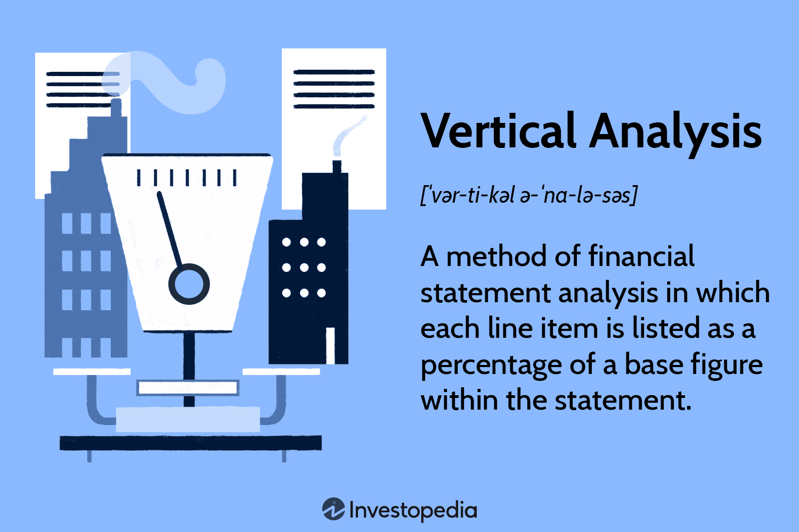

Financial analysis is a critical tool used by investors, business managers, and financial analysts to assess a company's performance and determine its financial health. By scrutinizing financial statements, stakeholders can evaluate a company's profitability, liquidity, solvency, and operational efficiency, ultimately guiding strategic decisions and investment opportunities. Financial analysis encompasses various techniques, each offering unique insights into a company's operations. Among these techniques is vertical analysis, a method that involves expressing each item in a financial statement as a percentage of a base figure. This approach differs from other forms of analysis, such as horizontal analysis, which compares financial data across periods, and ratio analysis, which evaluates relationships between different financial statement items.

Vertical analysis is valuable for its ability to present a company's financial data in terms of relative size, making it easier to compare financial performance with industry norms or competitors. By focusing on the proportion of financial statement items, analysts can identify trends and shifts in a company's financial structure, aiding in strategic planning and decision-making.



Accounting techniques play a crucial role in financial analysis, providing the framework for accurate data interpretation. Consistent accounting practices, guided by standards like Generally Accepted Accounting Principles (GAAP) or International Financial Reporting Standards (IFRS), ensure that the financial statements upon which analyses are based are reliable and comparable over time. In vertical analysis, accounting techniques enable analysts to accurately calculate and interpret percentages, providing a clear view of financial statements' compositions.

The advent of technology has revolutionized financial markets, introducing algorithmic trading, commonly known as algo trading. This trading technique employs advanced algorithms to execute trades based on predefined criteria, allowing for high-speed and precision trading that surpasses human capabilities. Algo trading has become an integral component of modern financial markets due to its efficiency and ability to leverage large volumes of data to inform trading decisions.

This article aims to explore the intersection of vertical analysis, accounting techniques, and algorithmic trading in the broader scope of financial analysis. By examining how these elements converge, we can gain a better understanding of their collective impact on shaping financial strategies and trading systems, ultimately enhancing profitability and decision-making capabilities in the financial domain.

## Table of Contents

## Understanding Financial Analysis

Financial analysis is the systematic evaluation of financial data to understand and assess the financial health and performance of an individual or organization. It serves a vital purpose in both personal and corporate finance, providing insights that can guide investment decisions, strategic planning, risk management, and operational improvements. Through financial analysis, stakeholders can discern patterns, evaluate economic viability, and forecast future performance based on historical data.

### Types of Financial Analyses

Financial analysis encompasses various techniques, each serving distinct objectives:

1. **Vertical Analysis**: This method involves expressing each item in a financial statement as a percentage of a specific base figure. For instance, in an income statement, each line item is often represented as a percentage of total sales or revenue. This approach allows for a proportional analysis, making it easier to compare with industry standards or evaluate performance across different years without the distortion of size differences.

2. **Horizontal Analysis**: Horizontal analysis assesses financial data across multiple periods, focusing on trends and pattern shifts. By examining changes in financial statement items over time, it identifies growth patterns, cyclical trends, and anomalies that may indicate underlying operational issues or strategic victories.

3. **Ratio Analysis**: Ratio analysis involves the calculation of ratios from financial statement figures to evaluate various aspects of a company's performance and financial health. This can include liquidity ratios (e.g., current ratio), profitability ratios (e.g., return on assets), debt ratios (e.g., debt to equity), and efficiency ratios (e.g., inventory turnover). Each ratio provides different insights into operational efficiency, financial stability, and profitability.

### Key Financial Statements Involved in Financial Analysis

Effective financial analysis relies on several key financial statements:

- **Balance Sheet**: This statement provides a snapshot of an entity's financial position at a specific point in time, detailing assets, liabilities, and equity. It is instrumental in analyzing capital structure, liquidity, and solvency.

- **Income Statement**: Also known as a profit and loss statement, it summarizes the company's revenue, expenses, and profits over a period. It is essential for assessing profitability and operational performance through measures like gross profit margin and operating income.

- **Cash Flow Statement**: It tracks the inflow and outflow of cash within an organization during a specific period. This statement is crucial for understanding cash generation capabilities, financing activities, and investment expenditures, providing insights into liquidity and cash management.

### Benefits of Financial Analysis

Financial analysis delivers numerous benefits to various stakeholders:

- **Investors**: It guides investment decisions by offering insights into a company's financial stability, growth prospects, and profitability. A thorough analysis can indicate the potential return on investment and associated risks.

- **Business Managers**: Financial analysis aids in strategic decision-making, helping managers optimize resource allocation, improve operational performance, and enhance profitability. It can also identify areas needing corrective actions or strategic redirections.

- **Accountants**: For accountants, financial analysis supports accurate reporting and compliance with accounting standards. It aids in detecting errors, fraud, and in crafting forecasts and budgets.

In essence, financial analysis is indispensable for making informed decisions, whether it be for investing, managing a business, or maintaining financial accountability. Its techniques and insights can uncover underlying financial realities and propound necessary strategic adjustments.

## Vertical Analysis: A Detailed Exploration

Vertical analysis is a financial assessment technique that involves evaluating financial statements by expressing each line item as a percentage of a base figure within the same statement. This approach allows analysts to present the proportional size and the structure of financial statement items, offering a clear picture of how each component contributes to the overall financial health of a company.

In an income statement, vertical analysis is conducted by expressing each item as a percentage of total sales or revenue. For example, if a company's total sales are $1,000,000 and its cost of goods sold is $400,000, the cost of goods sold would be presented as 40% of total sales, calculated as:

$$
\text{Cost of Goods Sold Percentage} = \left( \frac{\text{Cost of Goods Sold}}{\text{Total Sales}} \right) \times 100 = \left( \frac{400,000}{1,000,000} \right) \times 100 = 40\%
$$

Similarly, when applied to a balance sheet, each item, such as liabilities or shareholders' equity, is expressed as a percentage of total assets. For instance, if total assets amount to $500,000 and total liabilities are $300,000, then total liabilities constitute 60% of the total assets:

$$
\text{Liabilities Percentage} = \left( \frac{\text{Total Liabilities}}{\text{Total Assets}} \right) \times 100 = \left( \frac{300,000}{500,000} \right) \times 100 = 60\%
$$

Vertical analysis serves to highlight trends and facilitate the comparison of a company's financial performance over time by focusing on the proportional relationships within a single period's financial statements. This method allows for easy cross-period comparisons as it accounts for growth or contraction within the company by assessing line items relative to a consistent base figure.

Distinct from horizontal analysis, which examines financial data by looking at changes over multiple periods or years, vertical analysis centers on a single time frame, providing insight into the internal efficiency and cost structure for that period. While horizontal analysis reveals trends across different periods by calculating percentage changes year-over-year for each line item, vertical analysis is particularly useful for benchmarking against industry standards or competitor financials, as it neutralizes the impact of size differences among companies.

In summary, vertical analysis is a valuable tool that provides clarity on the internal allocation of resources within a single accounting period and enables analysts to assess operational efficiency and cost control. By presenting financial data as relative percentages, vertical analysis simplifies the evaluation of how well a company utilizes its resources, identifying areas of strength and potential improvement in its financial structure.

## Accounting Techniques in Vertical Analysis

Vertical analysis is a fundamental tool in financial analysis that allows users to evaluate financial statements by expressing each line item as a percentage of a base figure. To ensure accuracy in this process, several key accounting techniques must be employed.

Consistent accounting standards, such as Generally Accepted Accounting Principles (GAAP) or International Financial Reporting Standards (IFRS), play a crucial role in vertical analysis. These standards provide a universal framework that ensures comparability and consistency across financial statements. By adhering to these guidelines, businesses can prepare financial reports that are reliable and comparable across different reporting periods or entities. This consistency is paramount for conducting a vertical analysis that accurately reflects a company's financial position and performance.

In addition to accounting standards, the utilization of accounting software has become instrumental in simplifying the vertical analysis process. Modern accounting software packages facilitate the calculation of percentages and automation of data presentation, drastically reducing the time and potential for human error inherent in manual calculations. These software tools are equipped to generate detailed reports that follow GAAP or IFRS standards, allowing accountants to focus on interpreting the results rather than number crunching. 

Despite the advanced tools and standards available, the role of an accountant's judgment remains critical in interpreting vertical analysis results. Accountants must assess whether the percentages accurately reflect the operational realities of the business and consider contextual factors that might impact financial performance. For instance, an increase in cost of goods sold (COGS) as a percentage of revenue might signal inefficiencies or changes in supplier pricing, which require a deeper analysis beyond raw percentages. Therefore, an accountant's insight is vital in recognizing underlying trends and drawing actionable conclusions from the data presented.

In summary, vertical analysis relies heavily on consistent accounting standards and software tools for accuracy, but it is the accountant's analytical skills that provide the necessary interpretation and insight to meaningfully utilize this analysis in financial decision-making.

## Algorithmic Trading: Bridging Tech and Finance

Algorithmic trading, often referred to as algo trading, has revolutionized the financial markets by using complex algorithms to automate trading processes. This approach leverages computers to execute buying and selling orders based on pre-defined criteria, significantly enhancing the efficiency and effectiveness of trades.

**Overview of Algorithmic Trading**

At its core, [algorithmic trading](/wiki/algorithmic-trading) employs algorithms - sets of rules for solving a problem - to determine the timing, price, and quantity of orders with precision. These algorithms analyze market data and make trades at speeds and frequencies that would be impossible for a human trader. The functions range from simple execution strategies, like time-weighted average price, to complex strategies involving [market making](/wiki/market-making), [arbitrage](/wiki/arbitrage), and [trend following](/wiki/trend-following).

**Advantages over Manual Trading**

The advantages of algorithmic trading over manual trading are multifaceted:

1. **Speed**: Algorithms can process data and execute orders in milliseconds, allowing traders to respond almost instantaneously to market conditions.
2. **Precision**: Algorithms minimize human error by following rules strictly, ensuring that trades conform to pre-set parameters without emotional influence.
3. **Consistency**: Algorithms can operate continuously, executing trading strategies consistently over time.
4. **Backtesting**: Traders can use historical data to simulate trading strategies to evaluate their effectiveness before deploying them in live markets.

**Integration with Financial Analysis**

While algorithmic trading excels in executing trades efficiently, the integration of financial analysis, including vertical analysis, is vital in developing competent algo trading strategies. Vertical analysis involves expressing financial statement line items as a percentage of a base figure to identify relative proportions and assess financial performance trends. By incorporating insights from vertical analysis, traders can design algorithms that align trading strategies with company performance metrics, such as revenues, expenses, and profit margins.

For instance, if a company's cost structure improves relative to its revenues (observed through vertical analysis), an algorithm might predict enhanced profitability and adjust trading strategies to capitalize on this trend.

**Challenges and Opportunities**

The proliferation of algorithmic trading presents several challenges and opportunities:

- **Challenges**: 
  - Market Volatility: Rapid execution can exacerbate market fluctuations, leading to increased volatility.
  - Technological Risks: Dependence on technology makes systems vulnerable to failures or cyber-attacks.
  - Regulatory Issues: The complex nature of algorithms often leads to regulatory scrutiny to prevent market manipulation.

- **Opportunities**:
  - Efficient Market Hypothesis: Increased trading efficiency contributes to improved price discovery and market liquidity.
  - Artificial Intelligence Integration: AI and machine learning techniques can be used to enhance trading algorithms' predictive capabilities by learning from data patterns and adapting strategies.
  - Customization and Scalability: Algorithmic frameworks can be customized to cater to diverse trading styles and scaled across multiple asset classes.

Algorithmic trading stands as a testament to the successful fusion of technology and finance, offering both new opportunities and challenges in the pursuit of optimized trading outcomes. By judiciously integrating financial analysis techniques such as vertical analysis, traders can design algorithms that are not only efficient but also strategically informed, capitalizing on financial insights to bolster profitability.

## Integrating Vertical Analysis and Algo Trading

The integration of vertical analysis into algorithmic trading offers a compelling means to enhance trading strategies. Vertical analysis, by expressing each item in a financial statement as a percentage of a base figure, allows traders to discern proportional relationships within financial statements. When applied to algo trading, these insights can be instrumental in refining algorithmic models and enhancing trading effectiveness.

Vertical analysis can be crucial for [backtesting](/wiki/backtesting) and optimizing trading algorithms. Backtesting involves assessing how well a trading strategy would have performed using historical data, which is critical for validating the robustness of an algorithm. By incorporating vertical analysis, traders can apply a consistent methodology to evaluate how changes in key financial ratios impact the performance of selected stocks or financial instruments. For example, analyzing the proportion of operating income to net sales over time can reveal trends and insights that are crucial to adjusting algorithm parameters. This process helps in identifying patterns that correlate with successful trades, thereby enabling the development of more accurate predictive models.

A real-world example of the use of vertical analysis in algorithmic trading is its application in the equity markets to select stocks with favorable financial indicators. Traders can automate the analysis of income statements and balance sheets to gauge profitability and asset utilization ratios. By doing so, algorithms can be programmed to favor stocks with consistently high profitability margins or efficient asset turnover ratios, informed by historical vertical analysis data. If a company exhibits a rising trend in its net profit margin relative to its peers, an algorithm could prioritize this stock within a trading strategy based on historical correlation to stock performance.

Data analytics, when combined with vertical analysis, holds significant potential in further refining algorithmic trading models. Advanced analytics can evaluate vast datasets from financial statements and market data, applying [machine learning](/wiki/machine-learning) techniques to uncover non-obvious relationships and trends within the data. For instance, a machine learning algorithm could be trained to predict stock prices by incorporating vertical analysis metrics as features alongside other technical indicators. Python, with its robust ecosystem of libraries such as Pandas for data manipulation and Scikit-learn for machine learning, can be used to perform such analyses. An example of Python code might involve using a regression model to predict future stock prices based on past financial statement ratios obtained through vertical analysis:

```python
import pandas as pd
from sklearn.model_selection import train_test_split
from sklearn.linear_model import LinearRegression
from sklearn.metrics import mean_squared_error

# Sample dataset loading with features based on vertical analysis ratios
data = pd.read_csv('financial_data.csv')
features = data[['net_profit_margin', 'return_on_assets', 'equity_ratio']]
target = data['future_stock_price']

# Splitting the data
X_train, X_test, y_train, y_test = train_test_split(features, target, test_size=0.3, random_state=42)

# Model training
model = LinearRegression()
model.fit(X_train, y_train)

# Predictions
predictions = model.predict(X_test)

# Evaluating the model
mse = mean_squared_error(y_test, predictions)
print(f'Mean Squared Error: {mse}')
```

By leveraging both vertical analysis and data analytics, traders can develop sophisticated models that not only react to historical patterns but also adapt to emerging financial trends, providing a competitive edge in algorithmic trading. As technology continues to advance, integrating traditional analysis techniques with state-of-the-art data science methods will likely play an increasingly vital role in crafting successful trading algorithms.

## Conclusion

In summary, the article has examined the intricate connections between financial analysis, vertical analysis, accounting techniques, and algorithmic trading. Financial analysis acts as the cornerstone in evaluating business performance and profitability, with vertical analysis offering a specific lens through which financial statements are viewed. By expressing each line item as a percentage of a base figure within financial statements, vertical analysis provides a clear representation of a company's financial position and performance over time. Such insight is invaluable not only for investors and business managers but also for accountants who rely on consistent standards such as GAAP or IFRS to ensure accuracy in reporting.

Vertical analysis is further enhanced by algorithmic trading, which bridges technology and finance, employing complex algorithms to efficiently execute trades at speeds unattainable by human traders. This synergy allows for improved financial decision-making and trading outcomes, as insights derived from vertical analysis can inform and refine algorithmic trading strategies. The integration of vertical analysis into the development of such strategies provides a robust framework for backtesting and optimizing trading algorithms, thus maximizing profitability and efficiency.

Looking forward, the future of financial analysis and algorithmic trading appears promising, particularly with ongoing technological advancements. Developments in [artificial intelligence](/wiki/ai-artificial-intelligence) and machine learning present new opportunities for enhancing algorithmic trading models, potentially offering deeper insights when combined with traditional financial analysis techniques such as vertical analysis. Encouraging further research and exploration in this domain is crucial for leveraging these advancements, ultimately refining financial strategies and bolstering market performance. As the financial landscape continues to evolve, the interplay of traditional analysis and modern technological tools will be indispensable in navigating the complexities of financial markets.

## References & Further Reading

[1]: Bergstra, J., Bardenet, R., Bengio, Y., & Kégl, B. (2011). ["Algorithms for Hyper-Parameter Optimization."](https://papers.nips.cc/paper/4443-algorithms-for-hyper-parameter-optimization) Advances in Neural Information Processing Systems 24.

[2]: ["Advances in Financial Machine Learning"](https://www.amazon.com/Advances-Financial-Machine-Learning-Marcos/dp/1119482089) by Marcos Lopez de Prado

[3]: ["Evidence-Based Technical Analysis: Applying the Scientific Method and Statistical Inference to Trading Signals"](https://www.amazon.com/Evidence-Based-Technical-Analysis-Scientific-Statistical/dp/0470008741) by David Aronson

[4]: ["Machine Learning for Algorithmic Trading"](https://github.com/stefan-jansen/machine-learning-for-trading) by Stefan Jansen

[5]: ["Quantitative Trading: How to Build Your Own Algorithmic Trading Business"](https://www.amazon.com/Quantitative-Trading-Build-Algorithmic-Business/dp/1119800064) by Ernest P. Chan