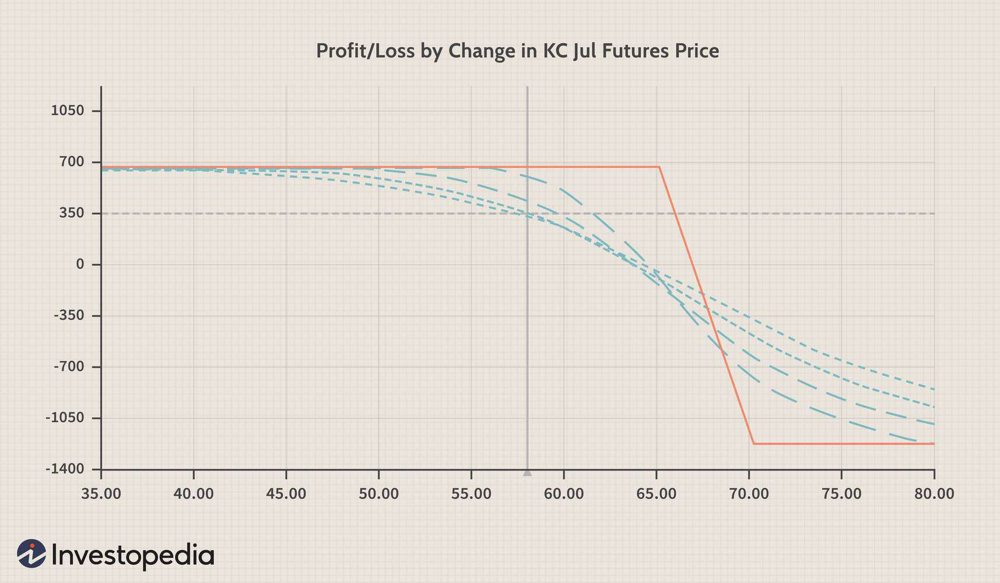

## Table of Contents

## What is a vertical credit spread?

A vertical credit spread is a type of options trading strategy where you sell one option and buy another option of the same type (either both calls or both puts) on the same underlying asset with the same expiration date. The key is that the option you sell has a higher premium than the one you buy, so you receive a net credit into your account when you set up the trade. The options have different strike prices, and the difference in their premiums is what gives you the credit.

This strategy is used when you have a directional view on the market but want to limit your risk. For example, if you think a stock's price will go down, you might sell a put option with a higher strike price and buy a put option with a lower strike price. The maximum profit you can make is the net credit you received when you opened the trade. The maximum loss is limited to the difference between the strike prices of the two options minus the net credit received. This makes the vertical credit spread a defined risk strategy, which can be appealing to traders who want to manage their potential losses.

## How do bull and bear credit spreads differ?

A bull credit spread is used when you think the price of a stock will go up a little bit. You sell a call option with a lower strike price and buy a call option with a higher strike price. Both options have the same expiration date. You get money right away because the option you sell is worth more than the one you buy. If the stock price stays below the lower strike price at expiration, you keep the money you got upfront. But if the stock price goes above the higher strike price, you lose money, up to the difference between the strike prices minus the money you got upfront.

A bear credit spread is used when you think the price of a stock will go down a little bit. You sell a put option with a higher strike price and buy a put option with a lower strike price. Again, both options expire on the same date. You get money right away because the put option you sell is worth more than the one you buy. If the stock price stays above the higher strike price at expiration, you keep the money you got upfront. But if the stock price goes below the lower strike price, you lose money, up to the difference between the strike prices minus the money you got upfront.

In both cases, the maximum profit is the money you get when you set up the trade, and the maximum loss is limited. This makes bull and bear credit spreads good for managing risk because you know the most you can lose before you start trading.

## What are the key components of setting up a vertical bull credit spread?

Setting up a vertical bull credit spread involves selling a call option with a lower strike price and buying a call option with a higher strike price on the same stock and with the same expiration date. You choose these options because the one you sell will have a higher premium than the one you buy, so you get money right away. This money you get is called the net credit. You want to do this when you think the stock's price will go up a little but not too much.

The key is [picking](/wiki/asset-class-picking) the right strike prices. The lower strike price should be below where you think the stock will be at expiration, and the higher strike price should be above where you think the stock will be. If the stock price stays below the lower strike price at expiration, you keep the net credit as your profit. But if the stock price goes above the higher strike price, you could lose money. The most you can lose is the difference between the strike prices minus the net credit you got. So, it's important to choose strike prices that fit your view of where the stock is going.

## What are the key components of setting up a vertical bear credit spread?

Setting up a vertical bear credit spread means you think the price of a stock will go down a little bit. You do this by selling a put option with a higher strike price and buying a put option with a lower strike price. Both options are on the same stock and have the same expiration date. The put option you sell will have a higher premium than the one you buy, so you get money right away. This money is called the net credit. You want to do this when you think the stock's price will go down but not too much.

The key is picking the right strike prices. The higher strike price should be above where you think the stock will be at expiration, and the lower strike price should be below where you think the stock will be. If the stock price stays above the higher strike price at expiration, you keep the net credit as your profit. But if the stock price goes below the lower strike price, you could lose money. The most you can lose is the difference between the strike prices minus the net credit you got. So, it's important to choose strike prices that fit your view of where the stock is going.

## What are the potential risks and rewards associated with bull credit spreads?

A bull credit spread can make you money if the stock's price goes up a little bit, but not too much. When you set it up, you get money right away because you sell a call option with a lower strike price and buy a call option with a higher strike price. If the stock price stays below the lower strike price when the options expire, you get to keep all the money you got upfront. This is your maximum profit, and it's the same as the net credit you received when you started the trade.

But there are risks too. If the stock price goes above the higher strike price at expiration, you could lose money. The most you can lose is the difference between the strike prices minus the money you got upfront. So, if the stock goes up a lot, you might lose more than you gained. It's important to pick the right strike prices to make sure your potential loss is something you can handle.

## What are the potential risks and rewards associated with bear credit spreads?

A bear credit spread can make you money if the stock's price goes down a little bit, but not too much. When you set it up, you get money right away because you sell a put option with a higher strike price and buy a put option with a lower strike price. If the stock price stays above the higher strike price when the options expire, you get to keep all the money you got upfront. This is your maximum profit, and it's the same as the net credit you received when you started the trade.

But there are risks too. If the stock price goes below the lower strike price at expiration, you could lose money. The most you can lose is the difference between the strike prices minus the money you got upfront. So, if the stock goes down a lot, you might lose more than you gained. It's important to pick the right strike prices to make sure your potential loss is something you can handle.

## How do you calculate the maximum profit and loss for a bull credit spread?

The maximum profit you can make with a bull credit spread is the money you get when you set it up. This money is called the net credit. You get it because you sell a call option with a lower strike price and buy a call option with a higher strike price. If the stock's price stays below the lower strike price when the options expire, you keep all the money you got upfront. That's your profit, and it's the same as the net credit.

The maximum loss happens if the stock's price goes above the higher strike price at expiration. To figure out the maximum loss, you take the difference between the two strike prices and subtract the net credit you got when you set up the trade. For example, if the lower strike price is $50, the higher strike price is $55, and you got a net credit of $2, your maximum loss would be $55 - $50 - $2 = $3. So, if the stock goes up a lot, you could lose money, but it's limited to this amount.

## How do you calculate the maximum profit and loss for a bear credit spread?

The maximum profit you can make with a bear credit spread is the money you get when you set it up. This money is called the net credit. You get it because you sell a put option with a higher strike price and buy a put option with a lower strike price. If the stock's price stays above the higher strike price when the options expire, you keep all the money you got upfront. That's your profit, and it's the same as the net credit.

The maximum loss happens if the stock's price goes below the lower strike price at expiration. To figure out the maximum loss, you take the difference between the two strike prices and subtract the net credit you got when you set up the trade. For example, if the higher strike price is $50, the lower strike price is $45, and you got a net credit of $2, your maximum loss would be $50 - $45 - $2 = $3. So, if the stock goes down a lot, you could lose money, but it's limited to this amount.

## What are the best market conditions for implementing a bull credit spread?

The best time to use a bull credit spread is when you think the stock's price will go up a little bit, but you're not sure it will go up a lot. This strategy works well in a market that's moving slowly upwards or staying pretty much the same. If the stock's price stays below the lower strike price of the options you chose when they expire, you keep all the money you got when you set up the trade.

You want to avoid using a bull credit spread in a market that's moving really fast or could go up a lot. If the stock's price goes way above the higher strike price you picked, you could lose money. So, it's good to use this strategy when you think the stock will have a small increase, and you want to make some money without risking too much.

## What are the best market conditions for implementing a bear credit spread?

The best time to use a bear credit spread is when you think the stock's price will go down a little bit, but not too much. This strategy works well in a market that's moving slowly downwards or staying pretty much the same. If the stock's price stays above the higher strike price of the options you chose when they expire, you keep all the money you got when you set up the trade.

You want to avoid using a bear credit spread in a market that's moving really fast or could go down a lot. If the stock's price goes way below the lower strike price you picked, you could lose money. So, it's good to use this strategy when you think the stock will have a small decrease, and you want to make some money without risking too much.

## How can adjustments be made to a bull credit spread if the market moves against the position?

If the market moves against your bull credit spread and the stock's price goes up a lot, you might need to make some changes to your trade. One way to do this is by rolling up the short call. This means you buy back the call option you sold and sell a new one with a higher strike price. This can give you more room for the stock to move up before you start losing money. Another way is to roll out the expiration date. You buy back your current options and sell new ones that expire later. This gives the stock more time to come back down below the lower strike price, so you can still make a profit.

Another thing you can do is to close part of your spread. If the stock's price is getting close to the higher strike price, you might want to buy back the call option you sold. This will cost you money, but it will limit your losses if the stock keeps going up. You can also try to turn your bull credit spread into a different kind of trade, like a butterfly spread, by adding more options. This can help manage your risk better, but it can also make things more complicated.

## How can adjustments be made to a bear credit spread if the market moves against the position?

If the market moves against your bear credit spread and the stock's price goes down a lot, you might need to make some changes to your trade. One way to do this is by rolling down the short put. This means you buy back the put option you sold and sell a new one with a lower strike price. This can give you more room for the stock to move down before you start losing money. Another way is to roll out the expiration date. You buy back your current options and sell new ones that expire later. This gives the stock more time to come back up above the higher strike price, so you can still make a profit.

Another thing you can do is to close part of your spread. If the stock's price is getting close to the lower strike price, you might want to buy back the put option you sold. This will cost you money, but it will limit your losses if the stock keeps going down. You can also try to turn your bear credit spread into a different kind of trade, like a butterfly spread, by adding more options. This can help manage your risk better, but it can also make things more complicated.

## What is Understanding Bull Spreads?

Bull spreads are options strategies that target a future increase in the price of an underlying asset. Unlike straightforward call options, bull spreads aim to profit from a price rise while minimizing potential losses. This is achieved by simultaneously purchasing options with a lower strike price and selling options at a higher strike price. The combination results in a net debit, where the overall cost of the strategy is usually lower than buying a single call option.

The mechanics of a bull spread involve selecting two different strike prices within the same expiration period. By buying a call option at a lower strike price and selling a call option at a higher strike price, traders capitalize on the anticipated upward movement in the asset’s price. The objective is to profit when the asset’s price is near or between the selected strike prices by the time of expiry.

The primary advantage of bull spreads is their inherent risk control. The maximum potential loss is limited to the initial net cost of setting up the spread, which is the difference between the premium paid for the lower strike price option and the premium received from the higher strike price option. Conversely, the maximum profit is capped at the difference between the two strike prices minus the net premium paid. This restricted risk-reward framework can be expressed mathematically as follows:

$$
\text{Maximum Profit} = (K_2 - K_1) - \text{Net Premium Paid}
$$

$$
\text{Maximum Loss} = \text{Net Premium Paid}
$$

Where $K_1$ is the lower strike price and $K_2$ is the higher strike price.

Bull spreads appeal to risk-averse traders because of their fewer risks compared to outright call options. While outright options offer unlimited potential profits, they involve higher upfront costs and greater exposure to the underlying asset's [volatility](/wiki/volatility-trading-strategies). Bull spreads, in contrast, allow traders to engage in a controlled risk environment with reduced capital requirements while still benefiting from an increase in asset price.

In practice, bull spreads can be a potent tool in volatile markets where precise control over risk and expenditure is essential. Their integration into a diversified trading portfolio can provide a balanced approach to leveraging market movements effectively.

## References & Further Reading

[1]: Natenberg, S. (1994). ["Option Volatility and Pricing: Advanced Trading Strategies and Techniques,"](https://www.amazon.com/Option-Volatility-Pricing-Strategies-Techniques/dp/0071818774) McGraw-Hill Education.

[2]: McMillan, L. G. (2004). ["Options as a Strategic Investment,"](https://www.amazon.com/Options-Strategic-Investment-Lawrence-McMillan/dp/0735201978) New York Institute of Finance.

[3]: Lopez de Prado, M. (2018). ["Advances in Financial Machine Learning,"](https://www.amazon.com/Advances-Financial-Machine-Learning-Marcos/dp/1119482089) Wiley.

[4]: Chan, E. P. (2009). ["Quantitative Trading: How to Build Your Own Algorithmic Trading Business,"](https://github.com/ftvision/quant_trading_echan_book) Wiley.

[5]: Jansen, S. (2020). ["Machine Learning for Algorithmic Trading,"](https://github.com/stefan-jansen/machine-learning-for-trading) Packt Publishing.

[6]: Hull, J. C. (2014). ["Options, Futures, and Other Derivatives,"](https://www.amazon.com/Options-Futures-Other-Derivatives-9th/dp/0133456315) Pearson.