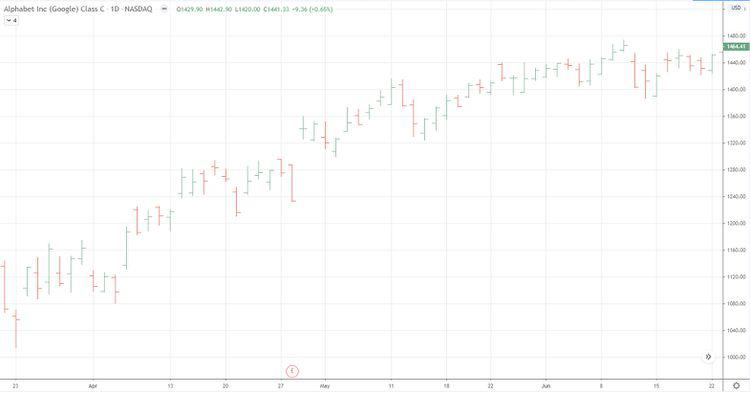

In the contemporary financial landscape, the use of charts is paramount for traders and analysts. These graphical representations of data facilitate a clear and comprehensive understanding of market dynamics and price movements, enabling more informed decision-making and strategic planning. Among the various types of charts, vertical line charts hold a unique position. Often referred to as bar charts, vertical line charts provide traders with a distinct perspective that is crucial for effective financial analysis and the development of algorithmic trading strategies.

Vertical line charts are characterized by their display of price movements over specific periods, encapsulated in a format that details the open, high, low, and close (OHLC) prices. This configuration allows traders to visualize fluctuations within a trading session clearly. Each session's trading activity is concisely represented through vertical bars, which summarize the data succinctly. This method of representation is particularly beneficial in its ability to distill complex price movements into easily interpretable formats, paving the way for more precise trend analysis and trading insights.



This article aims to explore various charting techniques integral to the use of vertical line charts in the context of financial analysis and algorithmic trading. It seeks to provide an understanding of the basics of vertical line charting while also examining more advanced strategies designed to enhance trading efficiency. By grasping these techniques, traders can obtain valuable insights into market trends and significantly boost their decision-making processes. The focus will be on equipping traders with practical skills and methodologies to maximize the utility of vertical line charts across different financial sectors. As we navigate this exploration, the goal is to empower traders with the knowledge needed to effectively integrate vertical line charts into their routine analytical toolkit, resulting in improved market prediction and trading outcomes.

## Table of Contents

## Understanding Vertical Line Charting

Vertical line charting, often referred to as bar charting, is an essential tool in financial analysis used to depict price movements over specific periods. This technique is invaluable for traders and analysts who require a clear representation of market dynamics.

In a vertical line chart, each vertical bar symbolizes a trading session. The top and bottom of the bar represent the highest and lowest prices achieved during that session, which provides an immediate visual understanding of the price range. Complementing these vertical lines are short horizontal ticks that appear on either side of the bar. The tick on the left denotes the opening price, while the tick on the right signifies the closing price. This Open-High-Low-Close (OHLC) configuration offers a comprehensive snapshot of price fluctuations within the specified period.

The clarity offered by vertical line charting is crucial. By encapsulating complex price movements into distinct data points—open, high, low, and close—traders can efficiently discern patterns and emerging trends. This detailed insight aids in the identification of market behaviors that might indicate future price directions.

Vertical line charts summarize complex price movements into easily interpretable visual cues, allowing traders to analyze trends efficiently. They serve as the foundation for a variety of analytical techniques in financial markets, facilitating both short-term and long-term investment strategies. Despite the intricate data they present, their design makes them approachable, offering a balance between detail and clarity that is essential in the fast-paced world of trading.

## Key Components of Vertical Line Charting

Vertical line charting, often referred to as bar charting, is a widely used method in financial analysis that succinctly encapsulates the market's trading dynamics through its key components: price bars, [volume](/wiki/volume-trading-strategy), and the time axis. These elements collectively form a comprehensive and coherent representation of market activity, aiding traders in their analysis and decision-making processes.

**Price Bars**

The price bar is the fundamental unit of a vertical line chart, representing a specific trading session. Each vertical bar portrays the high and low prices of a security during that session. The vertical extent of the bar captures this range, providing a visual cue to price [volatility](/wiki/volatility-trading-strategies) within the selected timeframe.

To enhance the understanding of price dynamics within the session, horizontal ticks are added to the price bar. The left-side tick indicates the opening price, while the right-side tick shows the closing price. This graphical method captures the Open-High-Low-Close (OHLC) data of the trading period, offering rich insights into whether the price moved upward or downward during the session. For example:
- If the closing price is higher than the opening price, the market experienced a bullish trend.
- Conversely, if the closing price is lower, the session was bearish.

**Volume**

Volume bars accompany price bars and are typically depicted as a histogram at the bottom of the chart. They represent the number of shares or contracts traded during the session, adding another layer of analysis to the price data. Large volume alongside significant price movement often indicates strong investor interest and potential trends. Conversely, low volume with price changes might suggest a lack of market conviction. Accurate interpretation of volume bars can be crucial for validating price movements and predicting potential reversals or continuations.

**Time Axis**

The time axis is a pivotal component that delineates the period covered by the chart. It can range from short intervals—such as minute-by-minute or hourly charts—suitable for [day trading](/wiki/day-trading-spy), to longer spans like daily, weekly, or even yearly charts for long-term investors. The choice of timeframe directly influences the granularity of market activity insight and can affect the detection of market patterns and trends.

Together, these components allow traders to create a cohesive picture of market behavior. By analyzing the interplay of price fluctuations, volume, and time, vertical line charts offer a dynamic and structured approach to evaluating market conditions. This structured representation aids traders in identifying trends, gauging market sentiment, and making informed trading decisions. Understanding and integrating these elements can significantly enhance the analytical capability of traders utilizing vertical line charts in financial markets.

## Charting Techniques and Interpretation

Creating vertical line charts involves the systematic gathering of financial data and the establishment of appropriate time frames to accurately reflect market activities. Vertical line charts, also known as bar charts, provide a detailed view of market fluctuations by representing data over specified periods. To craft these charts, traders first select a time frame, which can range from minutes to years, depending on the trading strategy and market under analysis.

The construction of vertical line charts requires the accurate plotting of price and volume data. Each bar in a vertical line chart consists of a vertical line and two short horizontal ticks. The vertical line indicates the high and low prices during the chosen time frame, while the horizontal ticks on the left and right signify the opening and closing prices, respectively. This structured format allows for a comprehensive analysis of price patterns, making it easier to decipher significant market trends. Moreover, volume data, often displayed as a separate bar graph beneath the main chart, provides additional insights into the strength and [momentum](/wiki/momentum) of price movements by showing the number of trades executed.

Interpreting vertical line charts involves recognizing recurring price patterns that can indicate potential market behaviors. Traders look for formations such as 'head and shoulders', 'double tops', and 'triangles', which can signal possible reversals or continuations in price trends. Understanding market dynamics through these patterns helps in anticipating future market movements, allowing traders to position themselves advantageously.

Vertical line charts find practical applications across various markets, including stocks, [forex](/wiki/forex-system), and commodities. In the stock market, these charts help traders identify bullish or bearish trends, assess market sentiment, and execute trades based on historical price behaviors. For forex markets, vertical line charts enable the tracking of currency pairs, aiding in the detection of entry and [exit](/wiki/exit-strategy) points. In commodities, the charts assist in evaluating supply and demand dynamics by providing a visual summary of price fluctuations over specific periods.

The adept use of vertical line charts enhances the trader's ability to conduct technical analysis, offering a structured approach to understanding complex market activities. By effectively interpreting these charts, traders can derive actionable insights that inform trading strategies, thus improving the potential for successful market engagement.

## Advanced Analytical Techniques

Incorporating advanced analytical techniques into vertical line charting substantially enhances its value for traders. By integrating trendlines and support/resistance levels, traders can improve their ability to identify and confirm trends. Trendlines are straightforward tools drawn across significant highs or lows to indicate the prevailing trend direction. Support and resistance levels, on the other hand, highlight potential reversal points, which are crucial in predicting market behavior. A trader might combine these tools with vertical line charts to quickly visualize where the market might experience significant buying or selling pressure.

Adding technical indicators such as moving averages and the Relative Strength Index (RSI) further augments the analytical capacity of vertical line charts. Moving averages smooth out price data, helping to identify trends over various time frames and softening the noise of short-term fluctuations. The RSI is a momentum oscillator that measures the speed and change of price movements, providing insights into overbought or oversold conditions. Here's a basic implementation of a moving average in Python:

```python
def moving_average(prices, period):
    return [sum(prices[i:i + period]) / period for i in range(len(prices) - period + 1)]
```

Recognizing patterns such as double tops, bottoms, or triangles within vertical line charts enables traders to forecast future price movements. These formations often indicate potential trend reversals or continuations. A double top, typically a bearish pattern, suggests a peak followed by a decline, while a triangle pattern might indicate a continuation or a [breakout](/wiki/breakout-trading). The ability to decipher these patterns is crucial for anticipating future market activity.

These advanced strategies empower traders to develop comprehensive trading strategies, particularly when combined with [algorithmic trading](/wiki/algorithmic-trading) systems. By automating processes and utilizing algorithmic models, traders can efficiently execute strategies based on the complex interplay of indicators and patterns identified on vertical line charts.

Despite the complexities involved, the use of these advanced techniques can significantly improve predictive accuracy and trading efficiency. By continually refining their understanding and application of these methodologies, traders can more effectively harness the full potential of vertical line charting in various financial markets.

## Challenges and Limitations

Vertical line charts are a popular tool in financial analysis, yet they come with a range of challenges and limitations that can make their interpretation complex, particularly for beginners. One major challenge is that the visual complexity of the chart, with its various data points and indicators, can be overwhelming. Understanding the interaction of open, high, low, and close prices requires a foundational knowledge of financial markets, and without this, traders may struggle to extract useful insights.

Market volatility adds another layer of difficulty. Rapid price changes can create misleading signals in vertical line charts, making it hard to discern genuine trends from noise. Sudden fluctuations can result in sharp spikes or drops that may not be representative of broader market trends. For this reason, traders are encouraged to use additional analysis tools, such as technical indicators like moving averages or the Relative Strength Index (RSI), to filter out short-term volatility and obtain a clearer picture of market conditions.

Another limitation of vertical line charts is their reliance on historical data, which cannot predict future movements with absolute certainty. Historical price movements are influenced by numerous factors, and while they can indicate potential trends, they do not account for unforeseen market events. Consequently, there is a necessity for meticulous cross-verification with [fundamental analysis](/wiki/fundamental-analysis). This means examining fundamental factors such as economic indicators, corporate earnings, and geopolitical events that can impact market behavior. Combining vertical line charting with fundamental analysis enables traders to develop a more comprehensive and reliable trading strategy.

To overcome these challenges while maximizing the benefits of vertical line charting, traders can adopt a few strategies. First, gaining proficiency with charting software and tools is crucial—many platforms offer customizable features that allow traders to simplify charts according to their needs. Secondly, education plays a fundamental role; participating in courses or seminars can build a trader’s ability to interpret complex charts effectively. Lastly, practicing with demo accounts before committing real capital can help traders gain confidence and fine-tune their techniques in a risk-free environment. By employing these methods, traders can enhance their analytical capabilities and harness the full potential of vertical line charts in trading.

## Conclusion

Vertical line charting serves as a fundamental tool in financial analysis and algorithmic trading. By mastering these charting techniques, traders can enhance their analytical capabilities, enabling more informed decision-making. Vertical line charts provide detailed insights into price movements through the representation of open, high, low, and close (OHLC) values, facilitating the analysis of market trends and patterns.

While challenges such as complexity and market volatility exist, adopting advanced methodologies can enhance market predictions and trading efficiency. By integrating vertical line charts with technical indicators, such as moving averages and the Relative Strength Index (RSI), traders can gain deeper insights into market dynamics. This integration allows for the identification of significant price patterns, aiding in the forecast of future price movements and the formulation of robust trading strategies.

Continual practice is essential to proficiently utilize vertical line charts. By consistently applying these techniques and integrating diverse analytical tools, traders can maximize the benefits offered by vertical line charting. This optimization helps navigate the complexities of various financial markets, ultimately improving trading outcomes. Leveraging vertical line charting, therefore, not only enhances analytical prowess but also contributes to the development of more effective and efficient trading strategies.

## References & Further Reading

[1]: ["Advances in Financial Machine Learning"](https://www.amazon.com/Advances-Financial-Machine-Learning-Marcos/dp/1119482089) by Marcos Lopez de Prado

[2]: ["Evidence-Based Technical Analysis: Applying the Scientific Method and Statistical Inference to Trading Signals"](https://www.amazon.com/Evidence-Based-Technical-Analysis-Scientific-Statistical/dp/0470008741) by David Aronson

[3]: ["Machine Learning for Algorithmic Trading"](https://github.com/stefan-jansen/machine-learning-for-trading) by Stefan Jansen

[4]: ["Quantitative Trading: How to Build Your Own Algorithmic Trading Business"](https://www.amazon.com/Quantitative-Trading-Build-Algorithmic-Business/dp/1119800064) by Ernest P. Chan

[5]: ["Technical Analysis of the Financial Markets: A Comprehensive Guide to Trading Methods and Applications"](https://archive.org/details/technicalanalysi0000murp) by John J. Murphy

[6]: Murphy, J. J. (1999). ["The Visual Investor: How to Spot Market Trends"](https://archive.org/details/visualinvestorho0000murp)