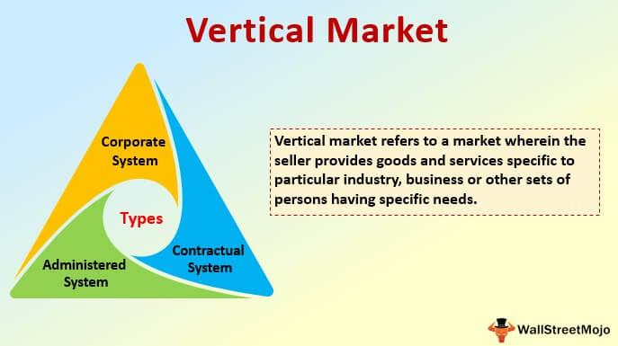

In today's fast-paced business environment, companies are continually seeking ways to gain competitive advantages by leveraging specialized strategies such as vertical market approaches and algorithmic trading. Vertical markets focus on catering to the needs of specific industries or demographics, differentiating themselves from broader horizontal markets. These markets often offer unique opportunities due to their niche segments, allowing businesses to develop a deep understanding of their target audience and address specific needs more effectively.

Algorithmic trading, on the other hand, involves the use of computer programs to automate trading activities based on pre-set rules and criteria. This technology enables traders to analyze vast amounts of data and make quick decisions, often faster than human capabilities allow. The benefits of algorithmic trading include enhanced efficiency, reduced emotional bias, and the ability to test strategies using historical data.



This article will explore the dynamics and advantages of vertical markets, the complexities of algorithmic trading, and how businesses can harness both to create innovative approaches that stand out in niche industries. By integrating insights from vertical markets with algorithmic trading strategies, companies can position themselves to thrive, becoming leaders within their specific markets and achieving significant operational efficiencies.

## Table of Contents

## Understanding Vertical Markets

A vertical market consists of businesses that cater specifically to the needs of a particular industry or demographic. Unlike horizontal markets, which serve a wide range of consumers with diverse needs, vertical markets target niche segments with specialized offerings. This focused approach means that companies operating in vertical markets often face higher barriers to entry. These barriers arise from the necessity of deep expertise and knowledge about industry-specific trends, terminologies, and regulatory landscapes.

The specialized nature of vertical markets necessitates that companies comprehend and anticipate the unique demands of their target audiences. This capability results in the potential development of a loyal customer base, as businesses can offer tailored solutions that effectively address distinctive customer needs within these segments. Such specialization not only enhances customer satisfaction but also often leads to higher profit margins. This occurs because companies can command premium pricing for their specialized products or services, reflecting their added value in catering to the specific needs of their clientele.

Vertical markets also benefit from reduced competition, as the expertise and resources required to enter these markets deter potential entrants. This relative scarcity of competitors allows businesses within vertical markets to establish themselves as leaders in their respective spaces. As a result, companies can experience increased bargaining power and stability in their customer relationships, further cementing their market position.

Additionally, operating within a vertical market allows for a concentrated marketing approach, where messaging and promotional efforts can be highly targeted. This can lead to more efficient use of marketing resources and a stronger resonance with the intended audience. Overall, the understanding and successful execution of vertical market strategies can significantly impact a company's ability to thrive within its niche, ultimately fostering an environment for sustained growth and competitive advantage.

## Vertical Market Business Strategies

Vertical market businesses typically pursue strategies that emphasize specialization, targeted marketing, and the development of customized products or services. These strategies enable businesses to create a strong value proposition that directly addresses the unique needs and challenges of their specific market segments.

One effective approach businesses take is leveraging industry-specific trends and insights to provide tailored solutions that solve explicit problems within their market sector. By understanding the unique challenges and pain points of their customer base, businesses can design products or services that offer significant value and differentiation from generic solutions provided in horizontal markets. This involves staying up-to-date with industry developments and customer feedback to continuously refine and enhance offerings.

Additionally, focused research and development allow companies to innovate and tailor their solutions specifically for the niche audience they serve. For instance, a company operating within the healthcare vertical may develop software with specialized features that cater to regulatory requirements and workflow processes unique to the healthcare industry, such as HIPAA compliance. This level of customization not only makes the product more appealing to the target audience but also increases barriers to entry for competitors who lack the same level of specialization.

By focusing on a narrower audience, businesses can dedicate more resources to understanding and meeting customer demands, effectively positioning themselves as market leaders in their respective niches. This targeted approach enables companies to cultivate strong relationships with their clients, leading to increased customer loyalty and retention rates. Moreover, businesses can leverage data analytics to gain insights into consumer behavior and preferences, allowing further customization and refinement of their offerings.

In summary, the strategic focus on specialization and targeted marketing empowers vertical market businesses to develop deeply aligned solutions that resonate with their core audience. This not only enhances customer satisfaction and loyalty but also positions the company as a thought leader and innovator within its niche, paving the way for sustained growth and profitability.

## Algorithmic Trading: An Overview

Algorithmic trading employs computer algorithms to automate the buying and selling of financial instruments, operating on predetermined criteria. This process harnesses high-speed analytical capabilities to evaluate vast datasets, identify trading opportunities, and execute decisions faster than human traders. 

A notable advantage of [algorithmic trading](/wiki/algorithmic-trading) is its ability to enhance trading efficiency by processing and executing multiple transactions with minimal latency. It mitigates emotional biases that can affect human traders, thereby promoting more disciplined and consistent trading strategies. Moreover, algorithmic trading accommodates [backtesting](/wiki/backtesting) strategies, allowing traders to apply their algorithms to historical data to evaluate performance and optimize their approaches before deploying them in live markets.

Various strategies underpin algorithmic trading, each aiming to leverage market inefficiencies for potential gain. Common strategies include:

1. **Arbitrage**: This involves exploiting price discrepancies of identical or similar financial instruments across different markets. For instance, if a stock is priced differently on two exchanges, an algorithm can simultaneously buy the stock on the lower-priced exchange and sell it on the higher-priced one.

2. **Trend-following**: These strategies capitalize on asset momentum, seeking to identify and follow ongoing price trends. This could involve analyzing moving averages or price breakouts to guide trading decisions.

3. **Market-making**: Algorithms can place both buy and sell limit orders for a particular financial instrument to profit from the spread between bid and ask prices. This strategy typically involves high transaction volumes and rapid execution.

4. **Statistical arbitrage**: This method employs quantitative models to identify and exploit statistical mispricings between securities, often relying on concepts like pairs trading or mean reversion.

Algorithmic trading's reliance on precise algorithms and real-time data processing empowers traders to navigate dynamic markets effectively, offering a significant strategic advantage over traditional manual trading methods.

## Examples of Algorithmic Trading in Vertical Markets

Financial services companies frequently utilize algorithmic trading to streamline processes and enhance accuracy in sectors such as equities, commodities, and foreign exchange. The integration of algorithmic trading with these vertical markets allows for improved execution speeds, lower transaction costs, and better management of trading risks.

One notable example of algorithmic trading is in high-frequency trading ([HFT](/wiki/high-frequency-trading-strategies)). HFT firms leverage powerful computing resources to execute trades at extremely high speeds based on real-time analysis of market data. These firms often employ strategies that involve [arbitrage](/wiki/arbitrage) opportunities, [market making](/wiki/market-making), and statistical analysis to capitalize on minute price movements across markets. HFT is particularly prevalent in stock exchanges, where quick trade execution can provide significant advantages. The following Python code snippet demonstrates a simplified example of an HFT strategy using mean reversion:

```python
import numpy as np

# Simulated price data
prices = np.random.randn(100) + 100

# Mean reversion strategy
def identify_signals(prices, window=10):
    signals = []
    for i in range(window, len(prices)):
        window_prices = prices[i-window:i]
        mean_price = np.mean(window_prices)
        if prices[i] < mean_price * 0.98:  # Buy signal
            signals.append('buy')
        elif prices[i] > mean_price * 1.02:  # Sell signal
            signals.append('sell')
        else:
            signals.append('hold')
    return signals

signals = identify_signals(prices)
print(signals)
```

In niche industries, such as crypto trading, algorithmic trading plays a crucial role in providing an edge by swiftly capturing opportunities in a highly volatile market. The [cryptocurrency](/wiki/cryptocurrency) market operates 24/7, demanding continuous monitoring and decision-making capabilities. Algorithmic trading systems in this domain perform constant analysis of market trends, news feeds, and social media sentiment to generate buy or sell signals. Within crypto trading, automated bots capitalize on strategies such as arbitrage—exploiting price discrepancies of the same asset across different exchanges—and [momentum](/wiki/momentum) trading, which involves following the trend of price movements.

Moreover, commodity trading also benefits from algorithmic approaches, where programs evaluate a vast network of supply chain data, weather patterns, and geopolitical events to inform trading decisions. Algorithms are designed to detect patterns that indicate fluctuations in commodity prices, thus informing strategic buying and selling actions.

Through these diverse applications across vertical markets like equities, commodities, and cryptocurrencies, algorithmic trading affirms its value by enhancing accuracy and efficiency, ultimately offering strategic advantages to businesses within their specific niches.

## Integrating Vertical Market Strategies with Algorithmic Trading

Integrating vertical market strategies with algorithmic trading technologies enables businesses to sharpen their focus on data-centric sectors. This synergy allows enterprises to leverage the precision and speed of algorithmic trading in niche markets, optimizing their products and services for specialized consumer needs. By combining industry-specific insights with automated trading systems, companies can improve operational efficiency and enhance their strategic positioning in competitive landscapes.

One significant advantage of this integration is the potential for creating innovative business models. Businesses can utilize [deep learning](/wiki/deep-learning) and machine analysis to extract valuable insights from large datasets specific to their vertical. For instance, companies in the financial sector can deploy [machine learning](/wiki/machine-learning) algorithms to detect patterns in stock market data, enabling them to make more informed and timely decisions. The ability to analyze historical and real-time data accelerates the process of identifying market trends and consumer preferences, which is crucial for companies targeting narrow market segments.

Using Python, businesses can harness libraries such as TensorFlow and Scikit-learn to implement deep learning models in their algorithmic trading strategies. Here's a simple example of a Python script utilizing a machine learning model to predict stock prices:

```python
import numpy as np
import pandas as pd
from sklearn.model_selection import train_test_split
from sklearn.preprocessing import StandardScaler
from sklearn.ensemble import RandomForestRegressor

# Load stock market data
data = pd.read_csv('stock_data.csv')

# Preprocess data
features = data[['Open', 'High', 'Low', 'Volume']]
target = data['Close']

X_train, X_test, y_train, y_test = train_test_split(features, target, test_size=0.2, random_state=42)

scaler = StandardScaler()
X_train_scaled = scaler.fit_transform(X_train)
X_test_scaled = scaler.transform(X_test)

# Train a Random Forest model
model = RandomForestRegressor(n_estimators=100, random_state=42)
model.fit(X_train_scaled, y_train)

# Predict and evaluate
predictions = model.predict(X_test_scaled)
print('Predicted stock prices:', predictions)
```

This script illustrates the use of a Random Forest Regressor to predict stock prices, demonstrating how machine learning models can enhance algorithmic trading strategies in vertical markets.

Moreover, integrating vertical market strategies with algorithmic trading allows for the development of customized solutions that cater to specific requirements of the target demographic. By offering tailored products and services, companies can establish strong customer loyalty and achieve higher profit margins. This approach is particularly beneficial in industries where data-driven decision-making is paramount, such as telecommunications, healthcare, and energy.

In summary, by fusing industry-specific knowledge with advanced trading technologies, businesses can significantly enhance their competitive edge. This integration promotes efficiency, fosters innovation, and supports the creation of bespoke solutions, all of which contribute to sustained growth and success in niche markets.

## Conclusion

Vertical markets and algorithmic trading represent pivotal strategies for businesses aiming to excel in niche domains. By concentrating efforts within a specific industry vertical, companies can establish themselves as dominant players. This specialization enables businesses to cater to specific customer needs with customized products and services, leading to strong customer loyalty and enhanced profit margins.

Algorithmic trading, on the other hand, equips businesses with the technological advantage necessary for precision and scalability. Leveraging computer algorithms to automate trading decisions based on quantitative data, these systems minimize human error and bias, while maximizing efficiency. The ability to process and analyze massive datasets at incredible speeds positions firms ahead of their competition by seizing opportunities that manual trading methods might miss.

The synergy between vertical market strategies and algorithmic trading can amplify a company's competitive edge. Businesses that skillfully blend these approaches not only enhance operational efficiency but also strengthen their strategic market positioning. This integration promotes the development of innovative business models, utilizing advanced analytics and tailored solutions for their chosen sectors. Ultimately, such a strategic fusion enables companies to achieve significant growth and sustained profitability within their specific market segments.

## References & Further Reading

[1]: Bergstra, J., Bardenet, R., Bengio, Y., & Kégl, B. (2011). ["Algorithms for Hyper-Parameter Optimization."](https://papers.nips.cc/paper/4443-algorithms-for-hyper-parameter-optimization) Advances in Neural Information Processing Systems 24.

[2]: ["Advances in Financial Machine Learning"](https://www.amazon.com/Advances-Financial-Machine-Learning-Marcos/dp/1119482089) by Marcos Lopez de Prado

[3]: ["Evidence-Based Technical Analysis: Applying the Scientific Method and Statistical Inference to Trading Signals"](https://www.amazon.com/Evidence-Based-Technical-Analysis-Scientific-Statistical/dp/0470008741) by David Aronson

[4]: ["Machine Learning for Algorithmic Trading"](https://github.com/PacktPublishing/Machine-Learning-for-Algorithmic-Trading-Second-Edition) by Stefan Jansen

[5]: ["Quantitative Trading: How to Build Your Own Algorithmic Trading Business"](https://books.google.com/books/about/Quantitative_Trading.html?id=j70yEAAAQBAJ) by Ernest P. Chan