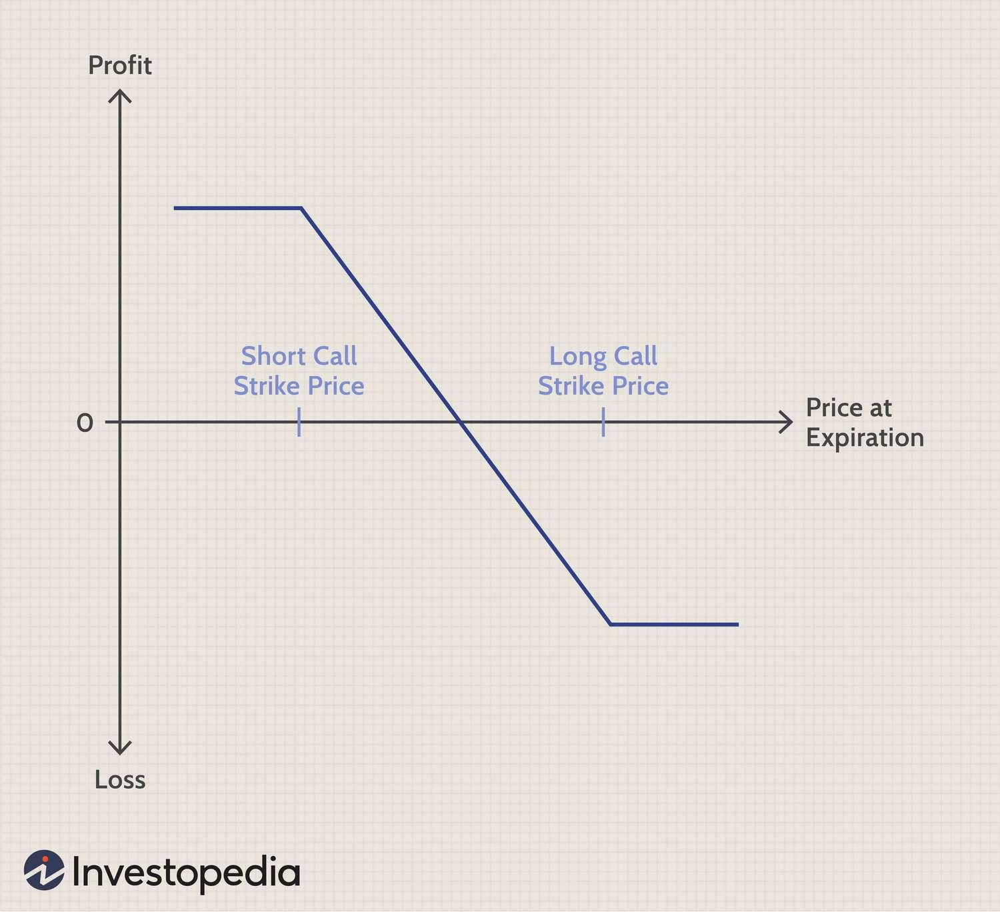

Options trading is a multifaceted financial instrument primarily engaging individuals with considerable risk tolerance and a deep understanding of market trends. It involves the strategic buying and selling of call and put options, which grant the right—not the obligation—to purchase or sell an underlying asset at specified strike prices before or upon expiration. One of the sophisticated strategies within options trading is the vertical spread, a method that offers traders the advantage of capping both potential losses and gains. This strategy involves concurrently purchasing and selling options of the same class (calls or puts) and expiration date but at different strike prices, thereby establishing a range of predicted asset movement within which traders can operate.

Vertical spreads subdivide into several specific strategies such as the bull call spread, the bear call spread, the bull put spread, and the bear put spread. Each signifies a combination of market outlook with a corresponding options arrangement. For example, a bull call spread profits in a rising market through buying low-strike calls and selling high-strike calls. In contrast, a bear put spread anticipates market declines by buying high-strike puts while selling low-strike puts. These structured strategies help traders to navigate their positions, aiming for profitability within a range while minimizing exposure to unexpected market shifts.



Further, algorithmic trading has emerged as a prominent tool in options trading, optimizing the execution of vertical spreads and other strategies. Algorithms, designed with sophisticated computational techniques, facilitate rapid decision-making and execution, far beyond the capabilities of human traders. They identify favorable trading conditions based on historical data and real-time market analytics, ensuring strategic discipline and effective risk management. By integrating algorithms into options trading, traders can enhance precision and capitalize on fleeting opportunities presented by market dynamics.

This article investigates into the fundamentals of vertical spreads, demonstrating how these strategic options can accommodate different market conditions, and examines the integration of algorithmic trading into these strategies. Through this exploration, traders will gain insights into better risk management and the potential for profit in the ever-evolving financial markets.

## Table of Contents

## Understanding Vertical Spreads

Vertical spreads are an essential component of options trading, offering traders a strategic approach to capitalizing on expected movements in asset prices while managing risk. This strategy involves simultaneously buying and selling options of the same class (either call or put options) and expiration date, but with different strike prices. The primary types of vertical spreads are the bull spread and the bear spread, each serving different market outlooks.

A bull spread is employed by traders who anticipate an increase in the price of the underlying asset. It can be further categorized into a bull call spread or a bull put spread:

1. **Bull Call Spread**: This involves purchasing a call option at a lower strike price and selling another call option at a higher strike price. The maximum profit in a bull call spread is realized when the asset price rises above the higher strike price, while the loss is limited to the net premium paid.

2. **Bull Put Spread**: In this strategy, a trader sells a put option at a higher strike price and buys another put option at a lower strike price. The strategy benefits from stable or rising prices, with the maximum profit achieved when the underlying asset's price is above the higher strike price at expiration. The potential loss is limited to the difference between the strike prices minus the net premium received.

Conversely, a bear spread is designed for traders who expect a decline in the price of the underlying asset. Bear spreads also branch into two types:

1. **Bear Call Spread**: This strategy involves selling a call option at a lower strike price while purchasing another at a higher strike price. It profits when the underlying asset price stays below the lower strike price at expiration, with losses capped at the difference in premiums received and paid.

2. **Bear Put Spread**: Here, traders buy a put option at a higher strike price and sell another at a lower strike price. The maximum profit occurs when the asset's price is below the lower strike price at expiration, whereas losses are limited to the net premium outlay.

Each vertical spread strategy is crafted to align with a trader's market predictions, providing a balance between risk and reward profiles. These strategies are especially advantageous in defining potential losses and profits upfront, as they allow traders to prepare for a range of market scenarios with known exposures.

## The Mechanics of Vertical Spreads

Vertical spreads in options trading are strategic methods to adjust risk and potential profit. These involve the simultaneous buying and selling of options of the same class with the same expiration date but different strike prices. Each vertical spread type has distinctive characteristics and mechanics, impacting how a trader profits—or limits losses—from price movements in the underlying asset.

In a **bull call spread**, the trader buys a call option with a lower strike price while selling another call option with a higher strike price. The expectation here is that the underlying asset's price will rise, allowing the trader to profit from the difference between the two strike prices minus the net premium paid. The maximum profit is calculated as:

$$
\text{Max Profit} = (\text{Strike Price of Sold Call} - \text{Strike Price of Bought Call}) - \text{Net Premium Paid}
$$

Conversely, a **bear call spread** plays on the expectation of a decline or limited rise in asset prices. The trader sells a call at a lower strike price, buying another at a higher price, gaining from the net premium as long as the asset price does not rise above the sold call's strike price.

**Bull put spreads** involve selling a put option at a higher strike price and buying a put at a lower strike price. This strategy benefits if the price remains above the higher strike price, collecting the net premium as profit. It is used when the trader anticipates that the underlying asset's price will not fall below the lower strike of the bought put.

A **bear put spread** capitalizes on anticipated declines in the asset price. It involves buying a put at a higher strike price and selling another at a lower strike price. The trader profits from the price drop up to the spread difference, minus the net premium paid.

In all vertical spreads, the costs and potential maximum gains or losses are well defined at the outset, allowing traders to manage their exposure effectively. The distinction lies in the strategic placement concerning expected market movements. The inherent nature of vertical spreads' defined risk/reward makes them a favorable strategy for those seeking controlled [volatility](/wiki/volatility-trading-strategies) exposure.

## Algorithmic Trading in Vertical Spreads

Algorithmic trading, frequently referred to as algo trading, plays a significant role in enhancing the efficiency and precision of executing vertical spreads. Algorithms excel by making rapid computations and executing trades at speeds that human traders cannot match. This speed is crucial for capturing fleeting opportunities in the highly dynamic markets where vertical spreads operate. Utilizing complex mathematical models and extensive historical data, algorithms assess current market conditions and predict price movements, thereby identifying profitable spread opportunities effectively.

Algorithms can be programmed to follow predefined criteria. For example, these criteria might include specific price movements, volatility patterns, or historical data correlations, enabling the early detection of advantageous trades. By using algorithms, traders can implement strategies that reduce risk and ensure disciplined trading. For instance, algorithms can monitor market conditions and trigger trades when specific conditions are met, thereby eliminating the emotional component often associated with trading decisions. This disciplined approach aids in maintaining consistency and reliability in trading strategies.

Moreover, algo trading in vertical spreads offers advanced risk management capabilities. Traders can program algorithms to adjust strategies automatically with changing market conditions. Let's consider a simple Python example where an algorithm adjusts a vertical spread position based on real-time market data:

```python
def update_vertical_spread(position, market_data):
    # Example criteria: if market price increase by a threshold, adjust strategy
    price_threshold = 5  # Example threshold
    if market_data['current_price'] > market_data['initial_price'] + price_threshold:
        # Adjust position: execute specific trade orders (e.g., buy/sell options)
        execute_trade_orders(position, new_parameters)
    return position

def execute_trade_orders(position, new_parameters):
    # Implementation of order execution logic
    # new_parameters could modify strikes, expiration dates, etc.
    # This would be specific to the brokerage or trading platform being used.
    pass
```

Incorporating such automated adjustments in trading strategies ensures that trades remain optimized under varying market conditions, enhancing the overall efficacy of the vertical spread approach. This automatic adjustment helps traders respond swiftly to market dynamics, thus maintaining an optimal trading position without constant manual monitoring.

Algorithmic trading transforms vertical spread strategies into a more systematic and less error-prone process. By combining computational power with sophisticated trading algorithms, traders can optimize their strategies to achieve better results. As financial markets continue to evolve, the integration of [algorithmic trading](/wiki/algorithmic-trading) in vertical spreads will likely expand, further enriching the strategy's efficiency and effectiveness.

## Pros and Cons of Vertical Spreads

Vertical spreads are a valuable tool for traders who have moderate expectations about stock price movements, offering a balanced approach to risk and reward. One of the primary advantages of vertical spreads is their ability to limit both risk and potential rewards. This makes them an attractive strategy for traders who prefer a more conservative approach to options trading.

By structure, vertical spreads involve simultaneously buying and selling options, which naturally limits the exposure to risk. For example, in a bull call spread, the maximum potential loss is confined to the net premium paid, while the maximum profit is restricted to the difference between the strike prices minus the net premium. This capped nature of potential loss and gain makes vertical spreads cost-effective as the risk of enduring a full premium loss is offset by the income generated from the opposite position. 

This risk mitigation contributes to efficient capital allocation because traders can clearly define their potential losses before initiating the trade. Knowing the exact risk enables traders to plan their portfolios more effectively and allocate assets with greater precision. It allows traders to participate in market movements without excessive exposure to risk, particularly in volatile markets.

However, vertical spreads come with certain drawbacks. The capped profit potential can be a limitation for traders aiming for unlimited profit opportunities. Since vertical spreads restrict the maximum return, they are not suitable for those looking to capitalize on large market swings.

Furthermore, while vertical spreads offer controlled risk exposure, they also introduce complexities, especially to new traders. The dual-leg nature of vertical spreads, involving both buying and selling options, can make the strategies challenging to set up and understand fully. Novice traders may struggle to grasp the intricacies related to strike price selection, premium calculations, and timing.

Overall, while vertical spreads provide a methodical and measured trading technique that can protect traders from extreme losses, they require a careful understanding and strategic application to be advantageous. As with all trading strategies, success lies in thoroughly evaluating the market conditions and aligning them with the trader’s risk tolerance and market outlook.

## Calculating Profit and Loss

Calculating potential profit and loss from a vertical spread involves straightforward formulas that help traders evaluate the trade's feasibility. For a bull call spread, the maximum profit is computed by taking the difference between the strike prices of the long call and the short call, and then subtracting the net premium paid:

$$
\text{Max Profit} = (\text{Strike Price of Short Call} - \text{Strike Price of Long Call}) - \text{Net Premium Paid}
$$

In contrast, the maximum profit for a bear call spread is simply the net premium received when the trade is executed. This occurs if the price of the underlying asset remains below the strike price of the short call until expiration.

$$
\text{Max Profit} = \text{Net Premium Received}
$$

For bear put spreads, where a trader buys a higher strike put option and sells a lower strike put option, the profit calculation is similar to that of bull call spreads:

$$
\text{Max Profit} = (\text{Strike Price of Long Put} - \text{Strike Price of Short Put}) - \text{Net Premium Paid}
$$

Bull put spreads mirror bear call spreads in that the maximum profit is equal to the net premium received, provided the asset's price stays above the strike price of the short put:

$$
\text{Max Profit} = \text{Net Premium Received}
$$

Understanding premiums is critical in these calculations. The net premium is determined by subtracting the premium received from writing options from the premium paid for purchasing options. These calculations allow traders to determine the maximum potential profit or loss, helping them assess the viability and desirability of deploying vertical spread strategies given expected market movements.

## Conclusion

Vertical spreads are distinguished as a conservative but effective strategy within the options trading domain, offering traders a balanced approach to managing risk and potential reward. By design, vertical spreads create a scenario where risks are limited and well-defined, allowing traders to maintain a controlled trading environment. This predefined risk cap is a significant advantage, particularly in volatile markets where price movements can be unpredictable.

While the potential for profit is inherently limited within vertical spreads—given that maximum gain is the difference in strike prices minus the net premium paid—the trade-off lies in the strategic limitation of risk. This characteristic makes vertical spreads an attractive choice for traders with moderate expectations regarding market movements and who prioritize capital preservation over speculative gain.

Algorithmic trading emerges as a transformative tool in maximizing the efficiency of vertical spread strategies. Algorithms offer precision and speed, executing trades at rates unachievable by human intervention. Their ability to analyze market data, identify opportunities based on tailored criteria, and adapt to real-time changes positions algorithms as indispensable in enhancing the performance of vertical spread strategies. The integration of algorithmic trading ensures discipline, minimizes emotional decision-making, and optimizes risk management.

For traders, understanding the subtleties and mechanics of vertical spreads is crucial. Mastering these strategies involves recognizing how different factors, such as strike prices and expiration dates, interact and influence the profitability and risk profile of a vertical spread. This understanding empowers traders to effectively deploy vertical spreads in various market conditions, leveraging their conservative nature to manage unpredictability.

As the financial markets continue to evolve, strategies like vertical spreads adapt to new information, technologies, and trader needs. Despite changes, vertical spreads remain a core component of options trading, serving as a reliable option for those seeking to balance risk and reward in their trading endeavors.

## References & Further Reading

[1]: Hull, John C. ["Options, Futures, and Other Derivatives"](https://www.amazon.com/Options-Futures-Other-Derivatives-9th/dp/0133456315). Pearson Education.

[2]: McMillan, Lawrence G. ["Options as a Strategic Investment"](https://www.amazon.com/Options-as-Strategic-Investment-Fifth/dp/0735204659) (5th Edition). New York Institute of Finance.

[3]: Chan, Ernest P. ["Algorithmic Trading: Winning Strategies and Their Rationale"](https://github.com/ftvision/quant_trading_echan_book). Wiley Trading.

[4]: Das, Sanjiv. ["Derivatives: Principles and Practice"](https://www.researchgate.net/profile/Sanjiv-Das/publication/267418669_Derivatives_Principles_and_Practice/links/549020870cf225bf66a81999/Derivatives-Principles-and-Practice.pdf). Cambridge University Press.

[5]: Haugh, Martin B. ["Course on Quantitative Methods in Derivatives Pricing"](https://martin-haugh.github.io/) Columbia University.