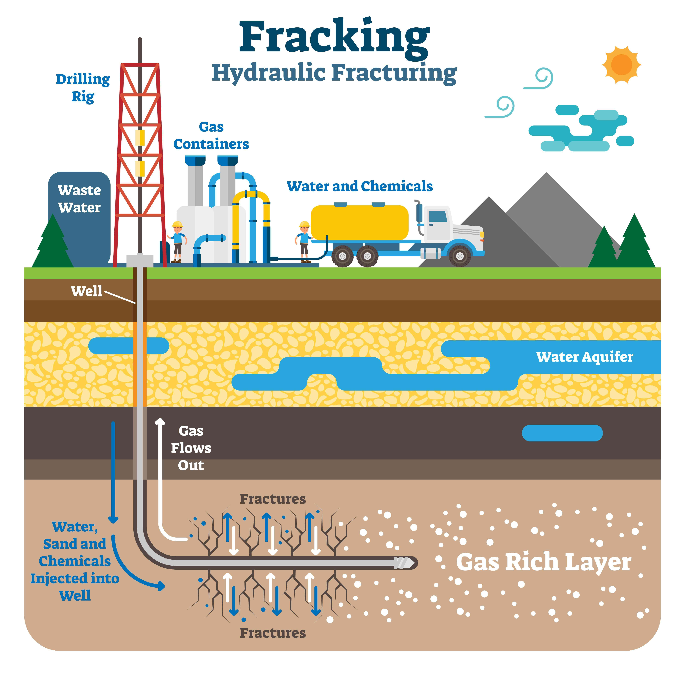

Vertical well drilling technology has significantly transformed petroleum extraction, leading to substantial improvements in resource recovery within the oil and gas industry. This method of drilling involves creating a straight, vertical borehole into the earth to access underlying oil or gas deposits. Its straightforward approach is not only cost-effective but also reduces the complexity associated with more advanced drilling methods such as directional or horizontal drilling. These characteristics make it an essential component in the toolkit of petroleum engineers, particularly in scenarios where simplicity and cost savings are paramount.

In parallel, the advent of algorithmic trading has profoundly impacted commodities markets, including those dealing in petroleum and its derivatives. By utilizing sophisticated algorithms, traders can automate the process of executing trades, which leads to enhanced efficiency and improved timing of transactions. These algorithms analyze real-time data and vast datasets, providing insights and predicting market trends that assist in making informed strategic decisions. The integration of such technology signifies a shift towards leveraging computational power to maximize financial gains.

This article investigates the complementary roles that vertical well drilling and algorithmic trading play in advancing both the extraction and trading aspects of petroleum resources. By understanding the nuances of vertical well drilling, its inherent advantages, and the transformative impact of algorithmic trading technology, stakeholders can significantly optimize their petroleum extraction and trading strategies, ultimately boosting efficiency and profitability. Recognizing the synergy between these technologies is crucial for industry participants aiming to maintain competitiveness in today's rapidly evolving market.

## Table of Contents

## Vertical Well Drilling: Definition and Principles

Vertical well drilling involves creating a borehole directly into the earth to access subsurface oil or gas deposits. This method is characterized by its straightforward approach, where the borehole is drilled vertically from the surface to the target formation. Vertical drilling is considered the most traditional and simplest form of well drilling, often providing an economically viable option when the reservoir lies directly beneath the drilling site.

One of the key advantages of vertical well drilling is its simplicity compared to more advanced methods like directional or horizontal drilling. The vertical design reduces the complexity involved in hitting the target zone, as it requires fewer calculations and adjustments in the well trajectory. This simplicity translates into cost savings in terms of both equipment and labor, as the process involves fewer components and steps, reducing both the need for specialized drilling technology and the time required for well completion.

The core component of vertical drilling is the drilling rig, comprising the machinery needed to bore through underground layers of rock and soil. The drilling rig plays a crucial role, providing the power and support structures necessary to maintain the stability and integrity of the borehole as it descends. The rig's design and capacity are tailored to the geological conditions expected at the drilling site, with considerations for factors such as depth and rock hardness.

Vertical well drilling remains particularly vital in offshore platforms. The logistical challenges presented by offshore drilling, such as stabilized platform requirements and limited space, make the straightforward nature of vertical wells advantageous. In these environments, the reduced equipment footprint and faster operational timelines of vertical wells can mitigate some of the complexities associated with drilling at sea.

Understanding the basic principles of vertical well drilling is essential for grasping its role in petroleum extraction. By providing a direct path to oil and gas deposits, vertical wells serve as an efficient means of testing and accessing subsurface resources. Despite advancements in drilling technology that allow for the extraction of more complex and less accessible reservoirs, vertical wells continue to play an integral role in the industry. They are especially useful in scenarios where simplicity, cost-effectiveness, or direct access to a reservoir is prioritized.

## Advantages of Vertical Well Drilling

Vertical drilling offers a straightforward method for extracting petroleum, primarily due to its direct and uncomplicated approach. It efficiently targets oil reserves located directly beneath the drilling site, which can lead to quicker access and optimized initial extraction phases. This method is especially beneficial in locations where the geological formations are well understood, making it easier to predict the positioning of oil reservoirs. 

One of the notable advantages of vertical drilling is its simplicity, which translates into fewer equipment requirements and reduced labor costs. This reduction in complexity can be a significant [factor](/wiki/factor-investing) when considering the cost-effectiveness of drilling operations. Since vertical wells generally demand less technology and manpower than their directional or horizontal counterparts, they often result in substantial cost savings.

Vertical wells are also vital during the preliminary surveys of a drilling project. They serve as an essential tool for understanding geological formations and identifying potential yield zones. By providing initial data on subsurface conditions, vertical wells offer valuable insights that can inform the planning and execution of further drilling activities.

Despite the increasing adoption of directional and horizontal drilling techniques, vertical wells continue to be economically viable under specific scenarios. They are particularly useful in areas where geological conditions are favorable and the reserves are situated directly beneath the surface. In such cases, the benefits of vertical drilling in terms of simplicity, cost, and efficiency can outweigh the advantages of more complex drilling methods.

## The Role of Simulation Technology in Vertical Drilling

Simulation technology has become an indispensable tool in vertical well drilling by allowing operators to plan and visualize drilling operations with increased precision. One of the foremost advantages of simulation technology is its ability to anticipate and mitigate risks associated with wellbore stability and drilling trajectories. By creating detailed models of geological formations, operators can foresee potential challenges such as deviations from the planned path or unexpected pressure zones, enabling proactive adjustments to the drilling strategy.

A notable benefit of using simulation technology is its capacity to serve as an educational platform. Operators and drilling personnel gain valuable insights through simulated drilling scenarios, which bolster decision-making abilities and reduce the likelihood of operational errors. This training aspect is crucial for enhancing staff competence and ensuring that operations remain safe and efficient.

From an operational perspective, simulations are instrumental in optimizing drilling parameters. By experimenting with various drilling scenarios, operators can determine the optimal settings for parameters such as weight on bit, rotational speed, and mud properties. This optimization process leads to improvements in drilling efficiency and a reduction in non-productive time, which are critical factors in the economic success of drilling projects.

As the oil and gas industry continues to encounter complex challenges, including deeper and more challenging reservoirs, the reliance on advanced simulation tools is increasing. These tools are continually evolving to incorporate new data and algorithms, ensuring that they remain at the forefront of technological innovation in vertical well drilling. By integrating real-time data analytics and [machine learning](/wiki/machine-learning), simulation technology is poised to offer even more precise predictions and operational guidance, setting a new standard for efficiency and safety in vertical drilling operations.

## Integration of Algorithmic Trading in Oil Markets

Algorithmic trading in oil markets leverages sophisticated algorithms to automate the trading process, capitalizing on real-time data analysis to execute trades with precision and speed. This technological advancement is pivotal in optimizing trading efficiency by processing large-[volume](/wiki/volume-trading-strategy) trades at the most opportune times, thereby maximizing profit potential and minimizing human intervention errors. At its core, [algorithmic trading](/wiki/algorithmic-trading) employs complex mathematical models and statistical analyses to predict market trends and respond accordingly.

The ability to analyze vast and diverse datasets gives algorithmic systems an edge in strategic decision-making. By continuously studying patterns, these algorithms can anticipate price movements, thus allowing traders to position themselves advantageously in the market. A pivotal element of this technology is its use in refining risk management strategies. Algorithms can incorporate real-time market conditions and historical data to identify potential risks and suggest mitigating strategies, thereby enhancing the robustness of trading approaches.

The convergence of petroleum extraction technologies with algorithmic trading can generate substantial financial benefits. For instance, the data derived from extraction processes can feed into trading algorithms, offering insights that could inform trading strategies. This integration promotes better price transparency as it provides a more comprehensive view of market dynamics, incorporating both supply-side developments and trading data.

Furthermore, algorithmic trading facilitates strategic asset allocation by enabling investors to adjust their portfolios with greater precision based on predictive insights. This capability supports dynamic rebalancing in response to volatile market conditions, ensuring that investment strategies remain aligned with changing market scenarios.

Overall, the integration of algorithmic trading within the oil markets represents a significant evolution in how trading operations are conducted. By merging technological advancements in extraction and trading, the industry stands to achieve enhanced profitability and operational efficiency, ensuring that stakeholders can navigate market complexities with greater confidence.

## Challenges and Future Directions

Both vertical well drilling and algorithmic trading, while transformative, encounter significant challenges that need addressing to ensure their sustainable and efficient application within the oil and gas industry. 

### Environmental Concerns and Market Volatility
One of the main challenges faced by vertical drilling is environmental impact. Traditional drilling methods can disrupt ecosystems and lead to emissions and spills that harm flora and fauna. As society becomes more environmentally conscious, industries must develop greener drilling technologies. Algorithmic trading, on the other hand, grapples with market [volatility](/wiki/volatility-trading-strategies). Algorithms can exacerbate market fluctuations, especially when multiple systems act on similar signals, leading to flash crashes or [liquidity](/wiki/liquidity-risk-premium) crises. Effective risk management tools and strategies are necessary to mitigate such impacts.

### Technological Advancements and Sustainability
To address these challenges, advancements in technology must incorporate sustainability measures. For vertical drilling, techniques such as carbon capture and storage (CCS) can be integrated to minimize emissions. Moreover, utilizing renewable energy sources for powering drilling operations can reduce the carbon footprint. Algorithmic trading requires developing robust models that can withstand volatile market conditions, incorporating real-time data and predictive analytics to enhance decision-making under uncertainty.

### Integration of AI and Machine Learning
The future of both sectors points to a deeper integration of [artificial intelligence](/wiki/ai-artificial-intelligence) (AI) and machine learning. In drilling, AI can optimize operational parameters, predict equipment failures, and improve accuracy in identifying resource-rich zones, thereby reducing waste and improving safety. Machine learning algorithms in trading can provide more nuanced insights into market trends and enhance the detection of anomalies, ensuring more stable performance even during turbulent market conditions.

### Evolution of Regulatory Frameworks
Regulatory bodies are expected to evolve their frameworks to accommodate rapid technological changes. In drilling, regulations must balance the promotion of technological innovation with the protection of the environment and public health. For trading, regulators will need to ensure transparency and fairness in markets increasingly dominated by algorithmic systems. This includes setting rules to prevent market manipulation and ensuring equitable access to market data.

Ultimately, the focus for both vertical drilling and algorithmic trading is on enhancing the synergy between extraction technologies and trading algorithms. This collaboration can lead to a more resilient industry landscape, capable of adapting to both technological advancements and external market pressures. By prioritizing sustainability and embracing innovation, the industry can achieve continued growth and stability.

## Conclusion

Vertical well drilling and algorithmic trading are pivotal technologies transforming the oil and gas industry and commodities markets. Their integration heralds a new level of efficiency and profitability, highlighting the importance for stakeholders to adapt and innovate. By embracing these technologies, industry players position themselves at the forefront of a rapidly shifting landscape, with the promise of ongoing advancements continually enhancing operational capabilities.

Vertical well drilling, as a fundamental technique, provides a cost-effective and direct means to access subterranean petroleum resources. Its simplicity and reduced resource requirements make it an enduring choice, particularly for preliminary resource assessments and straightforward extraction tasks. As drilling technologies evolve, further improvements in precision, efficiency, and environmental sustainability are anticipated, ensuring that vertical drilling remains a vital component of resource extraction strategies.

On the trading front, algorithmic trading offers a sophisticated mechanism for processing commodity trades efficiently. It utilizes advanced algorithms to analyze large datasets and execute trades at optimal times, allowing for improved price transparency and strategic decision-making. As trading technologies advance, greater integration of artificial intelligence and machine learning is expected, making trading strategies more adaptive and resilient to market fluctuations.

The synthesis of drilling technology and financial algorithms represents a strategic convergence that can optimize both resource extraction and market performance. By leveraging drilling data within algorithmic models, stakeholders can capitalize on real-time insights and adapt proactively to market demands. This symbiosis not only enhances operational efficiency but also drives financial gains, positioning the industry for long-term growth.

The ongoing evolution of these technologies promises continuous refinement, with regulatory frameworks and industry practices adapting to support innovation. As these advancements unfold, the synergy between drilling operations and algorithmic trading algorithms will become increasingly integral to managing risks and maximizing value in petroleum extraction and trading endeavors.

## References & Further Reading

[1]: Economides, M. J. (2000). ["Petroleum Production Systems"](https://archive.org/details/petroleumproduct0000econ). Prentice Hall.

[2]: ["Drilling Technology in Nontechnical Language"](https://www.amazon.com/Drilling-Technology-Nontechnical-Language-Devereux/dp/1593702647) by Steve Devereux.

[3]: ["Advances in Financial Machine Learning"](https://www.amazon.com/Advances-Financial-Machine-Learning-Marcos/dp/1119482089) by Marcos Lopez de Prado.

[4]: ["Technical Analysis of the Financial Markets: A Comprehensive Guide to Trading Methods and Applications"](https://www.amazon.com/Technical-Analysis-Financial-Markets-Comprehensive/dp/0735200661) by John J. Murphy.

[5]: ["Directional Drilling"](https://en.wikipedia.org/wiki/Directional_drilling) by Tom Pryor.

[6]: Fama, E. F. & French, K. R. (1993). ["Common risk factors in the returns on stocks and bonds."](https://www.sciencedirect.com/science/article/pii/0304405X93900235) Journal of Financial Economics, 33(1), 3-56.