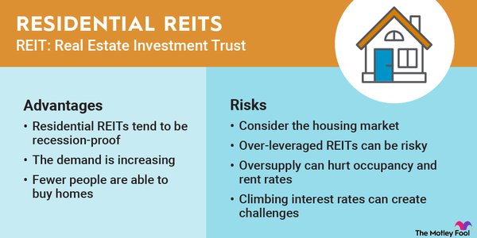

## Table of Contents

## What is a Real Estate Investment Trust (REIT)?

A Real Estate Investment Trust, or REIT, is a company that owns, operates, or finances income-generating real estate. It's like a mutual fund for real estate, where many people pool their money to invest in properties such as apartments, shopping centers, offices, and hotels. By investing in a REIT, people can earn a share of the income produced without having to buy or manage the property themselves.

REITs are popular because they offer a way to invest in real estate without the large amount of money needed to buy a property outright. They also have to pay out at least 90% of their taxable income as dividends to shareholders each year, which can provide a steady income stream. This makes REITs attractive to investors looking for regular income, similar to getting dividends from stocks.

## How does a REIT generate income for investors?

A REIT makes money for its investors by owning and managing properties that bring in rent. When people or businesses pay rent to live or work in the REIT's buildings, that money becomes income for the REIT. The REIT then takes this money, pays for things like building upkeep and management, and gives most of what's left to its investors as dividends. This is like sharing the rent money with everyone who invested in the REIT.

Besides rent, REITs can also make money by selling properties they own. If a REIT buys a building, fixes it up, and then sells it for more than they paid, they make a profit. This profit can also be shared with investors. So, a REIT can generate income in two main ways: through the regular rent they collect and through the profits they make when they sell properties. Both of these help increase the money investors get back from their investment in the REIT.

## What are the different types of REITs?

There are three main types of REITs: equity, mortgage, and hybrid. Equity REITs are the most common type. They own and manage real estate that produces income, like apartments, shopping centers, and office buildings. People who invest in equity REITs get money from the rent these properties make, and sometimes from selling the properties at a profit.

Mortgage REITs, or mREITs, are different. They don't own buildings; instead, they invest in mortgages or mortgage-backed securities. This means they lend money to people who want to buy real estate or buy pieces of loans that other people made. The money they make comes from the interest on these loans. Hybrid REITs combine both equity and mortgage REITs. They own properties and also invest in mortgages, so they make money from rent and interest.

These different types of REITs give investors choices based on what they want. If you like the idea of owning part of a shopping mall or an apartment building, you might choose an equity REIT. If you're more interested in the financial side of real estate, like lending money, a mortgage REIT might be better for you. And if you want a bit of both, a hybrid REIT could be the way to go.

## What are the benefits of investing in REITs?

Investing in REITs can be a good choice because they offer a way to make money from real estate without having to buy a whole building yourself. When you invest in a REIT, you get to share in the rent money that comes from the properties they own. This can give you a steady income, kind of like getting regular paychecks. Plus, REITs have to pay out at least 90% of their income to investors, which means you could get more money back compared to other types of investments.

Another benefit is that REITs let you spread your money across many different properties. This is called diversification, and it can help lower your risk. Instead of putting all your money into one building, you're investing in a bunch of different places like shopping centers, apartments, and offices. This way, if one property doesn't do well, you still have others that might be doing okay. Also, you don't have to worry about fixing up the buildings or finding tenants because the REIT takes care of all that work for you.

## What are the risks associated with REIT investments?

Investing in REITs can have some risks that you should know about. One risk is that the value of the properties the REIT owns can go down. If people stop wanting to rent or buy properties in certain areas, the REIT might not make as much money. This can mean less money for you as an investor. Also, if the economy gets worse, more people might not be able to pay their rent, which can hurt the REIT's income and the dividends they pay out to you.

Another risk is that REITs can be affected by interest rates. When interest rates go up, it can make it more expensive for the REIT to borrow money to buy or fix up properties. This can cut into their profits. Also, if interest rates are high, other investments like bonds might start to look more attractive to people, which could make the price of REIT shares go down.

Lastly, not all REITs are the same, and some might be managed better than others. If the people running the REIT make bad choices about which properties to buy or how to manage them, it can lead to lower returns for investors. So, it's important to do your homework and pick a REIT that is well-managed and has a good track record.

## How do REITs compare to direct real estate investments?

Investing in REITs is different from buying real estate directly. When you invest in a REIT, you're buying shares in a company that owns and manages properties. This means you don't have to deal with the day-to-day work of being a landlord, like fixing up the property or finding tenants. You just get a share of the rent money the REIT collects, which can give you a steady income without much effort. On the other hand, if you buy a property directly, you have to handle everything yourself, from maintenance to finding people to rent it. This can be a lot of work, but it also gives you more control over your investment.

Another big difference is how much money you need to start. Buying a property directly can cost a lot of money, and you might need a big down payment and a mortgage. With REITs, you can start investing with much less money because you're just buying shares. This makes it easier for more people to get into real estate investing. Also, REITs let you spread your money across many different properties, which can lower your risk. If you own one property directly and something goes wrong, like a big repair, it can really hurt your investment. But with a REIT, the risk is spread out over many properties, which can make it safer.

## What are the tax implications of investing in REITs?

When you invest in REITs, the tax rules can be a bit different from other investments. One key thing to know is that the dividends you get from a REIT are usually taxed as regular income, not as the lower tax rates you might get with stock dividends. This is because a big part of the REIT's income comes from rent, which is considered regular income. So, if you're in a high tax bracket, you might end up paying more in taxes on your REIT dividends than you would on dividends from stocks.

Another thing to keep in mind is that some of the dividends from REITs might be considered "qualified dividends" or "capital gains dividends," which can be taxed at a lower rate. But this depends on how the REIT makes its money. If the REIT sells properties and makes a profit, part of your dividend might be treated as a capital gain, which is usually taxed at a lower rate than regular income. It's a good idea to talk to a tax professional to understand how the dividends from your specific REIT will be taxed, because it can get a bit complicated.

## How do interest rate changes affect REIT performance?

When interest rates go up, it can make things harder for REITs. This is because REITs often borrow money to buy or fix up properties. If interest rates are higher, it costs more for them to borrow that money. This can cut into their profits because they have to pay more in interest. Also, when interest rates go up, other investments like bonds start to look more attractive to people. This can make the price of REIT shares go down because investors might move their money to these other investments.

On the other hand, when interest rates go down, it can be good for REITs. It becomes cheaper for them to borrow money, which can help them buy more properties or make improvements without spending as much on interest. This can lead to more profits for the REIT, and more money for investors in the form of dividends. Plus, when interest rates are low, REITs might look more attractive to investors compared to bonds, which could make the price of REIT shares go up.

## What role does diversification play in a REIT investment strategy?

Diversification is really important when you're investing in REITs. It means spreading your money across different types of properties and different areas. If you put all your money into one type of property, like shopping centers, and something bad happens to shopping centers, you could lose a lot of money. But if you spread your money across shopping centers, apartments, and office buildings, a problem with one type might not hurt as much because the others could still be doing well.

This way, diversification helps lower your risk. It's like not putting all your eggs in one basket. If one property or one area doesn't do well, the others might balance it out. Plus, different types of properties can do well at different times. For example, when the economy is doing great, office buildings might be in high demand. But if the economy slows down, people might still need places to live, so apartments could be a safer bet. By having a mix, you can keep your investment more stable and maybe even make more money over time.

## How can one evaluate the performance of a REIT?

To evaluate the performance of a REIT, you can start by looking at its funds from operations (FFO). FFO is like the profit of the REIT, but it's adjusted to show the money it makes from its properties, not just from buying and selling them. A higher FFO usually means the REIT is doing well. You can also check the dividend yield, which is how much money the REIT pays out to investors compared to the price of its shares. A high dividend yield can be good, but you need to make sure it's not too high because that might mean the REIT is having trouble and can't keep paying out that much money.

Another way to evaluate a REIT is by looking at its occupancy rate, which shows how full its buildings are. If a lot of the spaces are rented out, that's a good sign because it means the REIT is making money from rent. You should also look at the REIT's debt levels. If it has a lot of debt, it might have trouble paying it back, especially if interest rates go up. Finally, comparing the REIT to others in the same industry can help you see if it's doing better or worse than its competitors. This can give you a good idea of how well the REIT is performing overall.

## What are some advanced strategies for investing in REITs?

One advanced strategy for investing in REITs is to use sector rotation. This means you pay attention to which types of properties are doing well at different times and move your money around to take advantage of that. For example, if you think apartments are going to be in high demand because a lot of people are moving to a city, you might put more of your money into REITs that own apartments. Then, if you think office buildings are going to do better later because more businesses are opening, you can switch some of your money to REITs that own office buildings. This way, you can try to make more money by being in the right place at the right time.

Another strategy is to use leverage, which means borrowing money to invest more in REITs. If you think a certain REIT is going to do really well, you might borrow money to buy more shares of it. This can make your gains bigger if the REIT does well, but it can also make your losses bigger if it doesn't. So, it's a riskier way to invest, but it can pay off if you're right. You should be careful with this strategy and only use it if you understand the risks and can handle them.

A third strategy is to look for REITs that are undervalued. This means finding REITs that are trading at a lower price than they should be based on their earnings and other factors. You can do this by looking at things like the price-to-FFO ratio, which compares the price of the REIT's shares to its funds from operations. If you find a REIT with a low price-to-FFO ratio, it might be a good buy because it could go up in value once other people realize it's undervalued. This strategy takes a lot of research, but it can help you find hidden gems in the REIT market.

## How do global economic conditions impact the viability of REITs?

Global economic conditions can really affect how well REITs do. When the world economy is doing well, people have more money to spend on things like renting apartments or shopping in malls. This means REITs that own these kinds of properties can make more money from rent. Also, when the economy is good, more businesses might want to rent office space, which helps REITs that own office buildings. But if the global economy slows down, people might not have as much money to spend, and businesses might cut back on renting space. This can hurt the income of REITs, making it harder for them to pay dividends to investors.

Another way global economic conditions impact REITs is through interest rates. When the world economy is doing well, interest rates might go up because central banks want to control inflation. Higher interest rates make it more expensive for REITs to borrow money to buy or fix up properties. This can cut into their profits and make it harder for them to grow. On the other hand, if the global economy is struggling, interest rates might go down to help boost spending. Lower interest rates can make it cheaper for REITs to borrow money, which can help them buy more properties and increase their income. So, keeping an eye on global economic conditions can help you understand how REITs might perform in the future.

## What are some strategies for investing in REITs?

Real Estate Investment Trusts (REITs) present a unique opportunity for investors seeking to gain exposure to real estate markets without the complexities of direct property ownership. Effective REIT investment strategies hinge upon robust market analysis and prudent diversification.

**Market Analysis and Diversification**

Investors should initially focus on comprehensive market analysis, which involves evaluating geographical regions where REITs operate, as well as assessing sector-specific performance. For instance, market segments such as industrial, residential, or commercial real estate have different demand cycles and risk profiles. Diversification can be achieved by investing in various types of REITs to spread risk across different sectors and geographies. Consequently, this approach mitigates the [volatility](/wiki/volatility-trading-strategies) inherent in any single asset class, enhancing the stability of investment returns.

**Key Metrics for Evaluating REIT Performance**

To gauge the performance of REITs, investors commonly rely on two critical metrics: Funds From Operations (FFO) and Adjusted Funds From Operations (AFFO). 

- **Funds From Operations (FFO):** This metric is crucial for measuring a REIT's cash flow generated from operations. FFO is calculated by adjusting net income for depreciation, amortization, and losses on sales of investment properties. The formula is:
$$
  \text{FFO} = \text{Net Income} + \text{Depreciation} + \text{Amortization} - \text{Gains on Sales of Property}

$$

- **Adjusted Funds From Operations (AFFO):** AFFO takes the analysis further by considering capital expenditures and other adjustments to provide a more accurate picture of the REIT's financial health. AFFO is derived from FFO, adjusted for recurring capital expenditures and maintenance costs. It can be expressed as:
$$
  \text{AFFO} = \text{FFO} - \text{Recurring Capital Expenditures} - \text{Straight-lining of Rent}

$$

The use of FFO and AFFO allows investors to evaluate earnings generated specifically from the REIT's core operations, offering clearer insights into its ongoing profitability and potential for growth.

**Impact of Economic Conditions**

Economic conditions substantially impact REIT investments. Factors such as interest rates, inflation, and broader economic cycles can influence real estate markets. Historically, rising interest rates can lead to increased borrowing costs for REITs, potentially compressing profit margins. Conversely, in low-interest-rate environments, REITs often benefit from lower financing costs, which can enhance acquisition opportunities and overall returns.

Additionally, macroeconomic factors such as employment rates, consumer confidence, and urbanization trends play pivotal roles in influencing demand for various real estate sectors, affecting REIT performance. For instance, economic expansion can drive increased demand for commercial real estate, while economic downturns might heighten residential property demand due to downsizing trends.

In summary, successful REIT investment strategies require diligent market analysis, disciplined diversification, and proactive consideration of prevailing economic conditions. By focusing on key performance metrics like FFO and AFFO, investors can better navigate the complexities of the real estate market and optimize their portfolios for sustainable income and growth.

## References & Further Reading

[1]: Nareit. ["What is a REIT?"](https://www.reit.com/what-reit/reit-basics) National Association of Real Estate Investment Trusts.

[2]: Lo, Andrew W. (2001). ["Risk Management for Hedge Funds: Introduction and Overview."](https://papers.ssrn.com/sol3/papers.cfm?abstract_id=275153) SSRN Electronic Journal.

[3]: Geltner, D., Miller, N.G., Clayton, J., & Eichholtz, P. (2013). ["Commercial Real Estate Analysis and Investments."](https://www.researchgate.net/publication/245702364_Commercial_Real_Estate_Analysis_and_Investments) Cengage Learning.

[4]: Chan, Ernest P. (2009). ["Quantitative Trading: How to Build Your Own Algorithmic Trading Business."](https://github.com/ftvision/quant_trading_echan_book) Wiley.

[5]: Jansen, Stefan (2020). ["Machine Learning for Algorithmic Trading."](https://github.com/stefan-jansen/machine-learning-for-trading) Packt Publishing.

[6]: Python Software Foundation. ["Python for Data Analysis and more."](https://realpython.com/python-for-data-analysis/) Python.org.

[7]: Ling, D.C., & Naranjo, A. (1999). ["The Integration of Commercial Real Estate Markets and Stock Markets."](https://onlinelibrary.wiley.com/doi/abs/10.1111/1540-6229.00781) Real Estate Economics.