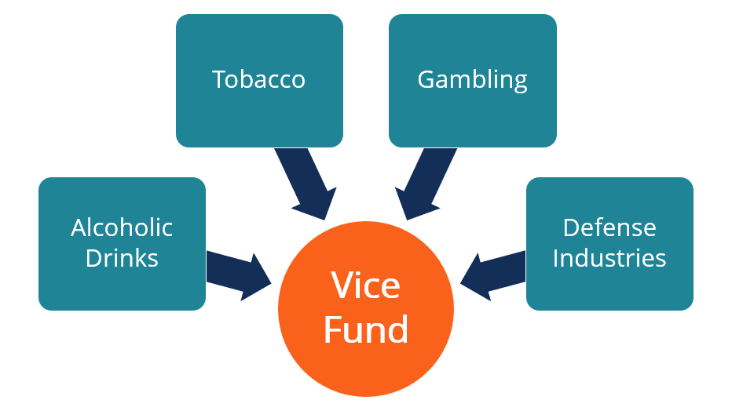

## Table of Contents

## What is a Vice Fund?

A Vice Fund is a type of investment fund that focuses on companies involved in industries often considered controversial or morally questionable. These industries typically include tobacco, alcohol, gambling, and sometimes even weapons or adult entertainment. The idea behind a Vice Fund is that these companies can be profitable because people continue to buy their products or services, even during tough economic times.

People might invest in a Vice Fund because they believe these companies will do well financially. Even though some people might not agree with the industries, they see them as a good way to make money. However, investing in a Vice Fund can be risky because these industries can face strict laws and public criticism, which might affect their profits.

## What types of industries does a Vice Fund typically invest in?

A Vice Fund usually invests in companies that are part of industries some people might see as bad or harmful. These industries include tobacco, which makes cigarettes and other smoking products, alcohol, which makes beer, wine, and spirits, and gambling, which includes casinos and betting companies. These businesses are often called "vices" because they can be addictive or bad for health, but they also make a lot of money.

Sometimes, Vice Funds also put money into companies that make weapons or are involved in adult entertainment. These industries can be controversial too, but they can still be profitable. People might not like these businesses, but they keep buying their products or services, which is why investors think they can make money from them.

Even though these industries can make a lot of money, they can also be risky. Governments might make strict rules about them, or people might start to like them less. This can make it harder for the companies to make money, which can affect the Vice Fund's profits.

## How does a Vice Fund differ from other mutual funds or ETFs?

A Vice Fund is different from other mutual funds or ETFs because it focuses on investing in companies from industries that some people think are bad or harmful, like tobacco, alcohol, gambling, and sometimes weapons or adult entertainment. These industries are often called "vices" because they can be addictive or bad for health. Other mutual funds or ETFs might invest in a wide range of industries, like technology, healthcare, or consumer goods, and they might avoid the controversial industries that Vice Funds focus on.

The main reason people invest in Vice Funds is because they believe these companies will make a lot of money, even when the economy is not doing well. People keep buying products like cigarettes, alcohol, and gambling services, which can make these companies very profitable. On the other hand, other mutual funds or ETFs might spread their investments across many different types of companies to reduce risk, but they might not have the same focus on industries that are considered vices.

## What are the potential benefits of investing in a Vice Fund?

One big benefit of investing in a Vice Fund is that the companies it invests in can make a lot of money. People keep buying things like cigarettes, alcohol, and gambling services, even when the economy is not doing well. This means these companies can be very profitable, and if you invest in them through a Vice Fund, you might make more money than with other types of investments.

Another benefit is that Vice Funds can help spread out your investments. If you already have money in other types of funds, adding a Vice Fund can give you a different kind of investment. This can help protect your money because if one type of investment does badly, the Vice Fund might still do well. So, it can be a good way to balance your investments and maybe make more money.

## What are the risks associated with investing in a Vice Fund?

One big risk of investing in a Vice Fund is that the industries it focuses on, like tobacco, alcohol, and gambling, can face a lot of rules and laws from the government. These rules can make it harder for the companies to make money. For example, if the government decides to put higher taxes on cigarettes or make new laws about gambling, the companies in the Vice Fund might not do as well, and your investment could lose value.

Another risk is that people's opinions about these industries can change. If more people start to think that smoking, drinking, or gambling is bad, they might buy less of these products. This can hurt the companies' profits and make the Vice Fund less valuable. Also, because Vice Funds focus on just a few types of industries, they might not be as safe as other funds that spread their investments across many different kinds of companies. If something bad happens to one of these industries, it could affect your whole investment in the Vice Fund.

## How has the performance of Vice Funds been historically?

Historically, Vice Funds have done pretty well. The companies they invest in, like those in the tobacco, alcohol, and gambling industries, often make a lot of money because people keep buying their products even when the economy is not doing great. For example, during tough economic times, people might still buy cigarettes or go to casinos. This has helped Vice Funds to perform better than some other types of funds, especially during downturns.

However, the performance of Vice Funds can also be up and down. Sometimes, new laws or taxes can hurt the companies in these industries. For instance, if the government decides to put higher taxes on alcohol or make it harder to gamble, the companies might not make as much money. Also, if people start to think that these products are bad and buy less of them, it can affect the Vice Fund's performance. So, while Vice Funds have had good times, they can also face challenges that make their performance less predictable.

## What is the investment strategy of a typical Vice Fund?

A typical Vice Fund focuses on investing in companies from industries that some people might think are bad or harmful, like tobacco, alcohol, and gambling. The main idea behind this strategy is that these companies can make a lot of money because people keep buying their products, even when the economy is not doing well. For example, during tough times, people might still buy cigarettes or go to casinos. This steady demand can help the Vice Fund perform better than other types of funds, especially during economic downturns.

However, the investment strategy of a Vice Fund also comes with risks. These industries can face strict laws and regulations from the government, which can make it harder for the companies to make money. For instance, if the government decides to put higher taxes on alcohol or make new rules about gambling, it can hurt the companies' profits. Also, if people start to think that these products are bad and buy less of them, it can affect the Vice Fund's performance. So, while the strategy aims to take advantage of the steady demand for these products, it also needs to carefully watch for changes in laws and public opinion.

## How do Vice Funds select their investments?

Vice Funds pick their investments by looking at companies in industries that some people think are bad or harmful, like tobacco, alcohol, and gambling. They choose these companies because they believe they can make a lot of money. People keep buying things like cigarettes, beer, and casino services, even when the economy is not doing well. This steady demand can help the Vice Fund make more money than other types of funds, especially during tough economic times.

However, Vice Funds also have to be careful. They need to watch out for new laws and rules from the government that can make it harder for these companies to make money. For example, if the government decides to put higher taxes on alcohol or make new rules about gambling, it can hurt the companies' profits. Also, if people start to think that these products are bad and buy less of them, it can affect the Vice Fund's performance. So, while they focus on these industries, they also need to keep an eye on changes in laws and public opinion to make smart investment choices.

## What role do ESG (Environmental, Social, and Governance) factors play in Vice Fund investment decisions?

[ESG](/wiki/esg-investing) factors, which stand for Environmental, Social, and Governance, usually don't play a big role in Vice Fund investment decisions. Vice Funds focus on industries like tobacco, alcohol, and gambling, which are often seen as bad or harmful. These industries might not do well when it comes to ESG factors because they can be bad for the environment, society, or have poor governance. So, Vice Funds might not care as much about ESG factors because their main goal is to make money from these controversial industries.

However, some investors might still think about ESG factors when choosing to invest in a Vice Fund. They might look at how the companies in the fund handle things like pollution, worker rights, or how they are run. Even though Vice Funds focus on making money from industries that are often seen as bad, some investors might want to make sure the companies are trying to do better in terms of ESG. This can help them feel better about their investment, even if the main focus is still on making money from these industries.

## How can an investor evaluate the performance of a Vice Fund?

An investor can evaluate the performance of a Vice Fund by looking at how much money the fund has made over time. They can check the fund's returns, which show how much the investment has grown. It's good to compare these returns to other types of funds or to a general market index, like the S&P 500, to see if the Vice Fund is doing better or worse. Also, looking at the fund's performance during different economic times, like during a recession or a boom, can help understand how well it handles ups and downs.

Another way to evaluate a Vice Fund is by looking at its risk. This means checking how much the fund's value goes up and down, which is called [volatility](/wiki/volatility-trading-strategies). A Vice Fund might be riskier because it focuses on just a few industries, like tobacco, alcohol, and gambling. Investors should also think about any fees they have to pay to invest in the fund, as these can affect the overall return. By considering both the returns and the risks, an investor can get a good idea of how well a Vice Fund is performing and if it's a good fit for their investment goals.

## What are some examples of well-known Vice Funds?

One well-known Vice Fund is the Vice Fund (VICEX), managed by USA Mutuals. This fund invests in companies from industries like tobacco, alcohol, gaming, and defense. It's popular because it focuses on businesses that some people think are bad but can still make a lot of money. People like this fund because it can do well even when the economy is not doing great.

Another example is the AdvisorShares Vice [ETF](/wiki/etf-trading-strategies) (VICE). This fund also invests in companies involved in alcohol, tobacco, and gaming, but it's set up as an exchange-traded fund, which means you can buy and sell it like a stock. It's a good choice for investors who want to put money into these industries but also want the flexibility of trading during the day. Both of these funds show how Vice Funds can be a way to invest in controversial but potentially profitable industries.

## How might future regulatory changes impact the strategy and performance of Vice Funds?

Future regulatory changes could have a big effect on how Vice Funds work and how well they do. Governments might make new rules or raise taxes on industries like tobacco, alcohol, and gambling. If this happens, the companies in these industries might make less money. For example, if the government puts a higher tax on cigarettes, people might buy fewer of them, and that could hurt the profits of tobacco companies. This means Vice Funds, which invest in these companies, might not do as well as they used to.

On the other hand, if the rules become less strict, Vice Funds could do better. For instance, if the government makes it easier for casinos to operate, more people might go to them, and gambling companies could make more money. This would be good for Vice Funds because their investments would go up in value. So, Vice Funds need to keep a close eye on what the government might do next, because these changes can really shake things up for them.

## References & Further Reading

[1]: Bergstra, J., Bardenet, R., Bengio, Y., & Kégl, B. (2011). ["Algorithms for Hyper-Parameter Optimization."](https://papers.nips.cc/paper/4443-algorithms-for-hyper-parameter-optimization) Advances in Neural Information Processing Systems 24.

[2]: ["Advances in Financial Machine Learning"](https://www.amazon.com/Advances-Financial-Machine-Learning-Marcos/dp/1119482089) by Marcos Lopez de Prado

[3]: ["Evidence-Based Technical Analysis: Applying the Scientific Method and Statistical Inference to Trading Signals"](https://books.google.com/books/about/Evidence_Based_Technical_Analysis.html?id=MeoJAQAAMAAJ) by David Aronson

[4]: ["Machine Learning for Algorithmic Trading"](https://github.com/stefan-jansen/machine-learning-for-trading) by Stefan Jansen

[5]: ["Quantitative Trading: How to Build Your Own Algorithmic Trading Business"](https://www.amazon.com/Quantitative-Trading-Build-Algorithmic-Business/dp/1119800064) by Ernest P. Chan