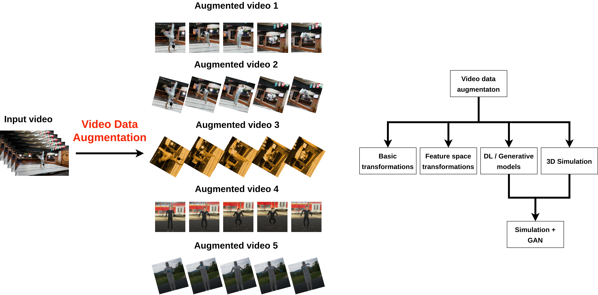

## Table of Contents

## What is video data augmentation in the context of machine learning?

Video data augmentation in machine learning is a technique used to increase the amount and diversity of training data by applying various transformations to existing video clips. This process helps improve the performance and robustness of machine learning models, especially in tasks like video classification, object detection, and action recognition. By creating new variations of the original videos, the model can learn to recognize patterns and features more effectively, even when the input data varies due to factors like different lighting conditions, camera angles, or motion speeds.

Common techniques for video data augmentation include frame flipping, rotation, cropping, and color adjustments. For example, flipping a video horizontally can help a model learn to recognize actions that are independent of the direction they are performed. Similarly, adjusting the brightness or contrast of video frames can teach the model to be more resilient to changes in lighting. These transformations can be applied at different stages of the video processing pipeline, either before or during training, allowing the model to generalize better to new, unseen videos.

## Why is video data augmentation important for training machine learning models?

Video data augmentation is important for training machine learning models because it helps increase the amount of data available for training. When you have more data, your model can learn better and make more accurate predictions. By creating new versions of existing videos through techniques like flipping, rotating, or changing the brightness, you can teach the model to recognize patterns in different situations. This means the model can work well even if the new videos it sees are a bit different from the ones it was trained on.

Another reason video [data augmentation](/wiki/data-augmentation) is important is that it helps the model become more robust. This means the model can handle changes in the video, like different lighting or camera angles, without getting confused. For example, if a model is trained to recognize a person walking, it should still recognize walking even if the video is flipped or the colors are changed. By showing the model many different versions of the same action, it learns to focus on what's important and ignore small changes that don't matter. This makes the model more reliable and useful in real-world situations where videos can vary a lot.

## What are the basic techniques used in video data augmentation?

Video data augmentation uses several basic techniques to create new versions of videos. One common technique is frame flipping, where each frame of the video is flipped horizontally or vertically. This helps the model learn to recognize actions and objects from different perspectives. Another technique is rotation, where frames are rotated by a certain angle. This can help the model understand that an object or action looks the same even if the video is not perfectly aligned. Cropping is also used, where parts of the frame are cut out to focus on specific areas or to simulate different camera zooms.

Color adjustments are another set of techniques used in video data augmentation. This includes changing the brightness, contrast, or saturation of the video frames. By doing this, the model learns to recognize patterns even when the lighting conditions change. For example, if a video is made darker or lighter, the model should still be able to identify what is happening. Additionally, techniques like frame rate adjustment can be used to speed up or slow down the video, helping the model understand actions at different speeds.

These techniques can be combined in various ways to create a diverse set of training data. For instance, a video might be flipped, rotated, and have its brightness adjusted all at once. This variety helps the model generalize better, meaning it can perform well on new videos that it hasn't seen before. By using these basic techniques, video data augmentation makes [machine learning](/wiki/machine-learning) models more accurate and reliable in real-world applications.

## How does video data augmentation differ from image data augmentation?

Video data augmentation and image data augmentation both aim to increase the amount and variety of data for training machine learning models, but they handle different types of data. Image data augmentation works with single pictures, applying transformations like flipping, rotating, or changing the color to create new versions of those pictures. These transformations help the model learn to recognize objects and patterns in different situations. On the other hand, video data augmentation deals with sequences of images, or frames, that make up a video. It not only applies similar transformations to each frame but also considers the temporal aspect of the video, like the order of frames and how actions change over time.

The key difference lies in how video data augmentation must maintain the continuity and flow of the video. For example, if you flip a video horizontally, you need to flip every frame to keep the action consistent. Similarly, if you speed up or slow down a video, you're changing the timing of the actions, which is something you don't do with images. This means video data augmentation techniques need to be more complex to ensure that the new videos still make sense and accurately represent the actions or events they show. By considering both the individual frames and the sequence of those frames, video data augmentation helps models learn to recognize and understand dynamic scenes and movements in a way that image data augmentation cannot.

## What is temporally consistent spatial augmentation in video data augmentation?

Temporally consistent spatial augmentation in video data augmentation means changing every frame of a video in the same way so that the video still makes sense after the change. Imagine you have a video of someone walking. If you flip the video horizontally, you need to flip every single frame. This way, the person keeps walking in the same direction throughout the video. If you didn't flip every frame, the person might suddenly change direction, which would make the video confusing and not useful for training a machine learning model.

This kind of augmentation is important because it helps the model learn to recognize actions and objects even when the video is changed. For example, if the model is trained on videos where people are walking, and those videos are flipped, the model should still recognize walking no matter which direction the person is going. By keeping the changes consistent across all frames, the model can learn from the video without getting confused by sudden changes in the action or scene. This makes the model more reliable and able to handle real-world videos where things can look different but still show the same actions.

## Can you explain how to implement basic video data augmentation techniques using popular libraries?

To implement basic video data augmentation techniques, you can use popular libraries like OpenCV and PyTorch. Let's start with OpenCV, which is great for handling video files. You can read a video, apply transformations like flipping or rotating to each frame, and then save the new video. For example, to flip a video horizontally, you would read each frame, use the `cv2.flip()` function to flip it, and then write the flipped frame to a new video file. Similarly, to change the brightness, you can use `cv2.convertScaleAbs()` to adjust the brightness of each frame before writing it to the new video. Here's a simple example of how to flip a video using OpenCV:

```python
import cv2

# Open the input video
cap = cv2.VideoCapture('input_video.mp4')

# Get video properties
frame_width = int(cap.get(3))
frame_height = int(cap.get(4))
fps = int(cap.get(5))

# Define the codec and create VideoWriter object
fourcc = cv2.VideoWriter_fourcc(*'mp4v')
out = cv2.VideoWriter('output_video.mp4', fourcc, fps, (frame_width, frame_height))

while True:
    ret, frame = cap.read()
    if not ret:
        break

    # Flip the frame horizontally
    flipped_frame = cv2.flip(frame, 1)

    # Write the flipped frame
    out.write(flipped_frame)

# Release everything when done
cap.release()
out.release()
```

For more advanced techniques, you might use PyTorch, which is widely used in machine learning. PyTorch has a library called `torchvision` that includes tools for video augmentation. You can use `torchvision.transforms` to apply transformations like rotation, cropping, or color adjustments to each frame of a video. These transformations can be applied on-the-fly during training, which is helpful for creating diverse training data. For example, you can define a series of transformations and apply them to a video tensor using `torchvision.transforms.Compose()`. Here's a simple example of how to rotate and adjust the brightness of a video using PyTorch:

```python
import torch
import torchvision.transforms as transforms
from torchvision.io import read_video

# Read the video
video, _, _ = read_video('input_video.mp4')

# Define transformations
transform = transforms.Compose([
    transforms.RandomRotation(degrees=15),
    transforms.ColorJitter(brightness=0.2),
])

# Apply transformations to each frame
augmented_video = []
for frame in video:
    frame_tensor = frame.permute(2, 0, 1).float() / 255.0  # Convert to tensor
    augmented_frame = transform(frame_tensor).permute(1, 2, 0).mul(255).byte()
    augmented_video.append(augmented_frame)

# Convert back to tensor
augmented_video = torch.stack(augmented_video)

# Save the augmented video
torchvision.io.write_video('output_video.mp4', augmented_video, fps=30)
```

These examples show how you can use OpenCV and PyTorch to implement basic video data augmentation techniques, helping you create more diverse training data for your machine learning models.

## What are the challenges associated with maintaining temporal consistency in video data augmentation?

Keeping videos looking smooth and natural after changing them is a big challenge in video data augmentation. When you change each picture in a video, you have to make sure that the changes don't make the video look weird or jumpy. For example, if you flip a video to make it look like everything is happening from the other side, you have to flip every single picture the same way. If you don't, the video might show someone suddenly changing direction, which would confuse the machine learning model trying to learn from it.

Another challenge is making sure that changes to things like brightness or color look the same across the whole video. If you make one part of the video brighter and another part darker, it might look like the lighting changed suddenly, which doesn't happen in real life. This can make it hard for the model to understand what's happening in the video. To keep the video looking natural, you need to apply the same changes to every picture, which can be tricky and might need a lot of computer power to do quickly.

## How can video data augmentation be used to improve model performance on specific tasks like action recognition?

Video data augmentation helps improve model performance on tasks like action recognition by increasing the variety of training data. When you train a model to recognize actions, like someone running or jumping, you want it to work well no matter how the video looks. By flipping, rotating, or changing the brightness of videos, you create new versions of the same action. This teaches the model to recognize running or jumping even if the video is flipped or the lighting is different. The more different versions of the same action the model sees, the better it gets at understanding what running or jumping looks like in any situation.

Keeping the video smooth and natural after changing it is important for action recognition. If the changes make the video look jumpy or weird, the model might get confused about what action it's seeing. For example, if you flip a video of someone running, you need to flip every frame so the person keeps running in the same direction. If you don't, the video might show the person suddenly changing direction, which doesn't help the model learn. By making sure the changes are the same for every frame, the model can focus on the action itself and not get distracted by sudden changes in the video.

## What advanced techniques exist for video data augmentation beyond simple spatial transformations?

Beyond simple spatial transformations like flipping or rotating, there are more advanced techniques for video data augmentation that can help improve machine learning models even more. One such technique is temporal augmentation, where you change the timing of the video. For example, you can speed up or slow down the video to make the model learn actions at different speeds. Another advanced method is frame interpolation, where you add new frames between existing ones to make the video smoother or to change how fast things happen. These techniques help the model understand actions better because they see them in different ways.

Another advanced technique is style transfer, where you change the look of the video to match another style, like making it look like a painting or a different type of video. This can help the model learn to recognize actions no matter how the video looks. Additionally, you can use generative models like GANs (Generative Adversarial Networks) to create entirely new videos that look real but are different from the original ones. These new videos can show the same actions in new settings or with different people, making the training data even more diverse. By using these advanced techniques, you can make your model much better at recognizing actions in all sorts of videos.

## How do you evaluate the effectiveness of different video data augmentation strategies?

To evaluate how well different video data augmentation strategies work, you need to see if they make your machine learning model better at its job. One way to do this is by looking at the model's accuracy, which is how often it gets the right answer. If the model can recognize actions in videos more accurately after using a certain augmentation strategy, then that strategy is probably helping. You can also look at other measures like precision, which tells you how many of the model's positive predictions are correct, and recall, which tells you how many of the actual positive cases the model finds. By comparing these measures before and after using different augmentation techniques, you can see which ones make the biggest difference.

Another way to check the effectiveness of video data augmentation is by using cross-validation. This means you split your video data into different groups and train your model on some of the groups while testing it on the others. You do this several times, using different groups for training and testing each time. If the model's performance gets better with each round of cross-validation after using a specific augmentation strategy, that's a good sign. You can also use techniques like A/B testing, where you train two versions of your model: one with the augmentation strategy and one without. By comparing how well these models do on the same set of videos, you can see if the augmentation strategy makes a difference.

## What are the current research trends in video data augmentation?

Current research trends in video data augmentation are focusing on making machine learning models even smarter by using more advanced techniques. One big trend is using generative models like GANs to create new videos that look real but are different from the original ones. These new videos can show the same actions in different settings or with different people, making the training data much more diverse. Researchers are also looking into how to use these generative models to create videos that are very similar to the ones the model will see in real life, which helps the model learn to recognize actions in all sorts of situations.

Another trend is improving temporal augmentation, where the timing of the video is changed. Researchers are working on ways to speed up or slow down videos in a way that still looks natural. This helps the model understand actions at different speeds. They are also exploring frame interpolation, which adds new frames between existing ones to make the video smoother or to change how fast things happen. By using these advanced techniques, researchers hope to make models better at recognizing actions in videos, no matter how the videos look or how fast the actions happen.

## How can video data augmentation be integrated into a machine learning pipeline for optimal results?

To get the best results from video data augmentation in a machine learning pipeline, you need to add it in a way that helps the model learn better without making things too complicated. Start by figuring out what kind of videos your model will see in real life and what kinds of changes might happen, like different lighting or camera angles. Then, choose augmentation techniques that match these changes, like flipping videos, adjusting brightness, or even speeding up or slowing down the video. You can use libraries like OpenCV or PyTorch to do this. For example, with OpenCV, you can read each frame of a video, flip it, and then write it to a new video file. With PyTorch, you can set up a series of transformations that get applied to each frame on-the-fly during training. This way, the model sees different versions of the same action, which helps it learn to recognize actions no matter how the video looks.

Once you have your augmentation techniques, you need to test them to see if they make the model better. You can do this by comparing the model's performance before and after using the augmentations. Look at measures like accuracy, precision, and recall to see if the model is getting better at recognizing actions. You can also use cross-validation, where you split your video data into different groups and train your model on some while testing it on others. If the model's performance improves with each round of cross-validation after using the augmentation techniques, that's a good sign. By carefully choosing and testing your augmentation strategies, you can make sure they are helping your model learn better and perform well on real-world videos.