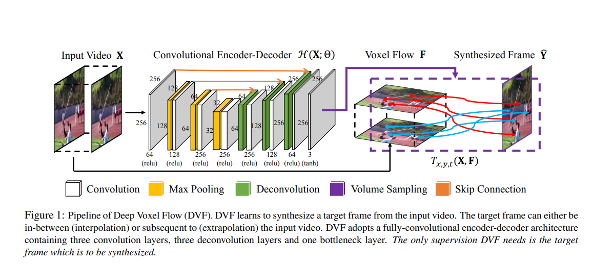

## Table of Contents

## What is Video Frame Interpolation?

Video Frame Interpolation is a technique used to create new frames between existing ones in a video. This process helps to make videos smoother and more fluid, especially when the original video has a low frame rate. By adding these new frames, the video appears to play more continuously, reducing the choppiness that can occur in fast-moving scenes or when the frame rate is not high enough.

The basic idea behind frame interpolation is to estimate the motion between two consecutive frames and then generate a new frame that represents what would happen halfway between them. For example, if you have a video of a car moving from left to right, the interpolation algorithm would analyze the movement of the car and create a new frame showing the car in a position between its starting and ending points. This can be done using various methods, including optical flow, which tracks the movement of pixels from one frame to the next.

While video frame interpolation can significantly improve the visual quality of a video, it also has its challenges. One of the main difficulties is ensuring that the interpolated frames look natural and do not introduce artifacts or distortions. Advanced algorithms and machine learning techniques are often used to enhance the accuracy and realism of the interpolated frames, making the process more effective and reliable.

## Why is Video Frame Interpolation important in video processing?

Video Frame Interpolation is important in video processing because it helps make videos look smoother and more enjoyable to watch. When videos have a low frame rate, they can appear choppy, especially during fast-moving scenes. By adding new frames between the existing ones, frame interpolation fills in the gaps and makes the motion look more continuous. This is particularly useful for sports videos, action movies, or any content where smooth motion is important for the viewer's experience.

Another reason why frame interpolation is important is that it can help convert videos from one frame rate to another. For example, if you have a video shot at 24 frames per second (fps) and you want to play it on a device that supports 60 fps, frame interpolation can create the additional frames needed to make the video compatible. This process not only improves the video's appearance but also ensures that it can be enjoyed on a wider range of devices and platforms without losing quality.

## What are the basic principles behind Video Frame Interpolation?

Video Frame Interpolation works by creating new frames that fit between existing ones in a video. The main idea is to look at two frames and guess what should happen in between them. Imagine you have a picture of a car on the left side of the road and another picture of the same car on the right side. To make the car move smoothly, you need a picture of the car in the middle. Frame interpolation helps create this middle picture by figuring out how the car moved from left to right.

To do this, computers use special math to track how things move from one frame to the next. This is called optical flow. It's like drawing arrows to show where each part of the picture is going. Once the computer knows where everything is moving, it can make a new frame that shows everything halfway through its journey. This new frame makes the video look smoother because it fills in the gaps between the original frames.

While the basic idea is simple, making it work well can be tricky. The computer has to be very smart to make sure the new frames look real and don't have any weird mistakes. Sometimes, they use fancy math and learning tricks to make the new frames look even better. This helps the video look smooth and natural, no matter how fast things are moving.

## How does Video Frame Interpolation improve video quality?

Video Frame Interpolation makes videos look better by adding new frames between the original ones. When a video has a low frame rate, it can look choppy, especially if things are moving fast. By creating these new frames, the video becomes smoother and more enjoyable to watch. For example, if you have a video of a ball flying through the air, frame interpolation can add frames to show the ball moving smoothly from one point to another, making the motion look more natural.

This technique is also important for changing a video's frame rate. If you want to play a video that was shot at 24 frames per second on a device that works best at 60 frames per second, frame interpolation can create the extra frames needed. This makes the video look good on different devices without losing quality. By filling in the gaps between frames, the video appears more fluid and lifelike, enhancing the overall viewing experience.

## What are some common challenges faced in Video Frame Interpolation?

One of the main challenges in Video Frame Interpolation is making sure the new frames look real and natural. When a computer tries to guess what should happen between two frames, it can sometimes make mistakes. These mistakes can show up as weird lines, blurry spots, or other strange things in the video. This is called an artifact. To avoid these problems, the computer needs to be very smart and use special math to figure out how things are moving. Even then, it's hard to get it perfect every time, especially if the video has a lot of fast movement or complex scenes.

Another challenge is dealing with different types of videos. Some videos might have a lot of action, while others might be more still. The computer has to be able to handle all these different situations. For example, if a video has a lot of people moving around, the computer needs to track each person's movement carefully. If it gets it wrong, the new frames might look off. Also, if the video has a lot of details, like leaves blowing in the wind, it can be hard to make the new frames look right. This is why researchers keep working on better ways to do frame interpolation, using things like [machine learning](/wiki/machine-learning) to help the computer learn from lots of different videos.

## Can you explain the architecture of IFNet for Video Frame Interpolation?

IFNet, or the Intermediate Flow Network, is a special kind of computer program that helps make videos look smoother by adding new frames. It works by using a method called optical flow, which is like drawing arrows to show how things move from one frame to another. IFNet has two main parts: one part that figures out the motion between frames, and another part that uses this motion information to create new frames. The first part, called the flow estimation network, looks at two frames and tries to guess how everything is moving. It uses this guess to create a map of the motion. The second part, called the synthesis network, takes this motion map and the original frames to make a new frame that fits perfectly between them.

The flow estimation network in IFNet is designed to be very good at guessing motion, even in tricky situations like fast-moving scenes or when things are partly hidden. It does this by using a special kind of math called convolutional neural networks, which are really good at finding patterns in pictures. Once the flow estimation network has made its guess, the synthesis network takes over. It uses another set of convolutional neural networks to blend the original frames and the motion map into a new frame. This new frame looks like it was taken right in the middle of the two original frames, making the video look smoother and more natural. By working together, these two parts of IFNet help make videos look better without adding weird mistakes or blurry spots.

## How does RIFE (Real-Time Intermediate Flow Estimation) approach Video Frame Interpolation?

RIFE, or Real-Time Intermediate Flow Estimation, is a method used to make videos smoother by adding new frames between the original ones. It works by figuring out how things move from one frame to the next, which is called optical flow. RIFE uses a special kind of computer program called a [neural network](/wiki/neural-network) to do this quickly and accurately. The neural network looks at two frames and guesses where each part of the picture is going. Once it knows the motion, it can create a new frame that shows everything halfway through its journey. This makes the video look smoother because it fills in the gaps between the original frames.

One of the cool things about RIFE is that it can do this in real-time, which means it's fast enough to work while you're watching the video. This is important because it makes the process much more useful for things like video games or live streaming, where you need the video to be smooth right away. RIFE is designed to be smart and quick, so it can handle all kinds of videos, even ones with a lot of fast movement or complex scenes. By using advanced math and learning from lots of different videos, RIFE can make new frames that look real and natural, without adding any weird mistakes or blurry spots.

## What are the differences between IFNet and RIFE in terms of performance and application?

IFNet and RIFE both aim to make videos smoother by adding new frames, but they do it in different ways. IFNet uses a two-part system: one part figures out how things are moving between frames, and the other part uses this information to create new frames. This method is good for making sure the new frames look real and natural, but it can be slower because it has to do a lot of calculations. IFNet is often used when you need high-quality video interpolation, like in movies or professional video editing, where the video doesn't need to be processed in real-time.

On the other hand, RIFE is designed to work quickly, so it can add new frames to videos in real-time. This means you can use RIFE while watching a video or playing a game, and it will make the video smoother right away. RIFE uses a special kind of math called neural networks to guess how things are moving and create new frames. While RIFE might not be as accurate as IFNet in every situation, its speed makes it great for applications where you need the video to be smooth and can't wait for the processing to finish, like in video games or live streaming.

Both IFNet and RIFE have their strengths. IFNet is better for situations where you need the highest possible quality and don't mind waiting a bit longer, while RIFE is perfect for when you need things to happen quickly and can accept a slight trade-off in quality. Depending on what you're using video frame interpolation for, you might choose one over the other.

## How can machine learning models be trained for Video Frame Interpolation?

Training machine learning models for Video Frame Interpolation involves feeding them lots of video data so they can learn how to create new frames that look real and fit perfectly between existing ones. The process starts by giving the model pairs of frames from videos, and then it tries to guess what the frame in between should look like. The model uses special math called neural networks to figure out how things are moving from one frame to another. By comparing its guesses to the actual frames, the model learns to get better and better at creating new frames. This is done by adjusting the math inside the neural network to make the guesses more accurate, a process called backpropagation.

To make the model even smarter, researchers use a lot of different videos with all kinds of scenes, from slow-moving nature shots to fast-paced sports clips. This helps the model learn how to handle different situations, like when things move quickly or when parts of the scene are hidden. The model keeps practicing until it can create new frames that look smooth and natural, without any weird mistakes or blurry spots. By the end of the training, the machine learning model should be able to take any two frames and create a new one that fits perfectly in between, making videos look smoother and more enjoyable to watch.

## What datasets are commonly used for training Video Frame Interpolation models?

Training Video Frame Interpolation models requires a lot of video data, and there are several popular datasets used for this purpose. One commonly used dataset is the Vimeo-90K dataset, which contains 90,000 video clips from the Vimeo website. These clips have different lengths and scenes, making them great for teaching models how to handle various situations. Another dataset is the Middlebury Optical Flow dataset, which is smaller but very detailed, focusing on how things move in videos. It's often used to help models get better at figuring out motion, which is key for creating new frames that look smooth and natural.

Another important dataset is the UCF101 dataset, which has over 13,000 video clips of different human actions. This dataset helps models learn how to deal with fast-moving scenes and complex movements, like someone running or dancing. The DAVIS dataset is also used, which focuses on videos with moving objects and changing backgrounds. It's good for teaching models how to handle tricky scenes where things are partly hidden or moving quickly. By using these datasets, researchers can train their models to be good at creating new frames that make videos look smoother and more enjoyable to watch.

## What are the latest advancements in Video Frame Interpolation techniques?

Recent advancements in Video Frame Interpolation have significantly improved the quality and speed of creating new frames between existing ones in videos. One major breakthrough is the use of more advanced neural networks, like those in the RIFE (Real-Time Intermediate Flow Estimation) model. These neural networks are better at figuring out how things move from one frame to another, which helps create smoother and more natural-looking new frames. RIFE is particularly notable because it can do this in real-time, making it useful for applications like video games and live streaming where you need the video to be smooth right away.

Another important development is the use of larger and more diverse datasets for training these models. By using datasets like Vimeo-90K and UCF101, which include a wide range of scenes and movements, models can learn to handle different situations more effectively. This helps them create new frames that look good no matter what's happening in the video, whether it's a slow-moving nature scene or a fast-paced sports [clip](/wiki/clip). These advancements mean that Video Frame Interpolation is becoming more accurate and useful, making videos look better and more enjoyable to watch.

## How can Video Frame Interpolation be integrated into existing video processing pipelines?

Video Frame Interpolation can be integrated into existing video processing pipelines by adding it as a step between the video capture or import stage and the final output stage. After the video is captured or imported, the frame interpolation algorithm can be applied to analyze the motion between existing frames and generate new frames to insert between them. This can be done using software libraries that support frame interpolation, like those used in RIFE or IFNet. Once the new frames are created, they are seamlessly integrated into the video sequence, resulting in a smoother and more fluid video. The entire process can be automated within the pipeline, ensuring that it runs efficiently without needing manual intervention.

To ensure the integration is smooth, it's important to consider the compatibility of the frame interpolation software with the existing pipeline. For instance, if the pipeline is built using a specific programming language or framework, the frame interpolation tool should be compatible or easily integrated. This might involve using APIs or code libraries that can be plugged into the existing codebase. For example, if the pipeline uses Python, you might integrate RIFE using its Python interface. By carefully planning the integration, video frame interpolation can enhance the quality of videos processed through the pipeline, making them look smoother and more enjoyable to watch.