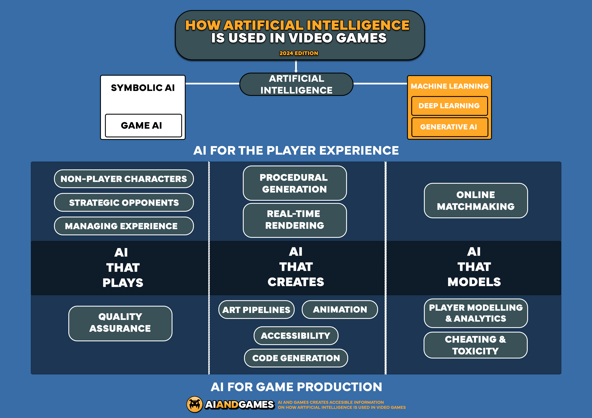

## Table of Contents

## What are video game models in the context of machine learning?

In the context of machine learning, video game models refer to the use of machine learning algorithms to create or enhance elements within video games. These models can be used for various purposes, such as improving game AI, generating realistic graphics, or predicting player behavior. For instance, machine learning can be used to train an AI opponent that learns from player actions, making the game more challenging and engaging. This involves feeding the AI data about player moves and outcomes, allowing it to adapt and improve over time.

Another common use of machine learning in video games is in the creation of procedural content. This means using algorithms to generate game content like levels, landscapes, or even entire game worlds automatically. By using machine learning, developers can create diverse and unique game environments that adapt to player preferences, making each playthrough different and more personalized. This not only enhances the player's experience but also reduces the workload on game designers, as the machine learning model can generate content that feels fresh and new.

## How do video game models like CARLA and AlphaStar differ from traditional video game AI?

Traditional video game AI usually follows a set of pre-defined rules and behaviors. These AIs are programmed to react in specific ways to player actions, which means they can become predictable over time. For example, in a racing game, the AI cars might always take the same route or make the same mistakes, making it easier for players to win once they figure out the pattern. This type of AI is good for simple games but can make more complex games feel less challenging and less fun as players learn to exploit the AI's limitations.

Video game models like CARLA and AlphaStar use [machine learning](/wiki/machine-learning) to create more dynamic and adaptive AIs. CARLA, which stands for "Car Learning to Act," is used to simulate realistic driving scenarios. It learns from data and can adapt to different driving conditions, making the game feel more like real life. AlphaStar, developed by DeepMind, is an AI that plays the strategy game StarCraft II. It uses [reinforcement learning](/wiki/reinforcement-learning) to improve its strategies over time, making it a formidable opponent that can surprise even experienced players. These models learn from experience, so they can change their behavior, making the game more challenging and interesting.

In summary, while traditional video game AI relies on fixed rules, models like CARLA and AlphaStar use machine learning to create AIs that can learn and adapt. This makes the gameplay more unpredictable and engaging, as the AI can develop new strategies and responses based on its experiences.

## What is CARLA and how is it used in machine learning for video games?

CARLA, which stands for "Car Learning to Act," is a popular open-source simulator used in the field of machine learning for video games. It's designed to help developers create and test autonomous driving systems in a realistic virtual environment. CARLA provides a platform where different driving scenarios can be simulated, allowing machine learning models to learn how to drive safely and efficiently. By using CARLA, developers can train their AI to handle various road conditions, traffic situations, and unexpected events, making the AI smarter and more adaptable.

In the context of video games, CARLA can be used to enhance the realism of driving games. For example, if a game developer wants to create a racing game where the AI opponents drive like real humans, they can use CARLA to train these AI drivers. The simulator can be set up with different tracks and weather conditions, and the AI can learn from each run how to improve its driving skills. This makes the game more challenging and enjoyable for players, as the AI opponents can adapt and change their strategies based on what they've learned, much like a human player would.

## Can you explain the basic architecture of AlphaStar and its application in video games?

AlphaStar is an AI developed by DeepMind to play the strategy game StarCraft II. It uses a type of machine learning called reinforcement learning to get better at the game. In simple terms, reinforcement learning means the AI learns by trying different things and seeing what works best. AlphaStar watches how it does in the game and changes its strategy to win more often. It has a big network of artificial neurons that help it make decisions, kind of like how our brains work. This network is trained on lots of game data to understand how to play StarCraft II well.

In video games, AlphaStar can be used to make the game more exciting and challenging. Imagine playing a strategy game where the computer opponent keeps getting smarter and harder to beat. That's what AlphaStar can do. It learns from every game it plays, so it can come up with new ways to surprise players. This makes the game more fun because you never know what the AI will do next. Developers can use AlphaStar to create AI opponents that feel more like real human players, which can make the game more interesting and keep players coming back for more.

## What are the key challenges in developing machine learning models for video games?

One major challenge in developing machine learning models for video games is balancing performance and realism. Machine learning models need a lot of computing power to learn and make decisions. In a game, if the model takes too long to think, it can slow down the game and make it less fun to play. Developers have to find ways to make the AI smart but also fast enough to keep the game running smoothly. This often means simplifying the model or using special techniques to speed it up, which can be tricky.

Another challenge is making the AI behave in a way that feels fair and fun to players. If the AI is too good, it can make the game too hard and frustrating. But if it's too easy, players might get bored. Developers need to train the AI to play at just the right level, which can be hard to get right. They also need to make sure the AI doesn't cheat or do things that a human player couldn't do, because that can make the game feel unfair. Finding the right balance is a big part of what makes developing machine learning models for video games so challenging.

## How do video game models learn from gameplay data?

Video game models learn from gameplay data by using machine learning techniques. When a player plays a game, the game records lots of information about what the player does, like where they move, what they click, and how they win or lose. This data is then used to train the AI. The AI looks at all this information and tries to find patterns. For example, if players often win by using a certain strategy, the AI can learn to use that strategy too. This process is called reinforcement learning, where the AI gets better over time by trying different things and seeing what works best.

To make this work, the game developers set up a system where the AI can play the game many times. Each time the AI plays, it gets feedback on how well it did. If it wins, it knows it did something right, and if it loses, it knows it needs to try something different. Over many games, the AI learns what works and what doesn't, and it starts to play more like a smart human player. This makes the game more fun because the AI can surprise players with new strategies and keep the game challenging.

## What role does reinforcement learning play in video game models like AlphaStar?

Reinforcement learning is a big part of how video game models like AlphaStar get better at playing games. It works by letting the AI play the game over and over again. Each time it plays, the AI gets a reward if it does well, like winning a game, and a penalty if it does poorly, like losing. By trying different moves and seeing what works, the AI learns to make better choices. For example, if AlphaStar wins a game by using a certain strategy, it will remember that and try to use it again. This way, the AI keeps improving and can come up with new ways to beat players.

In AlphaStar, reinforcement learning helps it become a tough opponent in StarCraft II. The AI starts by playing the game a lot, learning from each match. It uses a big network of artificial neurons to think about what to do next. Over time, AlphaStar figures out the best ways to win, making it smarter and harder to beat. This makes the game more fun for players because the AI can surprise them with new strategies, just like a human player would.

## How can video game models improve player experience and game design?

Video game models can make games more fun and interesting for players. They do this by learning how players play and then changing the game to match what players like. For example, if a player likes fast cars, the game can give them more chances to drive fast. This makes the game feel more personal and exciting. Also, these models can make the game harder or easier based on how good the player is, so everyone can have a good time, no matter how much they play.

These models can also help game designers make better games. They can use the data from how players play to see what works and what doesn't. If players keep getting stuck at a certain part, the designers can change it to make it easier. Or if players love a certain feature, the designers can add more of it. This way, the game keeps getting better and more fun for everyone.

## What are some common algorithms used in video game models?

Some common algorithms used in video game models include reinforcement learning, decision trees, and neural networks. Reinforcement learning is a big one because it lets the AI learn by playing the game over and over. The AI tries different things and gets rewards for doing well, like winning a game. This helps it figure out the best ways to play. Decision trees are another useful algorithm. They work by making choices based on certain conditions, kind of like a flowchart. In a game, a decision tree can help the AI decide what to do next, like whether to attack or defend.

Neural networks are also very important in video game models. They are made up of layers of artificial neurons that can learn from data. In a game, a [neural network](/wiki/neural-network) can learn to recognize patterns in how players play and then use that information to make better decisions. For example, a neural network can help an AI opponent learn to predict what a player might do next and then react in the best way. These algorithms make games more fun and challenging because the AI can keep getting smarter and adapting to how players play.

## How do you evaluate the performance of a video game model?

Evaluating the performance of a video game model involves looking at how well it does in the game. One way to do this is by checking its win rate. If the model wins a lot of games, it means it's doing well. Another way is to see how long it takes the model to make decisions. If it can make choices quickly without slowing down the game, that's a good sign. Developers also look at how the model adapts to different players. If it can change its strategy based on what the player does, it shows the model is learning and improving.

Another important part of evaluating a video game model is player feedback. Players can tell if the AI feels fair and fun to play against. If players enjoy the game and find the AI challenging but not impossible, that's a good indicator of success. Developers might also use metrics like the number of times players return to the game or how long they play each session. These can show if the model is making the game more engaging. By combining these different ways of measuring performance, developers can get a good idea of how well their video game model is working.

## What ethical considerations should be taken into account when developing video game models?

When developing video game models, it's important to think about fairness. The AI should not cheat or do things that a human player couldn't do. If the AI is too good or uses unfair tricks, players might feel frustrated and stop playing. Developers need to make sure the AI plays by the same rules as the players and gives everyone a fair chance to win. This means setting up the AI to be challenging but not impossible, so players can have fun and feel like they have a real shot at winning.

Another big ethical issue is privacy. Video game models often use data about how players play to get better. This data can include personal information, like how a player moves or what they click on. Developers need to be careful with this information and make sure it's kept private. They should tell players what data is being collected and ask for their permission. This helps build trust and makes sure players feel safe while playing the game.

## How can video game models be adapted for use in other areas of artificial intelligence?

Video game models can be adapted for use in other areas of [artificial intelligence](/wiki/ai-artificial-intelligence), like self-driving cars and robotics. For example, the CARLA simulator, which is used to train AI for driving games, can also help train real self-driving cars. It lets the AI practice in different road conditions and learn how to drive safely. This shows how the same technology that makes video games fun can also help make cars smarter and safer. The key is to use the same machine learning techniques, like reinforcement learning, to let the AI learn from experience in different environments.

In robotics, video game models can help robots learn to do tasks by playing games that mimic real-world situations. For instance, a robot might use a game to practice [picking](/wiki/asset-class-picking) up objects or navigating through a space. The AI can learn from each game session, improving its skills over time. This is similar to how video game AIs get better at playing games. By using these models, robots can become more efficient and adaptable, making them useful in areas like manufacturing or home assistance.

## References & Further Reading

[1]: Dosovitskiy, A., Ros, G., Codevilla, F., Lopez, A., & Koltun, V. (2017). ["CARLA: An Open Urban Driving Simulator."](https://arxiv.org/abs/1711.03938) arXiv preprint arXiv:1711.03938.

[2]: Vinyals, O., Babuschkin, I., Czarnecki, W. M., Mathieu, M., Dudzik, A., Chung, J., ... & Silver, D. (2019). ["Grandmaster level in StarCraft II using multi-agent reinforcement learning."](https://www.nature.com/articles/s41586-019-1724-z) Nature, 575(7782), 350-354.

[3]: Yannakakis, G. N., & Togelius, J. (2018). ["Artificial Intelligence and Games."](https://link.springer.com/article/10.1007/s10710-018-9337-0) Springer.

[4]: Goodfellow, I., Bengio, Y., & Courville, A. (2016). ["Deep Learning."](https://link.springer.com/article/10.1007/s10710-017-9314-z) MIT Press.

[5]: Zhang, J., & Huang, X. (2020). ["The Role of Machine Learning in Video Game Development for Adaptive AI."](https://scholar.google.com/citations?user=-wOTCE8AAAAJ&hl=en) IEEE Access, 8, 159177-159186.