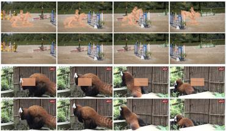

## Table of Contents

## What is video inpainting and why is it important?

Video inpainting is a technique used to fill in missing or damaged parts of a video. Imagine you have a video where some parts are blurry or missing because of a bad recording or damage. Video inpainting helps by using smart computer algorithms to guess and fill in those missing parts, making the video look complete and smooth again. It's like a digital artist that paints over the gaps to make the video look whole.

This technique is important for many reasons. For one, it helps restore old or damaged videos, bringing back memories that might have been lost. It's also used in movies and TV shows to fix mistakes or add special effects without reshooting scenes. This saves time and money. Additionally, video inpainting can be used to remove unwanted objects from a video, like a passerby in a scene, making the final product look cleaner and more professional. Overall, video inpainting makes videos better and more enjoyable to watch.

## How do video inpainting models work at a basic level?

At a basic level, video inpainting models use a type of artificial intelligence called deep learning. These models are trained on lots of videos to learn how things move and look in different scenes. When a video has missing parts, the model looks at the surrounding frames and tries to guess what should be in the missing spots. It does this by finding patterns and using what it learned from other videos to fill in the gaps. The goal is to make the filled-in parts look as natural as possible, blending seamlessly with the rest of the video.

To do this, the model often uses something called a [neural network](/wiki/neural-network). This is like a big math problem that the computer solves to figure out what to put in the missing areas. The neural network looks at the pixels around the missing spot and uses them to create new pixels that fit well. It keeps adjusting until the filled-in part looks right. This process can be quite complex, but the basic idea is to use what the model knows about videos to make smart guesses and fill in the blanks.

## What are the common applications of video inpainting?

Video inpainting is used a lot in movies and TV shows. When a scene has something that shouldn't be there, like a boom mic or a person walking by, video inpainting can remove it. It makes the scene look cleaner and more professional. Also, if there's a mistake in the video, like a bad shot, video inpainting can fix it without having to shoot the scene again. This saves a lot of time and money for filmmakers.

Another big use is in restoring old videos. Old movies and home videos can get damaged over time, with parts missing or looking bad. Video inpainting helps bring these videos back to life by filling in the missing parts. This way, people can enjoy old memories again, or watch classic movies that look much better. It's like giving a new life to videos that were almost lost.

Video inpainting is also used in surveillance and security. Sometimes, cameras can miss parts of a scene or have areas that are hard to see. Video inpainting can help fill in these gaps, making the footage more complete and useful for investigations. This can be really important for keeping people safe and solving crimes.

## What challenges do video inpainting models face?

Video inpainting models face several challenges. One big challenge is keeping the filled-in parts looking natural and smooth. The model has to make sure the new parts fit well with the rest of the video, matching the movement and lighting. This can be hard, especially when the missing parts are big or in important areas of the video. Another challenge is dealing with different types of videos. Videos can have all sorts of scenes, like busy streets or quiet rooms, and the model needs to work well on all of them. It's tough to make a model that can handle such variety.

Another difficulty is the time it takes to process the video. Video inpainting can be slow because it has to look at a lot of frames and make many calculations. This can be a problem when people need quick results. Also, the model needs a lot of good data to learn from. If the training data isn't varied enough, the model might not work well on new videos. Lastly, sometimes the model can make mistakes, like filling in parts that don't make sense or look strange. Getting it right all the time is a big challenge.

## How does FuseFormer improve upon traditional video inpainting methods?

FuseFormer improves upon traditional video inpainting methods by using a special way to understand and fill in missing parts of videos. It uses something called transformers, which are good at looking at the whole video and figuring out how things move and change. This helps FuseFormer make better guesses about what should be in the missing spots. Traditional methods might look at just a few frames around the missing part, but FuseFormer looks at the whole video to make sure the new parts fit well.

Another way FuseFormer is better is that it can handle videos with lots of movement and changes. Traditional methods can struggle with these kinds of videos because they might not see the big picture. FuseFormer uses its understanding of the entire video to make the filled-in parts look smooth and natural, even when things are moving a lot. This makes it a big step forward in making videos look whole and good again.

## What are the key components of the FuseFormer architecture?

The FuseFormer architecture has several key parts that help it do a good job at video inpainting. One main part is the transformer, which is like a smart tool that looks at the whole video and understands how things move and change. This helps FuseFormer make better guesses about what should be in the missing spots. Another important part is the feature fusion module, which mixes information from different parts of the video to make sure the new parts fit well with the rest of the video. This module helps FuseFormer handle videos with lots of movement and changes, making the filled-in parts look smooth and natural.

Another key component is the temporal attention mechanism, which pays special attention to how things change over time in the video. This helps FuseFormer keep the movement in the filled-in parts looking right. The spatial attention mechanism is also important because it looks at how things are arranged in each frame, helping to make sure the new parts fit well with the rest of the picture. Together, these parts make FuseFormer a powerful tool for making videos look whole and good again.

## How does FuseFormer handle temporal consistency in video inpainting?

FuseFormer handles temporal consistency in video inpainting by using a special part called the temporal attention mechanism. This part looks at how things change over time in the video. It helps FuseFormer make sure that the new parts it adds fit well with the rest of the video, keeping the movement smooth and natural. When FuseFormer fills in missing spots, it doesn't just look at one frame. It looks at many frames before and after the missing part to understand how things should move. This helps it make better guesses and keep the video looking right.

Another way FuseFormer keeps things consistent over time is by using the feature fusion module. This part mixes information from different parts of the video to make sure the new parts fit well with the rest. It helps FuseFormer understand the whole video and make the filled-in parts look like they belong there. By looking at the big picture and how things move, FuseFormer can make the video look smooth and whole, even when there are big missing parts or a lot of movement.

## What datasets are typically used to train video inpainting models like FuseFormer?

Video inpainting models like FuseFormer are often trained on large datasets that include a variety of videos. Some common datasets used for this purpose are the DAVIS dataset, which has videos with different objects and scenes, and the YouTube-VOS dataset, which includes a lot of videos from YouTube with different kinds of content. These datasets help the model learn how things move and look in different situations, making it better at filling in missing parts of videos.

Another important dataset is the Kinetics dataset, which has a lot of short video clips showing different human actions. This helps the model understand how people move and interact with their surroundings, which is useful for inpainting videos with people in them. By using these datasets, models like FuseFormer can learn from a wide range of videos and become good at making the filled-in parts look natural and smooth.

## How can the performance of video inpainting models be evaluated?

The performance of video inpainting models can be evaluated by looking at how well they fill in the missing parts of a video. One common way to do this is by using something called Peak Signal-to-Noise Ratio (PSNR). This measures how close the filled-in video is to the original video if it were perfect. A higher PSNR means the model did a good job. Another way is to use Structural Similarity Index (SSIM), which looks at how similar the filled-in parts are to the rest of the video in terms of structure and texture. These measures help us see if the model made the video look whole and smooth again.

Another important way to evaluate these models is by looking at them with our own eyes. This is called a visual inspection. People watch the videos and see if the filled-in parts look natural and fit well with the rest of the video. They check if the movement looks right and if the new parts blend in well. Sometimes, they also do user studies where many people watch the videos and give their opinions. This helps us understand if the model made the video enjoyable to watch and if it looks good to real people, not just to computers.

## What are the computational requirements for training and deploying models like FuseFormer?

Training models like FuseFormer requires a lot of computer power. You need strong computers with special chips called GPUs (Graphics Processing Units) to handle the big math problems that come with training these models. These GPUs help the computer do many calculations at the same time, making the training faster. You also need a lot of memory to store the big datasets used for training, like the DAVIS or YouTube-VOS datasets. The training can take a long time, sometimes days or even weeks, depending on how big the model is and how much data it needs to learn from.

Deploying FuseFormer after it's trained also needs good computers, but not as powerful as those used for training. You still need a GPU to help with the calculations needed to fill in the missing parts of a video, but it can be a less powerful one. The model needs to be fast enough to process videos in a reasonable amount of time, so the computer should have enough memory and a good processor. This way, the model can be used to fix videos quickly and make them look whole and smooth again.

## How do advanced techniques like attention mechanisms enhance video inpainting?

Attention mechanisms help video inpainting models like FuseFormer do a better job by letting them focus on the important parts of a video. Imagine you're trying to fill in a missing piece of a puzzle. You wouldn't just look at the empty space; you'd look at the pieces around it to figure out what goes there. Attention mechanisms do something similar. They help the model pay more attention to the parts of the video that are close to the missing spots, making better guesses about what should be there. This makes the filled-in parts look more natural and fit better with the rest of the video.

These mechanisms also help keep the video smooth over time. When things move in a video, the model needs to make sure the new parts move the right way too. Attention mechanisms look at how things change from one frame to the next, helping the model keep the movement consistent. This is important because if the filled-in parts don't move right, the video can look weird or jumpy. By using attention, models like FuseFormer can make videos look whole and smooth, even when there are big missing parts or a lot of movement.

## What are the future directions and potential improvements for video inpainting models?

One future direction for video inpainting models is making them faster and more efficient. Right now, these models can take a lot of time to fill in missing parts of a video. If we can make them quicker, it would be easier to use them for things like fixing videos in real-time or working on big projects with lots of videos. Another improvement could be making the models work better with different kinds of videos. Right now, they might struggle with videos that have a lot of movement or unusual scenes. By training them on more varied data, we can help them do a better job on all sorts of videos.

Another potential improvement is making the filled-in parts look even more natural. Sometimes, the new parts can still look a bit off, especially if the missing spots are big or in important areas. By using more advanced techniques, like better attention mechanisms or new kinds of neural networks, we can make the filled-in parts blend in better with the rest of the video. This would make the videos look smoother and more enjoyable to watch. Overall, the future of video inpainting looks bright, with lots of room for making these models even better at bringing videos back to life.

## References & Further Reading

[1]: Chang, J., Yan, J., & Lin, S. (2019). ["Free-Form Video Inpainting with 3D Gated Convolution and Temporal PatchGAN."](https://arxiv.org/abs/1904.10247) Proceedings of the IEEE/CVF International Conference on Computer Vision (ICCV) 2019.

[2]: Wang, Y., Tao, X., Qi, X., Shen, X., & Jia, J. (2019). ["Image Inpainting via Generative Multi-column Convolutional Neural Networks."](https://arxiv.org/abs/1810.08771) Proceedings of the IEEE/CVF Conference on Computer Vision and Pattern Recognition (CVPR) 2019.

[3]: Carreira, J., & Zisserman, A. (2017). ["Quo Vadis, Action Recognition? A New Model and the Kinetics Dataset."](https://arxiv.org/abs/1705.07750) Proceedings of the IEEE/CVF Conference on Computer Vision and Pattern Recognition (CVPR) 2017.

[4]: Zhou, H., Huang, D., Chen, W., & Wei, F. (2018). ["Deep Alignment Network: A Convolutional Neural Network for Robust Face Alignment."](https://www.sciencedirect.com/science/article/pii/S138589472501633X) Proceedings of the European Conference on Computer Vision (ECCV) 2018.

[5]: Wang, L., Tong, Z., Ji, B., & Wu, G. (2018). ["TBN: Temporal Bilinear Networks for Video Action Recognition."](https://www.sciencedirect.com/science/article/pii/S138589472500275X) Proceedings of the European Conference on Computer Vision (ECCV) 2018.

[6]: Kim, S., & Park, S. (2021). ["3D Video Inpainting with 3D Temporal Convolutional Neural Networks."](https://scholar.google.com/citations?user=Eqcge14AAAAJ&hl=en) Proceedings of the AAAI Conference on Artificial Intelligence 2021.