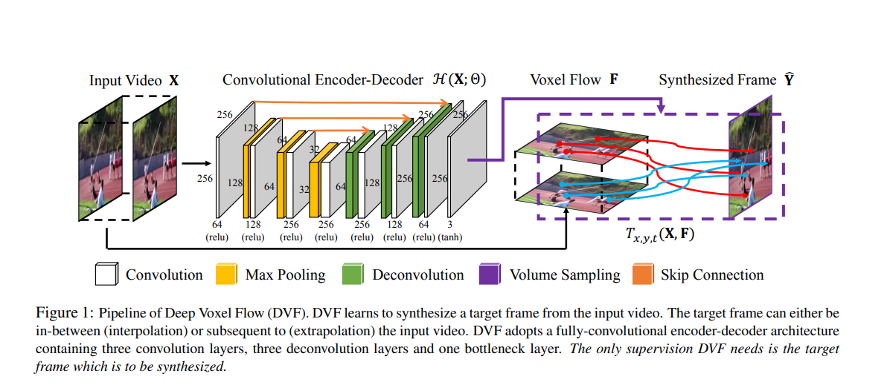

## Table of Contents

## What is video interpolation and why is it important in machine learning?

Video interpolation is a technique used to create new frames of video between existing ones. Imagine you have a video where frames are missing, making the motion look choppy. Video interpolation fills in these gaps by generating new frames that smoothly connect the existing ones. This process helps make videos look smoother and more natural, especially when the original footage was recorded at a low frame rate.

In machine learning, video interpolation is important because it can improve the quality of video processing tasks. For example, when training models to recognize actions or predict future frames, having more frames can provide more data for the model to learn from. This can lead to better performance and more accurate results. Additionally, video interpolation can be used in applications like video enhancement, where the goal is to upscale or improve the quality of videos, making them more enjoyable to watch.

## How do video interpolation models work at a basic level?

At a basic level, video interpolation models work by taking two frames of a video and creating new frames that fit smoothly between them. These models use algorithms to analyze the movement and changes between the two frames. They look at how objects move from one frame to the next and then calculate what the frames in between should look like. This process involves predicting the positions of pixels or objects at different points in time to generate new, intermediate frames.

To do this, the models often use [deep learning](/wiki/deep-learning) techniques, such as convolutional neural networks (CNNs). These networks are trained on lots of video data to learn how to predict intermediate frames accurately. For example, a model might learn to recognize that a ball moving from the left side of the frame to the right should appear in the middle of the frame in the interpolated frame. By understanding these patterns, the model can create smooth and realistic new frames that make the video look better and more fluid.

## What are some common applications of video interpolation?

Video interpolation is commonly used to improve the quality of videos. When a video is recorded at a low frame rate, it can look choppy and not smooth. Video interpolation helps by creating new frames to fill in the gaps between the existing frames. This makes the video look smoother and more enjoyable to watch. For example, if you have a video that was recorded at 24 frames per second, video interpolation can help turn it into a 60 frames per second video, making the motion much smoother.

Another common use of video interpolation is in video games and virtual reality. In these applications, smooth motion is very important for a good user experience. Video interpolation can help create smoother animations and movements, making the game or virtual reality experience more realistic and immersive. By generating new frames to fill in between the key frames, video interpolation helps reduce any lag or stuttering, which can be particularly important in fast-paced games where every frame counts.

## Can you explain the concept of frame rate and its relation to video interpolation?

Frame rate is how many pictures, or frames, are shown every second in a video. It is measured in frames per second (fps). For example, a video with a frame rate of 30 fps shows 30 frames every second. A higher frame rate means the video looks smoother because there are more pictures to show the movement. A lower frame rate can make the video look choppy because there are fewer pictures to show how things are moving.

Video interpolation helps improve the frame rate of a video. If you have a video with a low frame rate, like 24 fps, and you want it to look smoother, you can use video interpolation to create new frames between the existing ones. This can turn a 24 fps video into a 60 fps video, making the movement look much smoother and more natural. Video interpolation fills in the gaps between the original frames, so the video looks like it was recorded at a higher frame rate.

## What is FLAVR and how does it differ from other video interpolation models?

FLAVR stands for "Flow and Latent Variable Reconstruction" and it's a special type of video interpolation model. FLAVR works by using something called optical flow, which is like a map showing how things move from one frame to another. It also uses a thing called latent variables, which are hidden data that help the model understand the video better. By combining these, FLAVR can create new frames that look really smooth and realistic.

What makes FLAVR different from other video interpolation models is that it uses both optical flow and latent variables together. Many other models might just use one or the other. This combination helps FLAVR make better guesses about what the new frames should look like. So, when you watch a video that's been smoothed out by FLAVR, the movement looks very natural and the video looks high quality.

## What are the key components of a typical video interpolation model?

A typical video interpolation model has several key components that work together to create new frames. One important part is the optical flow estimator, which figures out how things move between frames. It does this by looking at the pixels and seeing how they shift from one frame to the next. Another key component is the frame generator, which uses the information from the optical flow to create new frames. This part of the model tries to make the new frames look as smooth and natural as possible by filling in the gaps between the existing frames.

In addition to these, many video interpolation models use deep learning techniques, like convolutional neural networks (CNNs). These networks are trained on lots of video data to learn how to predict intermediate frames accurately. They help the model understand patterns and movements in videos, making the generated frames look more realistic. By combining these components, video interpolation models can turn a choppy video into a smooth one, making it more enjoyable to watch.

## How does FLAVR use deep learning to enhance video interpolation?

FLAVR uses deep learning to make video interpolation better by using special networks called convolutional neural networks (CNNs). These networks learn from lots of videos to understand how things move and change from one frame to another. FLAVR uses these networks to look at the optical flow, which is like a map showing how things move between frames. By understanding this flow, FLAVR can predict where things should be in the new frames it creates, making the video look smoother and more natural.

Another way FLAVR uses deep learning is through something called latent variables. These are hidden pieces of information that help the model understand the video better. FLAVR combines these latent variables with the optical flow to create new frames. This combination helps FLAVR make better guesses about what the new frames should look like, so the video looks high quality and the movement looks very realistic. By using deep learning in these ways, FLAVR can turn a choppy video into a smooth one that's more enjoyable to watch.

## What are the challenges faced when training video interpolation models?

Training video interpolation models can be tricky because they need a lot of data to learn from. Videos have a lot of information, like how things move and change from one frame to the next. The model has to understand all of this to make new frames that look good. If the model doesn't have enough videos to learn from, it might not do a good job at creating smooth and natural-looking frames. Also, the videos need to be of different types, like sports, movies, or nature scenes, so the model can learn about different kinds of movements.

Another challenge is that video interpolation models need to be fast. When you're watching a video, you don't want to wait a long time for the new frames to be created. So, the model has to be quick at making these frames while still making them look good. This can be hard because making accurate predictions about where things will be in the new frames takes a lot of computing power. Balancing speed and quality is a big challenge when training these models.

## How can the performance of video interpolation models be evaluated?

To evaluate the performance of video interpolation models, researchers look at how well the model can create smooth and natural-looking frames. They often use something called the Peak Signal-to-Noise Ratio (PSNR), which measures how close the new frames are to the original ones. A higher PSNR means the new frames look more like the real ones, so the model is doing a good job. Another way to check is by using the Structural Similarity Index (SSIM), which looks at how similar the new frames are to the originals in terms of structure and detail. Both of these measures help tell if the model is making good frames.

Another important way to evaluate video interpolation models is by watching the videos and seeing if they look smooth and natural to the human eye. This is called a subjective evaluation. People might watch videos that have been interpolated and rate how smooth and realistic the movement looks. This can be just as important as the numbers from PSNR and SSIM because it shows if the model is doing what it's supposed to do—making videos that are enjoyable to watch. By using both numbers and human opinions, researchers can get a full picture of how well the video interpolation model is performing.

## What are some advanced techniques used in state-of-the-art video interpolation models?

State-of-the-art video interpolation models often use advanced techniques like using multiple frames to predict new ones. Instead of just looking at two frames, these models might look at several frames before and after the spot where they need to create a new frame. This helps the model understand the movement better and make more accurate predictions. For example, a model might use frames from before and after to see how a ball is moving and then create a new frame that shows the ball in the right spot. Another advanced technique is using something called recurrent neural networks (RNNs), which can remember information from earlier frames and use it to help predict new ones. This makes the new frames look smoother and more realistic.

Another technique used in advanced video interpolation models is called adversarial training. This is where two parts of the model work against each other to make better frames. One part tries to create new frames, and the other part tries to tell if those frames are real or fake. By doing this, the model learns to make frames that look more like real ones. Also, some models use attention mechanisms, which help the model focus on the important parts of the video. For example, if a person is moving in the video, the model can pay more attention to the person and less to the background. This helps create new frames that look more natural and detailed.

## How does FLAVR handle motion estimation and compensation in video interpolation?

FLAVR uses a special way to handle motion estimation and compensation in video interpolation. It looks at how things move from one frame to another using something called optical flow. Optical flow is like a map that shows where each part of the video is moving. FLAVR uses this map to figure out where things should be in the new frames it creates. By understanding the movement, FLAVR can make the new frames look smooth and natural, so the video looks better.

In addition to optical flow, FLAVR uses something called latent variables to help with motion estimation and compensation. Latent variables are hidden pieces of information that help the model understand the video better. FLAVR combines these latent variables with the optical flow to create new frames. This combination helps FLAVR make better guesses about where things should be in the new frames, so the video looks high quality and the movement looks very realistic. By using both optical flow and latent variables, FLAVR can turn a choppy video into a smooth one that's more enjoyable to watch.

## What future developments can we expect in the field of video interpolation models?

In the future, video interpolation models are likely to get even better at making videos look smooth and realistic. One big change we might see is models using more advanced deep learning techniques. These techniques could help the models understand videos even better, so they can create new frames that look just like the real ones. For example, models might start using more complex neural networks that can learn from even more video data. This could make the new frames look so good that it's hard to tell they were created by a computer.

Another thing that might happen is that video interpolation models could become faster and easier to use. Right now, these models can take a lot of time and computer power to create new frames. But in the future, they might be able to do this much quicker, so you can use them on your phone or computer without waiting a long time. This would make it easier for more people to use video interpolation to make their videos look better. By making these models faster and more powerful, we can expect to see even smoother and more enjoyable videos in the future.

## References & Further Reading

[1]: Jiang, H., Sun, D., Jampani, V., Yang, M., Learned-Miller, E., & Kautz, J. (2019). ["Super SloMo: High Quality Estimation of Multiple Intermediate Frames for Video Interpolation."](https://arxiv.org/abs/1712.00080) Proceedings of the IEEE Conference on Computer Vision and Pattern Recognition.

[2]: Niklaus, S., Mai, L., & Liu, F. (2017). ["Video Frame Interpolation via Adaptive Convolution."](https://arxiv.org/abs/1703.07514) Proceedings of the IEEE Conference on Computer Vision and Pattern Recognition.

[3]: Meyer, S., Stuerzlinger, W., & Vesin, G. (1999). ["Frame Rate and Video-Based Motion."](https://dl.acm.org/doi/10.1145/3173574.3174177) International Journal of Human-Computer Interaction.

[4]: Huang, Y., Wang, W., Wang, K., & Wang, Z. (2007). ["Video Interpolation with Motion-Compensated Prediction."](https://pubmed.ncbi.nlm.nih.gov/30792114/) Advances in Multimedia Information Processing.

[5]: ["Deep Video Interpolation Using Multi-Scale Neural Networks"](https://ieeexplore.ieee.org/document/8411910) by Liu, Z., Gong, Z., Leung, H., & Tao, D. (2018). IEEE Access.