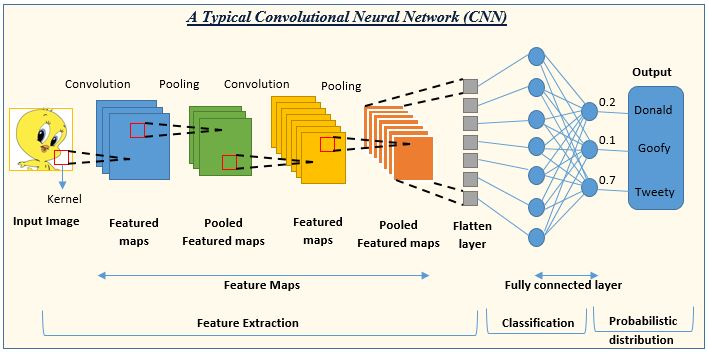

## Table of Contents

## What are Video Model Blocks and why are they important in machine learning?

Video Model Blocks are parts of a machine learning model that help it understand and work with videos. They are like building blocks that the model uses to learn from videos. Each block does a specific job, like recognizing objects in a video, understanding how objects move, or figuring out what is happening in the video. By using these blocks together, the model can better understand and analyze videos, which is important for tasks like video classification, action recognition, and video generation.

These blocks are important because videos are complex and have a lot of information. Unlike pictures, videos have movement and time, which makes them harder for machines to understand. Video Model Blocks help break down this complexity into smaller, manageable parts. This makes it easier for the model to learn and make accurate predictions about what is happening in the video. By using these blocks, machine learning models can be more effective at understanding and working with videos, which is useful in many real-world applications, like security surveillance, sports analysis, and entertainment.

## Can you explain the basic concept of Convolutional Recurrent Networks (CRN) in video processing?

Convolutional Recurrent Networks (CRN) are a type of machine learning model used for processing videos. They combine two powerful techniques: Convolutional Neural Networks (CNNs) and Recurrent Neural Networks (RNNs). CNNs are good at understanding what is in a single picture, like recognizing objects. RNNs, on the other hand, are good at understanding sequences, like the order of words in a sentence or the movement of objects over time in a video. By using both together, CRNs can look at each frame of a video with CNNs and then use RNNs to understand how things change from one frame to the next.

In video processing, CRNs help the model see both the details in each frame and the overall story of the video. For example, if you want to recognize an action in a video, like someone playing soccer, the CNN part of the CRN would identify the soccer ball and the players in each frame. Then, the RNN part would track how the players and the ball move over time, helping the model understand that the action is soccer. This combination makes CRNs very effective for tasks like action recognition, video classification, and even predicting what might happen next in a video.

## How does the IFBlock (Information Fusion Block) contribute to video analysis?

The IFBlock, or Information Fusion Block, is a special part of video analysis models that helps combine different types of information from a video. It takes the data from different parts of the video, like the movement of objects or the colors and shapes in each frame, and puts them together in a smart way. This helps the model understand the video better because it can see the whole picture instead of just pieces of it.

For example, if a video shows a car driving on a road, the IFBlock can combine information about the car's speed, the road's condition, and the weather. By fusing these details, the model can tell not just that there is a car, but also how fast it's going and whether the road is wet or dry. This makes the model's analysis more accurate and useful for things like traffic monitoring or safety systems.

## What is the role of WRQE (Weighted Region Query and Expansion) in video model blocks?

WRQE, or Weighted Region Query and Expansion, is a technique used in video model blocks to help the model focus on important parts of a video. It works by looking at different regions in each frame and deciding which ones are more important based on what the model is trying to learn. For example, if the model is trying to recognize a person's action, WRQE might focus more on the regions where the person's body is moving.

By using weights, WRQE helps the model pay more attention to these key areas while still considering the whole frame. This makes the model's understanding of the video more accurate because it can better see what is really important. For instance, in a soccer video, WRQE might put more weight on the region around the ball and the players near it, helping the model understand the game's flow and key actions more effectively.

## How does the Sscs (Soft Split and Soft Composition) technique improve video understanding?

The Sscs, or Soft Split and Soft Composition technique, helps video models understand videos better by breaking down each frame into smaller parts and then putting them back together in a smart way. When a video model looks at a frame, it can be hard to see everything at once. So, Sscs splits the frame into different pieces, like focusing on different parts of the scene. This helps the model see details it might miss if it just looked at the whole frame.

After splitting the frame, Sscs then softly composes these pieces back together. This means it doesn't just put them back exactly as they were, but it combines them in a way that helps the model understand the whole video better. For example, if there's a person walking in a park, Sscs might split the frame to focus on the person, the path, and the trees separately. Then, it composes these parts back together, helping the model see how the person is moving through the scene and understand the action better. This technique makes the model's video understanding more accurate and detailed.

## What are the key features of the FuseFormer Block in video processing?

The FuseFormer Block is a special part of video processing models that helps them understand videos better. It does this by combining, or fusing, different pieces of information from the video in a smart way. Imagine you are watching a video of a soccer game. The FuseFormer Block can look at the players, the ball, and the field separately and then put all this information together to understand what is happening in the game. This helps the model see not just the individual parts but the whole story of the video.

One key feature of the FuseFormer Block is that it can handle information from different times in the video. This means it can see how things change from one moment to the next. For example, it can track how a player moves across the field or how the ball's position changes. By doing this, the FuseFormer Block helps the model predict what might happen next in the video, making its understanding even better.

## How do Video Model Blocks handle temporal and spatial information in videos?

Video Model Blocks help machines understand videos by looking at both the time (temporal) and space (spatial) parts of the video. When we watch a video, we see things moving and changing over time. Video Model Blocks use special parts called Recurrent Neural Networks (RNNs) to keep track of these changes. They remember what happened before and use that information to understand what is happening now. This helps the model see the whole story of the video, not just one moment.

At the same time, Video Model Blocks also look at the details in each frame, which is the spatial part. They use Convolutional Neural Networks (CNNs) to see what is in each frame, like recognizing objects or people. By combining the information from RNNs and CNNs, Video Model Blocks can understand both what is happening in each frame and how things change over time. This makes them really good at tasks like recognizing actions or predicting what might happen next in a video.

## What are the common challenges faced when implementing Video Model Blocks?

One of the main challenges when implementing Video Model Blocks is dealing with the large amount of data in videos. Videos have many frames, and each frame has a lot of information. This means that video models need a lot of computing power and memory to process everything. It can be hard to make these models work quickly and efficiently, especially on devices that don't have a lot of power, like smartphones.

Another challenge is understanding the complex nature of videos. Videos have both spatial information, like what is in each frame, and temporal information, like how things change over time. Getting both of these right can be tricky. Sometimes, the model might focus too much on one part and miss important details in the other. For example, it might recognize objects well but struggle to understand how those objects move or interact over time. Balancing these two types of information is key to making Video Model Blocks work well.

## Can you compare the performance of CRN, IFBlock, and FuseFormer Block in video classification tasks?

When it comes to video classification tasks, Convolutional Recurrent Networks (CRN) are good at understanding both what is in each frame and how things change over time. They use Convolutional Neural Networks (CNNs) to look at the details in each frame, like objects or people, and Recurrent Neural Networks (RNNs) to see how these details move from one frame to the next. This makes CRN very effective for tasks like recognizing actions in videos. However, CRN can be slow because they need to process a lot of data, and they might struggle if the video has too many frames or if the frames are too complex.

The Information Fusion Block (IFBlock) helps video models by combining different types of information from the video. It looks at things like the movement of objects, the colors, and the shapes in each frame and puts them together in a smart way. This helps the model understand the video better because it can see the whole picture. IFBlock can be faster than CRN because it focuses on fusing information rather than processing every detail in every frame. However, it might not be as good at understanding how things change over time compared to CRN.

The FuseFormer Block is another type of video model block that combines information from different times in the video. It can track how things change from one moment to the next, which helps the model predict what might happen next. This makes FuseFormer Block very useful for video classification tasks where understanding the flow of the video is important. FuseFormer Block might be more efficient than CRN because it can handle temporal information well without needing as much computing power. However, like IFBlock, it might not capture as many spatial details as CRN does.

## How can the integration of Soft Split and Soft Composition enhance the accuracy of video model predictions?

The Soft Split and Soft Composition (Sscs) technique helps video models understand videos better by breaking each frame into smaller parts and then putting them back together in a smart way. Imagine you're watching a video of a soccer game. Sscs can split the frame to focus on the ball, the players, and the field separately. This helps the model see details it might miss if it just looked at the whole frame. By looking at these smaller parts, the model can understand things like how the players are moving or where the ball is going more accurately.

After splitting the frame, Sscs then softly composes these pieces back together. This means it doesn't just put them back exactly as they were, but it combines them in a way that helps the model see the whole picture better. For example, if there's a player shooting a goal, Sscs can focus on the player's movement and the ball's path separately and then combine this information to understand the action. This technique makes the model's video predictions more accurate because it can see both the small details and the overall story of the video.

## What advanced techniques can be used to optimize Video Model Blocks for real-time video processing?

To optimize Video Model Blocks for real-time video processing, one advanced technique is to use model compression. This means making the model smaller so it can work faster and use less memory. One way to do this is by using techniques like pruning, where parts of the model that don't help much are removed. Another way is quantization, which changes the numbers the model uses to simpler ones, making it quicker to process. By doing this, the model can still understand videos well but can do it much faster, which is important for real-time tasks like video surveillance or live sports analysis.

Another technique is to use efficient architectures designed for real-time processing. For example, models like MobileNet or EfficientNet are made to work well on devices with less power, like smartphones. These models use special layers and connections that help them process videos quickly without losing too much accuracy. By using these architectures, Video Model Blocks can handle the large amount of data in videos more efficiently, making them better suited for real-time applications.

## How do experts evaluate the effectiveness of different Video Model Blocks in complex video analysis scenarios?

Experts evaluate the effectiveness of different Video Model Blocks by looking at how well they perform on specific tasks like action recognition or video classification. They use metrics like accuracy, which tells them how often the model gets the right answer, and speed, which shows how fast the model can process the video. They might also use other measures like precision and recall to see if the model can correctly identify important parts of the video without missing anything. By comparing these metrics across different Video Model Blocks, experts can figure out which ones work best for complex video analysis scenarios.

In more complex scenarios, experts often run the Video Model Blocks through benchmarks that include a variety of videos with different levels of difficulty. These benchmarks help them see how well the models handle things like changes in lighting, different camera angles, or fast-moving objects. They also look at how the models manage to keep track of multiple objects over time and understand the overall context of the video. By doing this, experts can get a full picture of how effective each Video Model Block is in real-world situations where videos can be very complex and varied.

## References & Further Reading

[1]: Karpathy, A. (2014). ["Convolutional Neural Networks for Visual Recognition."](https://cs231n.stanford.edu/2016/) Stanford University.

[2]: Simonyan, K., & Zisserman, A. (2014). ["Two-Stream Convolutional Networks for Action Recognition in Videos."](https://arxiv.org/abs/1406.2199) Advances in Neural Information Processing Systems 27.

[3]: Donahue, J., Hendricks, L. A., Guadarrama, S., Rohrbach, M., Venugopalan, S., Saenko, K., & Darrell, T. (2015). ["Long-term Recurrent Convolutional Networks for Visual Recognition and Description."](https://arxiv.org/abs/1411.4389) Advances in Neural Information Processing Systems 28.

[4]: Carreira, J., & Zisserman, A. (2017). ["Quo Vadis, Action Recognition? A New Model and the Kinetics Dataset."](https://arxiv.org/abs/1705.07750) Proceedings of the IEEE Conference on Computer Vision and Pattern Recognition.

[5]: Yue-Hei Ng, J., Hausknecht, M., Vijayanarasimhan, S., Vinyals, O., Monga, R., & Toderici, G. (2015). ["Beyond Short Snippets: Deep Networks for Video Classification."](https://arxiv.org/abs/1503.08909) Proceedings of the IEEE International Conference on Computer Vision.