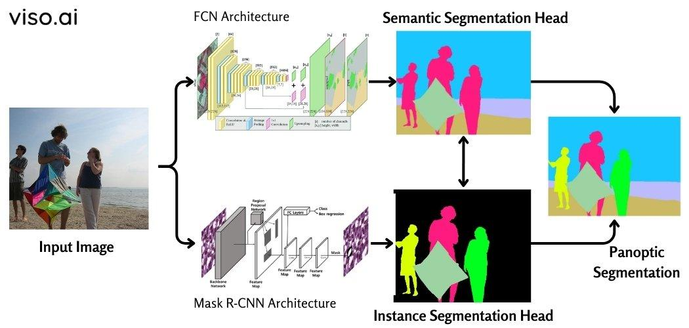

## Table of Contents

## What is video panoptic segmentation and why is it important in machine learning?

Video panoptic segmentation is a task in computer vision where the goal is to understand and label every pixel in a video frame, telling us what object it belongs to and whether it's a "thing" (like a car or a person) or a "stuff" (like the sky or a road). It combines two other tasks: instance segmentation, which identifies and separates individual objects, and semantic segmentation, which labels each pixel with a category. By doing this for every frame in a video, we can track how objects move and change over time, making it a very detailed way of understanding videos.

This task is important in machine learning because it helps computers to see and understand the world in a way that's closer to how humans do. It's useful in many areas, like self-driving cars, where the car needs to know exactly where everything is and how it's moving to drive safely. It's also important for video surveillance, where understanding what's happening in a scene can help keep places safe. By improving video panoptic segmentation, we can make machines better at helping us in our daily lives, from making our commutes safer to helping security systems be more effective.

## How do video panoptic segmentation models differ from image segmentation models?

Video panoptic segmentation models and image segmentation models both aim to label and understand pixels in visuals, but they work with different types of data. Image segmentation models focus on a single image. They label each pixel to show what object or category it belongs to, but they don't consider how things change over time. On the other hand, video panoptic segmentation models work with a series of frames that make up a video. They not only label each pixel in every frame but also track how objects move and change from one frame to the next, providing a dynamic understanding of the scene.

The key difference lies in the temporal aspect. Video panoptic segmentation models use information from previous and future frames to improve the accuracy of their predictions in the current frame. This means they can better handle situations where objects are partially hidden or moving quickly. For example, if a car is partially obscured by a tree in one frame, the model can use information from other frames to understand that it's still the same car. Image segmentation models don't have this advantage because they only see one image at a time. This makes video panoptic segmentation more complex but also more powerful for understanding real-world scenes that change over time.

## What are some common applications of video panoptic segmentation?

Video panoptic segmentation is used in many areas where understanding what's happening in videos is important. One big use is in self-driving cars. These cars need to know exactly where other cars, people, and road signs are, and how they're moving. By using video panoptic segmentation, the car's computer can see and understand everything around it, making driving safer and smoother. It's like giving the car eyes that can see and understand the whole world around it.

Another important use is in video surveillance. Security cameras can use video panoptic segmentation to watch over places and understand what's happening. If something unusual happens, like someone walking where they shouldn't, the system can spot it and alert security. This makes places safer because the system can tell the difference between normal and unusual activity.

Video panoptic segmentation is also helpful in sports analysis. Coaches and analysts can use it to track players and the ball during a game. This helps them see how players move and interact, which can be used to improve strategies and training. It's like having a detailed map of the game that shows everything that's happening on the field.

## Can you explain the basic architecture of a video panoptic segmentation model like VPSNet?

VPSNet, or Video Panoptic Segmentation Network, is a model designed to understand and label every pixel in a video, tracking how objects move over time. At its core, VPSNet uses a backbone network, like ResNet, to process the video frames. This backbone extracts features from each frame, which are then used to create two main outputs: one for semantic segmentation and another for instance segmentation. The semantic segmentation part labels each pixel with a category, like 'car' or 'road', while the instance segmentation part identifies and separates individual objects, giving each a unique ID. By combining these outputs, VPSNet can provide a full panoptic segmentation of the video.

The key to VPSNet's effectiveness is how it handles the temporal aspect of videos. It uses a technique called optical flow to track how pixels move from one frame to the next. This helps the model understand that an object in one frame is the same object in another, even if it moves or is partially hidden. VPSNet also employs a memory mechanism to keep track of past frames, which improves its accuracy over time. By considering the whole sequence of frames, VPSNet can make better predictions about what's happening in each frame, leading to more accurate and consistent panoptic segmentation across the entire video.

## What role does temporal consistency play in video panoptic segmentation?

Temporal consistency is really important in video panoptic segmentation because it helps the model understand that the same objects are moving from one frame to the next. When a model like VPSNet looks at a video, it doesn't just see each frame as a separate picture. Instead, it uses information from past and future frames to make better guesses about what's happening in the current frame. This means if a car is moving across the screen, the model can keep track of it and know it's the same car even if it moves behind a tree for a moment. This makes the model's understanding of the video more accurate and reliable.

By keeping things consistent over time, video panoptic segmentation models can handle tricky situations better. For example, if a person is walking and turns around, the model can still recognize that it's the same person. This helps in applications like self-driving cars, where knowing exactly where everything is and how it's moving is crucial for safety. Without temporal consistency, the model might think a moving object is a new one in every frame, which could lead to mistakes and confusion. So, making sure the model's understanding stays consistent over time is key to making it work well in the real world.

## How does ViP-DeepLab approach the challenge of video panoptic segmentation?

ViP-DeepLab tackles video panoptic segmentation by using a special way to look at video frames. It uses a technique called "temporal feature aggregation" to understand how things move from one frame to another. This means it doesn't just look at each frame by itself but also considers what was happening in the frames before and after. By doing this, ViP-DeepLab can keep track of objects even if they move or get hidden for a bit. It's like having a memory of what it saw, which helps it make better guesses about what's happening in the video.

The model also uses a single network to do both semantic and instance segmentation at the same time. This makes it more efficient because it doesn't need separate parts for each task. ViP-DeepLab can label each pixel with a category and also tell which pixels belong to the same object. By combining these two tasks, it can give a complete picture of what's in the video, showing where everything is and how it's moving. This approach helps in applications like self-driving cars or video surveillance, where understanding the whole scene accurately is really important.

## What are the key differences between VPSNet and ViP-DeepLab?

VPSNet and ViP-DeepLab both tackle video panoptic segmentation but they do it in slightly different ways. VPSNet uses a backbone network like ResNet to process video frames and extract features. It then separates these features into two streams: one for semantic segmentation to label each pixel with a category, and another for instance segmentation to identify and track individual objects. VPSNet also uses optical flow to understand how pixels move between frames, and it has a memory mechanism to keep track of past frames, which helps it make more accurate predictions over time.

On the other hand, ViP-DeepLab focuses on using temporal feature aggregation to understand how objects move across frames. Instead of separating semantic and instance segmentation into different streams, ViP-DeepLab uses a single network to handle both tasks at once. This makes it more efficient because it doesn't need to process the same information twice. ViP-DeepLab's approach of looking at past and future frames together helps it keep a consistent understanding of objects as they move or get hidden, which is crucial for applications like self-driving cars and video surveillance.

## How do video panoptic segmentation models handle occlusions and object tracking over time?

Video panoptic segmentation models like VPSNet and ViP-DeepLab handle occlusions and object tracking by using information from multiple frames. When an object is hidden or partially blocked, these models use what they know from earlier and later frames to guess where the object is. For example, if a car drives behind a tree, the model remembers where the car was before it got hidden and can predict where it will be after it comes out from behind the tree. This is done using techniques like optical flow, which tracks how pixels move from one frame to the next, helping the model understand that the car is still the same car even when it's not fully visible.

Both VPSNet and ViP-DeepLab also use memory mechanisms to keep track of objects over time. VPSNet has a specific memory component that stores information about past frames, which helps it make better predictions about what's happening in the current frame. ViP-DeepLab, on the other hand, uses temporal feature aggregation to look at past and future frames together, making its understanding of the video more consistent. By considering the whole sequence of frames, these models can keep a continuous track of objects, even when they move out of view or get temporarily blocked, ensuring a more accurate and reliable segmentation of the video.

## What metrics are commonly used to evaluate the performance of video panoptic segmentation models?

Video panoptic segmentation models are evaluated using several metrics to see how well they understand and label every pixel in a video. One important metric is the Panoptic Quality (PQ) score. This score looks at how well the model can both recognize different objects and label them correctly. It combines two other scores: Segmentation Quality (SQ), which checks how accurately the model outlines objects, and Recognition Quality (RQ), which checks if the model correctly labels what the objects are. The PQ score is calculated using the formula $$PQ = \frac{\sum_{(p,g) \in TP} IoU(p,g)}{|TP| + \frac{1}{2}|FP| + \frac{1}{2}|FN|}$$ where TP, FP, and FN stand for true positives, false positives, and false negatives, and IoU is the Intersection over Union, a measure of how much the predicted and actual object regions overlap.

Another commonly used metric is the Video Panoptic Quality (VPQ), which extends the PQ score to consider how well the model tracks objects over time. VPQ looks at the consistency of object tracking across frames, making sure that the model can keep track of the same object even when it moves or gets hidden for a bit. This is important because it shows how well the model understands the dynamic nature of videos, not just individual frames. Both PQ and VPQ help researchers and developers see where their models are doing well and where they need to improve, making sure the models can be used effectively in real-world applications like self-driving cars and video surveillance.

## What are some of the challenges faced when training video panoptic segmentation models?

Training video panoptic segmentation models can be really tricky because of the huge amount of data they need to process. Videos have lots of frames, and each frame needs to be labeled correctly, which takes a lot of time and computer power. Also, these models need to understand how objects move and change over time, which makes things even harder. If the model doesn't see enough examples of different situations, like cars turning corners or people walking behind trees, it might not work well in real life. So, getting enough good training data is a big challenge.

Another challenge is making sure the model can handle things like occlusions, where objects get hidden or partially blocked. When training, the model needs to learn how to keep track of objects even when they're not fully visible. This means it has to use information from past and future frames to guess where hidden objects are. It's like solving a puzzle where pieces keep moving around. If the model isn't trained well enough to do this, it might lose track of objects, which can cause big problems in applications like self-driving cars where knowing exactly where everything is all the time is really important.

## How can video panoptic segmentation models be optimized for real-time processing?

To optimize video panoptic segmentation models for real-time processing, it's important to make them faster and use less computer power. One way to do this is by using smaller and simpler models that can still do a good job but don't need as much time to process each frame. Techniques like model pruning, where you remove parts of the model that don't help much, and quantization, where you use smaller numbers to do calculations, can make the model run faster. Another way is to use special hardware like GPUs or TPUs that are made for doing lots of calculations quickly. By using these tricks, the model can keep up with the fast pace of video frames and work in real-time.

Another important thing is to use smart ways to process the video. Instead of looking at every frame from scratch, the model can use what it learned from past frames to make quicker guesses about the current frame. This is called temporal feature aggregation, and it helps the model work faster because it doesn't have to start over with each new frame. Also, using techniques like optical flow to track how pixels move can help the model understand the video more quickly. By combining these methods, video panoptic segmentation models can be made to work in real-time, which is really important for things like self-driving cars and video surveillance where every second counts.

## What are the latest advancements in video panoptic segmentation and what future developments can we expect?

The latest advancements in video panoptic segmentation include improvements in how models understand and track objects over time. One big step forward is the use of better temporal feature aggregation techniques, like those used in ViP-DeepLab, which help models look at past and future frames together to make more accurate guesses about what's happening in the current frame. Another advancement is the use of more efficient models that can process video frames faster, making them better for real-time applications. Researchers are also working on new ways to handle tricky situations like occlusions, where objects get hidden or partially blocked, by using memory mechanisms to keep track of objects even when they're not fully visible.

In the future, we can expect video panoptic segmentation models to become even more accurate and efficient. One exciting development might be the use of unsupervised or semi-supervised learning, where models can learn from videos without needing every frame to be labeled by humans. This could make it easier and cheaper to train these models because it's hard to get enough good training data right now. Another area to watch is the integration of these models with other types of AI, like natural language processing, so that they can understand and describe what's happening in videos in a way that's easy for people to understand. As these models get better, they'll be more useful in real-world applications like self-driving cars, video surveillance, and sports analysis, making our lives safer and more convenient.

## References & Further Reading

[1]: Kirillov, A., Wu, Y., He, K., & Girshick, R. (2019). ["Panoptic Feature Pyramid Networks."](https://arxiv.org/abs/1901.02446) Proceedings of the IEEE Conference on Computer Vision and Pattern Recognition.

[2]: Porzi, L., Wolf, C., Li, X., & Xu, G. (2019). ["Dense Video Captioning in a Hierarchical Fashion."](https://openaccess.thecvf.com/content_CVPR_2019/papers/Porzi_Seamless_Scene_Segmentation_CVPR_2019_paper.pdf) IEEE Transactions on Pattern Analysis and Machine Intelligence.

[3]: Zhou, B., Zhao, H., Puig, X., Fidler, S., Barriuso, A., & Torralba, A. (2019). ["Semantic Understanding of Scenes through the ADE20K Dataset."](https://arxiv.org/abs/1608.05442) International Journal of Computer Vision, 127, 302-321.

[4]: Cheng, B., Collins, M. D., Zhu, Y., Liu, T., Huang, T. S., & Adam, H. (2020). ["Panoptic-DeepLab."](https://arxiv.org/abs/1911.10194) arXiv preprint arXiv:1911.10194.

[5]: ["Deep Learning for Computer Vision"](https://www.sciencedirect.com/science/article/pii/S2666827021000670) by Rajalingappaa Shanmugamani

[6]: Lin, T-Y., Maire, M., Belongie, S., Hays, J., Perona, P., Ramanan, D., Dollár, P., & Zitnick, C. L. (2014). ["Microsoft COCO: Common Objects in Context."](https://arxiv.org/abs/1405.0312) European Conference on Computer Vision.