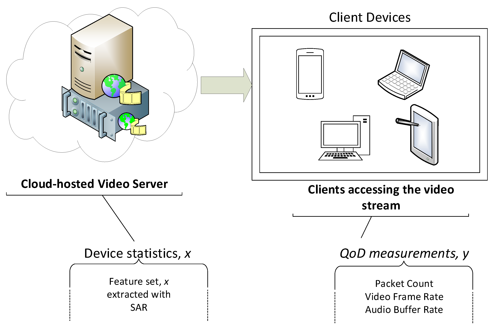

## Table of Contents

## What is a Video Quality Model?

A Video Quality Model is a tool used to measure how good or bad a video looks to viewers. It helps to predict the quality of a video by looking at things like how clear the picture is, how smooth the motion is, and if there are any annoying distortions. These models are important for people who make videos, like filmmakers and video streaming services, because they want to make sure their videos look the best they can for their audience.

There are different types of Video Quality Models, but they all work by comparing a video to a perfect version of it, or by looking at the video on its own to guess its quality. Some models use math formulas to calculate a score that tells how good the video is. For example, a common formula used in some models is the Peak Signal-to-Noise Ratio (PSNR), which is calculated as $$ \text{PSNR} = 10 \cdot \log_{10} \left( \frac{\text{MAX}_I^2}{\text{MSE}} \right) $$, where MAX_I is the maximum possible pixel value of the image and MSE is the Mean Squared Error between the original and the compressed image. Other models might use more complex methods that try to mimic how the human eye sees video quality.

These models are used in many ways, like testing new video compression methods, checking the quality of videos before they are sent out to viewers, and helping to fix problems in video streams. By using Video Quality Models, companies can make sure that their videos meet high standards and that viewers have a good watching experience.

## Why are Video Quality Models important in machine learning?

Video Quality Models are important in [machine learning](/wiki/machine-learning) because they help train computers to understand and predict how good a video looks to people. These models use machine learning to analyze videos and figure out what makes them look high or low quality. By training on lots of videos, the models can learn patterns and features that affect quality, like sharpness, color accuracy, and smoothness of motion. This helps video streaming services and filmmakers improve their videos by fixing problems before viewers see them.

In machine learning, Video Quality Models can also be used to develop new ways to compress videos without losing too much quality. For example, a model might learn to predict how much a video's quality will drop if it's compressed using a certain method. This is important because it lets companies make videos smaller in size for easier streaming or storage, while still keeping them looking good. By using machine learning, these models can keep getting better at predicting video quality, which helps make videos look better for everyone who watches them.

## What are the basic components of a Video Quality Model?

A Video Quality Model has a few main parts that help it figure out how good a video looks. First, there's the part that takes in the video. This could be the whole video or just a few frames. The model looks at these frames to check things like how clear the picture is, if the colors look right, and if the video moves smoothly. These are called video features, and they're really important because they tell the model what to look for when deciding on the video's quality.

The second part of the model is where it does the math to come up with a quality score. This part uses special formulas to turn the video features into a number that shows how good the video is. A common formula is the Peak Signal-to-Noise Ratio (PSNR), which is calculated as $$ \text{PSNR} = 10 \cdot \log_{10} \left( \frac{\text{MAX}_I^2}{\text{MSE}} \right) $$. Here, MAX_I is the biggest possible pixel value in the image, and MSE is the Mean Squared Error between the original video and a changed version. The model might also use other math tricks to make the score more accurate, like trying to copy how human eyes see video quality.

The last part of the model is how it learns and gets better. This is where machine learning comes in. The model is trained on lots of videos, and it learns from examples to get better at guessing video quality. As it sees more videos, it can fine-tune its formulas and become more accurate. This learning part is key because it helps the model keep up with new video technologies and stay useful over time.

## How do Video Quality Models differ from traditional quality assessment methods?

Video Quality Models and traditional quality assessment methods both aim to measure how good a video looks, but they do it in different ways. Traditional methods often rely on people watching videos and giving their opinions on the quality. They might use a group of people to rate videos on a scale, like from 1 to 5, based on how clear the picture is or how smooth the motion looks. This method is called subjective assessment because it depends on what people think. It can be useful but it takes a lot of time and money because you need to gather a lot of people and make sure their opinions are fair and consistent.

On the other hand, Video Quality Models use math and computers to predict video quality without needing people to watch the videos. These models look at the video itself and use special formulas to calculate a score that tells how good the video is. For example, a common formula used in some models is the Peak Signal-to-Noise Ratio (PSNR), which is calculated as $$ \text{PSNR} = 10 \cdot \log_{10} \left( \frac{\text{MAX}_I^2}{\text{MSE}} \right) $$. Here, MAX_I is the biggest possible pixel value in the image, and MSE is the Mean Squared Error between the original and the changed video. This method is called objective assessment because it doesn't depend on people's opinions. It's faster and can be done automatically, which makes it easier to use for big video collections or to check video quality in real-time.

## What is the MDTVSFA model and how does it work?

The MDTVSFA model, which stands for Multi-Dimensional TV Signal Fidelity Assessment, is a type of Video Quality Model used to measure how good a video looks. It works by looking at different parts of the video, like how clear the picture is, how well the colors are shown, and how smooth the motion is. Instead of just using one way to check the video, MDTVSFA uses many different ways to get a full picture of the video's quality. It combines all these different checks into one score that tells you how good the video is overall.

MDTVSFA is special because it tries to copy how human eyes see video quality. It does this by using a math formula called the Structural Similarity Index (SSIM), which is calculated as $$ \text{SSIM}(x, y) = \frac{(2\mu_x\mu_y + C_1)(2\sigma_{xy} + C_2)}{(\mu_x^2 + \mu_y^2 + C_1)(\sigma_x^2 + \sigma_y^2 + C_2)} $$. In this formula, $\mu_x$ and $\mu_y$ are the average pixel values of two images, $\sigma_x^2$ and $\sigma_y^2$ are the variances of the pixel values, $\sigma_{xy}$ is the covariance of the pixel values, and $C_1$ and $C_2$ are small constants to avoid dividing by zero. By using SSIM and other checks, MDTVSFA can give a more accurate score of video quality that matches what people would think about the video.

## What metrics are commonly used to evaluate video quality in machine learning models?

In machine learning models, several metrics are commonly used to evaluate video quality. One of the most well-known metrics is the Peak Signal-to-Noise Ratio (PSNR), which measures the difference between the original video and a processed version. It's calculated as $$ \text{PSNR} = 10 \cdot \log_{10} \left( \frac{\text{MAX}_I^2}{\text{MSE}} \right) $$, where MAX_I is the maximum possible pixel value of the image, and MSE is the Mean Squared Error between the two videos. PSNR is simple to compute but doesn't always match how people see video quality.

Another important metric is the Structural Similarity Index (SSIM), which tries to mimic how the human eye perceives video quality. The formula for SSIM is $$ \text{SSIM}(x, y) = \frac{(2\mu_x\mu_y + C_1)(2\sigma_{xy} + C_2)}{(\mu_x^2 + \mu_y^2 + C_1)(\sigma_x^2 + \sigma_y^2 + C_2)} $$, where $\mu_x$ and $\mu_y$ are the average pixel values of two images, $\sigma_x^2$ and $\sigma_y^2$ are the variances of the pixel values, $\sigma_{xy}$ is the covariance of the pixel values, and $C_1$ and $C_2$ are constants to avoid division by zero. SSIM is more complex than PSNR but often gives a better idea of video quality as seen by people.

Other metrics used include the Video Multimethod Assessment Fusion (VMAF), which combines several different quality checks into one score. VMAF is designed to be more in line with human perception of video quality and is widely used by streaming services to ensure their videos look good to viewers. Each of these metrics has its strengths and weaknesses, and often, a combination of them is used to get a full picture of video quality.

## How can machine learning improve the accuracy of Video Quality Models?

Machine learning can make Video Quality Models better by learning from lots of videos. It can find patterns and details in videos that are hard for people to see. For example, machine learning can learn to notice if a video has blurry parts, strange colors, or if it moves in a jerky way. By looking at many videos, the model gets better at guessing how good a new video will look. This is important because it helps the model to work well with different types of videos, like movies, sports, or video calls.

Also, machine learning helps Video Quality Models keep up with new video technology. As TVs and streaming services get better, the way videos are made and watched changes too. Machine learning can update the model to understand these changes and still give accurate scores. For example, it might learn to measure the quality of videos in 4K or 8K, which are much clearer than older videos. By doing this, machine learning makes sure the model stays useful and can help make videos look their best for viewers.

## What are the challenges in developing Video Quality Models using machine learning?

One big challenge in making Video Quality Models better with machine learning is getting enough good data to train the model. You need lots of videos to teach the model what good and bad quality looks like. But it's hard to find videos that are labeled correctly with their quality scores. Also, different people might think a video looks good or bad in different ways, so it's hard to make sure the model learns the right things. If the data isn't good, the model won't be able to guess video quality well, and it might make mistakes.

Another challenge is that videos can be very different from each other. Some videos might be movies, others might be sports or video calls. Each type of video can have its own way of looking good or bad. The model needs to learn about all these different kinds of videos to be accurate. This means the model has to be smart enough to understand many different things at once, like how clear the picture is, if the colors look right, and if the video moves smoothly. It's a lot for the model to handle, and it can be tough to make it work well for every kind of video.

Lastly, keeping up with new video technology is a big challenge. As TVs and streaming services get better, the way videos are made and watched changes too. The model has to learn about these new technologies to stay useful. For example, it might need to understand how to measure the quality of videos in 4K or 8K, which are much clearer than older videos. This means the model needs to keep learning and updating itself, which can be hard to do. If it doesn't keep up, the model might not be able to give good quality scores for new videos.

## Can you explain the training process for a machine learning-based Video Quality Model?

Training a machine learning-based Video Quality Model involves feeding the model lots of videos that have already been rated for quality. These videos are used as examples for the model to learn from. The model looks at different parts of the videos, like how clear the picture is, how good the colors look, and if the motion is smooth. It uses these parts to guess the quality score of the video. The model then compares its guess to the real quality score of the video. If the guess is wrong, the model adjusts itself to try to do better next time. This process is repeated many times with lots of different videos until the model gets good at guessing quality scores.

Once the model has been trained on a lot of videos, it can start to see patterns that it might not have noticed at first. For example, it might learn that certain types of blur or color changes make a video look worse to people. The model keeps learning and getting better by fine-tuning how it looks at videos and how it calculates quality scores. A common formula used in some models is the Peak Signal-to-Noise Ratio (PSNR), which is calculated as $$ \text{PSNR} = 10 \cdot \log_{10} \left( \frac{\text{MAX}_I^2}{\text{MSE}} \right) $$. Here, MAX_I is the biggest possible pixel value in the image, and MSE is the Mean Squared Error between the original and the changed video. By using this and other formulas, the model can give more accurate scores that match what people think about video quality.

## How do you validate and test the performance of a Video Quality Model?

To validate and test the performance of a Video Quality Model, you need to use a set of videos that the model hasn't seen before. These videos should have their quality scores already known, so you can compare the model's guesses to the real scores. You show the model these new videos and let it guess the quality. Then, you check how close the model's guesses are to the real scores. If the model's guesses are usually close to the real scores, it means the model is working well. If the guesses are often far off, you might need to train the model more or change how it works.

One way to measure how well the model is doing is by using a metric called the Mean Absolute Error (MAE). The MAE is calculated as $$ \text{MAE} = \frac{1}{n} \sum_{i=1}^{n} |y_i - \hat{y}_i| $$, where $n$ is the number of videos, $y_i$ is the real quality score of video $i$, and $\hat{y}_i$ is the model's guess for video $i$. A lower MAE means the model's guesses are closer to the real scores, which is good. You can also use other metrics like the Root Mean Square Error (RMSE) or the correlation between the model's guesses and the real scores to see how well the model is doing. By testing the model with different videos and using these metrics, you can make sure it works well for all kinds of videos.

## What are some advanced techniques used in state-of-the-art Video Quality Models?

State-of-the-art Video Quality Models use advanced techniques like [deep learning](/wiki/deep-learning) to make their guesses more accurate. Deep learning uses special math models called neural networks that can learn from lots of videos. These neural networks can find patterns in videos that are hard for people to see, like tiny changes in color or motion. By using deep learning, the model can get better at guessing video quality over time. It can also learn to understand different types of videos, like movies, sports, or video calls, and give accurate scores for all of them.

Another advanced technique is using multiple metrics together to get a full picture of video quality. Instead of just using one way to check the video, like the Peak Signal-to-Noise Ratio (PSNR) calculated as $$ \text{PSNR} = 10 \cdot \log_{10} \left( \frac{\text{MAX}_I^2}{\text{MSE}} \right) $$, these models combine several different checks. For example, they might use the Structural Similarity Index (SSIM) and the Video Multimethod Assessment Fusion (VMAF) along with PSNR. By putting all these different checks together, the model can give a more complete and accurate score of video quality that matches what people think.

## How can Video Quality Models be integrated into real-time video streaming applications?

Video Quality Models can be integrated into real-time video streaming applications to make sure the videos look good while they are being watched. These models work by quickly checking the quality of the video as it streams. They look at things like how clear the picture is, if the colors look right, and if the video moves smoothly. By doing this check in real-time, the model can tell the streaming service if the video needs to be fixed or if it's good enough to keep streaming. This helps make sure that viewers have a good watching experience without any annoying problems.

To make this work, the Video Quality Model needs to be fast and accurate. It uses special math formulas to calculate a score that tells how good the video is. For example, a common formula used in some models is the Peak Signal-to-Noise Ratio (PSNR), which is calculated as $$ \text{PSNR} = 10 \cdot \log_{10} \left( \frac{\text{MAX}_I^2}{\text{MSE}} \right) $$. Here, MAX_I is the biggest possible pixel value in the image, and MSE is the Mean Squared Error between the original and the changed video. The model can be set up to run on the server that sends out the video or on the device that the viewer is using. By using these models, streaming services can keep their videos looking great, even as they are being watched live.

## References & Further Reading

[1]: Wang, Z., Bovik, A. C., Sheikh, H. R., & Simoncelli, E. P. (2004). ["Image quality assessment: From error visibility to structural similarity."](https://ieeexplore.ieee.org/document/1284395) IEEE Transactions on Image Processing, 13(4), 600-612.

[2]: Seshadrinathan, K., & Bovik, A. C. (2010). ["Temporal variation of video quality in packetized video networks."](http://live.ece.utexas.edu/publications/2010/seshadrinathan_spie_jan10.pdf) Proceedings of the Second International Workshop on Quality of Multimedia Experience, 2010, 139-144.

[3]: Netflix Technology Blog. (2016). ["Toward a practical perceptual video quality metric."](https://netflixtechblog.com/toward-a-practical-perceptual-video-quality-metric-653f208b9652)

[4]: Wu, H. R., & Rao, K. R. (2005). ["Digital Video Image Quality and Perceptual Coding."](https://www.taylorfrancis.com/books/edit/10.1201/9781420027822/digital-video-image-quality-perceptual-coding-makoto-miyahara-mark-fairchild-stefan-winkler-zhou-wang-jorge-caviedes-ryoichi-kawada-jeffrey-lubin-damian-marcellinus-tan-hamid-sheikh-marc-gazalet-damian-tan-wu-rao-ethan-montag-weisi-lin-franco-oberti-tao-chen-philip-corriveau-hwang-francois-xavier-coudoux-albert-pica-zhenghua-yu-michael-yuen-jian-zhang-alan-conrad-bovik-michael-isnardi) CRC Press.

[5]: Mittal, A., Moorthy, A. K., & Bovik, A. C. (2012). ["No-reference image quality assessment in the spatial domain."](https://ieeexplore.ieee.org/document/6272356) IEEE Transactions on Image Processing, 21(12), 4695-4708.