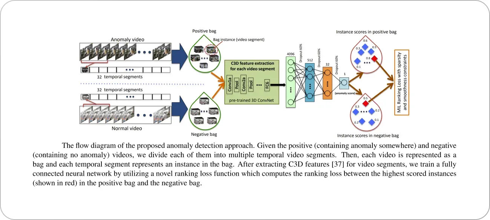

## Table of Contents

## What is video recognition in machine learning?

Video recognition in machine learning is the process where computers analyze and understand the content of videos. This involves breaking down videos into individual frames, and then using various algorithms to identify objects, actions, and events within those frames. By doing this, the computer can recognize what is happening in the video, similar to how a human would watch and understand it.

To achieve video recognition, machine learning models are trained on large datasets of videos. These models learn to detect patterns and features that are important for understanding video content. For example, a model might learn to recognize a person walking by analyzing the movement of their limbs across multiple frames. Once trained, these models can be used to automatically categorize videos, detect specific actions, or even generate descriptions of what is happening in the video.

## How do video recognition models differ from image recognition models?

Video recognition models and image recognition models both use machine learning to understand visual content, but they work in different ways because videos have more information than images. An image is just one picture, but a video is like a bunch of pictures shown quickly one after another. So, video recognition models need to look at many frames to understand what's happening over time. They can see movements and changes that an image recognition model can't see because it only looks at one picture at a time.

For example, if you want to recognize a person walking, an image recognition model might only see one pose in a single image. But a video recognition model can see the whole walking action by looking at many frames. This means video recognition models often use special techniques to track how things move and change from one frame to the next. They might use something called "temporal analysis" to understand the sequence of events in the video, which is not needed for images that don't change over time.

## What are some common applications of video recognition models?

Video recognition models are used in many ways to help people and businesses. One common use is in security and surveillance, where these models can watch video feeds to spot unusual activities or recognize known faces. For example, in a busy airport, video recognition can help security teams quickly find and follow someone they need to keep an eye on. Another use is in sports, where video recognition can analyze player movements and game strategies to help coaches make better decisions and improve player performance.

Another important application is in entertainment and media. Video recognition models can help with content moderation on social media platforms by automatically detecting and filtering out inappropriate videos. They can also help in creating better video search engines, where users can find videos by describing what they want to see, like "a cat playing with a ball." In the movie and TV industry, these models can help with editing by automatically tagging scenes or even helping to create special effects by tracking movements.

In healthcare, video recognition is used for monitoring patients remotely. For instance, it can help doctors keep an eye on how well a patient is moving after surgery, without needing to be there in person. This can save time and help patients get better care. Also, in education, video recognition can be used to analyze how students interact during online classes, helping teachers understand and improve their teaching methods.

## What is the basic architecture of a 3D ResNet-RS model?

A 3D ResNet-RS model is a type of [neural network](/wiki/neural-network) used for video recognition. It builds on the idea of a 2D ResNet, which is good for images, but adds a third dimension to handle videos. This third dimension represents time, allowing the model to understand how things change from one frame to the next. The basic architecture of a 3D ResNet-RS includes layers that apply 3D convolutions instead of 2D ones. These 3D convolutions look at both the spatial information (like in images) and the temporal information (how things change over time) in the video.

The model starts with an input layer that takes in a sequence of video frames. These frames are then passed through several 3D convolutional layers, which learn to recognize patterns in both space and time. After each convolution, there might be a batch normalization step to help the model train better, and an activation function like ReLU to introduce non-linearity. The model also includes residual connections, which help it learn better by allowing information to skip over some layers. These residual connections are what make it a "ResNet." The "RS" part stands for "Residual Squeeze-and-Excitation," which is a technique to focus on the most important features in the video. At the end, the model usually has some fully connected layers to make the final predictions about what's happening in the video.

## How does MoViNet improve upon traditional video recognition models?

MoViNet, which stands for Mobile Video Networks, improves upon traditional video recognition models by making them faster and more efficient, especially on mobile devices. Traditional models often need a lot of computing power and memory, which can make them slow or hard to use on phones or tablets. MoViNet uses a special way of processing videos called "streaming" that lets it look at the video as it comes in, without waiting for the whole thing to finish. This means it can start recognizing what's happening in the video much quicker and use less memory.

Another way MoViNet improves is by using something called "causal convolution." This means it only looks at the past frames to predict what's happening now, not the future ones. This makes the model more useful for real-time applications, like security cameras or live sports analysis, where you need to know what's happening right away. By focusing on what's important now and using less power, MoViNet makes video recognition easier and more practical for everyday use on devices that aren't super powerful.

## What are the key components of the AVSlowFast model and how do they work together?

The AVSlowFast model is a type of video recognition model that uses two different pathways to understand videos better. One pathway is called the "Slow" pathway, and it looks at the video frames slowly, like taking big steps through time. This pathway is good at understanding what things look like in the video, such as recognizing objects and scenes. The other pathway is called the "Fast" pathway, and it looks at the video frames quickly, like taking small steps through time. This pathway is good at understanding how things move and change in the video, like recognizing actions and movements.

These two pathways work together to give a complete picture of what's happening in the video. The Slow pathway helps the model see the big picture and understand the context, while the Fast pathway helps it catch the quick details and movements. By combining the information from both pathways, the AVSlowFast model can recognize both what is in the video and what is happening in it more accurately than if it used just one pathway. This makes it very useful for tasks like action recognition in videos, where understanding both the objects and their movements is important.

## Can you explain the concept of dual streams in the Dual-Stream C3D model?

The Dual-Stream C3D model is a video recognition model that uses two different streams to understand videos better. One stream is called the spatial stream, and it looks at each frame of the video like a picture. This stream is good at recognizing things like objects and scenes in the video. The other stream is called the temporal stream, and it looks at how the frames change over time. This stream is good at understanding movements and actions in the video. By using both streams together, the model can get a better understanding of what's happening in the video.

These two streams work together to give a complete picture of the video. The spatial stream helps the model see what's in each frame, like a dog or a car, while the temporal stream helps it see how those things move, like the dog running or the car driving. At the end, the model combines the information from both streams to make a final prediction about what's happening in the video. This way, the Dual-Stream C3D model can recognize both the objects and their movements more accurately than if it used just one stream.

## What are the challenges faced when training video recognition models?

Training video recognition models can be tricky because videos have a lot more information than pictures. Each video is made up of many frames, and the model needs to understand how things change from one frame to the next. This means the model needs to be good at understanding both what things look like and how they move. Also, videos can be long, so the model needs to be able to handle a lot of data without slowing down too much. This can make training the model take a long time and need a lot of computer power.

Another challenge is that videos can be different in many ways. They can be filmed from different angles, have different lighting, or be of different lengths. This makes it hard for the model to learn patterns that work for all videos. To help with this, people use big sets of videos to train the model, but even then, it can be hard to make sure the model works well for all kinds of videos. Sometimes, the model might do well on the videos it was trained on but not as well on new videos it hasn't seen before. This is called overfitting, and it's a big problem in video recognition.

## How do you evaluate the performance of video recognition models?

To evaluate the performance of video recognition models, we use different measures to see how well the model can recognize what's happening in videos. One common measure is accuracy, which tells us how often the model gets the right answer. For example, if the model is supposed to recognize if someone is walking or running, accuracy would tell us how often it correctly says "walking" or "running." Another measure is precision and recall. Precision tells us how many of the model's positive predictions were correct, while recall tells us how many of the actual positive cases the model found. These measures help us understand if the model is good at finding the right actions and not making too many mistakes.

Another way to evaluate video recognition models is by using confusion matrices. A confusion matrix shows us how the model's predictions match up with the actual labels. It helps us see if the model is confusing similar actions, like mistaking jogging for running. We also use metrics like F1 score, which is a balance between precision and recall, to get a single number that shows how well the model is doing overall. By looking at these different measures, we can get a good idea of how well the video recognition model works and where it might need to be improved.

## What are some advanced techniques used to optimize video recognition models?

One advanced technique to optimize video recognition models is called "knowledge distillation." This technique involves training a smaller, simpler model to mimic the behavior of a larger, more complex model. The idea is that the smaller model, called the student, can learn to perform almost as well as the larger model, called the teacher, but with less computing power and memory. This makes the model faster and easier to use on devices like phones or tablets. By using knowledge distillation, we can make video recognition more practical for everyday use without losing too much accuracy.

Another technique is "temporal segment networks" (TSN). TSN helps the model understand long videos better by breaking them into shorter segments and then looking at how things change from one segment to the next. This way, the model can see both the big picture and the small details of the video. TSN also uses a special way of combining information from different segments, called "consensus function," to make better predictions about what's happening in the whole video. By using TSN, video recognition models can handle longer videos and make more accurate predictions about complex actions and events.

## How can transfer learning be applied to improve video recognition models?

Transfer learning is a smart way to make video recognition models better without starting from scratch. It works by taking a model that's already good at recognizing things in pictures and using it to help with videos. Imagine you have a model that's great at spotting cats in photos. With transfer learning, you can use what that model knows about cats to help it recognize cats in videos too. You do this by keeping the early layers of the model, which are good at finding basic shapes and patterns, and then training new layers on top to understand how things move and change in videos. This way, the model can learn faster and work better because it already knows a lot about what things look like.

One cool thing about transfer learning is that it can help even if the new videos are different from the old pictures. For example, if you trained your model on pictures of animals, you can use transfer learning to help it recognize animals in videos, even if the videos are taken in different places or with different lighting. By using what the model already knows, you can make it work well on new videos without needing a huge amount of new data. This makes training video recognition models easier and quicker, which is really helpful when you want to use them on lots of different kinds of videos.

## What future developments can we expect in the field of video recognition models?

In the future, video recognition models are likely to become even smarter and faster. One big change we might see is models that can understand videos in real-time, no matter how long or complex they are. This means they could be used for things like live sports analysis or security monitoring, where every second counts. Another exciting development could be models that can learn from fewer examples. Right now, these models need a lot of videos to learn from, but in the future, they might be able to learn just as well from a smaller number of videos. This would make it easier and cheaper to train new models for different tasks.

We might also see video recognition models that can understand more about what's happening in videos, like the emotions of people or the context of a scene. For example, a model might be able to tell not just that someone is walking, but also if they're happy or sad while doing it. This could be really useful in areas like healthcare, where understanding a patient's mood could help doctors give better care. Overall, as technology keeps getting better, video recognition models will become more powerful and useful in our everyday lives, helping us with everything from entertainment to safety.