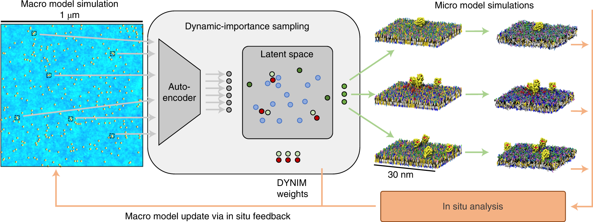

## Table of Contents

## What is video sampling in the context of machine learning?

Video sampling in machine learning refers to the process of selecting specific frames or segments from a video to use as training or testing data for machine learning models. This is important because videos often contain a large amount of data, and processing every frame can be computationally expensive and unnecessary. By sampling, we can reduce the amount of data to a manageable size while still capturing the essential information needed for the model to learn effectively.

The way video sampling is done can vary depending on the specific application and the goals of the machine learning task. For example, if the goal is to detect certain actions or events in a video, the sampling strategy might focus on selecting frames that are likely to contain these actions. On the other hand, if the goal is to understand the overall content of the video, a more uniform sampling approach might be used. The choice of sampling method can significantly impact the performance of the machine learning model, so it's important to choose a method that aligns well with the intended use of the model.

## Why is video sampling important for training machine learning models?

Video sampling is important for training machine learning models because it helps manage the large amount of data in videos. Videos can have thousands of frames, and processing all of them would take a lot of time and computer power. By choosing specific frames or segments, we can make the training process faster and more efficient. This way, the model can still learn what it needs to know without having to go through every single frame.

Additionally, video sampling helps focus the model on the most relevant parts of the video. For example, if we want the model to recognize certain actions, we can sample frames that show those actions happening. This makes the model better at its job because it learns from the parts of the video that matter most. By using smart sampling methods, we can improve how well the model performs and make sure it learns the right things.

## What are the common techniques used for video sampling?

One common technique for video sampling is uniform sampling. This means [picking](/wiki/asset-class-picking) frames at regular intervals, like every 10th frame. It's simple and makes sure the model sees different parts of the video evenly. Uniform sampling is good when you want the model to understand the whole video and not just specific moments.

Another technique is keyframe sampling. This involves choosing frames that show important changes or events in the video. For example, if a video is about someone dancing, keyframe sampling would pick frames where the dancer changes position. This method helps the model focus on the most relevant parts of the video, making it better at recognizing actions or events.

A third technique is random sampling, where frames are chosen randomly from the video. This can be useful for making the model more robust because it sees a variety of different frames. Random sampling can help the model learn to handle unexpected situations or changes in the video.

## How does temporal jittering work in video sampling?

Temporal jittering is a technique used in video sampling where small, random changes are made to the timing of when frames are picked. Imagine you are picking frames every 10 seconds, but with temporal jittering, you might pick a frame at 9.5 seconds, then at 10.7 seconds, and so on. This small randomness helps the model see different parts of the video and learn better. It makes the model more flexible and able to handle changes in the timing of events in the video.

By using temporal jittering, the model can learn to recognize actions or events even if they happen a bit earlier or later than expected. For example, if you're training a model to recognize a person waving, temporal jittering can help the model understand that the waving might start at different times in different videos. This makes the model more accurate and reliable when it's used in real situations where things don't always happen at the same time.

## What are the benefits of using temporal jittering in video sampling?

Temporal jittering helps make [machine learning](/wiki/machine-learning) models better at understanding videos. It does this by adding small random changes to when frames are picked from the video. This means the model sees different parts of the video and learns to recognize actions or events even if they happen at slightly different times. For example, if you're teaching a model to spot a person waving, temporal jittering lets the model learn that waving might start a bit earlier or later in different videos. This makes the model more flexible and able to handle real-world situations where things don't always happen at the same time.

Using temporal jittering also makes the model more accurate and reliable. When the model is trained with frames picked at slightly different times, it gets better at recognizing patterns and events no matter when they occur. This is important because in real life, actions and events can happen at different speeds or with different timing. By using temporal jittering, the model learns to be more adaptable and can perform better when it's used to analyze new videos.

## Can you explain how to implement temporal jittering in a video sampling process?

To implement temporal jittering in a video sampling process, you start by deciding on a base interval at which you want to sample frames. For example, if you want to sample every 10 seconds, that's your base interval. Then, you add a small random amount of time to this interval each time you pick a frame. This random amount is usually very small, like a few seconds or less. You can use a random number generator to create this jitter. For example, if your base interval is 10 seconds, you might add a random number between -0.5 and 0.5 seconds each time you pick a frame. This way, you might sample a frame at 9.7 seconds, then at 10.3 seconds, and so on.

Here's a simple example of how you could code this in Python:

```python
import random
import cv2

video = cv2.VideoCapture('your_video.mp4')
frame_rate = video.get(cv2.CAP_PROP_FPS)
base_interval = 10  # Sample every 10 seconds
jitter_range = 0.5  # Jitter between -0.5 and 0.5 seconds

current_time = 0
while True:
    jitter = random.uniform(-jitter_range, jitter_range)
    sample_time = current_time + base_interval + jitter
    video.set(cv2.CAP_PROP_POS_MSEC, sample_time * 1000)  # Set the video to the sample time
    success, frame = video.read()
    if not success:
        break
    # Process the frame here
    current_time = sample_time

video.release()
```

In this code, we use the `random.uniform` function to create the jitter, and we set the video to the sample time using `video.set`. This way, we make sure the model sees different parts of the video and learns to handle timing differences better.

## What are the challenges faced when applying video sampling techniques?

Video sampling can be tricky because it's hard to choose the right frames to use for training a machine learning model. If you pick the wrong frames, the model might not learn what it needs to know. For example, if you want the model to recognize a person dancing, but you only sample frames where the person is standing still, the model won't learn about the dancing. Also, different videos might need different sampling techniques. A video of a fast-moving sport might need more frequent sampling than a video of a slow-moving nature scene. This means you have to think carefully about how to sample each video to make sure the model learns well.

Another challenge is that video sampling can make the model miss important details. If you use uniform sampling, you might miss key moments in the video because you're only looking at frames at regular intervals. On the other hand, if you use keyframe sampling, it can be hard to decide which frames are important enough to include. You might miss some important frames if you're not careful. Random sampling can help with this, but it can also make the training process take longer because the model has to look at more frames to learn what it needs to know. So, finding the right balance between sampling enough frames to capture the important information and not sampling so many that it slows down the training process is a big challenge.

## How does video sampling affect the performance of machine learning models?

Video sampling can really change how well a machine learning model works. If you pick the right frames from a video, the model can learn what it needs to know quickly and accurately. For example, if you want the model to recognize a person dancing, sampling frames where the person is actually dancing helps the model learn that action. But if you pick the wrong frames, like ones where the person is just standing still, the model won't learn about dancing at all. So, choosing the right frames is super important for making sure the model performs well.

Another thing to think about is how much data the model has to look at. If you sample too many frames, it can take a long time for the model to train, and it might not even help the model learn better. But if you don't sample enough frames, the model might miss important details and not perform as well as it could. Finding the right balance is tricky but important. Using techniques like temporal jittering can help the model be more flexible and handle different situations better, which can improve its performance.

## What metrics should be used to evaluate the effectiveness of video sampling?

To evaluate how well video sampling works for training machine learning models, you can use accuracy as a key metric. Accuracy tells you how often the model gets things right. If the model is supposed to recognize actions in a video, you can check how many times it correctly identifies those actions in the sampled frames. Another important metric is the model's performance on a separate test set of videos that it hasn't seen before. This helps you see if the model can generalize what it learned from the sampled frames to new videos. You can calculate accuracy with a simple formula: $$ \text{Accuracy} = \frac{\text{Number of correct predictions}}{\text{Total number of predictions}} \times 100\% $$.

Another useful metric is the training time, which measures how long it takes for the model to learn from the sampled frames. If sampling reduces the amount of data the model needs to process, it should speed up the training process. You can also look at the model's precision and recall. Precision tells you how many of the positive predictions the model made were actually correct, while recall tells you how many of the actual positive cases the model was able to find. These metrics help you understand if the model is good at identifying the right things and not missing important details. Together, these metrics give you a good picture of how effective your video sampling technique is.

## How can video sampling be optimized for different types of machine learning tasks?

Video sampling can be optimized for different machine learning tasks by choosing the right sampling method based on what the model needs to learn. For example, if you want the model to recognize actions like dancing or running, you should use keyframe sampling to pick frames that show these actions happening. This helps the model focus on the important parts of the video. On the other hand, if you want the model to understand the overall content of the video, like what's happening in a nature documentary, uniform sampling might be better because it gives the model a broad view of the video.

For tasks where timing is important, like detecting when a specific event happens, using temporal jittering can make the model more flexible and accurate. Temporal jittering adds small random changes to when frames are picked, so the model learns to recognize events even if they happen a bit earlier or later than expected. This can be especially helpful for real-world applications where things don't always happen at the same time. By choosing the right sampling technique and adjusting it for the specific task, you can make sure the model performs well and learns what it needs to know from the video.

## What are the latest advancements in video sampling techniques for machine learning?

One of the latest advancements in video sampling for machine learning is the use of adaptive sampling techniques. These methods automatically adjust the sampling rate based on the content of the video. For example, if the video shows a lot of action or movement, the sampling rate might increase to capture more frames and ensure the model doesn't miss important details. On the other hand, if the video is more static, the sampling rate might decrease to save processing time. This helps make the training process more efficient and can improve the model's performance by focusing on the most relevant parts of the video.

Another advancement is the use of [deep learning](/wiki/deep-learning) to guide the sampling process. Researchers are now using neural networks to analyze videos and decide which frames are the most important to sample. This can be particularly useful for tasks like action recognition or event detection, where the model needs to focus on specific moments. By using deep learning to identify keyframes, the model can learn more effectively from the sampled data, leading to better accuracy and performance. These techniques are still being developed, but they show a lot of promise for improving how we use video data in machine learning.

## How does video sampling integrate with other data augmentation techniques in machine learning?

Video sampling works well with other [data augmentation](/wiki/data-augmentation) techniques to make machine learning models better. For example, after you pick frames from a video, you can use techniques like flipping, rotating, or changing the brightness of those frames to create more training data. This helps the model see the same action or event in different ways, making it more flexible and able to recognize things even if they look a bit different. By combining video sampling with these other methods, you can make sure the model gets a good variety of examples to learn from, which can improve its accuracy and performance.

Another way video sampling integrates with data augmentation is through techniques like temporal jittering and frame interpolation. Temporal jittering adds small random changes to when frames are picked, and this can be combined with other methods like frame interpolation, where new frames are created between existing ones. This helps the model learn about the timing and flow of actions in the video. By using these techniques together, the model can learn to handle different speeds and timing of events, making it more reliable in real-world situations where things don't always happen at the same time.

## References & Further Reading

[1]: Yeung, S., Russakovsky, O., Jin, N., Andriluka, M., Mori, G., & Fei-Fei, L. (2018). ["Every Moment Counts: Dense Detailed Labeling of Actions in Complex Videos."](https://link.springer.com/article/10.1007/s11263-017-1013-y) Proceedings of the IEEE Conference on Computer Vision and Pattern Recognition (CVPR).

[2]: Karpathy, A., Toderici, G., Shetty, S., Leung, T., Sukthankar, R., & Fei-Fei, L. (2014). ["Large-Scale Video Classification with Convolutional Neural Networks."](https://ieeexplore.ieee.org/document/6909619) Proceedings of the IEEE Conference on Computer Vision and Pattern Recognition (CVPR).

[3]: Simonyan, K., & Zisserman, A. (2014). ["Two-Stream Convolutional Networks for Action Recognition in Videos."](https://dl.acm.org/doi/10.5555/2968826.2968890) Advances in Neural Information Processing Systems (NIPS).

[4]: Wang, X., Farhadi, A., & Gupta, A. (2016). ["Actions ˜ Transformations."](https://arxiv.org/abs/1512.00795) Advances in Neural Information Processing Systems (NIPS).

[5]: Girdhar, R., Ramanan, D., Gupta, A., Sivic, J., & Russell, B. C. (2017). ["ActionVLAD: Learning Spatio-Temporal Aggregation for Action Classification."](https://arxiv.org/abs/1704.02895) Proceedings of the IEEE Conference on Computer Vision and Pattern Recognition (CVPR).

[6]: Wu, C., Feichtenhofer, C., Fan, H., He, K., Krahenbuhl, P., & Girshick, R. (2020). ["Long-Term Feature Banks for Detailed Video Understanding."](https://arxiv.org/abs/1812.05038) Proceedings of the IEEE Conference on Computer Vision and Pattern Recognition (CVPR).

[7]: Liu, C., Wu, Y., Luo, D., Tang, M., Wang, F., Jiang, B., & Liu, W. (2021). ["Strong Baselines for Temporal Sampling in Video Understanding."](https://advanced.onlinelibrary.wiley.com/doi/full/10.1002/adfm.202424526) Proceedings of the IEEE/CVF International Conference on Computer Vision (ICCV).