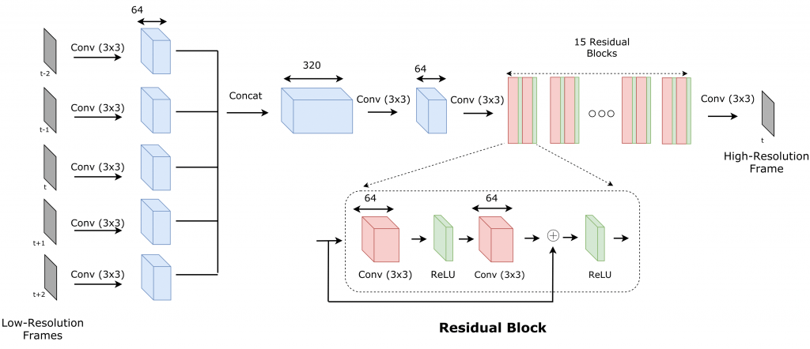

## Table of Contents

## What is video super-resolution and why is it important?

Video super-resolution is a technology that makes low-quality videos look better by increasing their resolution. Imagine you have a video that looks blurry or pixelated because it was recorded with a low-quality camera or compressed too much. Video super-resolution takes this video and uses smart computer algorithms to guess what the missing details might look like, creating a clearer, sharper version of the video. This process involves analyzing the existing frames of the video, understanding the patterns and movements, and then filling in the gaps to produce a higher resolution video.

This technology is important for several reasons. First, it helps us enjoy old videos or footage from low-quality sources in a better way. For example, if you have old family videos that are not very clear, video super-resolution can make them look much better. Second, it is useful in many professional fields like surveillance, medical imaging, and entertainment. In surveillance, clearer videos can help identify important details. In medicine, better resolution can help doctors see more clearly inside the body. And in entertainment, it can enhance the viewing experience by making movies and TV shows look sharper and more detailed. Overall, video super-resolution improves the quality of visual content, making it more useful and enjoyable for everyone.

## How does video super-resolution differ from image super-resolution?

Video super-resolution and image super-resolution both aim to improve the quality of visual content, but they work with different types of data. Image super-resolution focuses on enhancing the resolution of a single picture. It uses algorithms to analyze the pixels in the image and create a higher resolution version by guessing what the missing details might look like. This process is simpler because it only needs to consider the information within one image.

On the other hand, video super-resolution deals with a series of images, or frames, that make up a video. This makes the task more complex because it needs to consider not only the details within each frame but also how these frames relate to each other over time. Video super-resolution algorithms use information from multiple frames to enhance the resolution, taking into account motion and continuity between frames. This means that video super-resolution can often produce better results because it has more data to work with, but it also requires more sophisticated techniques to handle the dynamic nature of video content.

## What are the main challenges in video super-resolution?

One of the main challenges in video super-resolution is handling motion. Videos are made up of many frames that show movement, and this motion can make it hard to improve the resolution. When objects or the camera move, the details in the frames change from one moment to the next. This means the algorithms need to track these changes and make sure the enhanced frames still look smooth and natural. If the motion isn't handled well, the video might look blurry or have weird artifacts that make it look worse instead of better.

Another challenge is dealing with the amount of data in videos. Videos have a lot more information than single images because they have many frames. This means the algorithms need to process a lot of data quickly to make the video look better in real-time. It can be tough to do this without slowing down the video or using too much computer power. Also, the algorithms need to be smart enough to understand the patterns and details in all these frames and use that information to create a higher resolution video without losing the original quality.

Lastly, balancing the trade-off between quality and speed is a significant challenge. While it's important to make the video look as good as possible, it's also important to do it fast enough so that the video doesn't lag. This means the algorithms need to find a way to enhance the video quickly without sacrificing too much quality. If the process takes too long, it might not be practical for real-time applications like video streaming or live surveillance.

## What is BasicVSR and how does it work?

BasicVSR, which stands for Basic Video Super-Resolution, is a simple yet effective method for improving the quality of videos. It works by using a special kind of computer model called a [neural network](/wiki/neural-network). This model looks at many frames of a video at once and tries to figure out how to make them look clearer and sharper. BasicVSR uses something called a bidirectional recurrent structure, which means it looks at the frames both forward and backward in time. This helps the model understand the movement in the video better and make more accurate guesses about what the missing details should look like.

The way BasicVSR works is by first taking the low-quality video and breaking it into individual frames. Then, it uses its neural network to process these frames in a special order. It starts by looking at the middle frame and then moves outward, processing frames before and after the middle one. This helps the model keep track of how things move in the video. Once it has processed all the frames, BasicVSR puts them back together into a video that has a higher resolution than the original. This whole process is designed to be fast and efficient, so it can work well even on videos that are being watched in real-time.

## What are the key components of the BasicVSR architecture?

The BasicVSR architecture consists of several key components that work together to improve the resolution of videos. At the heart of BasicVSR is a bidirectional recurrent neural network. This means the model processes the video frames in two directions: forward and backward. By doing this, the model can better understand the motion and changes between frames. The neural network uses a structure called a [long short](/wiki/equity-long-short)-term memory (LSTM) unit, which helps it remember information from earlier frames and use it to make better predictions about the missing details in the current frame.

Another important part of BasicVSR is the way it processes the frames. It starts with the middle frame of a video segment and then moves outward, processing frames before and after the middle one. This approach helps the model keep track of how objects move over time. BasicVSR also uses something called residual learning, which means it focuses on the differences between the low-quality and high-quality frames rather than trying to create the entire high-quality frame from scratch. This makes the process more efficient and helps the model produce clearer, sharper videos.

## How does BasicVSR handle the temporal information in videos?

BasicVSR handles the temporal information in videos by using a bidirectional recurrent neural network. This means it looks at the video frames both forward and backward in time. Imagine watching a video, and you can see what happens before and after each moment. BasicVSR does something similar. It starts with the middle frame of a video segment and then processes the frames that come before and after it. By doing this, the model can understand how things move and change from one frame to the next. This helps BasicVSR make better guesses about the missing details and create a clearer, sharper video.

The model uses a special part called a long short-term memory (LSTM) unit. This unit helps BasicVSR remember information from earlier frames and use it to improve the current frame. Think of it like trying to solve a puzzle. If you remember what pieces you've seen before, you can fit them together better. The LSTM unit helps BasicVSR keep track of the movement and patterns in the video, making sure the enhanced video looks smooth and natural. By considering the temporal information in this way, BasicVSR can produce a higher resolution video that looks good and keeps the original video's flow.

## What datasets are commonly used to train and evaluate video super-resolution models like BasicVSR?

Common datasets used to train and evaluate video super-resolution models like BasicVSR include the REDS (REalistic and Dynamic Scenes) dataset and the Vimeo-90K dataset. The REDS dataset contains high-quality video clips with various scenes and motions, making it great for training models to handle different types of videos. It includes both training and testing sets, which helps researchers see how well their models work on new videos they haven't seen before. The Vimeo-90K dataset is another popular choice, featuring a large number of short video clips from the Vimeo website. These clips are diverse and can help models learn to enhance videos with different content and styles.

Another useful dataset is the Vid4 dataset, which is smaller but still valuable for testing how well video super-resolution models perform. It includes four video clips that are often used to check the quality of the enhanced videos. Researchers also sometimes use the UCF101 dataset, which has a wide range of action videos. This dataset helps models learn to handle videos with lots of movement and different activities. By using these datasets, researchers can train and test video super-resolution models like BasicVSR to make sure they work well on many types of videos.

## How does BasicVSR compare to other video super-resolution models in terms of performance?

BasicVSR is known for being simple yet effective in improving video quality. When compared to other video super-resolution models, BasicVSR often performs well, especially considering its straightforward design. It uses a bidirectional recurrent neural network, which helps it understand how things move in a video. This approach makes BasicVSR good at keeping the video smooth and clear. In tests on common datasets like REDS and Vimeo-90K, BasicVSR has shown results that are competitive with more complex models. It's not always the best, but it does a good job without needing a lot of computer power or time.

Some other models, like IconVSR and EDVR, might do better in certain situations. IconVSR, for example, uses a more advanced way to handle motion and can sometimes produce sharper videos. EDVR is another strong model that can handle complex scenes well. However, these models often need more time and computer resources to work. BasicVSR, on the other hand, is faster and easier to use, which makes it a good choice for many practical applications. Overall, while BasicVSR might not always be the top performer, its balance of speed and quality makes it a popular choice for video super-resolution.

## What are the computational requirements and efficiency considerations for deploying BasicVSR?

BasicVSR is designed to be efficient, which means it doesn't need a lot of computer power to work well. It uses a simple structure called a bidirectional recurrent neural network. This helps it process videos quickly without using too much memory or processing time. Because of this, BasicVSR can be used on many different devices, even ones that aren't very powerful. It's a good choice for real-time applications like video streaming or live surveillance because it can enhance videos fast enough to keep up with what's happening.

Even though BasicVSR is efficient, there are still some things to think about when deploying it. The model needs to balance the quality of the video with how fast it can process it. If you want a very high-quality video, it might take a bit more time and computer power. But if you need the video to be enhanced quickly, you might have to accept a bit less quality. Overall, BasicVSR does a good job of finding a middle ground, making it a practical choice for many uses.

## How can the performance of BasicVSR be further improved or optimized?

To make BasicVSR work even better, researchers can try a few things. One way is to use more data to train the model. The more videos BasicVSR sees, the better it can learn to guess what missing details should look like. Another way is to change the model a bit. For example, adding more layers to the neural network might help it understand videos better, but it could also make it slower. Researchers need to find a good balance between making the video look better and keeping the model fast enough to use in real-time.

Another thing that can help is to use smarter ways to handle motion in videos. BasicVSR already looks at frames both forward and backward, but there might be even better ways to do this. For example, using more advanced motion estimation techniques could make the enhanced videos look smoother and clearer. Also, making the model more efficient by using special computer tricks, like quantization, can help it run faster on different devices without losing much quality. By trying these different ideas, researchers can keep improving how well BasicVSR works.

## What are some real-world applications of video super-resolution models like BasicVSR?

Video super-resolution models like BasicVSR have many real-world uses. One common use is in the entertainment industry. When people watch old movies or TV shows, they often want them to look as good as new ones. Video super-resolution can help make these old videos clearer and sharper, so viewers can enjoy them more. It's also used in video streaming services. When videos are streamed over the internet, they sometimes lose quality. Using video super-resolution, these services can make the videos look better even if the internet connection isn't great.

Another important use is in surveillance and security. Cameras used for surveillance often don't have the best quality, but with video super-resolution, the videos they record can be made clearer. This helps people see important details they might have missed before, like the faces of people or license plate numbers. In medicine, video super-resolution can also be helpful. Doctors use videos to look inside the body, and making these videos clearer can help them see things better and make better decisions about treatments.

## What future developments can we expect in the field of video super-resolution?

In the future, we can expect video super-resolution to get even better and more useful. One big change might be that these models will use even smarter ways to understand how things move in videos. This could make the videos look smoother and more natural when they are made clearer. Also, as computers get more powerful, video super-resolution models might be able to work faster and handle more data. This means they could make videos look better in real-time, even on devices like phones and tablets. Researchers might also find new ways to train these models with less data, making them easier to use for more people.

Another exciting development could be using video super-resolution in new areas. For example, it might be used more in virtual reality and augmented reality to make the images and videos in these technologies look better. Also, as more videos are shared online, video super-resolution could become a standard tool for improving the quality of videos on social media and other platforms. Overall, the future of video super-resolution looks bright, with lots of potential to make our videos clearer and more enjoyable to watch.

## References & Further Reading

[1]: Wang, X., Chan, K. C., Yu, K., Dong, C., Change Loy, C., & Lin, S. (2019). ["EDVR: Video Restoration with Enhanced Deformable Convolutional Networks."](https://arxiv.org/abs/1905.02716) IEEE/CVF Conference on Computer Vision and Pattern Recognition Workshops (CVPRW).

[2]: Chan, T., Zhou, X., Xu, L., & Jia, J. (2021). ["BasicVSR: The Search for Essential Components in Video Super-Resolution and Beyond."](https://www.sciencedirect.com/science/article/pii/S0304383525002848) IEEE/CVF Conference on Computer Vision and Pattern Recognition (CVPR).

[3]: Nah, S., Baik, S., Hong, S., Moon, G., Son, S., Timofte, R., & Lee, K. M. (2019). ["NTIRE 2019 Challenge on Video Deblurring and Super-Resolution: Dataset and Study."](https://ieeexplore.ieee.org/document/9025509) IEEE/CVF Conference on Computer Vision and Pattern Recognition Workshops (CVPRW).

[4]: Xiang, F., Bao, W., Zhang, H., Wu, J., Liu, Z., & Yang, J. (2020). ["ICONVSR: Fast Real-world Video Super-Resolution Using Fractal Residual Network."](https://onlinelibrary.wiley.com/doi/full/10.1002/ange.202413660) IEEE Winter Conference on Applications of Computer Vision (WACV).

[5]: Caballero, J., Ledig, C., Aitken, A., Acosta, A., Totz, J., Bishop, R., & C. Kautz, J. (2017). ["Real-Time Video Super-Resolution with Spatio-Temporal Networks and Motion Compensation."](https://arxiv.org/abs/1611.05250) IEEE Conference on Computer Vision and Pattern Recognition (CVPR).