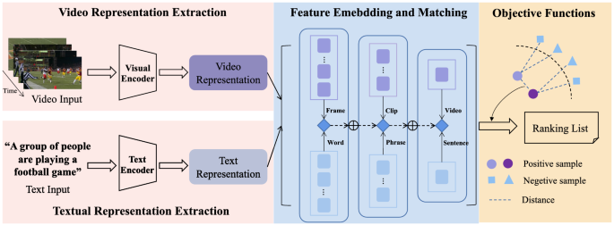

## Table of Contents

## What is Video-Text Retrieval in the context of machine learning?

Video-Text Retrieval is a task in machine learning where the goal is to find the most relevant videos for a given text query, or the most relevant text for a given video. Imagine you type a sentence into a search engine, and instead of getting web pages, you get videos that match what you described. This is useful in many places, like video search engines or helping people find videos they might like based on what they're interested in.

To do this, machine learning models learn to understand both videos and text. They look at things like the words in the text, and the images, sounds, and movements in the video. The model then tries to find a match between what the text says and what the video shows. This can be tricky because videos have a lot of information, and text can describe things in many different ways. But when it works well, it makes finding the right video much easier and faster.

## How do Video-Text Retrieval models work?

Video-Text Retrieval models work by turning both videos and text into a form that a computer can compare easily. First, the model breaks down the video into smaller parts, like frames or short clips, and looks at what's happening in each part. It might also listen to the sounds or words spoken in the video. At the same time, the model reads the text query and understands the meaning of the words. Both the video and the text are then transformed into something called embeddings, which are like special codes that represent their content in a way that a computer can understand. The model then measures how similar the video embeddings are to the text embeddings, usually using a distance metric like cosine similarity, $$ \text{similarity} = \frac{\mathbf{A} \cdot \mathbf{B}}{\|\mathbf{A}\| \|\mathbf{B}\|} $$, where $$\mathbf{A}$$ and $$\mathbf{B}$$ are the embeddings of the video and text, respectively.

Once the model has these similarity scores, it can rank the videos based on how well they match the text query. The videos with the highest similarity scores are considered the best matches and are shown to the user. To make these models work well, they need to be trained on a lot of examples of videos and text that go together. During training, the model learns to make the embeddings of matching video-text pairs more similar and the embeddings of non-matching pairs less similar. This way, when a new query comes in, the model can quickly find the videos that best fit what the user is looking for.

## What are some common applications of Video-Text Retrieval?

One common application of Video-Text Retrieval is in video search engines. When you type what you're looking for into a video search engine, the system uses Video-Text Retrieval to find the best matching videos. For example, if you search for "a dog playing fetch," the system will look through its database of videos and show you the ones where dogs are playing fetch. This makes it easier and quicker for you to find exactly what you want to watch.

Another application is in personalized video recommendations. Streaming services like Netflix or YouTube use Video-Text Retrieval to suggest videos that match your interests. If you've watched a lot of cooking shows and you search for "Italian recipes," the system will use Video-Text Retrieval to find and recommend videos about Italian cooking that you might enjoy. This helps keep you engaged and coming back to the platform.

Video-Text Retrieval is also used in educational settings. For instance, if a teacher wants to find a video to show in class about a specific topic, like "photosynthesis," they can use Video-Text Retrieval to quickly find relevant educational videos. This saves time and ensures that the content is closely related to what they're teaching, making the learning experience better for students.

## Can you explain the basic architecture of a Video-Text Retrieval model?

The basic architecture of a Video-Text Retrieval model involves two main parts: a video encoder and a text encoder. The video encoder takes a video and breaks it down into smaller parts, like frames or short clips. It then looks at the images, sounds, and movements in these parts to create a special code called an embedding that represents the video's content. The text encoder, on the other hand, reads the text query and understands the meaning of the words to create another embedding that represents the text's content. Both embeddings are designed to capture the key information in a way that a computer can easily compare.

Once the embeddings are created, the model compares them using a similarity measure, often cosine similarity, to see how well the video matches the text. The formula for cosine similarity is $$ \text{similarity} = \frac{\mathbf{A} \cdot \mathbf{B}}{\|\mathbf{A}\| \|\mathbf{B}\|} $$, where $$\mathbf{A}$$ and $$\mathbf{B}$$ are the embeddings of the video and text, respectively. By calculating this similarity score for different videos, the model can rank them from most to least relevant to the text query. The videos with the highest similarity scores are then presented to the user as the best matches.

## What is CoVR and how does it contribute to Video-Text Retrieval?

CoVR stands for Contrastive Video-Text Retrieval, which is a specific approach to improving how well video-text retrieval models work. It uses a technique called contrastive learning, where the model learns by comparing lots of pairs of videos and texts. The goal is to make the embeddings of matching video-text pairs very similar and the embeddings of non-matching pairs very different. This helps the model get better at finding the right videos for a given text query. By training the model this way, CoVR can make video-text retrieval more accurate and faster.

In CoVR, the model uses a special loss function called the contrastive loss. This loss function helps the model learn by pushing the embeddings of matching pairs closer together and pulling the embeddings of non-matching pairs further apart. The formula for the contrastive loss is $$ \mathcal{L} = -\log \frac{\exp(\text{similarity}(\mathbf{v}_i, \mathbf{t}_i) / \tau)}{\sum_{j=1}^{N} \exp(\text{similarity}(\mathbf{v}_i, \mathbf{t}_j) / \tau)} $$, where $$\mathbf{v}_i$$ and $$\mathbf{t}_i$$ are the embeddings of a video and its matching text, $$\tau$$ is a temperature parameter, and $$N$$ is the number of text samples. By using this loss function, CoVR helps the model learn better embeddings, which leads to more accurate video-text retrieval.

## How does VLG-Net improve upon existing Video-Text Retrieval models?

VLG-Net, which stands for Video-Language Grounding Network, improves upon existing Video-Text Retrieval models by focusing on better understanding how videos and texts connect. It does this by looking at specific parts of the video that match the text more closely. For example, if the text says "a dog is running," VLG-Net will try to find the exact moments in the video where a dog is running. This helps the model find videos that match the text more accurately because it pays attention to the right parts of the video.

To achieve this, VLG-Net uses a special method called cross-modal attention. This method helps the model understand which parts of the video are important for the text. It does this by creating a connection between the video and the text, making the embeddings more focused on the relevant parts. The formula for calculating attention is $$ \text{Attention}(Q, K, V) = \text{softmax}\left(\frac{QK^T}{\sqrt{d_k}}\right)V $$, where $$Q$$ is the query (from text), $$K$$ is the key (from video), $$V$$ is the value (from video), and $$d_k$$ is the dimension of the key vectors. By using this attention mechanism, VLG-Net can find videos that match the text more precisely, making the whole retrieval process better.

## What unique features does CAMoE bring to Video-Text Retrieval?

CAMoE, which stands for Cross-modal Alignment and Memory-enhanced Encoder, brings unique features to Video-Text Retrieval by focusing on how to better match videos with text. It does this by using a special way to remember important parts of videos and texts, called a memory-enhanced encoder. This helps CAMoE keep track of the most important bits of information, making it easier to find the right video for a given text. For example, if you're looking for a video of "a cat playing with a ball," CAMoE can remember and focus on the moments in the videos where cats are playing with balls, making the search more accurate.

Another unique feature of CAMoE is its cross-modal alignment method. This method helps the model understand how videos and texts relate to each other better. It does this by aligning the video and text in a way that the important parts of each match up more closely. The formula for calculating this alignment is $$ \text{alignment} = \frac{\mathbf{v} \cdot \mathbf{t}}{\|\mathbf{v}\| \|\mathbf{t}\|} $$, where $$\mathbf{v}$$ and $$\mathbf{t}$$ are the embeddings of the video and text, respectively. By using this alignment, CAMoE can find videos that match the text more precisely, making the retrieval process more effective and improving the overall user experience.

## How does ReGaDa approach the problem of Video-Text Retrieval differently?

ReGaDa, which stands for Region-based Graph Attention for Video-Text Retrieval, takes a unique approach by focusing on the specific parts of a video that match the text. Instead of looking at the whole video, ReGaDa breaks it down into smaller regions, like different objects or actions. It then uses a special way of paying attention, called graph attention, to understand how these regions connect to the text. For example, if the text says "a dog chasing a frisbee," ReGaDa will look for the exact parts of the video where a dog is chasing a frisbee and give more importance to those parts.

To do this, ReGaDa uses a formula for graph attention, which helps it understand how different parts of the video relate to each other and to the text. The formula for graph attention is $$ \text{Attention}(Q, K, V) = \text{softmax}\left(\frac{QK^T}{\sqrt{d_k}}\right)V $$, where $$Q$$ is the query (from text), $$K$$ is the key (from video regions), $$V$$ is the value (from video regions), and $$d_k$$ is the dimension of the key vectors. By using this method, ReGaDa can find the most relevant parts of the video and match them more accurately with the text, making the retrieval process more effective and precise.

## What are the key challenges faced in developing Video-Text Retrieval models?

One of the biggest challenges in developing Video-Text Retrieval models is dealing with the huge amount of information in videos. Videos have pictures, sounds, and movements, all happening over time. This makes it hard for the model to understand and compare everything to the text. The model needs to find a way to turn this complex video data into something simple, like an embedding, that it can compare to the text embedding. This process can be tricky because the model needs to capture what's important in the video without missing key details. For example, if the text says "a dog playing fetch," the model must focus on the dog and the fetch action, not just any random part of the video.

Another challenge is making sure the model works well with different kinds of text and videos. People can describe things in many ways, and videos can show the same thing from different angles or with different backgrounds. The model needs to be smart enough to understand these differences and still find the right match. This means the model has to be trained on a lot of different examples to learn how to handle all these variations. It also needs to be good at understanding the meaning behind the words and the actions in the video, which can be difficult because language and visuals can be interpreted in many ways.

## How can the performance of Video-Text Retrieval models be evaluated?

The performance of Video-Text Retrieval models is often evaluated using metrics like Recall at K (R@K) and Mean Average Precision (mAP). R@K measures how often the correct video appears in the top K results when searching with a text query. For example, if R@5 is high, it means the model usually finds the right video within the top 5 results. mAP looks at how well the model ranks all the videos, not just the top few. It checks if the correct videos are ranked higher than the wrong ones and gives a score based on how accurate the whole list is. These metrics help show how good the model is at finding the right videos for a given text.

Another way to evaluate these models is through user studies. In these studies, people use the model and say how happy they are with the results. If users find the videos they want quickly and easily, it's a sign that the model is working well. Sometimes, researchers also look at how fast the model can search through a big collection of videos. If it can do this quickly, it's more useful for real-life applications. By using a mix of these methods, researchers can get a good idea of how well a Video-Text Retrieval model is doing and where it might need to be improved.

## What are the latest advancements in Video-Text Retrieval models?

One of the latest advancements in Video-Text Retrieval is the use of more advanced attention mechanisms. Models like ReGaDa use region-based graph attention to focus on specific parts of the video that match the text. This helps the model understand which parts of the video are most important for the text query. For example, if the text says "a dog chasing a frisbee," ReGaDa looks for the exact moments in the video where a dog is chasing a frisbee and pays more attention to those parts. The formula for this attention is $$ \text{Attention}(Q, K, V) = \text{softmax}\left(\frac{QK^T}{\sqrt{d_k}}\right)V $$, where $$Q$$ is the query from the text, $$K$$ is the key from the video regions, $$V$$ is the value from the video regions, and $$d_k$$ is the dimension of the key vectors. By using this method, the model can find the most relevant parts of the video and match them more accurately with the text.

Another advancement is the use of memory-enhanced encoders, like in CAMoE, which help the model remember important parts of videos and texts. This allows the model to keep track of key information and focus on it when searching for matches. For instance, if you're looking for a video of "a cat playing with a ball," CAMoE can remember and focus on the moments in the videos where cats are playing with balls, making the search more accurate. Additionally, contrastive learning techniques, such as those used in CoVR, have improved how well models can distinguish between matching and non-matching video-text pairs. By training the model to make the embeddings of matching pairs very similar and those of non-matching pairs very different, CoVR helps improve the accuracy and speed of video-text retrieval.

## How can Video-Text Retrieval models be integrated into larger AI systems?

Video-Text Retrieval models can be integrated into larger AI systems to make them more useful and smart. For example, in a video search engine, the Video-Text Retrieval model can work with other parts of the system that handle user searches and show results. When someone types a search query, the model finds the best matching videos and sends them to the part of the system that displays them to the user. This makes the search engine better at finding what people want to watch. Also, in a streaming service like Netflix, the Video-Text Retrieval model can work with the recommendation system. When a user searches for something or watches a video, the model can help find more videos that match their interests, making the recommendations more accurate and personalized.

Another way Video-Text Retrieval models can be part of bigger AI systems is in educational platforms. These platforms can use the model to find and show videos that match what teachers or students are looking for. For example, if a teacher wants to show a video about "photosynthesis," the Video-Text Retrieval model can find the best video from a large collection and send it to the part of the platform that plays it in class. This makes teaching and learning easier and more effective. By working with other parts of the AI system, Video-Text Retrieval models help make the whole system better at understanding and meeting user needs.