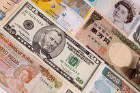

## Table of Contents

## What is the Vietnamese Dong and how is it used in Vietnam?

The Vietnamese Dong is the official currency of Vietnam. It is used every day by people in Vietnam to buy things like food, clothes, and other things they need. The symbol for the Vietnamese Dong is "₫" and it comes in both coins and paper money. The smallest coin is worth 200 Dong, and the paper money goes up to 500,000 Dong.

In Vietnam, you use the Dong to pay for everything, from a small cup of coffee to big things like a house or a car. When you go shopping or eat at a restaurant, you will pay with Dong. The exchange rate between the Dong and other currencies, like the US Dollar, can change, so it's good to check the rate if you are traveling to Vietnam. People in Vietnam use the Dong for all their money needs, and it's an important part of daily life there.

## How does the Vietnamese economy perform compared to other Southeast Asian countries?

Vietnam's economy has been growing fast in recent years. It is doing better than many other countries in Southeast Asia. Vietnam is known for making and selling a lot of things like clothes, shoes, and electronics. This has helped the country's economy grow. Vietnam also gets a lot of money from other countries that want to invest there. This has made Vietnam's economy stronger than some of its neighbors like Cambodia and Laos.

However, Vietnam's economy is not as big as some other Southeast Asian countries like Indonesia, Thailand, or Malaysia. These countries have been growing for a longer time and have bigger economies. Vietnam is still catching up, but it is doing well. The government in Vietnam is trying to make the economy even better by building more factories and improving education. This way, Vietnam can keep growing and maybe one day be as strong as those other countries.

## What are the key factors influencing the value of the Vietnamese Dong?

The value of the Vietnamese Dong is influenced by many things. One big thing is how much other countries want to buy things from Vietnam. If more people want to buy Vietnamese products, the Dong can become stronger. Another thing is how much money other countries put into Vietnam. If more money comes in from other countries, it can make the Dong stronger too. The government in Vietnam also plays a big role. They can decide to change the value of the Dong to make it easier for people to buy things from other countries.

Another [factor](/wiki/factor-investing) is the overall health of Vietnam's economy. If the economy is doing well, with more jobs and more money being made, the Dong can become stronger. But if the economy is not doing well, the Dong can become weaker. The value of the Dong can also change because of what is happening in the world. For example, if there is a big problem in the world that affects many countries, it can make the Dong weaker. All these things together decide how strong or weak the Vietnamese Dong is.

## How has the Vietnamese Dong's exchange rate changed over the past decade?

Over the past ten years, the Vietnamese Dong has had some changes in its exchange rate. At the start of the decade, around 2013, one US Dollar was worth about 21,000 Dong. By the end of 2023, one US Dollar was worth around 24,000 Dong. This means the Dong has become a bit weaker compared to the US Dollar over the years. The change has not been very big, but it shows that the value of the Dong can go up and down.

The Vietnamese government tries to keep the Dong stable. They do this by controlling how much the Dong can change in value each day. This helps to make sure that the Dong does not change too quickly, which can be good for businesses and people in Vietnam. Even though the Dong has become a bit weaker against the US Dollar, it has been more stable than some other currencies in the region. This stability has helped Vietnam's economy grow and attract more money from other countries.

## What role does the State Bank of Vietnam play in managing the economy and the Dong?

The State Bank of Vietnam is like the boss of all the money in Vietnam. It decides how much money should be in the country and how the Vietnamese Dong should be used. One big job of the State Bank is to keep the Dong stable. They do this by setting rules on how much the Dong can change in value each day. This helps businesses and people know what to expect when they use the Dong. The State Bank also decides how much interest people have to pay when they borrow money. If they make interest rates higher, it can slow down the economy a bit. If they make interest rates lower, it can help the economy grow faster.

Another important job of the State Bank is to make sure there is enough money in the country for everyone to use. They do this by controlling how much money banks can lend out. If the State Bank thinks there is too much money, they might tell banks to lend less. If they think there is not enough money, they might tell banks to lend more. This helps keep the economy running smoothly. The State Bank also watches what is happening in the world and makes changes to help protect Vietnam's economy. By doing all these things, the State Bank helps make sure the Vietnamese Dong stays strong and the economy keeps growing.

## How do inflation rates in Vietnam affect the Vietnamese Dong?

Inflation is when prices for things like food and clothes go up. In Vietnam, if inflation is high, it can make the Vietnamese Dong weaker. When prices go up a lot, people need more Dong to buy the same things. This can make the Dong less valuable compared to other countries' money. The State Bank of Vietnam tries to keep inflation under control to help keep the Dong strong. If inflation gets too high, the State Bank might raise interest rates to slow down how fast prices are going up.

On the other hand, if inflation is low, it can help the Dong stay strong. When prices are not going up very fast, people do not need as much Dong to buy things. This can make the Dong more valuable. The State Bank watches inflation closely and makes changes to help keep it at a good level. By doing this, they help make sure the Vietnamese Dong stays stable and people can trust it to buy things they need.

## What are the major economic reforms that have impacted the Vietnamese economy?

Vietnam started making big changes to its economy in the late 1980s with a plan called "Doi Moi," which means "renovation." This plan helped Vietnam move from a system where the government controlled everything to one where people could start their own businesses and make money. Doi Moi opened up Vietnam to the world, letting other countries invest money and buy things from Vietnam. This helped the economy grow a lot. The government also made it easier for farmers to sell their crops and for factories to make things. These changes made Vietnam's economy stronger and helped more people get jobs.

Another important change happened in the 2000s when Vietnam joined the World Trade Organization (WTO). This made it easier for Vietnam to sell things to other countries and buy things from them too. Joining the WTO helped Vietnam's economy grow even more because it could trade with more countries. The government also worked on making the country's banks and money system better. They did this to make sure people could trust the Vietnamese Dong and use it to buy things they need. All these changes have helped Vietnam's economy become one of the fastest-growing in Southeast Asia.

## How does Vietnam's trade balance influence its currency and overall economy?

Vietnam's trade balance is how much it sells to other countries compared to how much it buys from them. If Vietnam sells more than it buys, it has a trade surplus. This can make the Vietnamese Dong stronger because more people want to use Dong to buy Vietnamese things. A strong Dong can help Vietnam's economy because it makes things cheaper for people in Vietnam to buy from other countries. But if Vietnam buys more than it sells, it has a trade deficit. This can make the Dong weaker because Vietnam needs more foreign money to pay for what it buys. A weaker Dong can make things from other countries more expensive for people in Vietnam.

The government in Vietnam tries to keep the trade balance good to help the economy. They do this by making things that other countries want to buy, like clothes and electronics. When Vietnam has a good trade balance, it can attract more money from other countries to invest in Vietnam. This helps the economy grow and creates more jobs. But if the trade balance is not good, it can slow down the economy. The government watches the trade balance closely and makes plans to keep it balanced so the Vietnamese Dong stays strong and the economy keeps growing.

## What are the implications of Vietnam's integration into global trade agreements on the Dong?

Vietnam's joining of global trade agreements, like the World Trade Organization (WTO) and the Comprehensive and Progressive Agreement for Trans-Pacific Partnership (CPTPP), has had a big impact on the Vietnamese Dong. These agreements have made it easier for Vietnam to sell things to other countries and buy things from them too. When Vietnam sells more things to other countries, it can make the Dong stronger because more people want to use Dong to buy Vietnamese products. This can help the economy grow because a stronger Dong makes things from other countries cheaper for people in Vietnam to buy.

However, joining these trade agreements also means Vietnam has to follow certain rules. Sometimes, these rules can make it harder for Vietnam to control the value of the Dong. If Vietnam buys more things from other countries than it sells, it can lead to a trade deficit, which can make the Dong weaker. The government has to be careful and make plans to keep the trade balance good so the Dong stays strong. Overall, being part of global trade agreements has helped Vietnam's economy grow, but it also means the government has to work hard to keep the Dong stable.

## How do foreign investments impact the Vietnamese economy and the value of the Dong?

Foreign investments are when people or companies from other countries put money into Vietnam. This can help Vietnam's economy a lot. When foreign money comes into Vietnam, it can make the Vietnamese Dong stronger. More money coming in means more people want to use the Dong to buy things or start businesses in Vietnam. This can help create more jobs and make the economy grow faster. The government likes foreign investments because they bring in money and help the country develop.

However, too much foreign money can also cause problems. If a lot of money comes in quickly, it can make the Dong too strong. This might make it hard for Vietnam to sell things to other countries because their products become more expensive. The government has to be careful and sometimes they need to control how much foreign money comes in to keep the Dong stable. Overall, foreign investments are good for Vietnam's economy, but the government needs to manage them well to keep the Dong strong and the economy growing smoothly.

## What are the current economic challenges facing Vietnam and how do they affect the Dong?

Vietnam is facing some big economic challenges right now. One big problem is that the world's economy is not doing so well, which makes it harder for Vietnam to sell things to other countries. This can lead to a trade deficit, where Vietnam buys more than it sells. When this happens, the Vietnamese Dong can become weaker because Vietnam needs more foreign money to pay for what it buys. Another challenge is that inflation is going up, which means prices for things like food and clothes are getting higher. High inflation can make the Dong weaker because people need more Dong to buy the same things.

The government is trying to fix these problems. They are working on making more things that other countries want to buy, like electronics and clothes, to help with the trade balance. They are also trying to control inflation by changing interest rates and making sure there is not too much money in the economy. These efforts can help keep the Dong stable. But it's a hard job because the world's economy keeps changing, and Vietnam has to keep up. If the government can manage these challenges well, it can help the Dong stay strong and the economy keep growing.

## What are the future economic projections for Vietnam and the potential impact on the Vietnamese Dong?

Vietnam's economy is expected to keep growing in the future. Experts think that Vietnam will do well because it makes a lot of things that other countries want to buy, like clothes and electronics. More people from other countries are also coming to Vietnam to start businesses and invest money. This can help the Vietnamese Dong stay strong because more people will want to use Dong to buy things in Vietnam. The government is also working hard to make the economy even better by building more factories and improving education. If everything goes well, Vietnam's economy could become one of the strongest in Southeast Asia.

However, there are some things that could make the future harder for Vietnam. The world's economy can change a lot, and if it gets worse, it might be harder for Vietnam to sell its products. This could lead to a trade deficit, which might make the Dong weaker. Also, if inflation goes up a lot, it could make the Dong less valuable because people would need more Dong to buy the same things. The government will need to keep watching these problems and make good plans to keep the Dong stable. If they can do this, the Vietnamese Dong should stay strong, and the economy will keep growing.

## References & Further Reading

[1]: ["The Economy of Vietnam: Growth, Structural Change, and Future Challenges"](https://ceecvn.org/news/ceec-insight-vietnams-economic-development-outlook-2024-2025/) by Asian Development Bank

[2]: ["Advances in Financial Machine Learning"](https://www.amazon.com/Advances-Financial-Machine-Learning-Marcos/dp/1119482089) by Marcos Lopez de Prado

[3]: ["Vietnam: Rising Dragon"](https://www.amazon.com/Vietnam-Rising-Dragon-Bill-Hayton/dp/030017814X) by Bill Hayton

[4]: ["Algorithmic Trading: Winning Strategies and Their Rationale"](https://www.wiley.com/en-us/Algorithmic+Trading%3A+Winning+Strategies+and+Their+Rationale-p-9781118746912) by Ernest P. Chan

[5]: Han, J., & Kamber, M. (2006). ["Data Mining: Concepts and Techniques."](https://www.sciencedirect.com/book/9780123814791/data-mining-concepts-and-techniques) Elsevier.