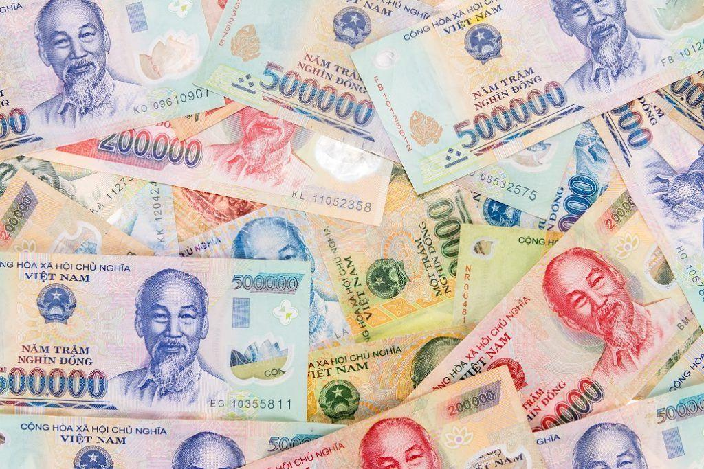

## Table of Contents

## What is the Vietnamese Dong?

The Vietnamese Dong is the official currency of Vietnam. It is used every day by people in Vietnam to buy things like food, clothes, and other stuff they need. The symbol for the Vietnamese Dong is ₫, and sometimes people write it as VND. If you are traveling to Vietnam, you will need to use Vietnamese Dong to pay for things.

The Vietnamese Dong comes in different forms, like coins and paper money. The coins are usually for smaller amounts, and the paper money is for bigger amounts. The value of the Vietnamese Dong can change compared to other countries' money, like the US Dollar or the Euro. This means that if you are coming from another country, you might need to change your money into Vietnamese Dong when you get to Vietnam.

## How is the Vietnamese Dong abbreviated?

The Vietnamese Dong is shortened to VND. This is the way people write it when they don't want to use the full name of the currency.

Sometimes, you might see the symbol ₫ used instead. This symbol stands for the Vietnamese Dong and is used in Vietnam to show prices and amounts of money.

## What is the history of the Vietnamese Dong?

The Vietnamese Dong has a long history that started in the 1940s. After Vietnam became independent from France in 1945, the country needed its own money. So, the Vietnamese government made the Dong the official currency. At first, the Dong was used in North Vietnam, while South Vietnam used a different currency called the piastre. It wasn't until 1975, when Vietnam was reunited, that the Dong became the currency for the whole country.

Over the years, the Vietnamese Dong has gone through many changes. The government has changed the look of the money several times and has also changed how much the Dong is worth compared to other countries' money. Sometimes, the value of the Dong goes up, and sometimes it goes down. This can make it harder for people to buy things from other countries. Today, the Vietnamese Dong is still the money used in Vietnam, and it helps people buy what they need every day.

## What are the denominations of the Vietnamese Dong?

The Vietnamese Dong comes in different amounts, called denominations. For coins, you can find 200 Dong, 500 Dong, 1,000 Dong, 2,000 Dong, and 5,000 Dong. These coins are used for smaller amounts of money. If you need to buy something that costs less, you might use these coins.

For paper money, there are bigger amounts. You can find banknotes of 1,000 Dong, 2,000 Dong, 5,000 Dong, 10,000 Dong, 20,000 Dong, 50,000 Dong, 100,000 Dong, 200,000 Dong, and 500,000 Dong. These are used for bigger purchases. When you go shopping in Vietnam, you will see these different amounts of money being used every day.

## How does the exchange rate of the Vietnamese Dong work?

The exchange rate of the Vietnamese Dong tells you how much it is worth compared to other countries' money, like the US Dollar or the Euro. If you want to change your money into Vietnamese Dong when you visit Vietnam, you need to know the exchange rate. This rate can change every day, so it might be different when you check it today compared to tomorrow. The exchange rate is important because it helps you know how much Vietnamese Dong you will get for your money from another country.

The Vietnamese government and banks help decide the exchange rate. They look at things like how much people want to buy and sell Vietnamese Dong, and what is happening with the economy in Vietnam and around the world. Sometimes, the government might try to keep the exchange rate steady, but other times it can go up or down a lot. If the exchange rate goes up, it means the Vietnamese Dong is getting stronger, and you might get more Dong for your money. If it goes down, the Dong is getting weaker, and you will get less Dong for your money.

## What are the factors affecting the value of the Vietnamese Dong?

The value of the Vietnamese Dong can change because of many things. One big thing is how much people want to buy and sell the Vietnamese Dong. If more people want to buy it, its value might go up. But if more people want to sell it, its value might go down. Another thing is what is happening in Vietnam's economy. If the economy is doing well, the Dong might get stronger. But if the economy is not doing well, the Dong might get weaker.

Also, what is happening in the world can affect the Vietnamese Dong. If other countries' economies are doing well, it might make the Dong stronger. But if there are problems in other countries, it might make the Dong weaker. The Vietnamese government and banks can also try to change the value of the Dong. They might do things to make it stronger or weaker, depending on what they think is best for Vietnam.

## How is the Vietnamese Dong managed by the State Bank of Vietnam?

The State Bank of Vietnam is in charge of the Vietnamese Dong. They make sure the money is working well for everyone in Vietnam. They do this by setting rules about how much money is in the country and how it can be used. They also decide how much the Vietnamese Dong is worth compared to other countries' money. This is called the exchange rate, and the State Bank of Vietnam can change it to help the economy.

Sometimes, the State Bank of Vietnam might do things to make the Vietnamese Dong stronger or weaker. They might change the interest rates, which is how much it costs to borrow money. If they make interest rates higher, it can make the Dong stronger. If they make interest rates lower, it can make the Dong weaker. They also watch how much money people are buying and selling and can step in to keep things balanced. This helps make sure the Vietnamese Dong stays stable and helps the economy grow.

## What role does the Vietnamese Dong play in Vietnam's economy?

The Vietnamese Dong is very important for Vietnam's economy. It is the money that people use every day to buy things like food, clothes, and other stuff they need. When people use the Dong to buy things, it helps businesses make money and grow. This is good for the economy because it means more jobs and more things being made in Vietnam. The government also uses the Dong to pay for things like schools and hospitals, which helps make life better for everyone in the country.

The value of the Vietnamese Dong can also affect the economy. If the Dong is strong, it can make it cheaper for Vietnam to buy things from other countries. But if the Dong is weak, it can make it more expensive. This can change how much people in Vietnam can buy and how much businesses can sell. The State Bank of Vietnam tries to keep the value of the Dong steady so that the economy can grow in a good way. By managing the Dong well, the bank helps make sure that Vietnam's economy stays strong and healthy.

## How does the Vietnamese Dong compare to other Southeast Asian currencies?

The Vietnamese Dong is one of several currencies used in Southeast Asia. It is often compared to other currencies like the Thai Baht, the Indonesian Rupiah, and the Malaysian Ringgit. The value of the Vietnamese Dong can be different from these other currencies. For example, the Thai Baht is usually stronger than the Vietnamese Dong, which means you need more Dong to buy one Baht. The Indonesian Rupiah and the Vietnamese Dong are closer in value, but the Rupiah can still be a bit stronger or weaker depending on the day.

The exchange rates between the Vietnamese Dong and other Southeast Asian currencies can change a lot. This can affect how much it costs for people in Vietnam to buy things from other countries in the region. If the Dong is weak compared to the Thai Baht, it might be more expensive for Vietnamese people to buy things from Thailand. But if the Dong is strong compared to the Indonesian Rupiah, it might be cheaper to buy things from Indonesia. The State Bank of Vietnam and other banks in the region work to keep these exchange rates stable, but they can still go up and down.

## What are the common methods of using the Vietnamese Dong for transactions?

In Vietnam, people use the Vietnamese Dong to buy things every day. They can use cash, which means they pay with the actual Dong coins and paper money. When you go to a store or a market, you might see people handing over Dong to pay for their shopping. Some places might also let you use a card, like a debit or credit card, to pay in Dong. This is handy if you don't want to [carry](/wiki/carry-trading) a lot of cash around. You can also use mobile payment apps on your phone to pay in Dong, which is becoming more popular, especially among younger people.

Another way to use the Vietnamese Dong is through bank transfers. If you need to send money to someone else, you can do it through a bank. This is useful for paying bills or sending money to family and friends. Some people also use online payment services to pay in Dong, which can be good for buying things on the internet. No matter which method you choose, the Vietnamese Dong is the money that makes all these transactions possible in Vietnam.

## What are the regulations and restrictions on the Vietnamese Dong for foreign investors?

Foreign investors in Vietnam need to follow some rules when they use the Vietnamese Dong. They can bring Dong into Vietnam, but there is a limit. They can bring in up to 15 million Dong without having to tell the government. If they want to bring in more, they need to get special permission. This helps the government keep track of how much money is coming into the country and make sure it is used in the right way.

When foreign investors want to take Dong out of Vietnam, they also need to follow rules. They can take out up to 15 million Dong without any problems. If they want to take out more, they need to get permission from the State Bank of Vietnam. These rules are there to help keep the Vietnamese economy stable and make sure that the Dong is not being used in ways that could hurt the country.

## How does the future outlook for the Vietnamese Dong look in terms of stability and growth?

The future of the Vietnamese Dong looks promising, but it depends on many things. Vietnam's economy is growing fast, and this can help make the Dong stronger. The government and the State Bank of Vietnam are working hard to keep the Dong stable. They do this by setting rules and watching how much money is coming in and going out of the country. If they can keep doing this well, the Dong should stay stable and maybe even grow in value.

But there are also things that could make the future of the Dong less certain. If there are big problems in the world's economy, it could affect Vietnam too. Also, if people start to trust the Dong less, it could get weaker. The government needs to keep making good choices to help the economy grow and keep the Dong strong. If they can do this, the Vietnamese Dong should have a good future, helping people in Vietnam buy what they need and making the country's economy stronger.

## References & Further Reading

[1]: Nguyen, D.T.T., & Nguyen, C.T.K. (2020). ["The Impact of Foreign Direct Investment on the Economic Growth in Vietnam."](https://www.mendeley.com/catalogue/a3b5572f-9684-3526-be47-b1d4e0423e64/) Journal of Asian Business and Economic Studies.

[2]: Lopez de Prado, M. (2018). ["Advances in Financial Machine Learning."](https://www.amazon.com/Advances-Financial-Machine-Learning-Marcos/dp/1119482089) Wiley.

[3]: Chaboud, A., Chiquoine, B., Hjalmarsson, E., & Vega, C. (2014). ["Rise of the Machines: Algorithmic Trading in the Foreign Exchange Market."](https://www.jstor.org/stable/43612951) Journal of Finance.

[4]: Le, T.L, & Nguyen, T.T.M. (2022). ["Financial Sector Development and Economic Growth in Vietnam."](https://scholar.google.com/citations?user=JAbK1oIAAAAJ&hl=en) Emerging Markets Finance and Trade.

[5]: Chan, E. P. (2009). ["Quantitative Trading: How to Build Your Own Algorithmic Trading Business."](https://github.com/ftvision/quant_trading_echan_book) Wiley.