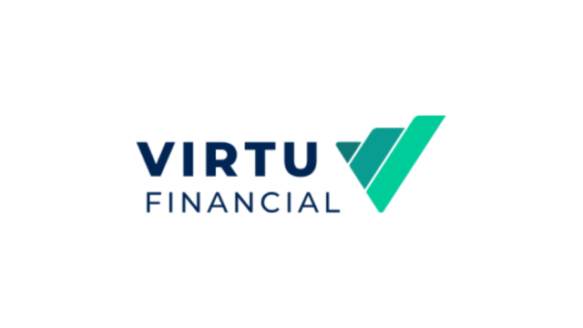

## Table of Contents

## What is Virtu Financial?

Virtu Financial is a company that helps people buy and sell things like stocks and other financial products. They use computers and technology to make trading faster and easier. They work with big investors, like banks and hedge funds, to help them trade quickly and efficiently.

The company started in 2008 and has grown a lot since then. They have offices in many countries around the world. Virtu Financial is known for using special technology to find the best prices for trades and to make sure everything is done quickly and safely.

## When was Virtu Financial founded?

Virtu Financial was founded in 2008. This means it started working and helping people trade stocks and other financial products that year.

Since then, Virtu Financial has grown a lot. They now have offices in many countries and use special technology to make trading fast and safe for big investors like banks and hedge funds.

## Who are the founders of Virtu Financial?

Virtu Financial was started by Vincent Viola and Douglas Cifu. Vincent Viola is a businessman who used to be in the military. He also owns a hockey team called the Florida Panthers. Douglas Cifu is a lawyer who worked with Vincent Viola before they started Virtu Financial together.

Vincent Viola and Douglas Cifu wanted to create a company that could help people buy and sell stocks and other financial products quickly and safely. They used their experience and knowledge to build Virtu Financial into a big company that works with banks and hedge funds all over the world.

## What services does Virtu Financial provide?

Virtu Financial helps people buy and sell things like stocks and other financial products. They use computers and special technology to make trading fast and easy. They work with big investors, like banks and hedge funds, to help them trade quickly and find the best prices. This means that Virtu Financial can help these big investors make more money by trading smarter and faster.

The company also provides tools and information that help investors make good decisions. They use their technology to look at a lot of data and find the best times to buy or sell. This helps their clients save time and money. Virtu Financial makes sure everything is done safely and follows all the rules, so their clients can trust them to handle their trades well.

## How does Virtu Financial make money?

Virtu Financial makes money by helping people buy and sell stocks and other financial products. They charge a small fee for each trade they help with. This fee is usually very small, but because Virtu Financial does a lot of trades every day, these small fees add up to a lot of money.

They also make money by using their special technology to find the best prices for trades. When they can buy something at a lower price and sell it at a higher price, they keep the difference as profit. This is called making a market, and it's another way Virtu Financial earns money. By doing a lot of trades and using their technology well, Virtu Financial can make a good amount of money every day.

## What is the business model of Virtu Financial?

Virtu Financial's business model is all about helping people buy and sell stocks and other financial products quickly and safely. They use special computers and technology to make trading fast and easy. They work with big investors like banks and hedge funds, helping them trade smarter and find the best prices. Virtu Financial charges a small fee for each trade they help with. Even though the fee is small, they do so many trades every day that these fees add up to a lot of money.

Another way Virtu Financial makes money is by using their technology to buy things at a lower price and sell them at a higher price. This is called making a market, and the difference between the buying and selling price is their profit. By doing a lot of trades and using their technology well, Virtu Financial can make a good amount of money every day. This business model helps them grow and keep providing good services to their clients.

## What are the key markets Virtu Financial operates in?

Virtu Financial works in many places around the world. They help people buy and sell stocks and other financial products in big markets like the United States, Europe, and Asia. These are important places for trading because a lot of money moves around in these areas.

In the United States, Virtu Financial helps with trading on big stock exchanges like the New York Stock Exchange and the Nasdaq. They also work in Europe, where they help with trading on exchanges like the London Stock Exchange and the Frankfurt Stock Exchange. In Asia, they operate in markets like the Tokyo Stock Exchange and the Hong Kong Stock Exchange. By working in these key markets, Virtu Financial can help their clients trade all over the world.

## How has Virtu Financial grown over the years?

Virtu Financial started in 2008 and has grown a lot since then. At first, they were a small company helping people buy and sell stocks. But they used special computers and technology to make trading faster and easier. This helped them grow quickly. They started working with big investors like banks and hedge funds, which helped them make more money and expand their business.

Over the years, Virtu Financial has opened offices in many countries around the world. They now work in big markets like the United States, Europe, and Asia. This means they can help their clients trade stocks and other financial products in many different places. By using their technology to find the best prices and do a lot of trades, Virtu Financial has become a big company that helps a lot of people and makes a lot of money.

## What are some major acquisitions made by Virtu Financial?

Virtu Financial has grown by buying other companies. One big acquisition was in 2017 when they bought KCG Holdings, Inc. KCG was another company that helped people trade stocks and other financial products. By buying KCG, Virtu Financial got bigger and could help more people in more places.

Another important acquisition was in 2020 when Virtu Financial bought Investment Technology Group, Inc. (ITG). ITG was known for its technology that helped with trading. This acquisition helped Virtu Financial improve their own technology and offer even better services to their clients. These big purchases have helped Virtu Financial become a bigger and stronger company.

## What are the regulatory challenges faced by Virtu Financial?

Virtu Financial, like other companies that help people buy and sell stocks, has to follow a lot of rules. These rules are made by governments and other groups to make sure trading is fair and safe. One big challenge for Virtu Financial is making sure they follow all these rules in different countries where they work. For example, in the United States, they have to follow rules from the Securities and Exchange Commission (SEC). In Europe, they have to follow rules from the European Securities and Markets Authority (ESMA). Keeping up with all these different rules can be hard and takes a lot of work.

Another challenge is that sometimes these rules change. When rules change, Virtu Financial has to change how they do things to follow the new rules. This can be expensive and take a lot of time. For example, in 2018, the SEC looked into how companies like Virtu Financial were trading. They wanted to make sure everything was fair. Virtu Financial had to show that they were following all the rules and that their trading was honest. Dealing with these kinds of checks and changes in rules is a big part of what Virtu Financial has to do to keep working well.

## How does Virtu Financial use technology in its operations?

Virtu Financial uses special computers and technology to help people buy and sell stocks and other financial products quickly and safely. They have a system that can do a lot of trades very fast. This helps them find the best prices for their clients. Their technology looks at a lot of information all the time to decide when to buy or sell. This makes trading easier and helps their clients make more money.

The company also uses technology to make sure everything is done safely and follows all the rules. They have special tools that watch over all the trades to make sure nothing goes wrong. This helps them keep their clients' money safe. By using technology well, Virtu Financial can help big investors like banks and hedge funds trade all over the world.

## What are the future growth strategies of Virtu Financial?

Virtu Financial wants to keep growing by using their special technology even more. They plan to make their trading systems even faster and smarter. This will help them find the best prices for their clients and do more trades every day. They also want to use their technology to offer new services that can help their clients make more money. By doing this, Virtu Financial hopes to work with more big investors like banks and hedge funds all over the world.

Another way Virtu Financial plans to grow is by buying other companies. They have already done this before, and it helped them get bigger and offer more services. They will look for other companies that have good technology or work in markets where Virtu Financial wants to grow. By buying these companies, Virtu Financial can use their technology and reach more clients. This will help them make more money and become an even bigger company in the future.

## References & Further Reading

[1]: Aldridge, I. (2013). ["High-Frequency Trading: A Practical Guide to Algorithmic Strategies and Trading Systems."](https://onlinelibrary.wiley.com/doi/book/10.1002/9781119203803) Wiley.

[2]: Hasbrouck, J., & Saar, G. (2013). ["Low-latency trading."](https://www.sciencedirect.com/science/article/abs/pii/S1386418113000165) The Review of Financial Studies, 26(9), 2091-2134.

[3]: Lopez de Prado, M. (2018). ["Advances in Financial Machine Learning."](https://www.amazon.com/Advances-Financial-Machine-Learning-Marcos/dp/1119482089) Wiley.

[4]: Manahov, V., & Hudson, R. (2014). ["The implications of high-frequency trading on market efficiency and volatility."](https://www.semanticscholar.org/paper/Does-high-frequency-trading-affect-technical-and-if-Manahov-Hudson/ffb3f38a16685f4a88f7b435c948b0516b88d5c3) Quantitative Finance, 14(10), 1637-1656.

[5]: Brogaard, J., Hendershott, T., & Riordan, R. (2014). ["High-frequency trading and price discovery."](https://academic.oup.com/rfs/article-abstract/27/8/2267/1582754) The Review of Financial Studies, 27(8), 2267-2306.