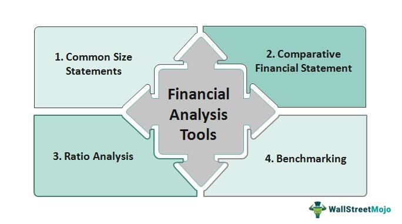

Electronic trading has become a cornerstone of modern financial markets, fundamentally transforming how transactions are executed. This mode of trading has significantly increased the speed and efficiency of transactions, allowing for near-instantaneous trades that would have been unimaginable in past decades. At the forefront of this technological shift is high-frequency trading (HFT), a method that involves the employment of complex algorithms to execute a large number of orders at extremely rapid speeds. HFT is characterized by holding positions for very short periods, often seconds or less, enabling firms to capitalize on small price discrepancies.

Virtu Financial Inc., founded in 2008 by Vincent Viola, is a notable leader in algorithmic trading and market making. The company has made a substantial impact on electronic trading, leveraging its technological prowess to facilitate efficient market operations. Virtu Financial has crafted a reputation for reliability and precision in trading execution, earning its place as a significant player in the financial industry.

This article examines Virtu Financial's contributions to electronic trading and its integral role in shaping financial markets. We will explore the historical context of Virtu's development, the technological innovations that distinguish its trading capabilities, and the regulatory challenges it faces in a highly scrutinized environment. Understanding Virtu's evolution and its strategic positioning offers insights into the mechanisms driving modern financial markets.

## Table of Contents

## History of Virtu Financial

Virtu Financial was founded in 2008 by Vincent Viola, a former chairman of the New York Mercantile Exchange (NYMEX), with the vision of leveraging the potential of electronic trading to enhance the efficiency and speed of financial transactions. Viola's initiative focused on developing a technology-driven platform that could operate within the fast-paced environment of high-frequency trading (HFT).

In 2011, Virtu Financial gained significant [momentum](/wiki/momentum) when it merged with Madison Tyler Holdings, a Los Angeles-based trading firm with expertise in high-frequency trading. This merger was pivotal, marking Virtu as a prominent player in the HFT domain. The combined capabilities of Virtu and Madison Tyler allowed the firm to enhance its trading strategies and execution speed, propelling it to the forefront of the industry.

A significant milestone in Virtu Financial's history came in 2015 when the company went public on the NASDAQ stock exchange. This event was noteworthy as Virtu became one of the first high-frequency trading firms to offer its shares to the public, ushering in a new era of transparency and accountability in a field often viewed skeptically by regulators and market participants.

Virtu's growth trajectory was significantly bolstered by strategic acquisitions, most notably the purchases of KCG Holdings in 2017 and Investment Technology Group (ITG) in 2019. The acquisition of KCG Holdings, a major player in [market making](/wiki/market-making) and execution services, expanded Virtu's presence across global financial markets and diversified its offerings. This acquisition was valued at approximately $1.4 billion, and it enabled Virtu to enhance its market-making capabilities and broaden its client base.

Further expanding its market influence, Virtu acquired ITG, an independent execution and research broker, for about $1 billion. This acquisition reinforced Virtu's position in the financial landscape by enhancing its execution, [liquidity](/wiki/liquidity-risk-premium), and analytical services. It also enabled Virtu to provide more comprehensive services to institutional investors, strengthening its competitive stance in the global trading environment.

Through these strategic mergers and acquisitions, Virtu Financial has effectively positioned itself as a leading entity in the global trading landscape. By continually adapting and expanding its technological and service offerings, the firm has maintained a robust presence in an evolving financial market marked by rapid technological advancements and regulatory challenges.

## Virtu's Technological Advantage

Virtu Financial has established itself as a leader in [algorithmic trading](/wiki/algorithmic-trading), thanks to its sophisticated and cutting-edge technological advancements. At the core of Virtu's success are its algorithmic trading strategies, which integrate complex mathematical models and advanced algorithms to execute trades at remarkable speeds. This high-frequency trading capability allows Virtu to capitalize on minute market inefficiencies, ensuring liquidity and competitive pricing in financial markets.

The firm's execution solutions are a testament to its technological prowess. Among these solutions is the Smart Order Router (SOR), designed to optimize the trade execution process by determining the best execution venues. The SOR dynamically routes orders to different exchanges or trading platforms, taking into account factors such as price, speed, and liquidity to maximize the execution quality and minimize transaction costs.

Additionally, Virtu deploys dark pool aggregations—a process that integrates liquidity from various non-public trading venues or dark pools. Dark pools are particularly valuable for executing large orders with minimal market impact, offering institutional clients better price discovery and reduced slippage.

Virtu's Frontier Execution Algorithms highlight the firm's extensive market-making expertise. These algorithms are designed to handle a wide range of market conditions, utilizing historical data and predictive analytics to optimize trading strategies. The adaptability and intelligence of these algorithms provide Virtu with a competitive edge, enabling quick adjustments to market changes and maintaining profitability even in volatile environments.

Moreover, Virtu's trade analytics and data platforms offer comprehensive post-trade analysis tools that assist in evaluating trade performance. Through these platforms, traders gain insights into factors such as pricing efficiency and execution costs, which are crucial for refining trading strategies and enhancing cost optimization. This analytical capability helps clients understand their trading activities more thoroughly, leading to more informed decision-making.

A standout feature among Virtu's technological offerings is the Triton Valor tool. Triton Valor is engineered to empower traders with an intuitive, high-throughput interface that streamlines the trading process. By providing real-time data and robust analytical functionalities, it enhances the trader's ability to execute strategies effectively. The platform's user-friendly design and high processing power ensure that traders can react promptly to market changes, tapping into opportunities as they arise.

In conclusion, Virtu's technological advantage lies in its state-of-the-art algorithmic trading, execution solutions, and analytical tools. These innovations not only enhance Virtu's market-making capabilities but also reinforce its position as a pivotal player in the fast-paced world of electronic trading. Through strategic investment in technology, Virtu continues to set benchmarks in trading efficiency and effectiveness, advancing beyond traditional market paradigms.

## Product Offerings and Services

Virtu Financial Inc. offers a comprehensive suite of products and services that cater to the exigencies of contemporary trading environments, focusing on enhanced execution capabilities and robust analytics across diverse asset classes. These offerings are tailored to meet the needs of institutional clients and broker-dealers, facilitating efficient and cost-effective trading.

### Execution Services

Virtu's execution services are distinguished by the integration of sophisticated algorithmic strategies with cutting-edge tools for liquidity provision, analytics, and workflow efficiency. These services facilitate optimal execution by employing technology-driven approaches to navigate the complexities of modern financial markets. Virtu's smart algorithms are designed to find the best possible execution paths, thereby minimizing market impact and slippage.

### Transaction Cost Analytics (TCA)

The firm's global transaction cost analytics (TCA) framework is essential for investors seeking to optimize their investment decisions by providing transparency into trading costs and performance. TCA tools analyze data from executed trades, allowing for a detailed breakdown of trading costs and contributing to more informed trading strategies. By leveraging such analytics, clients can achieve better execution outcomes and enhance their overall investment performance.

### Algo Wheel and RFQ-Hub Platforms

Virtu's Algo Wheel and RFQ-Hub are pivotal platforms that bolster execution quality and price discovery. The Algo Wheel is an innovative solution that systematically selects and evaluates algorithmic strategies, promoting competition among them to optimize execution results. This platform supports traders in adapting to dynamic market conditions by providing a flexible and transparent mechanism for executing trades.

The RFQ-Hub, on the other hand, serves as a multi-asset platform facilitating efficient request-for-quote (RFQ) workflows. It enhances price discovery by allowing market participants to source and manage liquidity across a broad spectrum of asset classes, including equities, fixed income, and derivatives.

### Customized Liquidity Solutions

Virtu offers tailored liquidity solutions that cater to the diverse needs of both institutional and broker-dealer clients. These solutions provide access to Virtu's extensive liquidity pool, ensuring superior execution capabilities and competitive pricing. By customizing liquidity strategies, Virtu enables clients to effectively manage their trading requirements in a manner aligned with their specific investment objectives.

In summary, Virtu Financial’s product and service offerings underscore its commitment to providing clients with advanced trading solutions. By integrating algorithmic execution services with comprehensive analytics and flexible liquidity options, Virtu supports its clients in achieving optimal trading results in an increasingly complex market landscape.

## Challenges and Regulatory Scrutiny

Virtu Financial has faced numerous legal challenges and regulatory scrutiny, particularly from the U.S. Securities and Exchange Commission (SEC) regarding information security concerns. As a leading high-frequency trading ([HFT](/wiki/high-frequency-trading-strategies)) firm, Virtu operates in a highly regulated environment, with an emphasis on ensuring transparency and adhering to market regulations.

The SEC's scrutiny often pertains to the robustness of information security measures employed by Virtu. Such regulatory oversight is essential given the rapid pace and [volume](/wiki/volume-trading-strategy) of transactions executed by HFT firms, which necessitate stringent protocols to prevent data breaches and ensure the integrity of market operations.

Lawsuits and investigations further underscore the stringent regulatory environment confronting HFT firms like Virtu. These legal challenges often question the transparency and fairness of market practices employed by Virtu, reflecting broader concerns about potential market manipulation and unfair advantages in electronic trading. For instance, certain cases have scrutinized the extent to which HFT practices may disadvantage other market participants by exploiting millisecond-level timing advantages.

Ensuring compliance with evolving regulations is crucial for Virtu Financial to maintain its reputable presence in the financial markets. This involves aligning with various legal requirements and standards set by regulatory bodies, such as the SEC, to avoid penalties, legal disputes, and reputational damage. The company must continuously update its compliance protocols to address both existing regulations and anticipate future changes in the regulatory landscape.

Ongoing adaptations in security protocols are vital for Virtu, not only to ensure regulatory compliance but also to safeguard its operations against potential cybersecurity threats. This includes implementing advanced technology solutions to enhance data protection, transaction security, and overall system resilience. As the financial markets evolve, Virtu's ability to adapt its security measures and remain compliant is a testament to its commitment to maintaining its position as a leader in the HFT industry while upholding the integrity of market dynamics.

## Future Outlook for Virtu Financial

Virtu Financial Inc. is strategically positioned to enhance its technological and service offerings with an eye toward maintaining and solidifying its competitive edge in the financial markets. As electronic and algorithmic trading continue to evolve, Virtu is expected to increase its investment in [artificial intelligence](/wiki/ai-artificial-intelligence) (AI) and [machine learning](/wiki/machine-learning) technologies. These advanced technologies are set to refine future trading strategies significantly by improving the predictive accuracy and execution efficiency of trades. Machine learning algorithms, for example, can be employed to analyze vast datasets to identify trading signals or optimize execution processes, thereby enhancing Virtu’s capability to respond swiftly to market changes.

Strategic partnerships play a critical role in Virtu’s future initiatives. Collaborations with technology firms, financial institutions, or other market participants are pivotal in fostering innovation and staying ahead of technological advancements. These alliances are instrumental in Virtu's pursuit of cutting-edge market solutions that align with the evolving demands of global trading dynamics.

Expanding into emerging markets is another avenue through which Virtu can realize substantial growth opportunities. Many of these markets are witnessing increased trading volumes and a rising demand for sophisticated financial services, creating a fertile ground for Virtu's technology-driven solutions. By tailoring its offerings to suit the specific needs of these markets, Virtu can tap into new revenue streams while supporting the development of financial ecosystems in these regions.

Virtu’s robust adaptive strategies in response to market challenges further underscore its potential for sustained success. The firm’s ability to navigate complex regulatory landscapes and rapidly shifting market conditions positions it favorably for future endeavors. This resilience is a testament to its comprehensive risk management frameworks and proactive adaptation to regulatory changes, which ensure that Virtu can maintain its market presence and operational integrity.

Overall, Virtu Financial’s proactive approach in expanding and enhancing its technological capabilities, forging strategic partnerships, and pursuing growth in emerging markets, all while maintaining regulatory compliance, characterizes its outlook as promising. Such initiatives are expected to keep Virtu at the forefront of innovation within the financial markets, ensuring its continued relevance and leadership in the fast-evolving sector of electronic trading.

## Conclusion

Virtu Financial stands as a prominent figure in algorithmic trading, illustrating its significant impact on financial markets. The company's trajectory showcases a paradigm shift towards electronic trading mechanisms, where speed, precision, and technological innovation are paramount. As financial markets increasingly rely on complex algorithms to execute transactions, Virtu has positioned itself at the forefront by continuously enhancing its technological capabilities. 

The firm's adeptness at balancing operational advancements with stringent regulatory demands is critical. Navigating a complex regulatory environment requires both agility and foresight, ensuring compliance while optimizing performance. This dual focus on innovation within operational contexts and adherence to compliance reflects Virtu's strategic priorities, enabling it to maintain a competitive edge in fast-evolving markets.

Virtu's continual emphasis on innovation reshapes global trading practices, driven by advanced algorithmic solutions and data analytics. The company's commitment to refining and expanding its technological offerings solidifies its role as a key player in shaping future trading dynamics. As markets evolve, propelled by technological advancements and changing economic landscapes, Virtu remains well-equipped to deliver forward-thinking trading solutions, ensuring it remains a pivotal force in the global financial ecosystem.

## References & Further Reading

[1]: Aldridge, I. (2013). ["High-Frequency Trading: A Practical Guide to Algorithmic Strategies and Trading Systems."](https://onlinelibrary.wiley.com/doi/book/10.1002/9781119203803) Wiley.

[2]: Hasbrouck, J., & Saar, G. (2013). ["Low-latency trading."](https://www.sciencedirect.com/science/article/abs/pii/S1386418113000165) The Review of Financial Studies, 26(9), 2091-2134.

[3]: Lopez de Prado, M. (2018). ["Advances in Financial Machine Learning."](https://www.amazon.com/Advances-Financial-Machine-Learning-Marcos/dp/1119482089) Wiley.

[4]: Manahov, V., & Hudson, R. (2014). ["The implications of high-frequency trading on market efficiency and volatility."](https://www.semanticscholar.org/paper/Does-high-frequency-trading-affect-technical-and-if-Manahov-Hudson/ffb3f38a16685f4a88f7b435c948b0516b88d5c3) Quantitative Finance, 14(10), 1637-1656.

[5]: Brogaard, J., Hendershott, T., & Riordan, R. (2014). ["High-frequency trading and price discovery."](https://academic.oup.com/rfs/article-abstract/27/8/2267/1582754) The Review of Financial Studies, 27(8), 2267-2306.