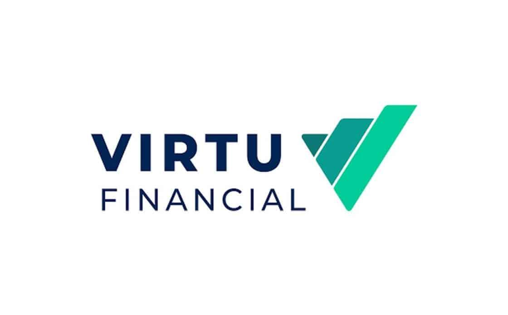

## Table of Contents

## What is Virtu Financial?

Virtu Financial is a company that helps people buy and sell things like stocks and other financial products. They use computers and technology to make trading faster and easier. They work with big investors, like banks and hedge funds, to help them trade quickly and efficiently.

The company started in 2008 and has grown a lot since then. They have offices in many countries around the world. Virtu Financial is known for using special technology to make sure their clients get the best prices when they trade. This technology helps them do a lot of trades very quickly, which can be important in the fast world of trading.

## When was Virtu Financial founded?

Virtu Financial was founded in 2008. This means it started working and helping people trade stocks and other financial products that year.

Since then, Virtu Financial has grown a lot. They now have offices in many countries and use special technology to help their clients trade quickly and get good prices.

## Who are the founders of Virtu Financial?

Virtu Financial was started by Vincent Viola and Douglas Cifu. Vincent Viola is a businessman who also helped start a company that trades energy. Douglas Cifu used to be a lawyer before he started working with Vincent to create Virtu Financial.

Together, Vincent and Douglas wanted to make trading easier and faster for big investors. They used their knowledge and new technology to build a company that could do a lot of trades quickly. This helped Virtu Financial grow and become successful.

## What services does Virtu Financial provide?

Virtu Financial helps people buy and sell things like stocks, bonds, and other financial products. They use computers and special technology to make trading fast and easy. This is important for big investors like banks and hedge funds who need to trade a lot of money quickly. Virtu Financial works with these big investors to help them get the best prices when they trade.

The company also offers tools and information that help investors make smart choices about trading. They use their technology to look at a lot of data and find the best times to buy or sell. This can help investors make more money and avoid losing money. Virtu Financial's services are used all over the world, and they have offices in many countries to help their clients wherever they are.

## How does Virtu Financial make money?

Virtu Financial makes money by charging fees for the services they provide to their clients. When big investors like banks and hedge funds use Virtu Financial to buy and sell stocks and other financial products, they pay a small fee for each trade. This fee is how Virtu Financial earns money from helping their clients trade quickly and efficiently.

The company also makes money from the difference between the price they buy and sell financial products. This is called the "bid-ask spread." When Virtu Financial buys something at a lower price and sells it at a higher price, they keep the difference as profit. By using their special technology to do a lot of trades very quickly, Virtu Financial can make a lot of small profits that add up to a big amount of money.

## What is the business model of Virtu Financial?

Virtu Financial's business model is based on helping big investors like banks and hedge funds trade stocks and other financial products quickly and efficiently. They use special technology to do a lot of trades very fast. This helps their clients get the best prices when they buy and sell. Virtu Financial charges a small fee for each trade they help with. This fee is how they make money from their services.

The company also makes money from the difference between the price they buy and sell financial products, which is called the "bid-ask spread." When Virtu Financial buys something at a lower price and sells it at a higher price, they keep the difference as profit. By using their technology to do many trades quickly, they can make a lot of small profits that add up to a big amount of money. This way, Virtu Financial can help their clients and make money at the same time.

## What are the main markets Virtu Financial operates in?

Virtu Financial works in many different markets around the world. They help people buy and sell things like stocks, bonds, and other financial products in places like the United States, Europe, and Asia. These markets are important because they have a lot of trading happening every day, and big investors need help to trade quickly and get good prices.

The company also works in markets for things like currencies and commodities. Currencies are different kinds of money, like dollars and euros, and commodities are things like oil and gold. Virtu Financial uses their special technology to help big investors trade these things too. By working in all these different markets, Virtu Financial can help their clients no matter where they are or what they want to trade.

## How has Virtu Financial grown over the years?

Since it started in 2008, Virtu Financial has grown a lot. At first, it was just a small company helping big investors trade stocks and other financial products. But over the years, it got bigger and bigger. They started using more technology to make trading faster and easier. This helped them work with more clients and do more trades. They also opened offices in many different countries, like the United States, Europe, and Asia, so they could help people all over the world.

Virtu Financial also grew by buying other companies. For example, in 2017, they bought a company called KCG Holdings, which helped them do even more trades and work with more clients. This made Virtu Financial even stronger and bigger. By growing this way, they could offer more services and help more people trade in different markets, like stocks, bonds, currencies, and commodities. This growth has made Virtu Financial a big and important company in the world of trading.

## What are some of the major acquisitions made by Virtu Financial?

Virtu Financial has grown a lot by buying other companies. One of the biggest acquisitions they made was in 2017 when they bought KCG Holdings. KCG Holdings was another company that helped people trade stocks and other financial products. By buying KCG Holdings, Virtu Financial could do even more trades and work with more clients. This made Virtu Financial a lot bigger and stronger.

Another important acquisition was in 2020 when Virtu Financial bought ITG, which stands for Investment Technology Group. ITG was known for its technology that helped investors trade better. By buying ITG, Virtu Financial got even better technology and could offer more services to their clients. These acquisitions helped Virtu Financial grow and become a big company in the world of trading.

## What are the regulatory challenges faced by Virtu Financial?

Virtu Financial, like other companies that help people trade stocks and other financial products, has to follow a lot of rules. These rules are made by governments and other groups to make sure trading is fair and safe. One big challenge for Virtu Financial is making sure they follow all these rules in different countries where they work. For example, in the United States, they have to follow rules from the Securities and Exchange Commission (SEC). In Europe, they have to follow rules from the European Securities and Markets Authority (ESMA). Keeping up with all these different rules can be hard and takes a lot of work.

Another challenge is that sometimes the rules change. When this happens, Virtu Financial has to change how they do things to follow the new rules. This can be tricky because they need to keep helping their clients trade quickly and efficiently while also making sure they are following the law. If they don't follow the rules, they could get in trouble and have to pay fines. So, Virtu Financial has to be very careful and always keep up with the latest rules to avoid problems.

## How does Virtu Financial use technology in its operations?

Virtu Financial uses special computers and technology to help people buy and sell things like stocks and other financial products. They use this technology to make trading very fast. This is important because big investors like banks and hedge funds need to trade a lot of money quickly. Virtu Financial's technology helps them do a lot of trades in a short time, which can help their clients get the best prices when they buy or sell.

The company also uses technology to look at a lot of data. This data helps them find the best times to trade and make smart choices. By using computers to analyze this information, Virtu Financial can help their clients make more money and avoid losing money. This technology is a big part of how Virtu Financial helps their clients all over the world, no matter what they want to trade.

## What are the future growth strategies of Virtu Financial?

Virtu Financial wants to keep growing by using more technology to make trading even faster and easier. They plan to keep improving their computers and software so they can help their clients trade better. This means they will keep looking for new ways to use technology to do more trades quickly and help their clients get the best prices. They also want to use technology to look at more data and find even better times to trade. This can help their clients make more money and avoid losing money.

Another way Virtu Financial plans to grow is by working in more markets around the world. They want to help people trade in more places, like new countries in Asia and other parts of the world. By doing this, they can help more clients and do more trades. They also plan to keep buying other companies that can help them grow. For example, if they find a company with good technology or that works in a market they want to be in, they might buy it to get bigger and stronger. This way, Virtu Financial can keep helping more people trade and grow their business.

## References & Further Reading

[1]: Aldridge, I. (2013). ["High-Frequency Trading: A Practical Guide to Algorithmic Strategies and Trading Systems."](https://www.wiley.com/en-us/High+Frequency+Trading%3A+A+Practical+Guide+to+Algorithmic+Strategies+and+Trading+Systems%2C+2nd+Edition-p-9781118343500) John Wiley & Sons.

[2]: Lopez de Prado, M. (2018). ["Advances in Financial Machine Learning."](https://www.amazon.com/Advances-Financial-Machine-Learning-Marcos/dp/1119482089) Wiley.

[3]: Kissell, R. (2013). ["The Science of Algorithmic Trading and Portfolio Management."](https://www.sciencedirect.com/book/9780124016897/the-science-of-algorithmic-trading-and-portfolio-management) Academic Press.

[4]: Narang, R. K. (2009). ["Inside the Black Box: The Simple Truth About Quantitative Trading."](https://onlinelibrary.wiley.com/doi/book/10.1002/9781118267738) John Wiley & Sons.

[5]: Vayanos, D., & Woolley, P. (2013). ["An Institutional Theory of Momentum and Reversal."](https://www.jstor.org/stable/23470044) National Bureau of Economic Research.