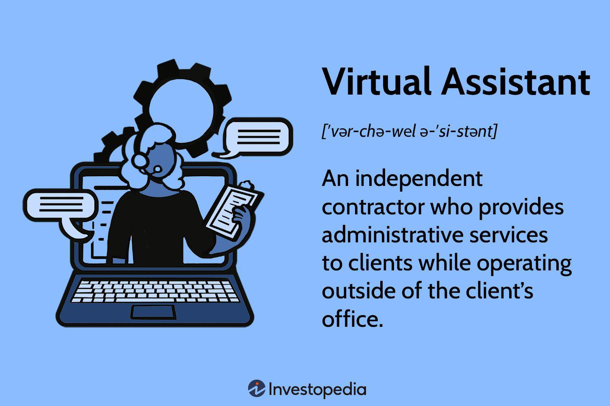

In the modern workplace, remote work has reshaped traditional job roles, providing unparalleled flexibility and efficiency. This transformation has led to the emergence of roles such as digital and virtual assistants, who harness technology to perform a wide array of tasks from any location globally. These roles have become increasingly vital as the landscape of work shifts towards a more decentralized model. Virtual assistants, in particular, have become integral in facilitating smooth operations for businesses that operate across multiple time zones and geographies.

As businesses continue to adapt to these changes, there is a growing demand for virtual assistants who are adept at supporting algorithmic trading operations. This niche requires individuals who are not only skilled in remote communication and digital tools but also possess a keen understanding of financial markets and algorithmic processes. These professionals can seamlessly integrate into financial trading teams, contributing significantly by using technology to enhance productivity and efficiency in trading operations.

The intersection of remote work capabilities and algorithmic trading presents unique opportunities for individuals with expertise in digital communication, technology, and finance. As algorithmic trading relies heavily on data analysis and software, virtual assistants equipped with these technical skills can play a crucial role in monitoring, managing, and optimizing trading activities alongside traders and analysts.

This article examines the expanding role of remote virtual assistants in algorithmic trading and identifies the lucrative career paths that are emerging as a result. By leveraging remote work technology, these digital assistants can contribute to more informed, productive, and successful trading strategies, offering a new dimension to the financial services industry and empowering professionals with the ability to work flexibly from any location.

## Table of Contents

## What is a Virtual Assistant in Remote Work?

Virtual assistants are professionals who offer administrative and technical support services remotely. Operating as independent contractors, they transcend traditional office boundaries, providing flexibility and efficiency. The primary role of a virtual assistant involves a broad spectrum of tasks such as managing emails, scheduling appointments, content creation, and database management. As technology progresses, the scope of a virtual assistant has expanded, allowing them to undertake specialized tasks. One pertinent area is managing trading activities, particularly in the financial sector.

This evolution is largely due to advancements in communication tools and technologies that facilitate seamless remote support. With applications like Slack, Zoom, and Trello, virtual assistants can integrate effectively into the financial ecosystem. These tools allow for efficient communication and task management, enabling virtual assistants to perform complex operations despite not being physically present in the office.

Furthermore, virtual assistants can bring specialized expertise to financial sectors by managing [algorithmic trading](/wiki/algorithmic-trading) strategies. They handle trading algorithms' implementation, monitoring, and optimization, tasks that require both technical and financial knowledge. By using programming languages such as Python or R, virtual assistants can analyze trading data, process financial transactions, and ensure compliance with regulatory standards.

In summary, the modern virtual assistant is a versatile and dynamic professional capable of supporting complex operations in remote work settings. Their ability to adapt to technological advancements makes them invaluable assets to organizations, particularly in sectors like finance, where precision and real-time data processing are critical.

## The Role of Technology in Algorithmic Trading

Algorithmic trading has revolutionized financial markets through the use of complex algorithms and advanced software applications that execute trading orders at speeds and frequencies that surpass human capabilities. At its core, algorithmic trading uses quantitative models to identify profitable trading opportunities, minimizing human error and emotional decision-making. Typically, these algorithms are developed to analyze vast sets of historical and real-time market data, providing a systematic approach to trading that relies on statistical and mathematical models. Automated execution of trades is conducted based on pre-set instructions, enabling trades to occur within milliseconds.

The foundation of algorithmic trading is its use of historical and real-time data to inform decision-making. Machine learning and [artificial intelligence](/wiki/ai-artificial-intelligence) can be integral to the development of these algorithms, identifying patterns or signals that human traders might overlook. For instance, traders might use regression analysis to examine relationships between different market variables, applying this to predict future price movements. The aim is to optimize trade execution while reducing market impact, often using strategies like [market making](/wiki/market-making), [arbitrage](/wiki/arbitrage), or [trend following](/wiki/trend-following).

Virtual assistants specifically tasked with supporting algorithmic trading operations bring a unique value proposition by merging their remote work skills with technical proficiencies. Armed with data analysis tools and a firm understanding of financial markets, these assistants can effectively monitor algorithmic strategies and optimize performance. For example, they could use Python scripts to extract and analyze trading data, checking for deviations from expected performance metrics or investigating anomalies in trade execution times.

These assistants serve an instrumental role in ongoing monitoring and troubleshooting of algorithmic trading systems, ensuring that they function as intended and adapting them to evolving market conditions. Their ability to work remotely allows them to integrate seamlessly with trading teams across the globe, offering continuous support and insights irrespective of their physical location. This nexus of technology and human oversight supports robust, adaptable trading strategies that can maintain a competitive edge in rapidly changing markets.

## Skills Required for Virtual Assistants in Algo Trading

Virtual assistants in algorithmic trading need a diverse set of skills to effectively support trading operations. A strong foundation in technological tools and platforms is essential. This includes proficiency in programming languages like Python, which is widely used for data analysis and automation tasks within the trading industry. Python's extensive libraries, such as NumPy and pandas, facilitate data manipulation and analysis, crucial for processing large datasets to derive actionable insights.

Familiarity with trading platforms such as MetaTrader or Algorand is also important. These platforms provide the infrastructure for algorithmic trading, enabling the execution of automated strategies. Understanding how to navigate these platforms and utilize their features allows virtual assistants to contribute to the development and monitoring of trading algorithms.

Strong organizational and communication skills are vital for managing schedules, documents, and interactions with remote trading teams. Virtual assistants must be adept at coordinating across time zones and ensuring seamless communication flows. This involves using tools like Slack or Microsoft Teams to maintain connectivity and promote collaboration.

A grasp of financial concepts and trading strategies is critical to effectively support algorithmic trading efforts. This includes understanding market dynamics, risk management, and the principles of trading strategies such as arbitrage, trend following, or mean reversion. Knowledge of these concepts allows virtual assistants to assist in the optimization of trading algorithms and the interpretation of results.

Overall, a combination of technical proficiency, organizational acumen, and financial literacy equips virtual assistants to enhance the efficiency and effectiveness of algorithmic trading teams.

## Benefits of Integrating Virtual Assistants with Algo Trading Teams

Integrating virtual assistants into algorithmic trading teams offers several compelling advantages that can enhance operational efficiency and drive business success. A primary benefit is cost efficiency. Employing virtual assistants tends to be more budget-friendly compared to hiring full-time, in-house staff. This cost reduction stems from the elimination of expenses related to physical office space, equipment, and employee benefits. According to research, businesses can save up to 78% in operating costs by utilizing virtual assistants, as they typically work as independent contractors. This allows companies to allocate financial resources more strategically, potentially increasing investment in advanced trading technologies or research and development efforts.

Beyond financial savings, virtual assistants contribute to increased productivity within trading teams. They can manage a wide range of administrative and operational tasks, such as data entry, scheduling, and communication management, enabling traders to concentrate on developing and executing market strategies. This focused approach can lead to more effective decision-making processes and faster response times to market changes, thereby improving overall trading performance.

Virtual assistants offer significant flexibility and scalability, which is crucial for adapting to the fast-paced and ever-changing landscape of algorithmic trading. Trading teams can hire virtual assistants on a need-basis, scaling the workforce up or down according to project demand or market conditions. This adaptability ensures that trading teams remain agile and responsive, helping them to maintain a competitive edge in the financial markets. Hiring assistants with specific skill sets also allows the team to quickly integrate new tools and technologies, further streamlining operations and optimizing trading strategies.

In summary, the integration of virtual assistants into algorithmic trading teams fosters cost-efficient operations, enhances productivity by relieving traders of administrative burdens, and provides the flexibility necessary to navigate dynamic market environments. These benefits underline the strategic advantage of leveraging virtual talent in the financial sector.

## Challenges and Solutions in Remote Support for Algo Trading

Ensuring effective communication between remote teams in algorithmic trading is crucial yet challenging. This complexity arises due to geographical [dispersion](/wiki/dispersion-trading) and time zone differences, which can hinder synchronous collaboration. To address this, many teams utilize communication platforms such as Slack and Microsoft Teams. These tools offer features like real-time messaging, video calls, and document sharing, which facilitate interaction and help maintain a cohesive workflow despite physical separation.

Maintaining data security and privacy is another critical challenge when dealing with sensitive financial information in algorithmic trading. The digital nature of remote work increases the vulnerability to cyber threats. Thus, implementing robust security measures is essential. Virtual assistants and trading teams should use secure, encrypted communication channels and adhere to stringent data protection protocols. Tools like VPNs (Virtual Private Networks) and encryption software can provide secure data transmission pathways, reducing the risk of unauthorized access.

Further, remote work in this field demands continuous upskilling to keep pace with rapidly evolving technologies. Virtual assistants involved in algorithmic trading must remain proficient in emerging trading technologies and tools to provide valuable support. For instance, staying updated with the latest versions of programming languages and trading software ensures compatibility and efficiency. Online courses, webinars, and industry certifications are effective avenues for acquiring new skills and knowledge necessary for adapting to technological advancements.

Overall, addressing these challenges through strategic use of communication tools, rigorous security practices, and ongoing professional development enables virtual assistants and algorithmic trading teams to function efficiently and securely in a remote work setting.

## Future Trends in Remote Work and Algo Trading

The evolution of AI technology is poised to significantly bolster the capabilities of virtual assistants in algorithmic trading. Modern AI models can process vast datasets with remarkable speed and accuracy, enabling virtual assistants to perform complex tasks such as strategy optimization, predictive analytics, and anomaly detection. These advancements are projected to transform how virtual assistants contribute to trading operations, making them indispensable assets in managing sophisticated trading algorithms.

Parallelly, the shift towards fully remote teams is gaining [momentum](/wiki/momentum) across industries, largely driven by the dual incentives of reduced operational costs and access to a diverse and skilled global workforce. Businesses are recognizing the potential of remote work to enhance productivity and innovation, prompting a reevaluation of traditional office structures. For algorithmic trading teams, this trend means greater flexibility in hiring specialized talent, irrespective of geographical limitations, which can lead to more dynamic and efficient trading strategies.

Moreover, advancements in real-time analytics and blockchain technology are expected to play pivotal roles in the future of algorithmic trading. Real-time analytics allows trading teams to access and interpret data as it is generated, facilitating quicker decision-making processes and the ability to adapt strategies on the fly to market fluctuations. Meanwhile, blockchain technology promises enhanced transparency and security in trading operations. Its decentralized nature can mitigate risks associated with data manipulation and fraud, providing a reliable framework for executing and recording trades. These technological innovations are set to redefine the operational landscape for remote virtual assistants in trading, ensuring they remain integral to the evolving financial ecosystem.

## Conclusion

The integration of virtual assistants into remote work and algorithmic trading signals a transformative shift in the operations of financial markets. By leveraging technology and remote access, digital assistants enable more informed, efficient, and successful trading strategies. This enhancement is achieved through their ability to manage data, automate routine processes, and provide real-time support to trading teams. Virtual assistants equipped with data analytics skills can interpret and present trading data more effectively, allowing for quicker decision-making.

As algorithmic trading becomes increasingly complex with advancements in artificial intelligence and [machine learning](/wiki/machine-learning), the role of virtual assistants becomes even more crucial. These digital professionals can relieve traders of administrative burdens, thus allocating more resources towards strategizing and market analysis. Their support in managing software tools and trading platforms further ensures that trading operations proceed seamlessly.

Staying informed and adaptable is essential for both companies and individuals to fully harness the benefits of these emerging trends. Constantly updating skills in technology, data security, and financial analysis will be necessary to remain competitive. The future of virtual assistance in financial trading relies on the continuous evolution of skills and technology, promising a more interconnected and efficient market landscape.

## References & Further Reading

[1]: Bergstra, J., Bardenet, R., Bengio, Y., & Kégl, B. (2011). ["Algorithms for Hyper-Parameter Optimization."](https://dl.acm.org/doi/10.5555/2986459.2986743) Advances in Neural Information Processing Systems 24.

[2]: ["Advances in Financial Machine Learning"](https://www.amazon.com/Advances-Financial-Machine-Learning-Marcos/dp/1119482089) by Marcos Lopez de Prado

[3]: ["Evidence-Based Technical Analysis: Applying the Scientific Method and Statistical Inference to Trading Signals"](https://www.amazon.com/Evidence-Based-Technical-Analysis-Scientific-Statistical/dp/0470008741) by David Aronson

[4]: ["Machine Learning for Algorithmic Trading"](https://github.com/stefan-jansen/machine-learning-for-trading) by Stefan Jansen

[5]: ["Quantitative Trading: How to Build Your Own Algorithmic Trading Business"](https://www.amazon.com/Quantitative-Trading-Build-Algorithmic-Business/dp/1119800064) by Ernest P. Chan