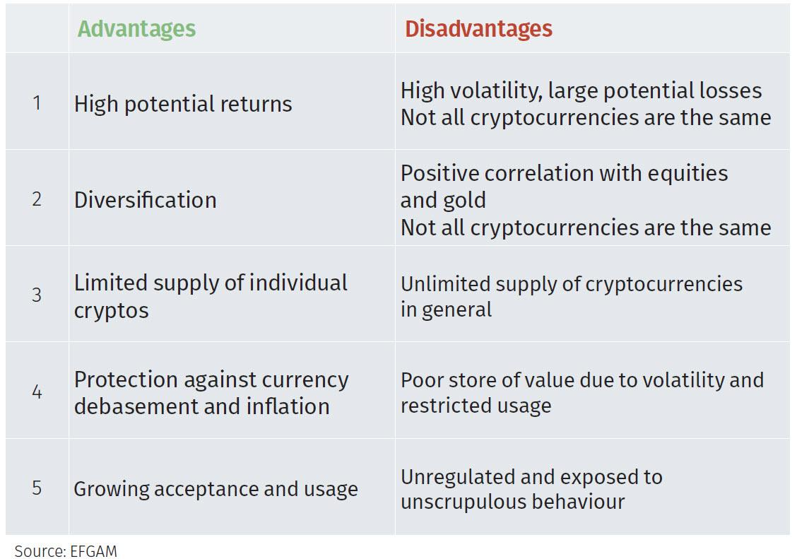

## Table of Contents

## What is virtual currency?

Virtual currency is a type of digital money that you can use online. It's not like regular money that you can touch, like coins and paper bills. Instead, it exists only on the internet and in computer systems. People use virtual currency to buy things, play games, or trade with others online. Some well-known virtual currencies include Bitcoin, Ethereum, and in-game currencies like V-Bucks in Fortnite.

Virtual currency works through a system called blockchain, which is like a digital ledger that keeps track of all transactions. This makes it secure and hard to cheat. You can get virtual currency by buying it with real money, earning it through activities like playing games, or even mining it, which involves using computers to solve complex math problems. While virtual currency can be convenient and fun to use, it can also be risky because its value can go up and down a lot, and it's not always accepted everywhere.

## What are the different types of virtual currency?

There are several types of virtual currency, and they can be grouped into different categories. One type is cryptocurrency, like Bitcoin and Ethereum. These are digital currencies that use encryption techniques to secure their transactions and to control the creation of new units. They are decentralized, meaning no single person or group controls them. Another type is in-game currency, which you can use in video games. Examples include V-Bucks in Fortnite or Robux in Roblox. These are usually controlled by the game's company and can only be used within that game.

Another category is central bank digital currencies (CBDCs). These are digital versions of a country's regular money, like the digital dollar or digital euro. They are issued and backed by a country's central bank. Then there are utility tokens, which are a type of virtual currency used to access specific services or products. For example, some companies might use tokens to let you use their platform or buy their products. Each type of virtual currency has its own rules and uses, so it's important to understand them before using them.

## How does virtual currency differ from traditional currency?

Virtual currency is different from traditional currency in many ways. Traditional currency, like dollars or euros, is physical money that you can touch, like coins and paper bills. It's issued by governments and controlled by central banks. You can use it to buy things everywhere, and its value stays pretty stable. Virtual currency, on the other hand, exists only online and in computer systems. It's not controlled by any government or bank, except for central bank digital currencies. Some virtual currencies, like Bitcoin, can change in value a lot, making them riskier to use.

Another big difference is how they work. Traditional currency transactions are usually handled by banks and other financial institutions. When you pay with a credit card or transfer money, banks keep track of it. Virtual currency transactions, especially cryptocurrencies, use a system called blockchain. This is like a digital ledger that everyone can see, and it keeps track of all transactions in a secure way. This makes virtual currency transactions faster and can be cheaper because you don't always need a bank to help. But, because virtual currency is not as widely accepted, it can be harder to use in everyday life.

## What are some examples of popular virtual currencies?

Some popular virtual currencies are Bitcoin and Ethereum. Bitcoin is the first and most well-known cryptocurrency. People use it to buy things online, and its value can go up and down a lot. Ethereum is another big one. It's not just a currency; it also lets people create and run special programs called smart contracts. These are like digital agreements that automatically do what they're supposed to do.

Other popular virtual currencies include Litecoin and Ripple. Litecoin is similar to Bitcoin but works faster and is easier to use for small payments. Ripple is used by banks and financial companies to move money around the world quickly and cheaply. In video games, V-Bucks in Fortnite and Robux in Roblox are also popular. These are used to buy things in the games and can only be used there.

## How can someone acquire virtual currency?

There are several ways to get virtual currency. One way is to buy it with real money. You can use websites or apps that let you trade your dollars or euros for virtual currency like Bitcoin or Ethereum. Another way is to earn it by doing things online. For example, some video games give you in-game currency like V-Bucks or Robux for playing or completing tasks. You can also get virtual currency by mining it. This means using your computer to solve hard math problems, and when you solve them, you get some of the currency as a reward.

Another way to get virtual currency is through trading or investing. You can trade one type of virtual currency for another, or you might buy some hoping its value will go up so you can sell it later for a profit. Some people also get virtual currency as payment for their work. For example, some companies pay their employees in Bitcoin instead of regular money. No matter how you get it, it's important to be careful because the value of virtual currency can change a lot, and not everyone accepts it as payment.

## What are the advantages of using virtual currency?

One big advantage of using virtual currency is that it can be faster and cheaper to send money around the world. With traditional money, you often have to pay fees to banks or other companies to move your money. But with virtual currency, you can send it directly to someone else without needing a bank. This can save you money and time, especially if you're sending money to another country. Also, virtual currency transactions are usually open for everyone to see, which can make them more transparent and harder to cheat.

Another advantage is that virtual currency can give you more privacy and control over your money. When you use traditional money, banks and other companies can see what you're doing with it. But with virtual currency, you can keep your transactions more private. Plus, because virtual currency isn't controlled by any one government or bank, you have more freedom to use it how you want. This can be really helpful in places where the regular money system isn't working well or if you just want more control over your finances.

## What are the disadvantages of using virtual currency?

One big problem with virtual currency is that its value can change a lot. This means you might buy some virtual currency and then find out it's worth less money later. This can be risky if you're using it to save or invest. Also, not everyone accepts virtual currency as payment. You can't always use it to buy things like you can with regular money. This can make it hard to use in everyday life.

Another issue is that virtual currency can be used for illegal things. Because it's harder to track who's using it, some people use it to do things they shouldn't, like buying drugs or other illegal stuff. This can make virtual currency seem risky or unsafe. Plus, if you lose your virtual currency, like if someone steals it or you forget your password, it can be really hard to get it back. There's no bank or company to help you, so you have to be very careful to keep it safe.

## How is the security of virtual currency ensured?

The security of virtual currency is mainly ensured through a system called blockchain. Blockchain is like a big digital notebook that keeps track of all the transactions. Every time someone sends or receives virtual currency, it gets written down in this notebook. The cool thing about blockchain is that it's spread out across lots of computers all over the world, so no one person or group can control it. This makes it really hard for anyone to cheat or change the records because everyone can see what's happening.

Another way virtual currency stays secure is through something called cryptography. This is like a secret code that keeps your virtual currency safe. When you send virtual currency, it gets locked up with this code so only the person you're sending it to can unlock it. Plus, you usually need special passwords or keys to access your virtual currency. If you keep these safe, no one else can get to your money. But you have to be careful because if you lose your password or key, you might lose your virtual currency forever.

## What role do blockchain and other technologies play in virtual currencies?

Blockchain is a big part of how virtual currencies like Bitcoin work. It's like a digital notebook that keeps track of all the transactions. Every time someone sends or receives virtual currency, it gets written down in this notebook. The cool thing about blockchain is that it's spread out across lots of computers all over the world. This means no one person or group can control it, making it really hard for anyone to cheat or change the records. Everyone can see what's happening, which makes the system more open and trustworthy.

Other technologies also help keep virtual currencies safe and working well. Cryptography is one of them. It's like a secret code that keeps your virtual currency safe. When you send virtual currency, it gets locked up with this code so only the person you're sending it to can unlock it. You also need special passwords or keys to access your virtual currency. If you keep these safe, no one else can get to your money. But you have to be careful because if you lose your password or key, you might lose your virtual currency forever.

## How do regulations affect the use and development of virtual currencies?

Regulations can have a big impact on how people use and develop virtual currencies. Governments and other groups make rules to keep things safe and fair. These rules can say who can use virtual currency, how it can be used, and what companies need to do to offer it. For example, some places might say you need to report your virtual currency earnings for taxes. Other places might make it hard for new virtual currency companies to start up because they have to follow a lot of rules. This can slow down how fast virtual currencies grow and change.

But regulations can also help virtual currencies become more trusted and used by more people. When there are clear rules, people might feel safer using virtual currency because they know it's being watched. This can make more businesses and people want to use it. Also, good regulations can stop bad things from happening, like fraud or money laundering. So, while rules can make things harder for virtual currency companies, they can also help the whole system work better and be more accepted.

## What are the economic impacts of virtual currencies on global markets?

Virtual currencies can change how money moves around the world. They let people send money to other countries faster and cheaper than using banks. This can help people in different countries trade with each other more easily. But, because the value of virtual currencies can go up and down a lot, it can also make things risky. If a lot of people start using virtual currencies, it might make regular money less important. This could change how countries control their money and how they make rules about it.

Virtual currencies can also affect jobs and businesses. Some companies might start using virtual currencies to pay their workers or to buy things. This could make new kinds of jobs, like people who help with virtual currency transactions or who make new virtual currencies. But it could also make some jobs harder, like people who work in banks or other money businesses. Governments might need to make new rules to keep things fair and safe. Overall, virtual currencies can shake up how the world's money system works, making things both better and more challenging.

## What future trends can we expect in the evolution of virtual currencies?

In the future, we might see more countries making their own digital money, called central bank digital currencies (CBDCs). These would be like regular money but in a digital form, and they would be controlled by the government. This could make it easier for people to use digital money because it would be backed by the government and more people would trust it. Also, more businesses might start using virtual currencies for everyday things like buying groceries or paying bills. This could make virtual currencies a normal part of our lives, just like using a credit card or cash.

Another trend could be better technology to make virtual currencies safer and easier to use. Right now, virtual currencies can be hard to understand and use, but new technology might make them simpler. For example, better ways to keep your virtual currency safe, like using your fingerprint or face to unlock it, could become common. Also, virtual currencies might start working together better, so you could use one type of virtual currency to buy things that need another type. This could make the whole system more connected and useful for everyone.

## References & Further Reading

[1]: Bergstra, J., Bardenet, R., Bengio, Y., & Kégl, B. (2011). ["Algorithms for Hyper-Parameter Optimization."](https://papers.nips.cc/paper/4443-algorithms-for-hyper-parameter-optimization) Advances in Neural Information Processing Systems 24.

[2]: ["Advances in Financial Machine Learning"](https://www.amazon.com/Advances-Financial-Machine-Learning-Marcos/dp/1119482089) by Marcos Lopez de Prado

[3]: ["Evidence-Based Technical Analysis: Applying the Scientific Method and Statistical Inference to Trading Signals"](https://www.amazon.com/Evidence-Based-Technical-Analysis-Scientific-Statistical/dp/0470008741) by David Aronson

[4]: ["Machine Learning for Algorithmic Trading"](https://github.com/stefan-jansen/machine-learning-for-trading) by Stefan Jansen

[5]: ["Quantitative Trading: How to Build Your Own Algorithmic Trading Business"](https://www.amazon.com/Quantitative-Trading-Build-Algorithmic-Business/dp/1119800064) by Ernest P. Chan