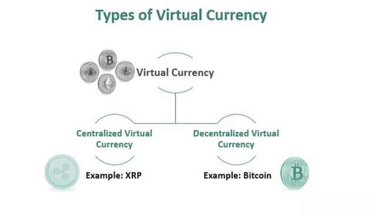

In a rapidly digitalizing world, understanding the intricacies of digital money, virtual currency, and cryptocurrency has become essential. The financial landscape is being reshaped by technological advancements, and digital money forms a critical component of this transformation. Digital money refers to any form of currency or money-like asset that primarily exists and is managed electronically. This can include both government-backed digital currencies and virtual currencies, which are often used in specific online communities and not regulated by traditional financial authorities.

Virtual currencies, a subset of digital money, have emerged as popular alternatives to traditional currencies, especially in online transactions. These currencies are typically created and managed by private developers and exist within specific digital ecosystems. Their decentralized and unregulated nature allows for innovative financial interactions but also raises questions about security and stability.



Cryptocurrency trading has evolved significantly with the introduction of algorithmic trading, often referred to as algo trading. Algorithmic trading utilizes computer algorithms to execute trades based on pre-defined strategies, enabling high-frequency and data-driven trading activities. This evolution represents a shift in how transactions are conducted, offering increased speed, accuracy, and efficiency while reducing the emotional biases that human traders might face.

This article explores these concepts, offering a comprehensive overview of their characteristics, advantages, and implications in today’s financial markets. As digital currencies and algorithmic trading continue to gain traction, they hold the potential to significantly alter the trading landscape, presenting both opportunities and challenges for traders and investors. Understanding these components is crucial for navigating the future of global finance.

## Table of Contents

## Understanding Digital Money and Virtual Currency

Digital money encompasses any form of currency or money-like asset that is primarily managed, stored, or exchanged through digital computer systems. This broad category includes digital representations of traditional money (such as bank deposits or digital assets linked to fiat currencies) and extends to encompass virtual currencies as well. Key characteristics of digital money involve its immaterial nature, as it exists only in electronic form and requires electronic systems for transactions and storage. This form inherently offers advantages such as ease of access and transferability across different platforms and geographies.

Virtual currency, a subset of digital money, represents digital currencies that are unregulated and are typically issued by developers for use within specific virtual communities. Unlike traditional digital money, which may involve regulatory oversight, virtual currencies operate independently of central banks and governments. They are often driven by community consensus and operate in environments such as online gaming platforms or decentralized applications.

The distinction between digital money and virtual currency can be understood through their regulatory status and scope of usage. Digital money encompasses regulated digital assets linked to fiat currencies, such as central bank digital currencies (CBDCs) and stablecoins. Examples include digital wallets or mobile banking platforms that facilitate transactions in official currency. Conversely, virtual currencies, such as tokens used in specific games or communities, maintain value and utility largely based on user demand and internal economics.

Understanding these concepts is crucial for engaging with the modern financial landscape, which is increasingly integrating digital platforms and currencies into existing economic systems. As technology persists in evolving, the lines between traditional finance and digital innovation continue to blur, creating a dynamic environment rich with opportunities and challenges.

## Exploring Cryptocurrencies

Cryptocurrencies represent an innovative evolution in the landscape of digital finance, belonging to a broader category known as digital currencies. Defined by their use of cryptographic systems, these digital assets ensure secure transactions and regulate the creation of new units through decentralized networks. The core technology underpinning cryptocurrencies is blockchain, a decentralized ledger that records all transactions across a network of computers.

### Cryptographic Security

Cryptocurrencies employ asymmetric cryptographic principles to secure transactions. This involves the use of a pair of keys: a public key, which is distributed and shared with the network, and a private key, which is kept secret by the owner. Each transaction initiated requires a digital signature, generated using the private key, ensuring both the authenticity and integrity of the transaction data. The mathematical foundation of this cryptography combines concepts from number theory and computational complexity, providing a security model that is practically unbreakable given today’s computational power.

### Decentralization and Blockchain Technology

At the heart of [cryptocurrency](/wiki/cryptocurrency) systems lies blockchain technology, which acts as a decentralized and immutable ledger. Each block in the blockchain contains a list of recent transactions, a timestamp, and a cryptographic hash of the previous block, forming a chain. This structure ensures data integrity, as altering any information in a block would require modifications to all subsequent blocks, a task virtually impossible due to the consensus mechanisms employed in blockchain networks.

Decentralization is a key feature of cryptocurrencies, distinguishing them from traditional currencies issued by central banks. This attribute is achieved by distributing network control across multiple nodes, preventing single-point failures or manipulative influences by a centralized authority. Bitcoin and Ethereum exemplify this architecture, operating on distributed networks that facilitate peer-to-peer transactions without intermediaries.

### Prominent Cryptocurrencies: Bitcoin and Ethereum

Bitcoin, introduced in 2009 by an anonymous entity known as Satoshi Nakamoto, was the first cryptocurrency, designed as a decentralized alternative to traditional money. It has a fixed supply limit of 21 million coins, with new bitcoins being mined through solving complex mathematical proofs, a process known as proof-of-work. Bitcoin’s primary function is to serve as a digital store of value and medium of exchange.

Ethereum, launched in 2015 by Vitalik Buterin and a team of developers, extends the concept of cryptocurrency by providing a platform for decentralized applications (dApps) through smart contracts. Unlike Bitcoin, Ethereum is not capped at a fixed supply and utilizes a model known as proof-of-stake (PoS) through its ongoing transition from proof-of-work. Smart contracts are self-executing contracts with predefined conditions coded into the Ethereum blockchain, enabling automated transactions and processes without human intervention.

Both Bitcoin and Ethereum are traded on various cryptocurrency exchanges and are often utilized in diverse applications ranging from financial services to supply chain management, showcasing the broad potential of these digital assets.

### Conclusion

Cryptocurrencies, through their cryptographic and decentralized design, are reshaping the financial ecosystem. Bitcoin and Ethereum serve as prime examples of this transformation, providing a secure, transparent, and decentralized model for digital transactions. As the underlying technology and network effects continue to evolve, cryptocurrencies are likely to play an increasingly significant role in global finance.

## Algorithmic Trading: An Overview

Algorithmic trading involves the utilization of computer programs and algorithms to facilitate trading activities, particularly within cryptocurrency markets. This method capitalizes on the capabilities of sophisticated software to execute trades at extremely high speeds and frequencies, often surpassing the capacity of human traders. Algorithms, essentially a set of instructions coded by traders, analyze market data to identify potential trading opportunities and execute trades based on predefined criteria.

The primary advantage of [algorithmic trading](/wiki/algorithmic-trading) is its ability to enhance trading speed. Algorithms process vast amounts of market information within milliseconds, responding to favorable conditions immediately. This speed allows traders to exploit minor price discrepancies that are often unavailable to manual trading methods. For instance, when trading cryptocurrencies, where market conditions can change rapidly, the swift action offered by algorithmic trading can be crucial for capitalizing on fleeting opportunities.

Another considerable advantage of algorithmic trading is the improved accuracy it provides. Algorithms minimize human error by adhering strictly to the programmed trading strategy. This strict adherence ensures that trades are executed precisely as intended, without deviation due to misinterpretation or oversight, which is common in manual trading. For example, an algorithm can be programmed to execute a trade only when certain technical indicators align, ensuring that the trade meets all necessary conditions.

Furthermore, algorithmic trading significantly reduces emotional bias in trading decisions. Human traders often struggle with emotions such as fear and greed, which can lead to irrational decision-making. Algorithms operate devoid of emotion, relying solely on data and logic. This objectivity ensures that decisions are consistent and not influenced by the psychological pressures that typically affect traders during market fluctuations.

In summary, algorithmic trading in cryptocurrency markets stands out due to its ability to execute trades with unmatched speed, precision, and emotional neutrality. These advantages make it an increasingly indispensable tool for traders seeking to maximize efficiency and accuracy in their trading activities.

## Key Benefits of Algo Trading

Algorithmic trading, often referred to as algo trading, brings several notable benefits to the financial landscape, especially in the context of cryptocurrency markets. One of the primary advantages is the speed and efficiency with which algorithms can process and react to market data. Computers programmed with advanced algorithms can analyze vast datasets much faster than a human trader can. For example, the time taken to place an order and execute complex trading strategies can be reduced to milliseconds, thereby maximizing profit opportunities and reducing latency.

Another significant benefit of algorithmic trading is objectivity. Unlike human traders, algorithms execute trades based entirely on data, eliminating emotional bias. This objectivity ensures that trading decisions are consistent and repeatable. In situations where market conditions might cause human traders to react emotionally, such as during unexpected market downturns or surges, algorithmic systems maintain a rational approach, adhering strictly to pre-defined rules and conditions.

Backtesting represents another substantial advantage of algorithmic trading. By using historical data, traders can evaluate and refine their trading strategies before applying them in real-time markets. This process ensures that the strategies have been tested for effectiveness and robustness. For instance, a trader can use Python to backtest a trading strategy by utilizing libraries such as `pandas` or `numpy` to handle data, and `[backtrader](/wiki/backtrader)` or `zipline` to facilitate the [backtesting](/wiki/backtesting) process. Below is a simple example of how a backtest might be implemented in Python:

```python
import backtrader as bt

# Define a simple moving average crossover strategy
class SmaCross(bt.SignalStrategy):
    def __init__(self):
        sma1, sma2 = bt.ind.SMA(period=10), bt.ind.SMA(period=50)
        self.signal_add(bt.SIGNAL_LONG, bt.ind.CrossOver(sma1, sma2))

# Create a Cerebro entity, which is the core of Backtrader's engine
cerebro = bt.Cerebro()
cerebro.addstrategy(SmaCross)

# Data loading
data = bt.feeds.YahooFinanceData(dataname='AAPL', fromdate=datetime(2020, 1, 1),
                                 todate=datetime(2021, 1, 1))
cerebro.adddata(data)

# Execute the backtest
cerebro.run()
cerebro.plot()
```

This example highlights how easy it is for traders to simulate past performance and optimize their strategies for better results. The ability to backtest provides a crucial safety net, allowing strategies to be evaluated in a controlled environment before capital is risked in live markets.

Overall, the benefits of speed, objectivity, and backtesting make algo trading a powerful tool in the modern financial ecosystem, enhancing trading performance and decision-making capabilities.

## Challenges in Algorithmic Trading

Algorithmic trading presents several challenges that traders and developers must navigate to successfully implement and maintain robust trading strategies. One of the primary challenges is the technical complexity involved. Developing an effective algorithmic trading system requires a deep understanding of programming and [statistics](/wiki/bayesian-statistics). Traders must be proficient in programming languages such as Python or C++, which are commonly used for implementing trading algorithms. Additionally, the statistical knowledge necessary to model and predict market behavior is critical, as algorithms are typically built on statistical techniques such as regression analysis, stochastic processes, or [machine learning](/wiki/machine-learning) models.

Another significant challenge is system reliability. Algorithmic trading systems rely heavily on technology infrastructure, making them susceptible to failures. Market data feeds, execution servers, network connections, and database systems must operate seamlessly to ensure that trades are executed accurately and in a timely manner. A failure in any of these components could lead to incorrect trading signals or missed opportunities, resulting in financial losses. Thus, ensuring system reliability often requires comprehensive testing and the implementation of redundancy measures, such as failover mechanisms.

Market [volatility](/wiki/volatility-trading-strategies) poses an additional challenge to algorithmic trading systems. Extreme market events, such as flash crashes or rapid market shifts, can challenge the assumptions and models used by algorithms. During periods of high market volatility, algorithms that have not accounted for sudden market changes may produce unpredictable results or execute trades at unfavorable prices. To mitigate this, algorithmic traders may implement risk management strategies such as stop-loss orders or volatility filters. Additionally, ongoing monitoring and adjustments to the algorithms' parameters may be necessary to respond promptly to changing market conditions.

In conclusion, while algorithmic trading offers significant advantages in terms of speed and efficiency, it also presents challenges that require considerable expertise and vigilance to overcome. Addressing these challenges involves a combination of technical skill, rigorous testing, and continuous monitoring to build a resilient and adaptive trading system.

## The Future of Digital Money and Algo Trading

As technology advances, digital currencies and algorithmic trading are expected to become more integrated into mainstream financial systems. The increasing digitization of transactions, coupled with the rapid evolution of blockchain and [artificial intelligence](/wiki/ai-artificial-intelligence) technologies, supports this integration. In this context, several factors play crucial roles in shaping the future landscape of digital money and algorithmic trading.

Firstly, the regulatory landscape is evolving, which could either facilitate or complicate their adoption. Financial regulators worldwide are striving to strike a balance between fostering innovation and ensuring market stability. The introduction of frameworks like the Markets in Crypto-Assets (MiCA) regulation by the European Union aims to provide clear guidelines while protecting consumers. However, differences in regulatory approaches can lead to fragmented markets, posing a challenge for global adoption and integration.

Moreover, as digital currencies gain popularity, central banks are exploring Central Bank Digital Currencies (CBDCs) to complement or replace traditional currencies. The potential issuance of CBDCs could reshape monetary systems, ensuring more secure and efficient payment mechanisms. Algorithmic trading could leverage these developments, enhancing [liquidity](/wiki/liquidity-risk-premium) and reducing transaction costs through automated processes.

Investors and traders need to stay informed about developments to maximize benefits while managing risks. Understanding changing regulations, technological advancements, and market dynamics is crucial. Traders can employ machine learning algorithms to analyze vast datasets, identifying patterns and trends that inform strategic decisions. Below is an example of a Python code snippet leveraging machine learning to predict market movements based on historical data:

```python
import pandas as pd
from sklearn.model_selection import train_test_split
from sklearn.ensemble import RandomForestClassifier
from sklearn.metrics import accuracy_score

# Load historical market data
data = pd.read_csv('market_data.csv')
features = data.drop('target', axis=1)
target = data['target']

# Split data into training and testing sets
X_train, X_test, y_train, y_test = train_test_split(features, target, test_size=0.2, random_state=42)

# Initialize and train model
model = RandomForestClassifier(n_estimators=100, random_state=42)
model.fit(X_train, y_train)

# Make predictions
predictions = model.predict(X_test)

# Evaluate model
accuracy = accuracy_score(y_test, predictions)
print(f'Prediction Accuracy: {accuracy * 100:.2f}%')
```

This future hinges on overcoming challenges such as system reliability, market volatility, and technical complexity. Innovation in cybersecurity measures and algorithm refinement will be critical in mitigating risks associated with high-frequency trading and ensuring robust financial ecosystems. Consequently, the landscape for digital money and algorithmic trading appears to be promising, with technological advancements serving as catalysts for their evolution.

## Conclusion

Digital currencies and algorithmic trading are at the forefront of financial innovation, reshaping the global financial landscape. They offer unprecedented opportunities for both efficiency and growth within the trading ecosystem. Digital currencies, characterized by blockchain technology and decentralization, ensure transparency, security, and ease of access to financial services. As digital assets, cryptocurrencies like Bitcoin and Ethereum permit swift and secure transactions across borders, reflecting a shift toward a more interconnected global economy.

Algorithmic trading amplifies these advantages by utilizing complex mathematical models and powerful computing capabilities to execute trades with precision and speed unachievable by human traders. This method significantly reduces transaction costs, mitigates human error, and provides a systematic approach to trading that can adapt to vast data inputs. Moreover, it enables backtesting of strategies, allowing traders to fine-tune their approaches based on historical data, leading to more informed decision-making.

Despite the evident benefits, challenges remain. The fast-paced evolution of digital currencies and algorithmic trading demands continuous adaptation and vigilance by stakeholders to manage risks such as technical failures, market fluctuations, and regulatory uncertainties. As the financial ecosystem modernizes, there is a need for robust regulatory frameworks to ensure market integrity while fostering innovation.

In conclusion, the convergence of digital currencies and algorithmic trading promises a transformed financial future. With the right approach and understanding, traders and investors can harness these tools not just for immediate gains but for sustainable long-term financial health, driving the global finance sector toward a new era of growth and development.

## FAQs

### FAQs

**What differentiates digital currency from cryptocurrency?**

Digital currency is an overarching term that includes any currency managed and exchanged via digital means. This comprises all forms of electronic money, including cryptocurrencies. Cryptocurrencies are a subset of digital currencies characterized by their use of cryptographic techniques to secure transactions and regulate the creation of new units. While digital currencies can also include currencies that are centralized and regulated by monetary authorities, such as central bank digital currencies (CBDCs), cryptocurrencies like Bitcoin and Ethereum operate on decentralized systems, often without centralized control.

**How can one start with algorithmic trading in cryptocurrencies?**

To start with algorithmic trading in cryptocurrencies, an individual needs a foundational understanding of both the cryptocurrency market and programming. Here's a step-by-step approach:

1. **Acquire Knowledge**: Gain a basic understanding of trading, including technical analysis and financial markets. Familiarize yourself with the concepts of cryptocurrencies and blockchain technology.

2. **Learn Programming**: Proficiency in programming languages such as Python is critical, as it allows one to write algorithms that can automate trades. Python is particularly favored for its extensive libraries and frameworks that facilitate algorithmic trading.

3. **Select a Trading Platform**: Choose a cryptocurrency exchange or a trading platform that supports API access, enabling the execution of trades programmatically.

4. **Develop Strategies**: Formulate trading strategies based on market trends, historical data, and predictive models. Strategies can be backtested using historical data to evaluate their performance before live trading.

5. **Paper Trading**: Engage in paper trading to simulate trades with virtual money, allowing for practice without financial risk.

6. **Automate and Monitor**: Once confident, deploy the algorithm in a live environment, ensuring continual monitoring to adjust strategies as market conditions fluctuate.

**Is algorithmic trading legal everywhere?**

Algorithmic trading is generally legal across most financial markets globally. However, its legality and regulation can vary significantly by jurisdiction. Some regions have specific rules that govern high-frequency trading ([HFT](/wiki/high-frequency-trading-strategies)) and the use of algorithms to ensure market fairness and stability. For example, in the United States, the Securities and Exchange Commission (SEC) and the Commodity Futures Trading Commission (CFTC) provide regulatory oversight. Potential traders should familiarize themselves with the legal requirements in their specific region and ensure compliance with any regulatory standards.

**What are the most popular strategies employed in algo trading?**

Algorithmic trading encompasses a wide range of strategies, each tailored to exploit different market conditions. Some popular strategies include:

1. **Trend Following**: This strategy focuses on algorithms that identify and follow market trends. The goal is to enter trades based on established market momentum, typically using indicators like moving averages.

2. **Arbitrage**: Arbitrage strategies seek to capitalize on price discrepancies for identical or similar financial instruments across different markets or exchanges. Algorithms are used to rapidly identify and exploit these opportunities before they vanish.

3. **Market Making**: These strategies involve providing liquidity to the market by placing simultaneous buy and sell limit orders. The algos profit from the spread between the buy and sell prices.

4. **Mean Reversion**: This strategy is based on the assumption that prices tend to return to their historical mean. Algorithms identify deviations from this mean and execute trades to profit from a reversion to the average price.

5. **Statistical Arbitrage**: This involves complex statistical and econometric models that capture relative value relationships between financial instruments. The strategy exploits pricing inefficiencies by trading pairs or groups of securities.

Each of these strategies requires a well-defined set of rules and parameters, which can be backtested and adjusted to respond to ever-changing market dynamics.

## References & Further Reading

[1]: Bergstra, J., Bardenet, R., Bengio, Y., & Kégl, B. (2011). ["Algorithms for Hyper-Parameter Optimization."](https://papers.nips.cc/paper/4443-algorithms-for-hyper-parameter-optimization) Advances in Neural Information Processing Systems 24.

[2]: ["Advances in Financial Machine Learning"](https://www.amazon.com/Advances-Financial-Machine-Learning-Marcos/dp/1119482089) by Marcos Lopez de Prado

[3]: ["Evidence-Based Technical Analysis: Applying the Scientific Method and Statistical Inference to Trading Signals"](https://www.amazon.com/Evidence-Based-Technical-Analysis-Scientific-Statistical/dp/0470008741) by David Aronson

[4]: ["Machine Learning for Algorithmic Trading"](https://github.com/stefan-jansen/machine-learning-for-trading) by Stefan Jansen

[5]: ["Quantitative Trading: How to Build Your Own Algorithmic Trading Business"](https://www.amazon.com/Quantitative-Trading-Build-Algorithmic-Business/dp/1119800064) by Ernest P. Chan